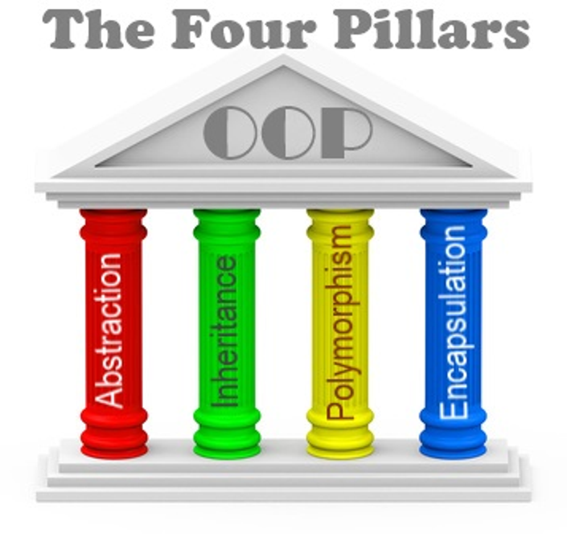

# Mod 5 - Object-Oriented Programming

Object-Oriented Programming is a style of programming (a "paradigm") that uses **objects to manage state (data) and behavior** in an application. While OOP does let us do some new things, more than anything, it helps us write better, more organized code.

It can be defined by its 4 pillars:

* **Encapsulation** - bundling methods with the data they operate on while hiding / protecting access to the data
* **Abstraction** - creating interfaces that hiding complexity behind functions
* **Inheritance** - sharing behavior between classes
* **Polymorphism** - similar objects can be used interchangeably

Throughout this module, we will be learning about these four pillars and how we implement them in JavaScript using the `class` syntax.

## Chapters

* [1. Intro to OOP, Encapsulation, Factory Functions, and Closure](1-encapsulation-factories-and-closure.md)
* [2. Classes](2-classes.md)
* [3. Private & Static](3-private-properties-static-methods.md)
* [4. UML Diagrams & Has Many/Belongs To Relationships](5-has-many-belongs-to.md)
* [5. Challenge: Implementing Has Many/Belongs To](6-has-many-belongs-to-frontend.md)
* [6. Inheritance](7-inheritance.md)
* [7. Polymorphism](8-polymorphism.md)
* [8. Review and Practice](9-review.md)