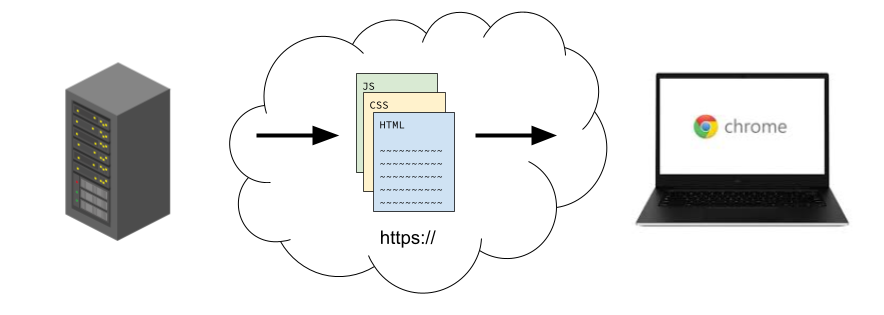

# HTML

**Table of Contents**

- [Key Concepts](#key-concepts)
- [Why HTML Matters for JavaScript Developers](#why-html-matters-for-javascript-developers)
- [Browsers and Markup Languages](#browsers-and-markup-languages)
  - [HTML is a Markup Language: HTML Syntax](#html-is-a-markup-language-html-syntax)
  - [Browsers Are Programs for Viewing HTML](#browsers-are-programs-for-viewing-html)
  - [The `file://` protocol vs the `https://` protocol](#the-file-protocol-vs-the-https-protocol)
- [How to Structure Your HTML Documents](#how-to-structure-your-html-documents)
  - [Semantic Page Structure](#semantic-page-structure)
- [Essential Content Elements](#essential-content-elements)
  - [Hyperlinks (Anchors) and Attributes](#hyperlinks-anchors-and-attributes)
  - [Headings (Not Header)](#headings-not-header)
  - [Images with Figure and Figcaption](#images-with-figure-and-figcaption)
    - [Figure and Figcaption](#figure-and-figcaption)
  - [Lists](#lists)
  - [Paragraphs](#paragraphs)
- [Complete HTML](#complete-html)
- [Quiz](#quiz)


## Key Concepts

- A **Browser** is a program that interprets and renders HTML
- Browsers use the **`file://` protocol** when opening HTML files locally; the **`https://` protocol** is used when accessing files from a server over the internet.
- **index.html** is the default entry point for a website: browsers and servers look for this file automatically.
- **HTML (Hypertext Markup Language)** describes the **content** and **structure** of a webpage.
- **HTML elements** are created using **opening and closing tags** (e.g., `<p>content</p>`).
- A properly formatted HTML document includes `<!DOCTYPE html>`, `<html>`, `<head>`, and `<body>` tags.
- **Semantic elements** have names that describe their function (e.g., `header`, `main`, `footer`, `section`, `figure`). 
- **Self-closing tags (void tags)** like `` do not require a closing tag.
- **Attributes** provide additional information and are included in the opening tag (e.g., `href`, `src`, `alt`).

By the end of this lesson, you'll have built a personal profile page with navigation, a profile picture, skills lists, and favorite quotes.

Something like this:


## Why HTML Matters for JavaScript Developers

You've been building applications that run in the terminal using Node.js. These CLI apps take input, process data, and output results to the console. Now you're going to learn how to build applications with HTML, CSS, and JavaScript that run in a web browser instead.

You already know how to:

* Create and manipulate data with JavaScript
* Build classes to model real-world systems
* Handle user input in the terminal

HTML gives you a new environment to apply these skills: **the browser**. Instead of `console.log()` displaying text in the terminal, you'll create visual interfaces that users can see and interact with in a browser window.

**The Browser vs. Node**

| Node.js | Browser (HTML + CSS + JavaScript) |
| ---- | ------ |
| Text-based interface     |   Visual interface     |
|  Input via prompt-sync    |  Input via forms, buttons, clicks      |
| Output via console.log()     |  Output via updating HTML elements      |
|  Runs on your computer in the Terminal    |   Runs in user's browser     |

## Browsers and Markup Languages

The most basic kind of a file is a `.txt` file which simply stores a string of characters. A `.txt` file is not considered "code" because its characters are interpreted literally.

A **markup language** on the other hand contains symbols that will not be interpreted literally and instead influence how the text inside is viewed.

Markdown (written in `.md` files) is considered a markup language. For example, when we view (**"render"**) the double-asterisk symbols `**` surrounding a word, the text inside will become **bold**:

```md
Here is some **bold** text.
```

### HTML is a Markup Language: HTML Syntax

Just like Markdown, **HTML (Hypertext Markup Language)** is a markup language that defines the *structure* and *content* of webpages.

```html
<!-- This is a heading element — it will be larger and bold -->
<h1>Ada Lovelace</h1>

<!-- This is a paragraph element — it will be smaller -->
<p>Innovating for a brighter future.</p>
```

An **HTML element** is the building block of a webpage. It tells the browser what content to display and how to display it:

* The **opening tag** `<tagname>` indicates the beginning of the element.
* The **closing tag** `</tagname>` indicates the end of the element.
* Only the content between the tags is displayed to the user.
* Comments are written like so: `<!-- comment -->`
* HTML elements are presented in order from top to bottom.

### Browsers Are Programs for Viewing HTML

To illustrate the difference between markup languages and regular `.txt` files, do the following:

* In your `mod-3` folder, create a new folder called `my-profile`
* Create two files called `index.txt` and `index.html`
* Put the code above inside both of them:
* Right click on the `index.html` file and select Reveal in Finder/Explorer
* Open Chrome. Then drag and drop the `index.html` into the tab bar (there should be a + icon)
* Then do the same for your `index.txt` file.

What is the difference between how they are presented by Chrome?


At the end of the day, your browser is just a program for interpreting and rendering HTML. It can also interpret/render CSS and execute JavaScript!


The first HTML file you should create for a new website should always be `index.html`. Your browser will automatically try to load the `index.html` when given a set of HTML files from a server (or from your computer).

`index.html` is commonly known as the **entry point**.


### The `file://` protocol vs the `https://` protocol

You're probably familiar with seeing `https://` at the start of your URL bar, but not `file://`.


When using your browser on the internet, the **`https://` protocol** (hyptertext transfer protocol) is used to load HTML files from a **server**.



A **server** is any computer that provides a resource to another computer.

Your browser uses the `file://` **protocol** to retrieve HTML files that come from your file system on your own computer. It all happens on the same computer:


Whether you're loading a file locally or from a server, your browser is doing the same thing—receiving and rendering HTML. Later, we'll learn to build servers so others can access our content via `https://`. For now, we'll use `file://` to view files on our own computer.

## How to Structure Your HTML Documents

Let's look at how we can build a website. Along the way, we will encounter a variety of HTML elements with many different tagnames. It may feel overwhelming to try to remember them all but don't panic! Most of HTML is "boilerplate"—repetitive, standard code that you will see over and over again.

For example, every webpage starts with the exact same code:

```html
<!DOCTYPE html>
<html lang="en">
  <head>
    <meta charset="UTF-8">
    <meta name="viewport" content="width=device-width, initial-scale=1.0">
    <!-- The title appears in the browser tab -->
    <title>Ada Lovelace</title>
  </head>
  <body>
    <!-- Visible Elements Go Here -->
  </body>
</html>
```

Let's break this down:

* `<!DOCTYPE html>` and `<html lang="en">` immediately tell the browser that the document it is rendering is HTML
* `<head>` contains "meta data" (information *about* the website) that won't show up in the webpage itself.
* `<body>` contains all of the elements that the user will see on the webpage.

**TODO**: Remove the contents of `index.html`. Then, add the boilerplate to your `index.html` file. Change the `<title>` to your name.


**Pro Tip!** Don't try to memorize this. In VS Code, when you create an empty `.html` document, just type `html` and then from the popup, select `html:5` and hit Enter. This boilerplate will be inserted into your page!



**Remember to refresh!** After saving changes to your HTML file, refresh the browser (Cmd+R on Mac or Ctrl+R on Windows) to see your updates. You'll be doing this constantly as you build!


### Semantic Page Structure

Now, let's add structure to the `<body>`. Most webpages have three main parts:

1. `<header>` — Contains navigation, logo, or introductory content at the top of the page.
2. `<main>` — Contains the primary content of the page.
3. `<footer>` — Contains copyright, contact info, or secondary links at the bottom of the page.

Add them to your `<body>`:

```html
<body>
  <header>
    <!-- Logo and Navigation will go here -->
  </header>
  <main>
    <!-- Main content will go here -->
  </main>
  <footer>
    <!-- Footer info will go here -->
  </footer>
</body>
```

Furthermore, we will often break up the `main` into various `<section>` elements:

```html
<main>
  <section>
    <!-- We'll add a main title, tagline and profile picture here soon -->
  </section>

  <section>
    <!-- We'll add some programming skills here soon -->
  </section>

  <section>
    <!-- We'll add quotes here soon -->
  </section>
</main>
```

Rather than adding visible content to the page, these elements provide *structure* that will keep our page organized. This is achieved through **nesting** elements inside each other:
- The `body` contains the `header`, `main`, and `footer` elements
- The `main` contains `section` elements

## Essential Content Elements

Now that we have the basic structure of our website in place, we can begin adding content.

Most of the content that you will see on a webpage is either text or images but there are more than just one way to create this content.

Let's start with filling out the `header` with links.

### Hyperlinks (Anchors) and Attributes

**Hyperlinks** allow the user to navigate between multiple pages within your website. 

The `<a>` element (anchor) creates a **hyperlink**. It has an `href` "attribute" that specifies the path to the link's destination:

```html
<a href="./about.html">About Me</a>
```

In this example, `href` ("hyperlink reference") is the **attribute** while `"./about.html"` is the **value**. The user only sees the text content between the tags `About Me` so it should be descriptive!

**TODO**: 
1. Add these links to your header. 
    ```html
    <header>
      <a href="./index.html">Home</a>
      <a href="./about.html">About Me</a>
      <a href="./projects.html">Projects</a>
    </header>
    ```
2. Then, copy your `index.html` file and name it `about.html`. Then update the `<title>` to say `About`
3. Again, copy your `index.html` file and name it `projects.html`. Then update the `<title>` to say `Projects`
4. You should be able to navigate between all three files now!


**Attributes** like `href` are always added to the opening tag of an HTML element and provide additional information about and/or configure the behavior of the element. We'll see a few other attributes as we move through the lesson.


### Headings (Not Header)

The heading elements `h1` through `h6` are used to indicate the start of a new section:

```html
<main>
  <section>
    <h1>Ada Lovelace</h1>
    <!-- We'll add some more information here soon -->
  </section>

  <section>
    <h2>Programming Skills</h2>
    
    <h3>Developer Tools</h3>
    <!-- We'll add a list of skills here soon -->

    <h3>JavaScript Skills</h3>
    <!-- We'll add a list of skills here soon -->
    
    <h3>Web Development</h3>
    <!-- We'll add a list of skills here soon -->
  </section>

  <section>
    <h2>Favorite Quotes</h2>
    <!-- We'll add a list of quotes here soon -->
  </section>
</main>
```

When choosing your heading size, think of it like a book: 
1. `h1` is the book title. There should only be one.
2. `h2` elements are chapter titles.
3. `h3` elements are like subsection titles within chapters.

Headings `h4`, `h5`, and `h6` also exist but they are rarely necessary.

**TODO:** Add these headings to each section.


Screen readers use this hierarchy to help users navigate, so it's important to use headings in order (don't skip from `h1` to `h4`).


### Images with Figure and Figcaption

Let's add a profile picture to the first section below our `h1`. 

Images use the `` tag with two important attributes:
* `src` — the source URL or file path of the image
* `alt` — describes the image for screen readers and when images fail to load

```html
<!-- Did you know that HTML elements can be written on multiple lines? -->

```

Notice `` is a **self-closing tag** (or **void tag**)—it doesn't need a closing tag.

**TODO**: Go to your GitHub profile. Right-click your profile image and select **Copy Image Address**. Add an image with your profile picture to the first section below the `h1` element.

If you don't have a GitHub profile picture, use the cat scratcher image above in the meantime!

#### Figure and Figcaption

For images with captions, we can wrap them in a `<figure>` element:

```html
<section>
  <h1>Ada Lovelace</h1>
  <figure>
    
    <figcaption>It's nice to meet you!</figcaption>
  </figure>
</section>
```

`<figure>` is another semantic element used to structure our image content. It groups an image with its caption. The `<figcaption>` provides useful context for the image.

**TODO:** Wrap your image in a `figure` and add a `figcaption` to share a message with your users!

### Lists

We have many skills to display so presenting them in a bulleted or numbered list would be appropriate.

Lists are built with a `ul` ("unordered list") or `ol` ("ordered list") that contains any number of `li`s ("list items").

The `li` elements inside of `ul` will appear as a bulleted list.

```html
<section>
  <h2>Programming Skills</h2>
  
  <h3>Developer Tools</h3>
  <ul>
    <li>Git & GitHub</li>
    <li>Command Line Interface</li>
  </ul>
  
  <h3>JavaScript Skills</h3>
  <ul>
    <li>JavaScript Fundamentals</li>
    <li>OOP and Classes</li>
  </ul>
  
  <h3>Web Development</h3>
  <ul>
    <li>HTML</li>
  </ul>
</section>
```

**TODO:** Add these lists of skills below each subheading. Feel free to add any additional skills you'd like to share!

**Challenge:** In the next section below, add your favorite quotes as an ordered list (`ol`) with at least three list items.

If you can't think of any quotes, here are a few you can use for now:

```
"Pressure is a privilege" - Arthur Ashe
"The more I study, the more insatiable do I feel my genius for it to be." - Ada Lovelace
"I can never lose. I either win or I learn" - Nelson Mandela
```

Here's a generic example of an ordered list for reference:

```html
<ol>
  <li>First item</li>
  <li>Second item</li>
  <li>Third item</li>
</ol>
```

### Paragraphs

And finally, perhaps the simplest element of them all: the paragraph!

Paragraph elements (`p`) are used to display plain text.

In the first section, below the `<h1>` element, we can add a paragraph with a "tagline" for our website.

```html
<section>
  <h1>Ada Lovelace</h1>
  <!-- Add this tagline above your figure -->
  <p>Mathematician | Pioneer of Computing | Visionary Thinker</p>
  <figure>
    
    <figcaption>It's nice to meet you!</figcaption>
  </figure>
</section>
```

Paragraphs and hyperlinks are considered "inline" elements. This means that when we nest a hyperlink within a paragraph, they appear as a single line of text.

In the footer, let's add a few paragraphs including one with a nested link:

```html
<footer>
  <p>Copyright Marcy Lab School 2025</p>
  <p>Learn more at <a href="https://marcylabschool.org">marcylabschool.org</a></p>
</footer>
```

## Complete HTML

Here's the complete `index.html` with all the elements we've built. Use this as a reference to check your work or catch up if you fell behind.

**index.html**
```html
<!DOCTYPE html>
<html lang="en">
  <head>
    <meta charset="UTF-8" />
    <meta name="viewport" content="width=device-width, initial-scale=1.0" />
    <title>Ada Lovelace</title>
  </head>
  <body>
    <header>
      <a href="./index.html">Home</a>
      <a href="./about.html">About Me</a>
      <a href="./projects.html">Projects</a>
    </header>
    <main>
      <section>
        <h1>Ada Lovelace</h1>
        <p>Mathematician | Pioneer of Computing | Visionary Thinker</p>
        <figure>
          
          <figcaption>It's nice to meet you!</figcaption>
        </figure>
      </section>
      <section>
        <h2>Programming Skills</h2>

        <h3>Developer Tools</h3>
        <ul>
          <li>Git & GitHub</li>
          <li>Command Line Interface</li>
        </ul>

        <h3>JavaScript Skills</h3>
        <ul>
          <li>JavaScript Fundamentals</li>
          <li>OOP and Classes</li>
        </ul>

        <h3>Web Development</h3>
        <ul>
          <li>HTML</li>
        </ul>
      </section>
      <section>
        <h2>Favorite Quotes</h2>
        <ol>
          <li>“Pressure is a privilege” - Arthur Ashe</li>
          <li>“The more I study, the more insatiable do I feel my genius for it to be.” - Ada Lovelace</li>
          <li>“I can never lose. I either win or I learn” - Nelson Mandela</li>
        </ol>
      </section>
    </main>
    <footer>
      <p>Copyright Marcy Lab School 2025</p>
      <p>Learn more at <a href="https://marcylabschool.org">marcylabschool.org</a></p>
    </footer>
  </body>
</html>
```

## Quiz

**Q1: What is the difference between a markup language and a plain text file?**

<details>
<summary>Answer</summary>

A plain text file (`.txt`) stores characters that are interpreted literally. A markup language (like HTML or Markdown) contains symbols that influence how the text is displayed when rendered. For example, `<strong>bold</strong>` in HTML will display as **bold** text rather than showing the angle brackets.

</details>

**Q2: What is the difference between the `file://` protocol and the `https://` protocol?**

<details>
<summary>Answer</summary>

- The `file://` protocol retrieves HTML files directly from your local file system (your computer).
- The `https://` protocol retrieves HTML files from a server over the internet.

</details>

**Q3: What are the four errors in the HTML below?**

```html
<h1>Welcome<h1>
<p This is Ada Lovelace.</p>
<ol>
  <li>Item 1
  <li>Item 2</li>
<ol>
```

<details>
<summary>Answer</summary>

1. The `<h1>` tag is not properly closed—it should be `</h1>`, not `<h1>`.
2. The `<p>` tag is missing a `>` after `<p`—it should be `<p>This is Ada Lovelace.</p>`.
3. The first `<li>` is missing its closing `</li>` tag.
4. The list is closed with `<ol>` instead of `</ol>`.

</details>

**Q4: What is wrong with this image element? How would you fix it?**

```html
picture-of-cat.png</img>
```

<details>
<summary>Answer</summary>

Two issues:
1. `` is a **void (self-closing) tag**—it should not have content between opening and closing tags.
2. The image source should be specified using the `src` attribute, and an `alt` attribute should describe the image.

**Fixed:**

```html

```

</details>

**Q5: Create an anchor tag that links to `https://google.com` with the visible text "Search on Google".**

<details>
<summary>Answer</summary>

```html
<a href="https://google.com">Search on Google</a>
```

</details>

**Q6: What are the three semantic elements that structure the main parts of a webpage, and what does each contain?**

<details>
<summary>Answer</summary>

1. `<header>` — Contains navigation, logo, or introductory content
2. `<main>` — Contains the primary content of the page
3. `<footer>` — Contains copyright, contact details, or secondary links

</details>

**Q7: Rewrite the following HTML using semantic elements instead of `<div>` tags:**

```html
<body>
  <div>
    <h1>My Site</h1>
  </div>
  <div>
    <p>Welcome!</p>
  </div>
  <div>
    <p>Copyright 2025</p>
  </div>
</body>
```

<details>
<summary>Answer</summary>

```html
<header>
  <h1>My Site</h1>
</header>
<main>
  <p>Welcome!</p>
</main>
<footer>
  <p>Copyright 2025</p>
</footer>
```

Semantic elements like `<header>`, `<main>`, and `<footer>` describe the purpose of the content, making the HTML more readable, accessible, and better for SEO.

</details>
