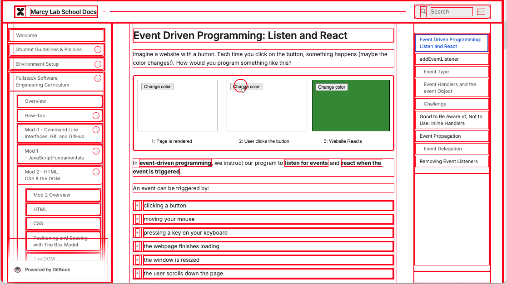
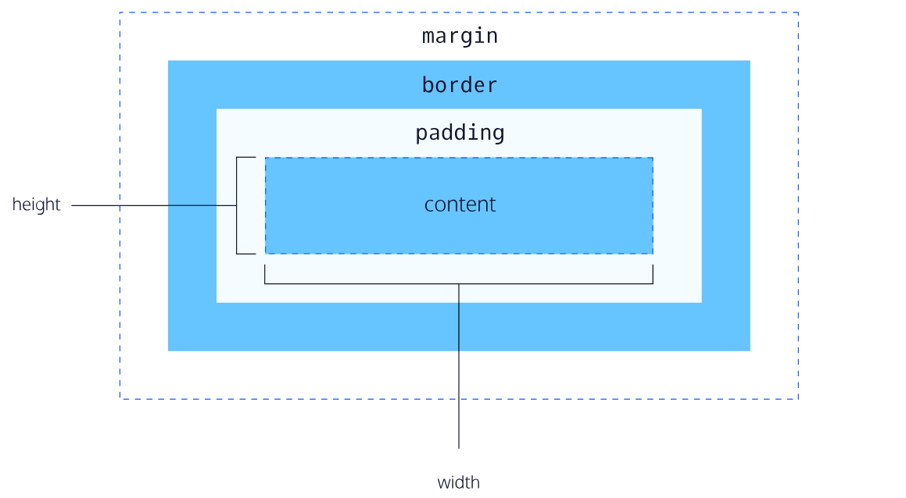

# The Box Model


Follow along with code examples [here](https://github.com/The-Marcy-Lab-School/3-3-box-model)!



**Table of Contents**

- [Key Concepts](#key-concepts)
- [Intro to The Box Model](#intro-to-the-box-model)
  - [Web Design 101: Every Element is a Box](#web-design-101-every-element-is-a-box)
- [Box Model](#box-model)
  - [Content, Width, and Height](#content-width-and-height)
  - [Padding: Space Inside the Box](#padding-space-inside-the-box)
  - [Border: The Edge of the Box](#border-the-edge-of-the-box)
    - [Adding Borders to One Side](#adding-borders-to-one-side)
    - [Border Radius](#border-radius)
  - [Margin: Space Between Elements](#margin-space-between-elements)
    - [Margin Collapse](#margin-collapse)
    - [Centering with Margin](#centering-with-margin)
  - [Box Shadow](#box-shadow)
- [Display](#display)
  - [Display Challenge](#display-challenge)
- [The Box-Sizing Problem](#the-box-sizing-problem)
  - [The Solution: border-box reset](#the-solution-border-box-reset)
  - [General CSS Reset](#general-css-reset)
- [Organizing Your CSS](#organizing-your-css)
- [Test your Skills!](#test-your-skills)
- [Complete HTML \& CSS](#complete-html--css)

## Key Concepts

* **Box Model** — How elements in an HTML document are modeled in the browser and how their dimensions are calculated based on the provided CSS properties. It consists of content, padding, border, and margin.
* The **content** — the space that the content of an element occupies (the text of a `<p>` tag, the image of an `img` tag, etc...)
* The **padding** — the space around the content but inside the border. This is the "background" of the content.
* The **border** — the space around the padding.
* The **margin** — the space around the border and "between" adjacent elements.
  * **Margin collapse** occurs when two vertical margins meet and the larger margin "wins".
* The `box-sizing` property determines how the total width and height of an element is calculated.
  * The default `box-sizing: content-box` setting has the `width` and `height` properties affect the content box, with padding and border dimensions added.
  * The `box-sizing:border-box` setting makes the `width` and `height` properties affect the border box, with the content box automatically shrinking to fit inside the padding box.
* A **CSS Reset** is a set of rules intended to remove default CSS styles applied by the _user agent stylesheet_.

```css
* {
  margin: 0;
  padding: 0;
  box-sizing: border-box;
}
```

* The `display` property changes how elements are arranged relative to each other:
  * `display: block` elements will stack on top of each other, regardless of their width.
  * `display: inline` elements will sit next to each other (if there is space available) and are not affected by the `width` or `height` properties
  * `display: inline-block` elements will sit next to each other (if there is space available) and ARE affected by the `width` and `height` properties
  * `display: none` elements are removed from the flow of the document.

## Intro to The Box Model

You've learned how to apply colors, fonts, and basic spacing to HTML elements using CSS. Now you need to understand the fundamental concept that controls how elements take up space on a webpage: **the box model**.

### Web Design 101: Every Element is a Box

The first rule to understanding CSS and web design is that **every HTML element is rendered as a rectangular box**.

Even elements that don't look like boxes (paragraphs, headings, links, images, buttons) are all boxes. Understanding how these boxes work is essential for controlling layout and spacing.

Open up your `index.html` file from the last lesson in the browser. Then do the following:
1. Right click on your website and select "Inspect". This will open your browser's **Developer Tools** where you can see the HTML structure of your elements and the CSS styles applied to them. **In the bottom-right corner is the Box Model diagram.**

    

2. Choose the **element selector tool** (look at the developer tools and it is the arrow icon in the top-left corner). 
3. Then, hover over different elements to see each element's box.

You can see clearly how every element is a box if you add this CSS declaration to your webpage:

```css
/* All elements have a 1px solid red border */
* {
  border: 1px solid red;
}
```



Knowing that everything is a box, we must start by learning how to control those boxes.

## Box Model

The **box model** defines the size and spacing of any element and it consists of 4 parts, from the inside out:

1. The **content** — the space that the content of an element occupies (the text of a `<p>` tag, the image of an `img` tag, etc...)
2. The **padding** — the space around the content but inside the border. This is the "background" of the content.
3. The **border** — the space around the padding.
4. The **margin** — the space around the border and "between" adjacent elements.



### Content, Width, and Height

The **content area** holds your actual content (text, images, or other nested elements).

You can control the content dimensions with `width`- and `height`-related properties.

Look at the existing CSS for your `figure` and `img` elements:

```css
img {
  width: 100%;
}

figure {
  max-width: 300px;
}
```

This is a really common pattern for handling image sizing:
* The `img` selector sets all images to fill 100% of their container's width. 
* The `figure` selector uses `max-width: 300px` to constrain the figure (and therefore the image inside it) to a maximum of 300 pixels wide. 
* If the screen is smaller than 300px, the figure will shrink to fit.

**TODO:** Set a width on our navigation links and a max-width on our sections:

```css
nav>a {
  /* ... existing styles ... */
  width: 10rem;
}

section {
  max-width: 600px;
}
```

Refresh your page. Notice that the `width` on `nav>a` doesn't seem to work yet—we'll fix that in the Display section!

### Padding: Space Inside the Box

**Padding** creates space between the content and the border. It's inside the element so it takes on the element's background color.

The header is looking a little bit cramped with the links inside. Let's add some padding to give the content some breathing room:

```css
header {
  background-color: var(--color-dark);
  padding: 1rem; /* <-- add this. play around with the value */
}
```

You can also assign different padding amounts on each side by providing multiple values. Let's update our navigation links to be more button-like:

```css
nav>a {
  background-color: var(--color-accent);
  color: var(--color-white);
  text-decoration: none;
  font-weight: bold;
  padding: 0.5rem 1rem; /* <-- 0.5rem top/bottom, 1rem left/right */
}
```

**TODO:** Add a padding to your section elements, to each `.programming-skill` element, and to each `.quote` element.

### Border: The Edge of the Box

The **border** is the line around the padding. The `border` property has three values: width, style, and color.

Let's add a border to each `section` to visually separate them and create a "card" effect:

```css
section {
  background-color: var(--color-white);
  max-width: 600px;
  padding: 1rem;

  /* Add this */
  border: 2px solid var(--color-accent);
}
```

Common border styles include `solid`, `dashed`, `dotted`, and `none` (default).

#### Adding Borders to One Side

You can also add a border to just one side of an element using `border-top`, `border-right`, `border-bottom`, or `border-left`.

Let's add a bottom border to our `h2` elements to create a nice visual separator:

```css
h2 {
  border-bottom: 2px solid var(--color-accent);
  padding-bottom: 0.5rem;
}
```

**TODO:** Add a left border to the quotes. It should be 4px, solid, and using your accent color.

#### Border Radius

You can control the curve of the corners of your border with `border-radius`:

```css
section {
  background-color: var(--color-white);
  max-width: 600px;
  padding: 1rem;
  border: 2px solid var(--color-accent);
  border-radius: 8px; /* <-- add this */
}
```

Let's also add `border-radius` to our navigation links:

```css
nav>a {
  /* ... existing styles ... */
  border-radius: 8px;
}
```

To make a perfectly circular border, use `border-radius: 50%`. This works great for profile pictures! Let's add this to our `#profile-picture`:

First, add an `id` to your profile picture so we can style it later:

**HTML:**
```html
<figure>
  
  <figcaption>It's nice to meet you!</figcaption>
</figure>
```

**CSS:**

```css
#profile-picture {
  border-radius: 50%;
  border: 2px solid var(--color-accent);
}
```

**TODO:** Add a `border` and `border-radius` to the `.programming-skill` class to make them look like tags/badges. Do the same for your navigation links.

### Margin: Space Between Elements

**Margin** creates space between an element and other elements around it. Margin is outside the element, so it doesn't take on the background color.

Let's add some space between our navigation elements, but only on the left and right sides:

```css
nav>a {
  background-color: var(--color-accent);
  color: var(--color-white);
  width: 10rem;
  padding: 0.5rem 1rem;
  border: 1px solid var(--color-dark);
  border-radius: 8px;

  /* Add this: 0 margin on top/bottom, 0.5rem left/right */
  margin: 0 0.5rem;

  /* or... */
  margin-inline: 0.5rem;
}
```

The `margin-inline` property allows you to control the margin on the left and right sides only. Padding and border each have this suffix available as well. You can use the `-block` suffix to work in the vertical direction.

Now, let's add some vertical spacing between elements using `margin-bottom`:

```css
header,
section,
main,
footer,
h1,
h2,
h3,
ul,
img {
  margin-bottom: 1rem;
}

#tagline {
  margin-bottom: 2rem;
}
```

**Tip:** If you want consistent vertical spacing, pick one direction (either `margin-bottom` or `margin-top`) and stick with it for all of your elements. This avoids "margin collapse" entirely.

**TODO:** Add a margin-bottom of `0.5rem` to every `.quote` element.

#### Margin Collapse

When two vertical margins meet, they don't stack on top of each other. Instead, the space between the elements is equal to the larger of the two margins. This is called **margin collapse**.

For example, if one element has `margin-bottom: 40px` and the next element has `margin-top: 20px`, the space between them is **40px**, not 60px. The larger margin (40px) "wins".

Remember: this only happens with vertical margins, not horizontal margins 🤷.

#### Centering with Margin

This entire time, our content has been stuck to the left side of the screen. This can't be solved with `text-align: center` because our elements like `section` and `figure` are not text elements!

Instead, we can put equally sized margins on the left and rights sides of our elements with `margin-inline: auto`. This positions the element in the center of their container.

**Note: `margin-inline: auto` only works if the element has a defined width** (like `max-width` or `width`).

Let's use this technique to center our `section` elements:

```css
section {
  background-color: var(--color-white);
  max-width: 600px;
  padding: 1rem;
  border: 2px solid var(--color-accent);
  border-radius: 8px;

  margin-inline: auto;     /* <-- add this */
}
```

The `margin-inline: auto` property instructs your browser to set the left and right margins to take up whatever space is available, effectively pushing the content to the center of their container.

**TODO:** Use this same trick to center the `figure`.

### Box Shadow

To give our sections some visual depth, we can add a **box shadow**. Box shadows create the illusion that an element is floating above the page.

First, let's add a CSS variable for our shadow color in `:root`:

```css
:root {
  --color-light: powderblue;
  --color-dark: midnightblue;
  --color-accent: royalblue;
  --color-white: white;
  --color-shadow: rgba(108, 92, 231, 0.4); /* <-- add this */
}
```

The `rgba()` function lets us specify a color with transparency. The last value (`0.4`) is the alpha (opacity), where `0` is fully see-through and `1` is fully opaque.

Now let's add a hover effect to our sections:

```css
section:hover {
  box-shadow: 0 0.25rem 1.5rem var(--color-shadow);
}
```

The `box-shadow` property effectively draws a "shadow box" behind the element. It takes these values:
- **Left/Right offset**: `0` (no shift left/right)
- **Top/Bottom offset**: `0.25rem` (slight shift down)
- **Blur radius**: `1.5rem` (how blurry the shadow is)
- **Color**: `var(--color-shadow)` (our semi-transparent purple)

Try hovering over your sections to see the effect!

## Display

HTML elements have default `display` behaviors that affect
1. how an element's width and height can be modified.
2. how they interact with other elements.

Remember how we tried adding a `width` to the `<a>` elements, but nothing happened?

```css
nav>a {
  width: 10rem; /* <-- try adding this — it won't work! */
  /* ... other styles ... */
}
```

Also, notice how pretty much all of the elements are stacked on top of each other but the hyperlink `<a>` elements are next to each other. 

This is all impacted by the `display` property:

| Display Type            | Examples                           | Makes New Line | Can Set Height / Width?                    | When To Use                                                                                                   |
| ----------------------- | ---------------------------------- | -------------- | ------------------------------------------ | ------------------------------------------------------------------------------------------------------------- |
| `display: block;`       | Most elements                      | Yes            | Yes                                        | To stack elements vertically.                                                                                 |
| `display: inline`       | `<a>`, `<span>`, `<i>`, `<strong>` | No             | No (but can set horizontal padding/margin) | To display elements horizontally within a line of text.                                                       |
| `display: inline-block` | None                               | No             | Yes                                        | To display elements horizontally with control over height/width                                               |
| `display: none`         | None                               | N/A            | N/A                                        | To completely remove an element from view. Useful for when we want to hide/reveal an element using JavaScript |

Since `<a>` elements have `display:inline`, they appear next to each other AND we can't set their `height` or `width` properties.

**<details><summary>Q: We want our nav links (`<a>` tags) to be 10rem wide AND keep them on the same line. Which display should we use?</summary>**

If we wanted to keep the `<a>` elements on the same line but also have control over their dimensions, we can change them to have `display:inline-block`:

```css
nav>a {
  background-color: var(--color-accent);
  color: var(--color-white);

  display: inline-block;    /* <-- add this */
  width: 10rem;             /* <-- now this works! */
  margin-inline: 0.5rem;
  padding: 0.5rem 1rem;
  border-radius: 8px;
}
```

</details>

### Display Challenge

Let's change the display of the `.programming-skill` list items so they appear next to each other instead of stacked vertically.

We want them to appear next to each other and have control over their width/height. What display should they have?

Try it out, then look at the solution below.

**<details><summary>Solution</summary>**

By default, list items have `display:block` which stacks them on top of each other. To have them listed next to each other, we can give them `display: inline-block`.

**CSS:**
```css
.programming-skill {
  padding: 0.5rem;
  border-radius: 8px;
  display: inline-block; /* <-- add this */
  background-color: var(--color-accent);
  color: var(--color-light);
  border: 1px solid var(--color-dark);
}
```

Try switching this to `display:inline` and see how it changes — notice how the padding behaves differently!

</details>

## The Box-Sizing Problem

By default, `width` and `height` only apply to the **content area**. Padding and border are added on top.

Let's see this problem with your navigation links. They currently have this styling:

```css
nav>a {
  display: inline-block;
  width: 10rem;
  padding: 0.5rem 1rem;
  border: 2px solid var(--color-dark);
  /* ... other styles ... */
}
```

**<details><summary>Q: What is the actual width of a nav link?</summary>**

You might expect each link to be 10rem (160px) wide. But the **actual width** is:
- Content: 160px
- Padding: 16px left + 16px right = 32px
- Border: 2px left + 2px right = 4px
- **Total width: 196px**

</details>


This is confusing and makes layout calculations difficult.

### The Solution: border-box reset

Add this to the **top** of your CSS file:

```css
* {
  box-sizing: border-box;
}

/* Rest of your CSS below... */
```

The `*` selector targets all elements. This rule changes how `width` and `height` are calculated.

With `box-sizing: border-box`, `width` includes content, padding, AND border. Now your nav links are **exactly 10rem wide**:
- Padding: 32px
- Border: 4px
- Content: 124px (automatically calculated as 160-32-4)
- **Total: 160px (10rem)**

**Always include `box-sizing: border-box` at the top of your CSS. It makes layout predictable and matches how you naturally think about sizing.**

### General CSS Reset

Different browsers apply different default margins and paddings to elements like `body`, `h1`, `ul`, and `p`. This can cause inconsistent layouts across browsers.

A **CSS reset** removes these defaults, giving you a clean, predictable starting point. Add this to the top of every CSS file:

```css
* {
  margin: 0;
  padding: 0;
  box-sizing: border-box;
}

img {
  width: 100%;
}

ul, ol {
  list-style: none;
}
```

This reset:
- Removes all default margins and paddings
- Makes `width` and `height` include padding and border
- Makes images fill their container width by default
- Removes bullet points from lists (we'll add our own styling)
- Ensures consistent behavior across all browsers

You'll then add spacing intentionally where you need it, giving you full control over your layout.

## Organizing Your CSS

As your CSS file grows, it helps to organize your code into sections using comments. Here's a recommended structure:

```css
/* ================================
Base Styles: Color Palette (CSS Variables)
================================ */
:root {
  --color-accent: royalblue;
  --color-dark: midnightblue;
  /* ... */
}

/* ================================
Base Styles: CSS Reset
================================ */
* {
  margin: 0;
  padding: 0;
  box-sizing: border-box;
}

/* ================================
Base Styles: Spacing
================================ */
header,
section,
main {
  margin-bottom: 1rem;
}

/* ================================
Component: Header & Navigation
================================ */
header {
  /* header styles */
}

nav>a {
  /* nav link styles */
}

/* ================================
Component: Sections
================================ */
section {
  /* section styles */
}

/* ... and so on ... */
```

This organization makes it easy to:
- Find specific styles quickly
- Understand the structure of your CSS
- Add new styles in the right place
- Debug issues faster

**TODO:** Take a moment to organize your CSS file using comment sections, then make adjustments to the padding and margins of the elements of your page until you are satisfied with the overall spacing.

## Test your Skills!

Head over to [MDN to test your box model skills](https://developer.mozilla.org/en-US/docs/Learn/CSS/Building_blocks/Box_Model_Tasks)!

## Complete HTML & CSS

**index.html**

```html
<!DOCTYPE html>
<html lang="en">
  <head>
    <meta charset="UTF-8" />
    <meta name="viewport" content="width=device-width, initial-scale=1.0" />
    <title>Ada Lovelace</title>

    <link rel="stylesheet" href="style.css">
  </head>
  <body>
    <header>
      <nav>
        <a href="./index.html">Home</a>
        <a href="./about.html">About Me</a>
        <a href="./projects.html">Projects</a>
      </nav>
    </header>
    <main>
      <section>
        <h1>Ada Lovelace</h1>
        <p id="tagline">Mathematician | Pioneer of Computing | Visionary Thinker</p>
        <figure>
          
          <figcaption>It's nice to meet you!</figcaption>
        </figure>
      </section>
      <section id="programming-skills">
        <h2>Programming Skills</h2>

        <h3>Developer Tools</h3>
        <ul>
          <li class="programming-skill">Git & GitHub</li>
          <li class="programming-skill">Command Line Interface</li>
        </ul>

        <h3>JavaScript Skills</h3>
        <ul>
          <li class="programming-skill">JavaScript Fundamentals</li>
          <li class="programming-skill">OOP and Classes</li>
        </ul>

        <h3>Web Development</h3>
        <ul>
          <li class="programming-skill">HTML</li>
          <li class="programming-skill">CSS</li>
        </ul>
      </section>
      <section>
        <h2>Favorite Quotes</h2>
        <ul>
          <li class="quote">"Pressure is a privilege" - Arthur Ashe</li>
          <li class="quote">"The more I study, the more insatiable do I feel my genius for it to be." - Ada Lovelace</li>
          <li class="quote">"I can never lose. I either win or I learn" - Nelson Mandela</li>
        </ul>
      </section>
    </main>
    <footer>
      <p>Copyright Marcy Lab School 2025</p>
      <p>Learn more at <a href="https://marcylabschool.org">marcylabschool.org</a></p>
    </footer>
  </body>
</html>
```

**style.css**

```css
/* ================================
Base Styles: Color Palette (CSS Variables)
================================ */
:root {
  --color-light: powderblue;
  --color-dark: midnightblue;
  --color-accent: royalblue;
  --color-white: white;
  --color-shadow: rgba(108, 92, 231, 0.4);
}

/* ================================
Base Styles: CSS Reset
================================ */
* {
  margin: 0;
  padding: 0;
  box-sizing: border-box;
}

img {
  width: 100%;
}

ul, ol {
  list-style: none;
}

/* ================================
Base Styles: Spacing
================================ */

header,
section,
main,
footer,
h1,
h2,
h3,
ul,
img {
  margin-bottom: 1rem;
}

#tagline {
  margin-bottom: 2rem;
}

/* ================================
Typography (headings and paragraphs)
================================ */
h1 {
  font-size: 3rem;
}

h2 {
  border-bottom: 2px solid var(--color-accent);
  padding-bottom: 0.5rem;
}

ol {
  text-align: left;
}

/* ================================
Component: Body
================================ */
body {
  background-color: var(--color-light);
  color: var(--color-dark);
  font-family: Helvetica, Arial, sans-serif;
  text-align: center;
  line-height: 1.5;
}

/* ================================
Component: Header & Navigation
================================ */

header {
  background-color: var(--color-dark);
  padding: 1rem;
}

nav>a {
  background-color: var(--color-accent);
  color: var(--color-white);
  display: inline-block;
  width: 10rem;
  margin-inline: 0.5rem;
  padding: 0.5rem 1rem;
  border-radius: 8px;
}

nav>a:hover {
  background-color: var(--color-white);
  color: var(--color-accent);
}

/* ================================
Component: Sections
================================ */

section {
  background-color: var(--color-white);
  max-width: 600px;
  padding: 1rem;
  border: 2px solid var(--color-accent);
  border-radius: 8px;
  margin-inline: auto;
}

section:hover {
  box-shadow: 0 0.25rem 1.5rem var(--color-shadow);
}

/* ================================
Component: Hero Section
================================ */

figure {
  max-width: 300px;
  margin-inline: auto;
}

#profile-picture {
  border-radius: 50%;
  border: 2px solid var(--color-accent);
}

#tagline, figcaption {
  font-style: italic;
  color: var(--color-accent);
}

/* ================================
Component: Skills Section
================================ */

.programming-skill {
  background-color: var(--color-accent);
  color: var(--color-white);
  padding: 0.5rem 1rem;
  border: 2px solid var(--color-dark);
  border-radius: 8px;
  display: inline-block;
}

/* ================================
Component: Quotes Section
================================ */

.quote {
  background-color: var(--color-light);
  color: var(--color-dark);
  padding: 1rem;
  border-left: 4px solid var(--color-accent);
  margin-bottom: 0.5rem;
}
```
