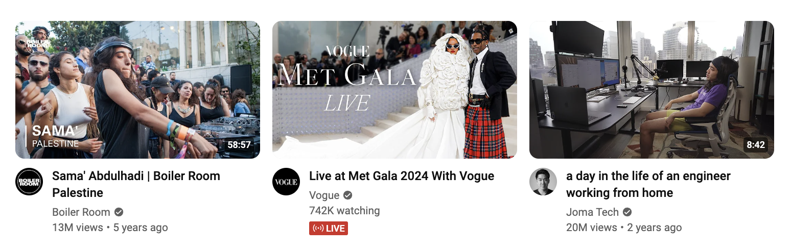
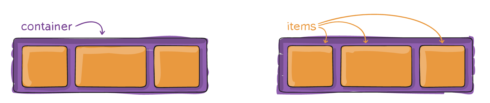
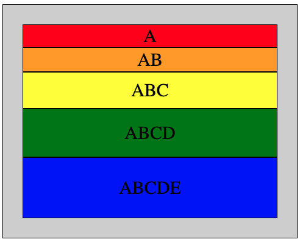
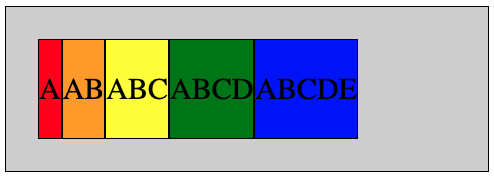
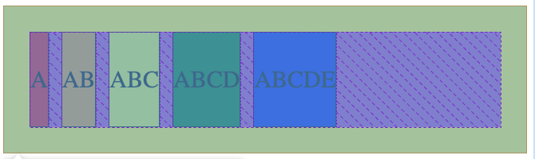
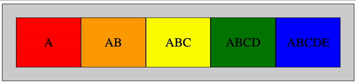
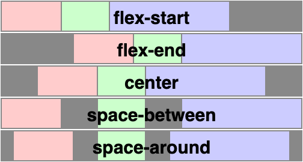
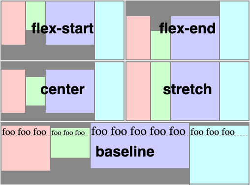
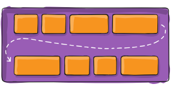
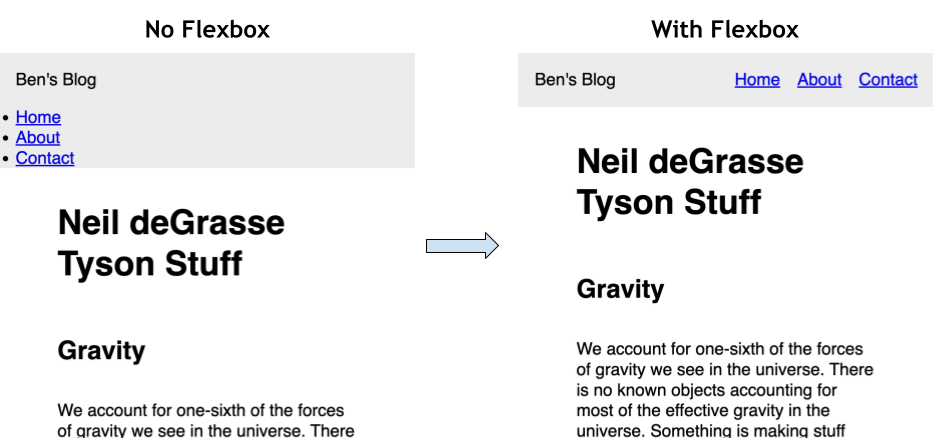

# Flexbox


Follow along with code examples [here](https://github.com/The-Marcy-Lab-School/2-3-1-flexbox)!


**Table of Contents**:

* [Terms](flexbox.md#terms)
* [Explore Flexbox on Youtube](flexbox.md#explore-flexbox-on-youtube)
* [Flexbox Puts Things In A Row](flexbox.md#flexbox-puts-things-in-a-row)
* [Controlling Flex Items](flexbox.md#controlling-flex-items)
  * [Flex Direction (Flex Container Property)](flexbox.md#flex-direction-flex-container-property)
  * [Gap (Flex Container Property)](flexbox.md#gap-flex-container-property)
  * [Flex (Flex Item Property)](flexbox.md#flex-flex-item-property)
  * [Justify Content (Flex Container Property)](flexbox.md#justify-content-flex-container-property)
  * [Align Items (Flex Container Property)](flexbox.md#align-items-flex-container-property)
  * [Flex Wrap (Flex Container Property)](flexbox.md#flex-wrap-flex-container-property)
* [Challenge: Styling a Navbar using Flexbox](flexbox.md#challenge-styling-a-navbar-using-flexbox)
* [Some More Examples!](flexbox.md#some-more-examples)

**Resources**:

* [A guide to flexbox](https://css-tricks.com/snippets/css/a-guide-to-flexbox/)
* [Learn Flexbox in 15 minutes](https://www.youtube.com/watch?v=fYq5PXgSsbE\&ab_channel=WebDevSimplified)
* [A great video to learn flexbox](https://www.youtube.com/watch?v=u044iM9xsWU\&ab_channel=KevinPowell)

## Terms

* **Flexbox** - a `display` type that arranges flexible elements in a container in a row or column.
* **Flex Container** - the element with `display:flex`.
* **Flex Item** - an element inside of a flex container.
* **Main Axis** — the direction that flex items flow in, (set by `flex-direction` and in the `row` direction by default).
* **Cross Axis** — the direction perpendicular to the main axis.
* The essential **flex container properties** are:
  * `flex-direction` - Determines the direction flex items will be arranged. Defaults to `row` but can be set to `column` to arrange flex items vertically.
  * `justify-content` — defines the spacing along the **main axis**
  * `align-items` — defines the alignment of elements along the **cross axis**
  * `gap` — controls spacing _between_ flex items (not on outer edges)
* The essential **flex item properties** are:
  * `flex-grow` — defines the amount a flex item will grow relative to its siblings when there is excess space.
  * `flex-shrink` — defines the amount a flex item will shrink relative to its siblings when there is not enough space.
  * `flex-basis` — defines the starting size of a flex item.
  * `flex` — used as shorthand for the above 3 properties.

## Explore Flexbox on Youtube

Open https://www.youtube.com/ and see how elements shift in size as you resize the window.



<details>

<summary><strong>Q: Look at a row of video "cards". Are they <code>display:inline</code>, <code>display:block</code> or something else? Guess, then inspect the page!</strong></summary>

They should be `display: flex;` elements!

</details>



* **Flexbox** is a display type used for arranging elements inside of a container in a row or a column.
* The parent element gets the `display: flex` property, making it a **flex container**.
* The children of the flex container automatically become **flex items**

## Flexbox Puts Things In A Row

With Flexbox, the most common use case is arranging identical elements in a row that will grow or shrink according to the available space.

Consider the following HTML:


```html
<div class="flex-container" id="squares-container">
  <div class="flex-item">A</div>
  <div class="flex-item">AB</div>
  <div class="flex-item">ABC</div>
  <div class="flex-item">ABCD</div>
  <div class="flex-item">ABCDE</div>
</div>
```


By default these elements elements will stack on top of each other.



<details>

<summary><strong>Q: Why is this the default behavior of divs?</strong></summary>

By default, `div` elements will be block elements. Block elements always stack on top of each other and take up the full width available to them.

</details>

By setting the adding Flexbox to the parent container (the `div.flex-container` element), its children will be placed horizontally in a row!



```css
.flex-container {
  display: flex;
}
```

The flex items will all stretch vertically to have equal height but will only take up as much width as is needed.

## Controlling Flex Items

With Flexbox applied to the parent container, we gain access to a bunch of options for arranging the flex items inside.

We can control:

1. the direction that flex items flow with `flex-direction`
2. how much space is between flex items with `gap`
3. how the flex items grow or shrink along the main axis with `flex`
4. how flex items are spaced along the main axis with `justify-content`
5. how flex items are stretch and are positioned along the cross axis with `align-items`
6. whether or not flex items wrap when they can't fit in one line with \`flex-wrap\`\`

Let's jump into each!

### Flex Direction (Flex Container Property)

Flexbox has two axes, the **main axis** and the **cross axis**. Flex items flow along the main axis and, by default stretch along the cross axis.


By default, the main axis runs in the "row" direction, arranged left to right.

We can arrange flex items in a column (top to bottom) by setting the `flex-direction` property to `column`:

```css
.flex-container {
  display: flex;
  flex-direction: column;
}
```

`flex-direction: column` changes the orientation of the main and cross axes.

* The main axis is now vertical (top to bottom)
* The cross axis is now horizontal (left to right)

Knowing the direction of these two axes plays an essential role in controlling how flex items behave inside of a flex container. Let's look at how!

### Gap (Flex Container Property)

Gap is perhaps the most useful feature of Flexbox. The `gap` property makes adding space between elements incredibly easy:

```css
.flex-container {
  display: flex;
  gap: 1rem;
}
```

Note that the gap will only be applied to the space between the elements, not before the first element and after the last element.



<details>

<summary><strong>Q: Why can't we just use margin to do this?</strong></summary>

Thus far, if we've wanted to put space between elements, we've had to rely on adding a `margin`. However, margins have a few behaviors that can be annoying to deal with:

* Margins are applied to all sides, making it difficult to only add space _between_ elements (the first and last elements will have extra margin on top and bottom)
* Margins can overlap causing unexpected spacing

Gap solves these problems entirely!

</details>

### Flex (Flex Item Property)

The `flex` property controls how much a flex item will grow or shrink within a container when there is extra space.

By default, flex items will only take up as much space as they need. However, if there is extra space, flex items with the `flex` property will flex to take up that space.



```css
/* The flex property controls the relative "growth rate" of a flex item when there is excess space */
.flex-item {
  flex: 1;
}

/* Hovering over a flex item will cause it to grow 3x the size of other flex items */
.flex-item:hover {
  flex: 3;
}
```

With `flex: 1;` applied to all flex items, they will all attempt to share the extra space evenly.

With `flex: 3;` applied to the one hovered element, it will take 3 times as much extra space as the other elements.


`flex` is a shorthand for the three properties `flex-grow`, `flex-shrink`, and `flex-basis`. Read more about [the flex property on MDN](https://developer.mozilla.org/en-US/docs/Web/CSS/flex)!


### Justify Content (Flex Container Property)

By default, flex items will arrange themselves at the start of the _main axis_ (left to right in the row direction) of the flex container. We can change this behavior using `justify-content`:

```css
.flex-container {
  display: flex;
  justify-content: space-between;
}
```



### Align Items (Flex Container Property)

By default, flex items will stretch along the _cross axis_. We can change this behavior using `align-items`.

```css
.flex-container {
  display: flex;
  align-items: flex-start;
}
```



### Flex Wrap (Flex Container Property)

By default, flex items will all try to fit onto one line. If there isn't enough space, they will overflow.

Setting `flex-wrap: wrap`, flex items will be pushed to the next line when there isn't enough space.



```css
.container {
  flex-wrap: nowrap | wrap | wrap-reverse;
}
```

## Challenge: Styling a Navbar using Flexbox

One of the most common uses of flexbox is to style a navigation bar. Open up the `1-navbar` file and look at the `<header>` element:

```html
<!-- Often, the header contains a logo and a nav component -->
<header>
  <p id="header-logo">Ben's Blog</p>
  <nav>
    <!-- It is common to put a ul inside with links as list items -->
    <ul id="nav-links">
      <li><a href="#">Home</a></li>
      <li><a href="#">About</a></li>
      <li><a href="#">Contact</a></li>
    </ul>
  </nav>
</header>
```

Below, you can see what the header currently looks like (left) and what we want it to look like (right). What is different?



**Q: How do we fix this?**

<details>

<summary><strong>Solution</strong></summary>

* Most elements are `display: block` which means they are stacked on top of each other.
* We can apply `display: flex` to a parent element to put its children in a row horizontally

```css
header {
  display: flex; /* Makes the header a flex container */
  justify-content: space-between; /* main-axis spacing */
  align-items: center; /* cross-axis spacing */
}

ul {
  display: flex;
  gap: 1rem; /* increasing spacing between flex items */
}
```

* The essential **flex container properties** are:
  * `justify-content` — defines alignment along the **main axis**
  * `align-items` — defines alignment along the **cross axis**
  * `gap` — controls spacing _between_ flex items (not on outer edges)
  * `flex-direction` - defaults to `row` but can be set to `column` to arrange flex items vertically.

</details>

## Some More Examples!

* Check out the `3-photo-gallery/` directory for a cool example of using flexbox to make a wall-to-wall flexible photo gallery based on this post: [Adaptive Photo Layout With Flexbox](https://css-tricks.com/adaptive-photo-layout-with-flexbox/)
* [19 CSS Flexbox Examples](https://freefrontend.com/css-flexbox-examples/)
