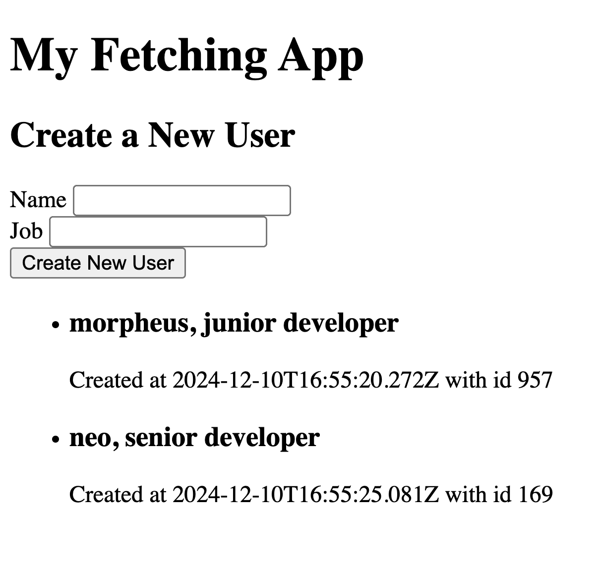

# 2. Fetch


Follow along with code examples [here](https://github.com/The-Marcy-Lab-School/4-5-fetch)!


**Table of Contents:**
- [Key Concepts](#key-concepts)
- [APIs](#apis)
- [Web APIs and The HTTP Request and Response Cycle](#web-apis-and-the-http-request-and-response-cycle)
  - [Endpoints and Request Verbs](#endpoints-and-request-verbs)
  - [Message Body and Status Codes](#message-body-and-status-codes)
  - [APIs Pop Quiz!](#apis-pop-quiz)
- [The `fetch()` function](#the-fetch-function)
  - [Steps 1 and 2: Getting A Response Object](#steps-1-and-2-getting-a-response-object)
  - [Steps 3 and 4: Reading Data From the Response Object](#steps-3-and-4-reading-data-from-the-response-object)
  - [Steps 5 and 6: Do Something With the Data (and Errors)](#steps-5-and-6-do-something-with-the-data-and-errors)
- [Challenge: Make Your Own API App](#challenge-make-your-own-api-app)
- [Sending POST, PATCH, and DELETE Requests](#sending-post-patch-and-delete-requests)
- [More Information About Requests and Responses](#more-information-about-requests-and-responses)
  - [HTTP Status Codes](#http-status-codes)
  - [URL Structure](#url-structure)


## Key Concepts

* **Interface** — a "shared boundary" where two or more components of a system can interact and exchange information. Interfaces do not expose the inner details of the tool/machine/program that the user is operating — they instead provide well-defined and controlled access points for the user to operate it.
* **API (Application Programming Interface)** is an interface that enables software applications to communicate, exchange data, and share functionality.
* **Web API** — an API exposed over the internet via URLs. You send HTTP requests to **endpoints** (URLs) to create, read, update, or delete data.
* **HTTP methods** — verbs that describe the nature of the HTTP request to the API: 
  * **GET** (read / request data)
  * **POST** (create new data)
  * **PATCH** (update existing data)
  * **DELETE** (delete data)
* **Response object** — the object returned by `fetch()` that represents the full HTTP response from the server. It contains properties and methods such as `ok`, `status`, `json()`, `text()`, and `headers` that let you check the response status and read the response body in different formats.
* **Status Code** — a three-digit number returned by the server that indicates the result of an HTTP request (for example, 200 for success, 404 for not found, 500 for server error).

**Key Syntax**
* **`fetch(url)`** — GET request by default; returns a Promise that resolves to a `Response`.
* **`fetch(url, { method, body, headers })`** — send POST, PATCH, DELETE, etc. 
  * Use `body: JSON.stringify(data)` and `headers: { "Content-Type": "application/json" }` to send JSON.
* **`response.ok`** — `true` when status is 2xx, `false` otherwise. Check this before calling `response.json()`.
* **`response.status`**, and **`response.json()`** to check and read the body.
* **`response.json()`** — starts reading the response body as JSON and returns a Promise that resolves to the parsed data. Must be used (or returned) before using the data in a following `.then()`.

## APIs

Recall this definition of an **interface** from Object-Oriented programming unit:

> An **interface** is a "shared boundary" where two or more components of a system can interact and exchange information. Interfaces do not expose the inner details of the tool/machine/program that the user is operating — they instead provide well-defined and controlled access points for the user to operate it.

An **API (Application Programming Interface)** is an interface that enables different software applications to communicate, exchange data, and share functionality.

The `document` object and its methods like `document.querySelector()` is an example of an API (a.k.a. "The DOM API"). It provides an interface that allows us to communicate to the browser how we want it to dynamically update the DOM. We can't see the inner details of how it works, we just use it! 

```js
document.querySelector("h1").textContent = "Hello World!";
```

## Web APIs and The HTTP Request and Response Cycle

A **web API** is a type of API that enables the exchange of data and functionality over the internet.

Programs can interact with a web API by sending **HTTP requests** to one of the API's public URLs. In response to the request, the API will send back an **HTTP response**. This is called the **HTTP Request and Response cycle**:


Web APIs make it possible for applications to utilize data from other sources and combine them in interesting ways. For example, we can build an application that uses the Google Maps API to get directions from point A to point B and then use a weather API to display the weather along the route.

### Endpoints and Request Verbs

The specific URL that you send a request to is called an **endpoint**. A web API may have many endpoints that each provide access to a specific resource. Try visiting these endpoints from the https://dog.ceo API:

* https://dog.ceo/api/breeds/list/all (all breeds endpoint)
* https://dog.ceo/api/breeds/image/random (random breed image endpoint)

By default, the request will be a `GET` request meaning you are requesting data from the API. However, you can also send requests by changing this **request verb**:

* `"GET"` - Request to get data from the API's dataset (the default)
* `"POST"` - Request to create data to be added to the API's dataset
* `"PATCH"` - Request to update existing data in the API's dataset
* `"DELETE"` - Request to delete data in the API's dataset

Understandably, most APIs will only allow you to send `GET` requests to protect their data. However, it is possible for specific users or programs to be authorized to perform these other types of requests.

### Message Body and Status Codes

When sending a `GET` request, the API will send back a **message body** which contains the requested data. For `POST`, `PATCH`, and `DELETE` requests the message body may contain a simple message confirming the completion of the requested action.


The most common data format for data transferred via HTTP requests/responses is **JSON (JavaScript Object Notation)**


In addition to the message body, the request will contain a three-digit **status code** that describes the status of the response. Here are a few commonly found status codes:

* `200` OK: The request was successful
* `400` Bad Request: The server received the request but was unable to process it due to malformed syntax
* `403` Forbidden: The server understood the request but denied it
* `404` Not Found: The server could not find the requested resource
* `500` Internal Server Error: The server experienced something unexpected that prevented it from fulfilling the request

### APIs Pop Quiz!

**<details><summary>Q1: A Web API is an interface for exchanging ____ via _____</summary>**

A Web API is an interface for exchanging data via the internet (HTTP)

</details>

**<details><summary>Q2: What do we call the cycle that describes how we get det data from a Web API?</summary>**

The HTTP Request and Response cycle

</details>

**<details><summary>Q3: What do we call the specific URL that we send a requst to?</summary>**

The endpoint

</details>

**<details><summary>Q4: What are the four HTTP request verbs and what do they each mean?</summary>**

* `"GET"` - Request to get data from the API's dataset (the default)
* `"POST"` - Request to create data to be added to the API's dataset
* `"PATCH"` - Request to update existing data in the API's dataset
* `"DELETE"` - Request to delete data in the API's dataset

</details>

**<details><summary>Q5: How is data typically formatted when sent via HTTP?</summary>**

Using JSON (JavaScript Object Notation)

</details>

## The `fetch()` function

Now that we know all about the HTTP Request and Response cycle, let's learn how to actually send requests from our programs using `fetch`

The `fetch(url, config)` function can be invoked to send an HTTP request to the given `url`. 
* The `config` parameter is optional and is used to specify the type of request (`GET`, `POST`, etc.) but we can omit it when sending a `GET` request. 
* A `Promise` object is returned that will resolve to the `Response` object.

```js
const fetchPromise = fetch('API_ENDPOINT_GOES_HERE'); 
// no config needed for GET requests
```

When, using the `fetch` function, we will follow these 6 steps:

```js
// 1. Invoke fetch with an API endpoint. A promise is returned.
const fetchPromise = fetch('API_ENDPOINT_GOES_HERE');

// 2. Define promise handlers with .then and .catch
fetchPromise
  .then((response) => {
    // 3. Check that the response is ok. If it isn't throw a useful error.
    if (!response.ok) {
      throw Error(`Fetch failed. ${response.status} ${response.statusText}`)
    }

    // 4. Start reading the response body's ReadableStream
    const readingPromise = response.json();
    return readingPromise
  })
  .then((responseBody) => {
    // 5. When the response body is read, do something with it!
    // What you do will depend on the API you're using
    // TIP: Print the structure of the body to see what you're working with.
    console.log(responseBody);
  })
  .catch((err) => {
    // 6. Handle Errors
    console.error(err);
  })
```

Let's break this down.

### Steps 1 and 2: Getting A Response Object

Let's start with the first two steps:

1. Invoke `fetch` with an API endpoint (a specific URL provided by a web API). A promise is returned.
2. Define promise handlers with `.then` and `.catch`

To test this, we can use the API endpoint `https://dog.ceo/api/breeds/image/random` and, in the `.then()` handler, print out the `response` object that the returned promise resolves to.

```js
const fetchPromise = fetch('https://dog.ceo/api/breeds/image/random');

fetchPromise
  .then((response) => {
    console.log(response)	

    // the rest of the code ...
  })
```

We should get something that looks like this:


The returned object is a [Response](https://developer.mozilla.org/en-US/docs/Web/API/Response) object. It contains useful information about both the request and the response including:

* `response.body` — a stream of data that we can read to get the response data
* `response.ok` — indicates if the response succeeded or failed
* `response.status` — a 3-digit code the type of success or failure that occurred (`200` means the requested data was returned)
* `response.statusText` — a string with more information about the response
* `response.url` — the endpoint requested

The `response.body` is the main thing we want from this response, but as you can see it is a `ReadableStream` object, not a string or normal object with the data inside.

Let's look at the next steps to see how we get the data from this `ReadableStream`.

### Steps 3 and 4: Reading Data From the Response Object

Our objective is to get the data from this response so that we can use it in our application. The code below accomplishes that task, but how?

```js
fetchPromise
  .then((response) => {
    // 3. Check that the response is ok. If it isn't throw a useful error.
    if (!response.ok) {
      throw Error(`Fetch failed. ${response.status} ${response.statusText}`)
    }

    // 4. Start reading the response body's ReadableStream
    const readingPromise = response.json();
    return readingPromise;
  })
```

Step 3 is a guard clause for step 4, so let's start with step 4 and then return to step 3:


When an HTTP request is sent to a web API, the response data isn't sent back all at once. Instead, it is sent back in a continuous "stream" of data chunks. That's what the `ReadableStream` in the `response.body` is.

<details>

<summary><strong>Q: Why might it be useful to send data in a stream of chunks, rather than all at once</strong></summary>

Getting data from another source requires two steps: first downloading the data and then reading it. If the data is really large, downloading the data can become a blocking task.

By chunking the data, we can download the data in smaller pieces and start the process of reading it as it comes in. If we had to wait for all of the data to be downloaded before we started reading it, the process would take longer.

</details>

Reading the incoming data stream is an asynchronous process that we can initiate by invoking the `response.json()` function, which will read the data stream as JSON.


Using `response.json()` assumes that the data is in JSON format (99% of the time it will be). If it isn't, there are [other methods available](https://developer.mozilla.org/en-US/docs/Web/API/Response#instance_methods).


`response.json()` returns a promise.

```js
// 4. Start reading the response body's ReadableStream
const readingPromise = response.json();
```

However, before we do this, we need to check to see if the `response` failed. If it did, then there won't be any data to read in. We don't want to start an asynchronous process unnecessarily if we don't have to.

So, we include a guard clause that checks the `response.ok` property and throws a useful error with the status of the response:

```js
fetchPromise
  .then((response) => {
    // 3. Check that the response is ok. If it is NOT, throw a useful error.
    if (!response.ok) {
      throw Error(`Fetch failed. ${response.status} ${response.statusText}`)
    }

    // Assuming that the response IS ok, go ahead and read the data stream.
  })
```

So, what we have so far is this:

```js
const fetchPromise = fetch('https://dog.ceo/api/breeds/image/random');

fetchPromise
  .then((response) => {
    if (!response.ok) {
      throw Error(`Fetch failed. ${response.status} ${response.statusText}`)
    }

    const readingPromise = response.json();
    return readingPromise;
  })
```

Note that the ONLY thing that we've changed from the pattern is the API endpoint that we used to invoke `fetch()`. Most of this code is "boilerplate" (it will be the same every time).

But why do we return the `readingPromise` from the callback given to `.then()`?

### Steps 5 and 6: Do Something With the Data (and Errors)

Remember, the `Promise.then()` method returns a Promise. That Promise will resolve to whatever is returned by the callback invoked by `.then()`!

So, if we return the `readingPromise` from `.then()`, then we can handle that Promise by chaining another invocation of `.then()` to our first one! When the `readingPromise` finishes reading the `response.body` data stream, the second `.then()` will be invoked with the requested data:

```js
const fetchPromise = fetch('https://dog.ceo/api/breeds/image/random');

fetchPromise
  .then((response) => {
    if (!response.ok) {
      throw Error(`Fetch failed. ${response.status} ${response.statusText}`)
    }
    const readingPromise = response.json();

    // readingPromise can be handled by the next .then, but only if we return it
    return readingPromise;
  })
  .then((responseBody) => {
    // When the response body is read, do something with it!
    // TIP: Print the structure of the body to see what you're working with.
    console.log(responseBody);
    dogImage.src = responseBody.message;
  })
  .catch((err) => {
    // 6. Handle Errors
    console.error(err);
  })
```

* What you do will depend on the API you're using
* For example, the dog.ceo API puts the image source URL in the `responseBody.message` property.
* Every web API should include documentation that outlines the structure of the `responseBody` data.

The final step of handling errors isn't that new or interesting. If an error is thrown (or if a Promise rejects), we catch it and print it out. However, we should be aware of what can cause an error (or a rejected Promise).

There are two likely causes of errors / rejected Promises:

* A `fetch()` Promise rejects when the request itself fails. For example, the URL might be malformed (`hxxp://example.com`) or there is a network error (you don't have internet).
  * **Note**: a `fetch()` promise can still resolve but have `response.ok` be `false`. For example, if the URL is properly formatted but the API you are requesting from is down, the `fetch()` call itself will work but `response.ok` will be `false`. You can check the [HTTP status code](2-fetch.md#http-status-codes) to see exactly what caused the request to fail. In this case, we manually throw our own `Error` in step 3.
* A `response.json()` Promise rejects when the `response` body is NOT in JSON format and therefore cannot be read.

## Challenge: Make Your Own API App

Now that you know how to use APIs, use the 6-step structure above to send and handle `fetch` requests to other APIs! Here are a few other free API endpoints that you can try:

* https://api.thecatapi.com/v1/images/search
* https://pokeapi.co/api/v2/pokemon/pikachu
* https://v2.jokeapi.dev/joke/Programming
* https://api.sunrise-sunset.org/json?lat=40.7128\&lng=-74.0060\&tzid=America/New\_York

Can you build an application that fetches this data and then displays it in some useful way? We've provided the `2-fetching-challenge` starting template for you to start working with.

## Sending POST, PATCH, and DELETE Requests

HTTP requests are not exactly requests for data; they are requests to perform a CRUD action. Consider these examples related to Instagram:

* The client requests to post a new picture on their profile (Create)
* The client requests to see all posts made by Beyonce (Read)
* The client requests to update a post they made yesterday (Update)
* The client requests to delete a post they made yesterday (Delete)

Each of these requests to perform CRUD actions has an HTTP verb that is associated with it.

* `POST` - Create
* `GET` - Read
* `PATCH` - Update
* `DELETE` - Delete

This HTTP verb or “method” is sent in the HTTP Request so that the server knows what kind of request it is receiving.

The default behavior of using `fetch` is to make a `GET` request, but we can also make other kinds of requests by defining an `options` object. We then pass the `options` object as a second argument to `fetch`. Here are some examples of POST (create), PATCH (update), and DELETE (delete) requests:



When sending a POST request, we often will need to send a **request body**. Before sending, we `JSON.stringify` that data and tell the API that we're sending `"application/json"` data.

```js
const url = 'https://reqres.in/api/users';
const newUser = { name: "morpheus", job: "junior developer" };

const options = {
  method: "POST",       
  body: JSON.stringify(newUser), 
  headers: {
    "Content-Type": "application/json"
  }  
};

fetch(url, options);
// handle the fetch promise, etc...
```



When sending a PATCH request, we are often updating a single resource. So, notice how the `url` now ends with `/users/2` to indicate that we want to update the user with id 2. The request body will include our desired changes. Again, we `JSON.stringify` that data and tell the API that we're sending `"application/json"` data.

```js
const url = 'https://reqres.in/api/users/2';
const updatedUser = { name: "morpheus", job: "senior developer" };

const options = {
  method: "PATCH",       
  body: JSON.stringify(updatedUser), 
  headers: {
    "Content-Type": "application/json"
  }  
};

fetch(url, options);
// handle the fetch promise, etc...
```



When sending a DELETE request, we are often deleting a single resource. So, notice how the `url` now ends with `/users/2` to indicate that we want to delete the user with id 2. No data needs to be sent with the request so we leave out `body` and `headers`.

```js
const url = 'https://reqres.in/api/users/2';

const options = {
  method: "DELETE",       
};

fetch(url, options);
// handle the fetch promise, etc...
```



Most of the `options` object is boilerplate (it's mostly the same each time):

* The `method` determines the kind of request
* The `body` determines **what** we send to the server. Note that it must be `JSON.stringify()`-ed first.
* The `headers` object provides meta-data about the request. It can provide many pieces of information but here all we need to share is the format of the data we are sending to the API.

To see this in action, check out the example in `3-post-requests` which uses a form to create new users:



## More Information About Requests and Responses

### HTTP Status Codes

Every Response that we receive from a server will include a status code indicating how the request was processed. Was the resource found and returned? Was the resource not found? What there an error? Did the POST request successfully create a new resource?

Responses are grouped in five classes:

* Informational responses (100 – 199)
* Successful responses (200 – 299)
* Redirection messages (300 – 399)
* Client error responses (400 – 499)
* Server error responses (500 – 599)

Important ones to know are 200, 201, 204, 404, and 500

### URL Structure

Every URL has a few parts. Understanding those parts can help us fetch precisely the data we want.

Consider this URL which tells us information about the sunrise and sunset at a particular [latitude and longitude](https://en.wikipedia.org/wiki/Geographic_coordinate_system#Latitude_and_longitude):

```
https://api.sunrise-sunset.org/json?lat=36.7201600&lng=-4.4203400&date=2023-3-15
```

Let's break it down:

* `https://api.sunrise-sunset.org` — This is the **host**. It tells the client where the resource is hosted/located.
* `/json` - This is the **path**. It shows what resource is being requested
* `?lat=36.7201600&lng=-4.4203400&date=2023-3-15` - These are **query parameters** and this particular URL has 3: `lat`, `lng`, and `date`. Query parameters begin with a `?` are are separated with `&`. Each parameter uses the format `name=value`. Try changing the `date` parameter!

When using a new API, make sure to look at that API's [documentation](https://api.sunrise-sunset.org/) (often found at the host address) to understand how to format the request URL.
