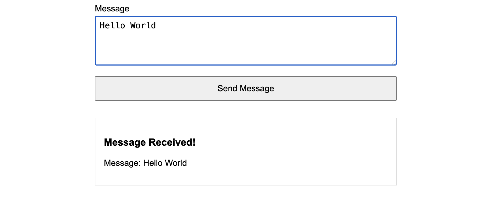

# Handling Forms


Follow along with code examples [here](https://github.com/The-Marcy-Lab-School/4-7-handling-forms)!

Clone down the repo, `cd` into it and run `npm i` to install dependencies.


**Table of Contents:**
- [Key Concepts](#key-concepts)
- [Forms Review: What We Learned in Module 3](#forms-review-what-we-learned-in-module-3)
- [Handling Forms With JavaScript](#handling-forms-with-javascript)
  - [Challenge: Adding A New Input](#challenge-adding-a-new-input)
  - [Handling Checkbox Inputs](#handling-checkbox-inputs)
- [FormData API](#formdata-api)
  - [FormData Checkboxes](#formdata-checkboxes)
  - [Sending FormData to APIs](#sending-formdata-to-apis)
- [Challenge: Build Your Own Form with Formspree!](#challenge-build-your-own-form-with-formspree)
- [Additional Reading](#additional-reading)
  - [Other Form Events](#other-form-events)
  - [Form Validation with JavaScript](#form-validation-with-javascript)
    - [Challenge: Registration Form with Validation](#challenge-registration-form-with-validation)

## Key Concepts

* **Default form behavior** - collect input data, refresh the current page, and send the data to the URL specified in the `action` attribute using the HTTP `GET` method (or `POST` if specified)
* **FormData API** — the modern approach to extracting all form values as an object
* **Form validation** — checking user input before processing the form data
* **Form reset** — clearing all form inputs after successful submission

**Key Syntax**
* **`event.preventDefault()`** — prevents default form submission behavior
* **`form.elements.fieldName.value`** — access input values by name using form.elements
* **`form.elements.checkboxName.checked`** — access checkbox checked state (returns `true`/`false`)
* **`new FormData(form)`** — creates a FormData object from a form element
* **`Object.fromEntries(formData)`** — converts FormData to a plain JavaScript object
* **`form.reset()`** — clears all form inputs to their default values

## Forms Review: What We Learned in Module 3

In Module 3, we learned how to build forms using HTML and CSS:

* How to structure forms with `<form>`, `<label>`, `<input>`, and `<button>` elements
* Different input types: `text`, `number`, `email`, `date`, `checkbox`, `radio`, `<textarea>`, `<select>`
* Connecting labels to inputs using `for` and `id` attributes for accessibility
* The `name` attribute on inputs (which we'll use extensively in this lesson!)
* HTML validation attributes: `required`, `min`, `max`, `minlength`, `maxlength`, `pattern`

We also learned how to capture the form data and send it to Formspree using the `action` and `method` attributes:

```html
<form action="https://formspree.io/f/YOUR_FORM_ID" method="POST">
  <div>
    <label for="username">Username</label>
    <input type="text" id="username" name="username" required>
  </div>

  <div>
    <label for="email">Email</label>
    <input type="email" id="email" name="email" required>
  </div>

  <button type="submit">Sign Up</button>
</form>
```

Recall that after submitting the form you would be redirected to the Formspree.


**<details><summary>Q: Take a look at the input elements. What is the difference between the `id` and `name` attributes?</summary>**

* The `id` attribute labels the field so that it can be connected to the `<label>` element
* The `name` attribute gives the form value a name when it is submitted. Remember this!

</details>

**<details><summary>Q: What does the `method="POST"` attribute mean?</summary>**

A POST request means that we are sending data to a server as opposed to requesting data from it.

</details>

Using services like Formspree is great for simple contact forms, but it has limitations:

* ❌ **You lose control** — the data is sent away and you can't do anything with it in your app
* ❌ **The page reloads/redirects** — this breaks the user experience in modern single-page applications
* ❌ **No custom validation** — you can only use basic HTML validation
* ❌ **No dynamic behavior** — you can't update the page based on the submitted data

Modern web applications handle forms with JavaScript instead, which allows us to:

* ✅ **Keep users on the same page** — no reload or redirect
* ✅ **Do whatever we want with the data** — display it, store it, send it to an API
* ✅ **Provide instant feedback** — show success messages, validation errors, loading states
* ✅ **Create dynamic experiences** — add items to a todo list, submit reviews, create posts

## Handling Forms With JavaScript

Let's start with a simple form with a single field and a button. Take a look at `0-contact-form/index.html`


    
Remember, we are using the Vite development server. To get the app running on the development server:
* `cd` into the directory
* `npm i` to install Vite dependencies (we did this earlier at the repo root)
* `npm run dev` to start the server
* `ctrl+c` to stop the server



```html
<form id="contact-form" action="https://formspree.io/f/xojnjqkp" method="POST">
  <div>
    <label for="message">Message</label>
    <textarea id="message" name="message" rows="4" required></textarea>
  </div>

  <button type="submit">Send Message</button>
</form>

<!-- Display the form results here -->
<div class="output">
  <h3 id="contact-output-status"></h3>
  <p>Message: <span id="contact-output-message"></span></p>
</div>
```

Try filling out the form. Confirm the behavior—the data is set to Formspree and you are redirected to another page.

Instead, let's prevent this default behavior and handle the form submission ourselves. We'll display a brief status message like "Message Received!" in the empty `h3` element and the message in the empty `span` element:



To do this, we'll need to:

1. **Prevent** the default page reload/redirect behavior
2. **Extract** the form data from the inputs using the `name` attribute
3. **Use** the data (display it, send it to an API, etc.)
4. **Reset** the form

```js
// Step 1: Grab the form and the output elements
const contactForm = document.querySelector('#contact-form');
const contactOutputStatus = document.querySelector("#contact-output-status")
const contactOutputMessage = document.querySelector("#contact-output-message")

// Step 2: Add a "submit" event listener to the form (don't forget event!)
contactForm.addEventListener('submit', (event) => {
  // Step 3: event.preventDefault()
  event.preventDefault();

  // Step 4: Get the form data
  const message = contactForm.elements.message.value;

  // Step 5: Use the form data (display it)
  contactOutputStatus.textContent = "Message Received!";
  contactOutputMessage.textContent = `${message}`;

  // Step 6: Reset the form
  contactForm.reset();
});
```

Let's look closer at the key parts of the JavaScript:

**<details><summary>`contactForm.addEventListener('submit', (event) => {})`</summary>**
* The `"submit"` event is fired when the user presses the submit button.
* The event handler should use the `event` parameter for preventing the default behavior.

</details>

**<details><summary>`event.preventDefault()`</summary>**

* `event.preventDefault()` stops the browser from doing its default action (reload/redirect)
* It *must* be called at the start of the handler. Otherwise the page will reload and your JavaScript won't run!
* Try removing it to see for yourself!

</details>

**<details><summary>`contactForm.elements.message.value`</summary>**

* `contactForm.elements` is an object containing all inputs in the form. 
* Inside of it, you can access inputs by their `name` attribute (e.g., `form.elements.message`).
* Then, use `.value` to get the current value of the input (e.g. `form.elements.message.value`)

</details>

**<details><summary>Status Message</summary>**
* When handling form submissions, it is a good practice to let your user know if the form submission worked!
* In this example we always display a success message but you can also show error messages if things like API calls fail

</details>

**<details><summary>`form.reset()`</summary>**
* Clears all inputs back to their default values
* Useful after successful submission
</details>

### Challenge: Adding A New Input

Let's add name and email inputs to this contact form and display them alongside the message, like this:


**HTML**
* Add two form inputs to the html, one for the name and one for the email 
  * make sure to give them `name` attributes!
* add an output element in the `div` to display the message (use a `<p>` with a `<span>` inside).
  * The format should be `"From: Ada Lovelace (ada@mail.com)"`.

**JavaScript**
* Grab the output element.
* In the event handler, extract the values for the `name` and the `email`.
* Display the formatted message in the output element.

> A solution can be found in the `0-contact-forms-solution/` folder.


### Handling Checkbox Inputs

Let's add a checkbox to our contact form. Suppose we want to give users the option to send the message anonymously.

**HTML:**

```html
<form id="contact-form">
  <!-- Other form elements... -->

  <div class="checkbox-field">
    <label for="anonymous">Send anonymously</label>
    <input type="checkbox" id="anonymous" name="anonymous">
  </div>

  <button type="submit">Send Message</button>
</form>
```

Checkboxes work differently from text inputs. Every form input has a `.value` property, but for checkboxes:
* The `.value` is always the string `"on"` whether or not the box is actually checked.
* The `.checked` property returns `true` if the box is checked or `false` if not.

So, here is the full JavaScript that uses the checkbox to display the user as "Anonymous" if they so choose: 

```js
const contactForm = document.querySelector('#contact-form');

contactForm.addEventListener('submit', (event) => {
  event.preventDefault();

  // For text inputs, use .value
  const name = contactForm.elements.name.value;         // "Ada Lovelace"
  const email = contactForm.elements.email.value;       // "ada@mail.com"
  const message = contactForm.elements.message.value;   // "Hello!"

  // For checkboxes, use .checked (not .value!)
  const isAnonymous = contactForm.elements.anonymous.checked;  // true or false

  // Now we can use the boolean to conditionally display the sender
  const sender = isAnonymous ? "Anonymous" : `${name} (${email})`;
  console.log(`From: ${sender}`);
  console.log(`Message: ${message}`);
});
```

**Tip:** You can reduce repetition of `formElement.elements` by destructuring:

```js
contactForm.addEventListener('submit', (event) => {
  event.preventDefault();

  // Destructure the elements to get each form input
  const { name, email, message, anonymous } = contactForm.elements;

  // remember to use .checked
  const sender = anonymous.checked ? "Anonymous" : `${name.value} (${email.value})`;

  contactOutputStatus.textContent = "Message Received!";
  contactOutputFrom.textContent = sender;
  contactOutputMessage.textContent = message.value;

  contactForm.reset();
});
```

## FormData API

The `FormData` API is a more modern approach to extracting data from a form. It automatically extracts ALL form values into a single `FormData` object. Since it is not an ordinary object, we need to convert it first using `Object.fromEntries()`:

```js
const contactForm = document.querySelector('#contact-form');

contactForm.addEventListener('submit', (event) => {
  event.preventDefault();

  // 1. Create a FormData object from the form
  const formData = new FormData(contactForm);

  // 2. Convert FormData to a plain JavaScript object
  const formValues = Object.fromEntries(formData);

  // Form inputs are stored in name:value pairs
  console.log(formValues);
  // { name: 'Ada', email: 'ada@mail.com', message: 'Hello!', anonymous: 'on' }

  // So we can extract the values directly
  const { anonymous, name, email, message } = formValues;

  const sender = anonymous ? "Anonymous" : `${name} (${email})`;

  contactOutputStatus.textContent = "Message Received!";
  contactOutputFrom.textContent = sender;
  contactOutputMessage.textContent = message;

  contactForm.reset();
});
```

Let's break this down:

**`new FormData(form)`**
* Creates a `FormData` object containing all the form's input values
* Automatically finds all inputs with a `name` attribute
* The `FormData` object is iterable but not directly usable as a normal object. Instead, it has "entries".

**`Object.fromEntries(formData)`**
* Converts the FormData object into a plain JavaScript object
* Each input's `name` becomes a property
* Each input's `value` becomes the property value

Often, the `FormData` and `Object.fromEntries` calls are combined into one.

```js
const contactForm = document.querySelector('#contact-form');

contactForm.addEventListener('submit', (event) => {
  event.preventDefault();

  const formValues = Object.fromEntries(new FormData(contactForm));
  const { anonymous, name, email, message } = formValues;

  const sender = anonymous ? "Anonymous" : `${name} (${email})`;

  contactOutputStatus.textContent = "Message Received!";
  contactOutputFrom.textContent = sender;
  contactOutputMessage.textContent = message;

  contactForm.reset();
});
```

**Pros:**
* ✅ Concise — just two lines to get all form data
* ✅ Automatic — grabs all inputs without listing them
* ✅ Less code to maintain when adding/removing fields

**Cons:**
* ❌ Less explicit — harder to see which fields exist
* ❌ Checkbox gotcha (see below)

### FormData Checkboxes

Remember how we said checkbox `.value` is always `"on"`? That's exactly what FormData gives you:

```js
const formValues = Object.fromEntries(new FormData(contactForm));
console.log(formValues);
/*
{
  name: 'Ada',
  email: 'ada@mail.com',
  message: 'Hello!',
  anonymous: 'on',        // <-- Checked checkbox gives "on", not true!
}
*/
```

And if the checkbox is **unchecked**, it won't be included at all:

```js
// If anonymous checkbox is NOT checked:
console.log(formValues);
/*
{
  name: 'Ada',
  email: 'ada@mail.com',
  message: 'Hello!',
  // anonymous is undefined — not even in the object!
}
*/
```

**For basic conditionals and ternary operations, this works fine** because of JavaScript's truthiness:

```js
const formValues = Object.fromEntries(new FormData(contactForm));
const { anonymous, name, email, message } = formValues;

// This works because "on" is truthy, undefined is falsy
const sender = anonymous ? "Anonymous" : `${name} (${email})`;
```

However, the most common use case for the `FormData` is when packaging the entire object to be sent to an API (which we'll see shortly). 

Most APIs will prefer receiving a booleans rather than a value that could either be `"on"`/`undefined`. So, we often will reassign a checkbox value after extracting it with `FormData`:

```js
const formValues = Object.fromEntries(new FormData(contactForm));
const { anonymous, name, email, message } = formValues;

// Convert checkbox to boolean for cleaner data
formValues.anonymous = Boolean(anonymous);

console.log(formValues);
// { name: 'Ada', email: 'ada@mail.com', message: 'Hello!', anonymous: true }
```

If you have multiple checkboxes, we need to convert each one:

```js
const formValues = Object.fromEntries(new FormData(contactForm));

formValues.anonymous = Boolean(formValues.anonymous);
formValues.subscribe = Boolean(formValues.subscribe);
formValues.acceptTerms = Boolean(formValues.acceptTerms);
```

### Sending FormData to APIs

Now let's combine what we learned about forms with what we learned about `fetch`!

Remember, in Module 3 we used Formspree to handle our form submissions. We set the `action` attribute to the Formspree URL and the form data was sent automatically when submitted. But this caused the page to redirect.

Now, we can use JavaScript to send the data ourselves using `fetch` with a POST request — keeping the user on the same page:

```js
const FORMSPREE_URL = "https://formspree.io/f/FORMSPREE_URL";

contactForm.addEventListener('submit', (event) => {
  event.preventDefault();

  const formValues = Object.fromEntries(new FormData(contactForm));
  const { anonymous, name, email, message } = formValues;
  
  // Make changes to the formValues before sending
  formValues.anonymous = Boolean(formValues.anonymous);
  if (formValues.anonymous) {
    delete formValues.name;
    delete formValues.email;
  }

  // Set up the POST request config
  const config = {
    method: 'POST',
    body: JSON.stringify(formValues),
    headers: {
      'Content-Type': 'application/json',
      'accept': 'application/json'
    }
  };

  // Send the fetch
  fetch(FORMSPREE_URL, config)
    .then((response) => {
      // 3. Check if the response was successful
      if (!response.ok) {
        throw Error(`Failed to submit. ${response.status} ${response.statusText}`);
      }
      return response.json();
    })
    .then((data) => {
      // 4. Handle success — update the UI
      console.log('Success:', data);
      
      const sender = Boolean(anonymous) ? "Anonymous" : `${name} (${email})`;
      contactOutputStatus.textContent = "Message Sent to Formspree!";
      contactOutputFrom.textContent = sender;
      contactOutputMessage.textContent = message;
      contactForm.reset();
    })
    .catch((error) => {
      // 5. Handle errors — show error message
      console.error('Error:', error);
      contactOutputStatus.textContent = 'Failed to send message. Please try again.';
    });
  contactForm.reset();
});
```

Let's break down the key parts:

**The `fetch` configuration object:**
* `method: 'POST'` — tells the server we're creating/sending new data
* `body: JSON.stringify(formValues)` — converts our JavaScript object to a JSON string
* `headers: { 'Content-Type': 'application/json', 'accept': 'application/json' }` — tells the server we're sending JSON data and are accepting JSON in response

**Why use `JSON.stringify()`?**

The `body` of a fetch request must be a string, not a JavaScript object. `JSON.stringify()` converts our object into a JSON-formatted string that can be sent over the network:

```js
const formValues = { name: 'Ada', email: 'ada@mail.com', message: 'Hello!' };

console.log(JSON.stringify(formValues));
// '{"name":"Ada","email":"ada@mail.com","message":"Hello!"}'
```

**Handling the response:**

Even though we're sending data (not requesting it), the API still sends back a response. We check `response.ok` to see if it succeeded, then update the UI accordingly.

## Challenge: Build Your Own Form with Formspree!

Test your skills by building your own form with Formspree from scratch! We've given you some code to start with in `1-form-challenge/` but it will be up to you to:
1. Create a new Formspree form
   1. Go to [formspree.io](https://formspree.io) and create a free account
   2. Create a new form and copy the endpoint URL (looks like `https://formspree.io/f/xyzabc123`)
2. Create a form with inputs. It is up to you what data you want to collect but your form should have:
   * At least one text input field
   * At least one checkbox field
   * A submit button
   * A `name` attribute for every input
   * A `label` for every input
3. Use the `FormData` approach to extract the form values. Remember to update the checkbox inputs!
4. Submit the form data to the Formspree URL using a POST request and `fetch()`
5. Render a success or an error message
6. Don't worry about styling. Just aim for functionality!

Use the example in `0-contact-form-solution-with-post` as a guide for what this looks like when completed!

## Additional Reading

### Other Form Events

Besides the `submit` event, there are several other useful form events:

**`input` event** — fires every time an input's value changes (as you type)

```js
const nameInput = document.querySelector('#name');

nameInput.addEventListener('input', (event) => {
  console.log('Current value:', event.target.value);
  // Great for: live character counters, search-as-you-type, instant validation
});
```

**`change` event** — fires when an input's value changes AND the input loses focus

```js
const selectMenu = document.querySelector('#country');

selectMenu.addEventListener('change', (event) => {
  console.log('Selected:', event.target.value);
  // Great for: dropdowns, radio buttons, checkboxes
});
```

**`focus` and `blur` events** — fires when an input gains or loses focus

```js
const emailInput = document.querySelector('#email');

emailInput.addEventListener('focus', () => {
  console.log('Email input focused');
  // Great for: showing help text, highlighting the field
});

emailInput.addEventListener('blur', () => {
  console.log('Email input lost focus');
  // Great for: validating after user finishes typing
});
```

**Non-submit buttons** — buttons with `type="button"` don't submit the form

```html
<button type="button" id="normal-button">Capitalize Name</button>
```

```js
const normalButton = document.querySelector('#normal-button');

normalButton.addEventListener('click', () => {
  const form = document.querySelector('form');
  const nameInput = form.elements.name;
  nameInput.value = nameInput.value.toUpperCase();
});
```

This is useful for buttons that manipulate form data without submitting!

### Form Validation with JavaScript

HTML validation attributes (`required`, `min`, `max`, etc.) are great, but sometimes we need custom validation logic. JavaScript gives us complete control!

Let's build a registration form with custom validation:

Check out this example in `2-registration-form`:

**HTML:** In the HTML, pay attention to the `<span class="error" id="input-name-error"></span>` elements that have been added for each input. 

```html
<form id="registration-form">
  <div>
    <label for="username">Username</label>
    <input type="text" id="username" name="username" required>
    <span class="error" id="username-error"></span>
  </div>

  <div>
    <label for="email">Email</label>
    <input type="email" id="email" name="email" required>
    <span class="error" id="email-error"></span>
  </div>

  <div>
    <label for="password">Password</label>
    <input type="password" id="password" name="password" required>
    <span class="error" id="password-error"></span>
  </div>

  <div>
    <label for="confirm-password">Confirm Password</label>
    <input type="password" id="confirm-password" name="confirmPassword" required>
    <span class="error" id="confirm-error"></span>
  </div>

  <button type="submit">Register</button>
</form>

<div id="success-message">
  <h3 id="success-heading"></h3>
  <p id="success-welcome"></p>
</div>
```

**CSS:** Here, we've created a class to make errors stand out.

```css
.error {
  color: red;
  font-size: 0.875rem;
  display: block;
  
  /* Reserve space even when empty */
  min-height: 1.25rem; 
}
```

**JavaScript:**

In the JavaScript, pay attention to how the helper functions work within the form submission event handler.

```js
const registrationForm = document.querySelector('#registration-form');
const successHeading = document.querySelector('#success-heading');
const successWelcome = document.querySelector('#success-welcome');

// Helper Function: Form validation
const validateForm = (formData) => {
  const errors = {};

  // Username must be at least 3 characters
  if (formData.username.length < 3) {
    errors.username = 'Username must be at least 3 characters';
  }

  // Email must contain @ symbol (basic check)
  if (!formData.email.includes('@')) {
    errors.email = 'Please enter a valid email address';
  }

  // Password must be at least 8 characters and contain a number
  if (formData.password.length < 8) {
    errors.password = 'Password must be at least 8 characters';
  } else if (!/\d/.test(formData.password)) {
    errors.password = 'Password must contain at least one number';
  }

  // Passwords must match
  if (formData.password !== formData.confirmPassword) {
    errors.confirm = 'Passwords do not match';
  }

  return errors;
};

// Helper Function: Display error messages
const displayErrors = (errors) => {
  // Clear all previous errors
  document.querySelectorAll('.error').forEach(span => span.textContent = '');

  // Display new errors
  Object.keys(errors).forEach(field => {
    const errorSpan = document.querySelector(`#${field}-error`);
    if (errorSpan) {
      errorSpan.textContent = errors[field];
    }
  });
};

registrationForm.addEventListener('submit', (event) => {
  event.preventDefault();
  const form = event.target;

  const formData = Object.fromEntries(new FormData(form));

  // Validate the form data to get any errors
  const errors = validateForm(formData);

  // If there are errors, display them and stop
  if (Object.keys(errors).length > 0) {
    displayErrors(errors);
    return; // Don't submit if there are errors!
  }

  // If there are no errors, clear out any previous errors
  displayErrors({});

  // Update the success message
  successHeading.textContent = 'Registration Successful!';
  successWelcome.textContent = `Welcome, ${formData.username}!`;

  form.reset();
});
```

This example demonstrates:
* Custom validation logic (username length, password requirements, matching passwords)
* Displaying error messages next to the relevant fields
* Preventing submission if validation fails
* Clearing errors when validation passes

#### Challenge: Registration Form with Validation

Enhance the registration form above by adding these validation rules:

1. Username must:
   - Be at least 3 characters
   - Contain only letters, numbers, and underscores
   - HINT: Use regex `/^[a-zA-Z0-9_]+$/`

2. Password must:
   - Be at least 8 characters
   - Contain at least one uppercase letter
   - Contain at least one lowercase letter
   - Contain at least one number

3. Add visual feedback:
   - Input borders turn red when there's an error
   - Input borders turn green when valid
   - Add CSS classes `.error` and `.valid` to inputs

**<details><summary>Solution</summary>**

```js
const registrationForm = document.querySelector('#registration-form');
const successMessage = document.querySelector('#success-message');

const validateForm = (formData) => {
  const errors = {};

  // Username validation
  if (formData.username.length < 3) {
    errors.username = 'Username must be at least 3 characters';
  } else if (!/^[a-zA-Z0-9_]+$/.test(formData.username)) {
    errors.username = 'Username can only contain letters, numbers, and underscores';
  }

  // Email validation
  if (!formData.email.includes('@')) {
    errors.email = 'Please enter a valid email address';
  }

  // Password validation
  if (formData.password.length < 8) {
    errors.password = 'Password must be at least 8 characters';
  } else if (!/[A-Z]/.test(formData.password)) {
    errors.password = 'Password must contain at least one uppercase letter';
  } else if (!/[a-z]/.test(formData.password)) {
    errors.password = 'Password must contain at least one lowercase letter';
  } else if (!/\d/.test(formData.password)) {
    errors.password = 'Password must contain at least one number';
  }

  // Confirm password
  if (formData.password !== formData.confirmPassword) {
    errors.confirm = 'Passwords do not match';
  }

  return errors;
};

const displayErrors = (errors) => {
  // Clear all previous error messages and classes
  document.querySelectorAll('.error').forEach(span => span.textContent = '');
  document.querySelectorAll('input').forEach(input => {
    input.classList.remove('error', 'valid');
  });

  // Display new errors and add error class to inputs
  Object.keys(errors).forEach(field => {
    const errorSpan = document.querySelector(`#${field}-error`);
    const input = document.querySelector(`[name="${field}"]`) ||
                  document.querySelector('#confirm-password');

    if (errorSpan) {
      errorSpan.textContent = errors[field];
    }
    if (input) {
      input.classList.add('error');
    }
  });

  // Add valid class to inputs without errors
  const formInputs = ['username', 'email', 'password', 'confirmPassword'];
  formInputs.forEach(field => {
    if (!errors[field]) {
      const input = document.querySelector(`[name="${field}"]`) ||
                    document.querySelector('#confirm-password');
      if (input && input.value) {
        input.classList.add('valid');
      }
    }
  });
};

const handleSubmit = (event) => {
  event.preventDefault();
  const form = event.target;

  const formData = Object.fromEntries(new FormData(form));
  const errors = validateForm(formData);

  if (Object.keys(errors).length > 0) {
    displayErrors(errors);
    return;
  }

  displayErrors({});

  // Clear previous success message
  successMessage.textContent = '';

  const successHeading = document.createElement('h3');
  const welcomeText = document.createElement('p');

  successHeading.textContent = 'Registration Successful!';
  welcomeText.textContent = `Welcome, ${formData.username}!`;

  successMessage.append(successHeading, welcomeText);

  form.reset();
};

registrationForm.addEventListener('submit', handleSubmit);
```

**Additional CSS:**
```css
input.error {
  border: 2px solid red;
}

input.valid {
  border: 2px solid green;
}

.error {
  color: red;
  font-size: 0.875rem;
  display: block;
  min-height: 1.25rem;
}
```

</details>
