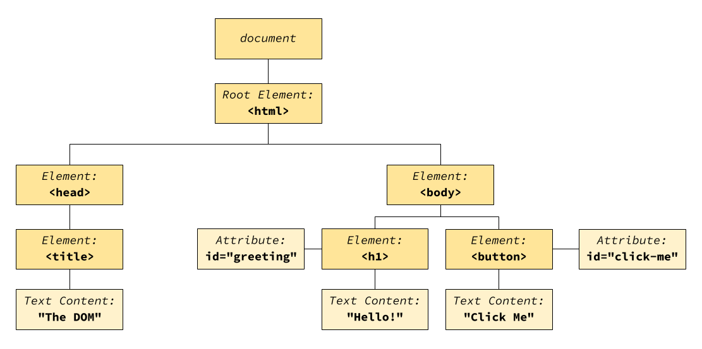

# Intro to Interactive Pages


Follow along with code examples [here](https://github.com/The-Marcy-Lab-School/4-1-interactive-pages)!


**Table of Contents**

- [Key Concepts](#key-concepts)
- [What Can JavaScript Do?](#what-can-javascript-do)
- [The Document Object Model (DOM)](#the-document-object-model-dom)
  - [Selecting Elements with querySelector](#selecting-elements-with-queryselector)
- [Events: Query, Listen, and React](#events-query-listen-and-react)
  - [addEventListener](#addeventlistener)
  - [Event Types](#event-types)
  - [The Event Object](#the-event-object)
- [Linking JavaScript to HTML](#linking-javascript-to-html)
- [Challenge: Speed Clicker](#challenge-speed-clicker)

## Key Concepts

**The DOM**
* **DOM (Document Object Model)** — the tree-like structure of JavaScript objects that the browser creates when it loads an HTML page. It maps the hierarchical relationships between elements.
* **`document` object** — the root object at the top of the DOM tree; our entry point for accessing and manipulating elements.
* **`document.querySelector(selector)`** — a method that returns the first element matching the given CSS selector. Returns `null` if no match is found.

**Events**
* **Event** — a user interaction that the browser can detect, such as a click, mouse movement, key press, or form submission.
* **`element.addEventListener(eventType, handlerFunction)`** — a method that registers an event handler function to run when the specified event type occurs on the element.
* **`event` object** — an object automatically passed to event handlers containing information about the event.
  * **`event.target`** — the element that triggered the event.
  * **`event.type`** — the type of event that occurred (e.g., `'click'`, `'keydown'`).

**Linking JS Files**
* **`<script src="file.js">`** — an HTML tag that links a JavaScript file to the page. Place at the end of the `<body>` to ensure all elements exist before the script runs.

## What Can JavaScript Do?

You've spent the last few weeks building beautiful, well-structured websites with HTML and CSS. But so far, your pages have been **static**—they look great, but they don't *do* anything when users interact with them.

**JavaScript changes everything.**

With JavaScript, you can make your pages respond to user actions:
- Click a button → something happens
- Type in a search box → results filter in real-time
- Hover over an image → it zooms in
- Submit a form → data gets saved

This is what we mean by **interactive web applications**. Let's see how it works.

In this lesson we'll first learn how to use JavaScript to manually manipulate HTML elements before learning how to make elements interactive.

## The Document Object Model (DOM)

Consider this HTML structure:


```html
<!DOCTYPE html>
<html>
  <head>
    <title>The DOM</title>
  </head>
  <body>
    <h1 id="greeting">Hello!</h1>
    <button id="click-me">Click Me</button>
  </body>
</html>
```


When a browser loads an HTML page, it converts every single HTML element into a JavaScript object and organizes them into a structure called the **Document Object Model (DOM)**. The DOM is a "tree-like" structure which maps the hierarchical relationship between elements.



The key insight: **if elements are objects, we can modify and interact with them using JavaScript!** We can change their text, their styles, their classes—anything.

The object at the top of this tree, `document` is our entry point to interacting with these objects.

### Selecting Elements with querySelector

To grab a specific HTML element object from the DOM, we use the `document.querySelector()` method. It uses the same CSS selector syntax you already know:

```js
// Find the first element with id="greeting"
document.querySelector('#greeting');

// Find the first button element
document.querySelector('button');

// Find the first element with class="highlight"
document.querySelector('.highlight');

// Find the first paragraph inside a div
document.querySelector('div p');
```

Open your browser's DevTools (F12 or right-click → Inspect), go to the Console tab, and try selecting elements on any webpage using this method.

Once you have a reference to an element, you can read and modify its properties:

```js
// Store the object in a variable to reference it multiple times
const heading = document.querySelector('#greeting');

// Read properties
console.log(heading.textContent);  // "Hello!"
console.log(heading.id);           // "greeting"

// Modify properties
heading.textContent = "Welcome!";  // Change the text
heading.style.color = "blue";      // Change the color
heading.classList.add("italic");    // Add a CSS class
```

Try these modifications in your DevTools console!

## Events: Query, Listen, and React

Now that we can select an element, we can make it interactive by using **events**. An event is something that the user does on the page:
1. clicking on a button
2. hovering over an element
3. scrolling on the page
4. pressing a key on their keyboard
5. submitting a form.

Using JavaScript, we can react to these user interactions using this pattern:

1. **Query** — Select the element you want to make interactive
2. **Listen** — Tell the browser to listen for a specific event on that element
3. **React** — Define what should happen when the event occurs

Here is the full pattern. Copy it into your DevTools console:

```js
// 1. Query: select the button
const button = document.querySelector('#click-me');

// 2 & 3. Listen and React: when clicked, change the heading
button.addEventListener('click', () => {
  const heading = document.querySelector('#greeting');
  if (heading.style.color !== "red") {
    heading.style.color = "red";
  } else {
    heading.style.color = "black";
  }
});
```

**<details><summary>Q: What type of value is the second argument for `addEventListener`?</summary>**

A callback function!

</details>

### addEventListener

The `addEventListener` method registers an **event handler** (a callback function) that runs when a specific event occurs.

```js
element.addEventListener(eventType, handlerFunction);
```

- **`eventType`** — A string like `'click'`, `'mouseover'`, `'keydown'`
- **`handlerFunction`** — A callback that runs when the event fires

A single element can have multiple event listeners:

```js
const heading = document.querySelector('#greeting');

heading.addEventListener('click', () => {
  console.log('heading was clicked!');
});

heading.addEventListener('mouseover', () => {
  console.log('Mouse is over the heading!');
});
```

### Event Types

There are many event types you can listen for:

| Event Type | Triggered When... |
|------------|-------------------|
| `click` | Element is clicked |
| `dblclick` | Element is double-clicked |
| `mouseover` | Mouse moves onto element |
| `mouseout` | Mouse leaves element |
| `mousemove` | Mouse moves while over element |
| `keydown` | A key is pressed |
| `keyup` | A key is released |
| `submit` | A form is submitted |
| `input` | An input's value changes |

You can find a complete list of events on [MDN](https://developer.mozilla.org/en-US/docs/Web/Events).

### The Event Object

When an event handler is called, it automatically receives an **event object** with information about what happened:

```js
const button = document.querySelector('#click-me');

button.addEventListener('click', (event) => {
  console.log(event.type);    // "click"
  console.log(event.target);  // The button element that was clicked
});
```

The two most important properties are:

- **`event.type`** — The type of event that occurred (`'click'`, `'keydown'`, etc.)
- **`event.target`** — The element that triggered the event

The event object also contains event-specific information. For example, keyboard events have a `key` property:

```js
document.body.addEventListener('keydown', (event) => {
  console.log(`You pressed: ${event.key}`);
});
```


**Tip:** When trying a new event type, always log the `event` object to see what properties are available!


## Linking JavaScript to HTML

Using the `document.querySelector()` method in the DevTools console is great for testing. But every time we refresh the page, all of our work is lost and we have to write it again. 

Instead, we can make a JavaScript file and have our HTML pages automatically run that file when the page loads.

For example, the `0-intro/index.js` file contains the following code:


```js
console.log('hello world');

const generateRandomColor = () => {
  const colorOptions = ['red', 'orange', 'yellow', 'green', 'blue', 'indigo', 'violet'];
  const index = Math.floor(Math.random() * colorOptions.length);
  return colorOptions[index];
}

console.log(generateRandomColor());
```


To run this file when our HTML page loads, add a `<script>` tag at the **end of the body** with a `src` attribute pointing to the `index.js` file:

```html
<!DOCTYPE html>
<html>
  <head>
    <title>The DOM</title>
  </head>
  <body>
    <h1 id="greeting">Hello!</h1>
    <button id="click-me">Click Me</button>

    <!-- JavaScript goes at the end of the body -->
    <script src="./index.js"></script>
  </body>
</html>
```

Now, when you load the page in the browser, the JavaScript will run and print messages in the console.

**Challenge Level 1:** Change the color of the button to a random color every time the button is clicked using the query, listen, react pattern:
1. Query: use `document.querySelector()` to grab the button element
2. Listen: use `addEventListener(eventType, handlerFunction)` to listen to "click" events
3. React: inside the `handlerFunction`, update the `style.backgroundColor` property of the button.

**<details><summary>Solution</summary>**

```js
const button = document.querySelector("#click-me");
button.addEventListener('click', (event) => {
  button.style.backgroundColor = generateRandomColor();
  
  // or use event.target to reference the button!
  event.target.style.backgroundColor = generateRandomColor();
});
```

</details>

**Challenge Level 2:** Change the background color of the heading when you mouseover it. How can you write the least amount of code to do this?

**<details><summary>Solution</summary>**

```js
// Store the handler function in a variable. 
const changeColorRandomly = (event) => {
  // Use event.target to reference the element that triggers the event
  event.target.style.backgroundColor = generateRandomColor();
};

// Add an event listener to both elements using the same handler function
const button = document.querySelector("#click-me");
button.addEventListener('click', changeColorRandomly);

const heading = document.querySelector("h1");
heading.addEventListener('mouseover', changeColorRandomly);

```

</details>


**<details><summary>Q: Why does the `<script>` tag need to go at the end of the body?</summary>**

JavaScript runs as soon as it loads. If your script tries to select an element that hasn't been added to the page yet, `querySelector` will return `null` and your code will break.

Try it out! The script will try to reference the `button#click-me` element before it exists.

By placing the `<script>` tag at the end of the body, you ensure all HTML elements exist before your JavaScript tries to access them.

</details>

## Challenge: Speed Clicker

In the `1-speed-clicker/` folder, build a "Speed Clicker" game to practice the Query, Listen, React pattern.

**Basic Requirements:**
1. Create an HTML page with:
   - A heading that displays the current count (starting at 0)
   - A button to click to increase the count
   - A "Reset" button to set the count back to 0
2. Each time the main button is clicked, increment the count and update the heading

**Bonus Challenges:**
- Add a 10-second timer and see how many clicks you can get
- Make the reset button reset the timer and try again
- Track and display the high score

**<details><summary>Starter Code</summary>**

**index.html**
```html
<!DOCTYPE html>
<html lang="en">
<head>
  <meta charset="UTF-8">
  <meta name="viewport" content="width=device-width, initial-scale=1.0">
  <title>Speed Clicker</title>
</head>
<body>
  <h1 id="count-display">Count: 0</h1>
  <button id="click-button">Click Me!</button>
  <button id="reset-button">Reset</button>
  
  <script src="./index.js"></script>
</body>
</html>
```

**index.js**

```js
// Keep track of the count
let count = 0;

// TODO: Select the elements you need

// TODO: Add a click event listener to the click button
// - Increment the count
// - Update the heading to show the new count

// TODO: Add a click event listener to the reset button
// - Set count back to 0
// - Update the heading
```

</details>

**<details><summary>Basic Solution</summary>**

```js
// index.js

let count = 0;

const countDisplay = document.querySelector('#count-display');
const clickButton = document.querySelector('#click-button');
const resetButton = document.querySelector('#reset-button');

clickButton.addEventListener('click', () => {
  count++;
  countDisplay.textContent = `Count: ${count}`;
});

resetButton.addEventListener('click', () => {
  count = 0;
  countDisplay.textContent = `Count: ${count}`;
});
```

</details>
