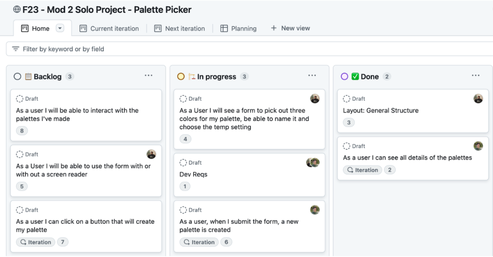

As you build this project, you will need to be incredibly organized and communicate well with your partner.

Throughout your career, as you work on more projects and on more teams, you will realize that the people you enjoy working with most are excellent communicators and are highly organized. Additionally, being able to demonstrate your communication skills and approach to organization can really set you apart in the hiring process.

In the world of software engineering, one methodology for successful communication and organization is called "The Agile Methodology" (look it up!). While there are many aspects to this methodology, we will focus on three of its most important practices: 
1. Maintaining a scrum board
2. Holding stand-up and stand-down meetings.
3. Sprints

## Scrum Board

A scrum board is a tool for creating and assigning tasks called "tickets". The scrum board separates these tickets into three columns:
1. **Backlog**: unassigned tasks that need to be completed
2. **In Progress**: assigned tasks that are in progress
3. **Done**: tasks that have been completed

High quality tickets should include a description of the task to be completed, contain additional implementation details inside the ticket, and be assigned to an individual.

This practice is essential for ensuring that every task is completed and every team member is contributing meaningfully.

## Daily stand-up and stand-down

Stand-up and stand-down meetings are held daily and are meant to take only a few minutes. The purpose of this meeting is to update the status of scrum board tickets and for every team member to share three things:

* What tickets did they complete?  
* What tickets do they plan on assigning themselves next?  
* What are they stuck on and may need help with?

By sharing these details, the scrum board is meticulously maintained, every team member can be aware of the overall progress made on the project, and blockers can be handled quickly.

## Retrospective

Following the completion of project week, you will have an opportunity to reflect on your experience. Doing so encourages you to celebrate your wins and identify how you want to improve. You may ask yourself:

- What kind of teammate was I? 
- Did I communicate well? 
- Was I collaborative or was I uncompromising?
- Did I contribute meaningfully to the end result or did I let my teammates do most of the work?
- Was I able to resolve problems on my own? 
- Did I reach out for help in a timely manner when I got stuck?
- What technical areas was I confident in?
- What technical areas can I improve in?