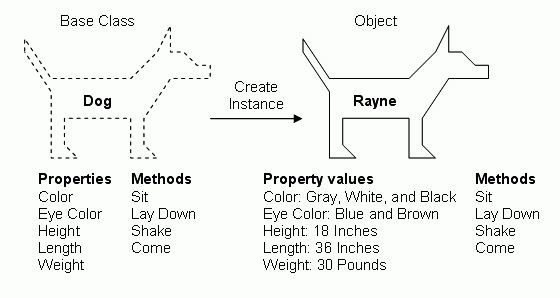

# Classes


Follow along with code examples [here](https://github.com/The-Marcy-Lab-School/5-0-1-classes)!


**Table of Contents:**
- [Intro: Reviewing Factory Functions](#intro-reviewing-factory-functions)
  - [Factory Functions Waste Memory](#factory-functions-waste-memory)
- [Classes](#classes-1)
  - [Class Definition and `new`](#class-definition-and-new)
  - [Instanceof](#instanceof)
  - [Setting Properties With A Constructor](#setting-properties-with-a-constructor)
  - [Defining Instance Methods](#defining-instance-methods)
- [Quiz!](#quiz)
- [Challenge](#challenge)
- [Summary](#summary)

## Intro: Reviewing Factory Functions

In the last lecture, we learned about **encapsulation** - bundling data and methods that act on that data into an object. We learned about using **closures** to hide internal data and restrict access to them.

The nice thing about encapsulation is that we can re-use `makeFriendsManager` to create multiple objects that look alike: each friends manager has `getFriends` and `addFriends` methods.

This kind of function is called a **factory function** and each object created from this factory function is called an **instance**.

```js
// factory functions return objects
const makeFriendsManager = () => {
  const friends = [];

  return {
    getFriends() {
      return [...friends]; 
    },
    addFriend(newFriend) {
      if (typeof newFriend !== 'string') {
        throw Error('new friends must be strings');
      };
      friends.push(newFriend);
    }
  }
}

// instances of the factory function have their own friends
const reuben = makeFriendsManager();
reuben.addFriend('carmen')
reuben.addFriend('ann')
reuben.addFriend('motun')
console.log(reuben.getFriends()); // ['carmen', 'ann', 'motun']


const maya = makeFriendsManager();
maya.addFriend('ben')
maya.addFriend('gonzalo')
console.log(maya.getFriends()); // ['ben', 'gonzalo']
```

### Factory Functions Waste Memory

The instances `reuben` and `maya` definitely have the same behavior. But do they _share_ that behavior? That is, **are the methods they each have referencing the same exact function?**

```js
console.log(reuben);
// {
//   getFriends: [Function: getFriends],
//   addFriend: [Function: addFriend]
// }

console.log(maya);
// {
//   getFriends: [Function: getFriends],
//   addFriend: [Function: addFriend]
// }

// so, are they the same object?
console.log(reuben === maya);
// are the methods of these objects the same?
console.log(reuben.addFriend === maya.addFriend);
```

<details>

<summary><strong>Answer</strong></summary>

No! They are not the same. Each time the factory function is invoked, a brand new object is made and the methods are recreated as well. This is a waste of memory!

We'll end up with two objects, each with two methods for a total of 4 methods. It would be great if we could share them.

</details>

## Classes



A **class** defines a type of object and the properties/methods that those objects will share.

<details>

<summary><strong>Q: Suppose we wanted to create a class to represent users. What would the default properties be? What methods would be shared by each instance?</strong></summary>

* The `User` class would have a **constructor function** for making a `User` instance with properties like `username`, `email`, and `password`
* The `User` class might have methods like `changeUsername` or `setPassword`

</details>

### Class Definition and `new`

Many programming languages implement classes in some manner.

In JavaScript, it starts with the `class` keyword, an uppercase name, and curly braces. Like this:

```js
// class definitions
class Person {

}

// creating class instances with the `new` keyword
const ben = new Person();
const carmen = new Person();

// Instances are objects derived from a particular class
console.log(ben);     // User {}
console.log(carmen);  // User {}
```

With a `class` definition, we can create new **instances** of that class using the `new` keyword. An **instance** is an object that is derived from a class.


**Note:** Even though `Person` is treated like a function (we invoke it), you must use the `new` keyword when making an instance (you'll get an error if you don't)

```js
// User is a function, but you can't just call it
console.log(typeof Person); // function

const ben = Person(); // error: you must use the new keyword to invoke a constructor function
```



### Instanceof

We can use the `instanceof` operator (kind of like the `typeof` operator) to see if an object is derived from the given class.

```js
console.log(ben instanceof Person); // true
console.log(ben instanceof Array); // false

console.log([] instanceof Person); // false
console.log([] instanceof Array); // true
```

### Setting Properties With A Constructor

Right now, the class definitions only allow us to create blank objects. But objects are only useful if they have properties.

There are two kinds of properties that instances of a class can have:

1. Properties with default values
2. Properties whose values are provided when the instance is "constructed"

```js
class Person {
  // Default properties are defined here. We can change these later.
  // Notice that the `this` keyword isn't used
  friends = []

  // The constructor allows the creator of the instance to specify property values
  constructor(name, age) {
    // The `this` keyword references the new instance object being created
    // We're setting properties on that new object
    this.name = name;  
    this.age = age;
  }
}

const ben = new Person('ben', 30);
const gonzalo = new Person('gonzalo', 36);

console.log(ben, gonzalo);
// Person { name: 'ben', age: 29, friends: [] }
// Person { name: 'gonzalo', age: 36, friends: [] }
```

Class `constructor` functions have some quirks to get used to:

* `constructor` is a special method name. You must use this name. When you create a new instance of a class using `new`, JavaScript will look to see if the class has a `constructor` method and it will execute that method.
* The `constructor` function can accept parameters whose values are provided when the instance is made
* The `this` keyword, when used in a `constructor,` references the new instance object being created.

### Defining Instance Methods

Remember, **encapsulation** wants us to bundle data with methods that operate on that data.

Adding methods to a `class` definition looks like this:

```js
class Person {
  friends = [];

  constructor(name, age) {
    this.name = name;
    this.age = age;
  }
  
  // notice that we don't have commas between methods
  // These methods are shared by ALL instances of the class

  addFriend(newFriend) {
    // When used in a method, this references the object invoking the method
    if (typeof newFriend !== 'string') {
      throw Error('new friends must be strings');
    };
    this.friends.push(newFriend);
  }

  greet() {
    console.log(`Hi, I'm ${this.name}, I am ${this.age} years old and I have ${this.friends.length} friends.`);
  }
}
const ben = new Person('ben', 30);

ben.addFriend('carmen');
ben.addFriend('gonzalo');
ben.addFriend('maya');

ben.greet(); // Hi, I'm ben, I am 30 years and I have 3 friends.
```

When used in a method, the `this` keyword refers to the object invoking the method.

```js
const ben = new Person('ben', 30);
const gonzalo = new Person('gonzalo', 36);

// they are the same method
console.log(ben.addFriend === gonzalo.addFriend); // true

// when we invoke the method, the value of `this` changes
ben.addFriend('motun'); // adding to ben's friends list
gonzalo.addFriend('reuben'); // adding to gonzalo's friends list
```

We currently have an issue, we can once again directly access the `friends` array leading to issues, but we'll resolve that in the next lesson!

```js
ben.friends.length = 0; // currently, this works!
```

## Quiz!

Can you spot the mistake(s) with the code below?

```js
const Animal = {
  this.owners = [];

  constructor: (species, sound) => {
    this.species = species;
    this.sound = sound;
  },
  makeSound() {
    console.log(sound)
  }
}

const dog = Animal('canine', 'woof');
```

<details>

<summary><strong>Q: Answer</strong></summary>

The following mistakes are made:

* `const` is used instead of `class` to define the `Animal` class
* We don't need the `=` to create the class
* The `owners` property with the default value doesn't need `this`
* The `constructor` function should be written like this: `constructor () {}` without the `:` and `=>`
* We don't need a comma to separate the methods
* `makeSound` should use `this.sound`
* When creating an instance of `Animal`, the `new` keyword should be used.

```js
class Animal {
  owners = [];

  constructor (species, sound) {
    this.species = species;
    this.sound = sound;
  }
  makeSound() {
    console.log(this.sound)
  }
}

const dog = new Animal('canine', 'woof');
```

</details>


## Challenge

Create a class called `FoodItem`. Every instance of `FoodItem` should have the following properties and methods

* `name` — the name of the item
* `price` - the price of the item in US dollars
* `weight` - the weight of the item
* `getPricePerPound()` - returns the price / pound of the item

For example, I should be able to use this `FoodItem` class like so

```js
const apple = new FoodItem('apple', 1, 0.5);
console.log(apple); 
// FoodItem { name: 'apple', price: 1, weight: 0.5 }

console.log(apple.getPricePerPound());
// 2
```

<details>

<summary><strong>Q: Solution</strong></summary>

```js
class FoodItem {
  constructor(name, price, weight) {
    this.name = name;
    this.price = price;
    this.weight = weight;
  }
  getPricePerPound() {
    return this.price/this.weight;
  }
}
```

</details>


Now, create a second class called `ShoppingCart`. Every instance of `ShoppingCart` should have the following properties and methods:

* `items` — an array that starts empty. It should hold `FoodItem` instances.
* `addItem(FoodItem)` — takes in a `FoodItem` instance and adds it to the `items` array.
* `getTotalPrice()` - calculates the total price of all `FoodItems` in the `items` array

For example, I should be able to use this `ShoppingCart` class like so

```js
const myCart = new ShoppingCart();
console.log(myCart); // ShoppingCart { items: [] }

myCart.addItem(new FoodItem('apple', 1, 0.5)) // name, price, weight
myCart.addItem(new FoodItem('bread', 5, 1))
myCart.addItem(new FoodItem('cheese', 7, 2))
console.log(myCart); // ShoppingCart { items: Array(3) }

console.log(myCart.getTotalPrice()); // 13
```

<details>

<summary><strong>Q: Solution</strong></summary>

```js
class ShoppingCart {
  constructor() {
    this.items = [];
  }
  addItem(item) {
    // we can get fancy and ensure that the incoming item is a FoodItem with instanceof
    if (!(item instanceof FoodItem)) return;

    this.items.push(item);
  }
  getTotalPrice() {
    return this.items.reduce((total, item) => total + item.price, 0)
  }
}
```

</details>


## Summary

* A **class** defines a type of object with shared methods and properties
  * It has a **constructor function** for defining the default properties that every **instance** of that class (objects of that type) will have.
  * All instances of that class inherit the class' methods.
* Classes are defined using the `class` keyword
* Instances of a class are created using the `new` keyword and the class constructor.
* When used in a constructor function, `this` points to the newly created object
  * When used in a method, `this` points to the object invoking the method

```js
class Animal {
  owners = [];
  constructor (species, sound) {
    this.species = species;
    this.sound = sound;
  }
  makeSound() {
    console.log(this.sound)
  }
}

const dog = new Animal('canine', 'woof');
dog.makeSound(); // 'woof'

const cat = new Animal('feline', 'meow');
cat.makeSound(); // 'meow'
```
