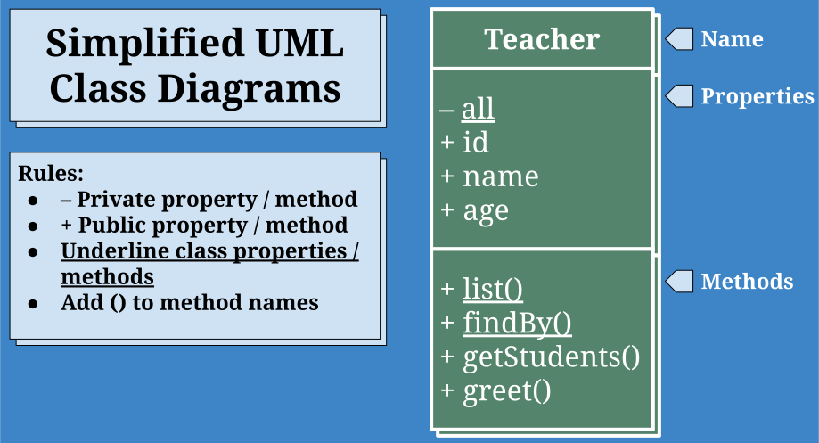
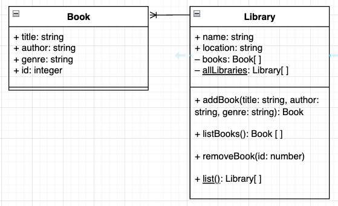

# UML Diagrams and Has Many/Belongs To Relationships


Follow along with code examples [here](https://github.com/The-Marcy-Lab-School/5-1-0-has-many-belongs-to)!


**Table of Contents:**
- [Intro: Class Diagrams](#intro-class-diagrams)
  - [Practice: The Book Class](#practice-the-book-class)
- [Has Many / Belongs To Relationships Between Classes](#has-many--belongs-to-relationships-between-classes)
  - [Practice: The Library Class](#practice-the-library-class)
- [Challenge](#challenge)

## Intro: Class Diagrams

When building an application, the first step is always to make a plan.

* We plan the features of the application with **user stories**
* We plan the user interface with a **wireframe**

Now that we're preparing to build more complex applications, we need to start thinking about how we plan our data. This plan is often called the **data architecture** and can be represented with a **Class Diagram**.

UML stands for **U**nified **M**odeling **L**anguage and it defines a way of describing classes and their relationships.



### Practice: The Book Class

UML Diagrams can be created using a tool like [https://draw.io](https://draw.io) or they can simply be drawn using pen and paper.

**TODO:** Take a moment and create a UML diagram for the `Book` class below:

```js
class Book {
  static #allBooks = []

  constructor(title, author, genre) {
    this.title = title;
    this.author = author;
    this.genre = genre;
    this.id = getId();

    Book.#allBooks.push(this);
  }

  static list() {
    return [...Book.#allBooks];
  }

  static find(id) {
    return Book.#allBooks.find((book) => book.id === id);
  }
}
```

## Has Many / Belongs To Relationships Between Classes

Often, classes will interact with each other. The way in which they interact defines what kind of relationship exists between the two classes. 

One of the most common relationships is a **has-many / belongs to** relationship in which one class manages instances of another. For example, a `PetOwner` class might manage many instances of a `Cat` class.


We can turn our diagrams from simple class diagrams to **Entity Relationship Diagrams** (ERDs) by connecting them.

### Practice: The Library Class

Now, imagine that in addition to our `Book` class, we had a `Library` class. Every instance of the `Library` class might manage its own collection of `Book` instances.

```js
class Library {
  #books = [];                // Private Instance Property
  static #allLibraries = []   // Private Class Property

  constructor(name, address) {
    this.name = name;
    this.address = address;
    this.id = getId();

    Library.#allLibraries.push(this);
  }

  // Library Instance Methods
  addBook(title, author, genre) {
    // When adding a book to the Library, a new Book instance is created. 
    const addedBook = new Book(title, author, genre);
    // The Book is added to this library's collection, forming the "has many/belongs to" relationship
    this.#books.push(addedBook);
    return addedBook;
  }
  listBooks() {
    return [...this.#books];
  }
  removeBook(id) {
    const matchingBookIndex = this.#books.findIndex((book) => book.id === id);
    this.#books.splice(matchingBookIndex, 1);
  }

  // Library Class Methods
  static list() {
    return [...Library.#allLibraries];
  }
  static find(id) {
    return Library.#allLibraries.find((library) => library.id === id);
  }
}
```

<details>

<summary><strong>Q: What is the relationship between a <code>Library</code> and a <code>Book</code> class?</strong></summary>

A library has many books. A book belongs to a Library

Later this week, we'll learn how to implement an "Is A" relationship with the `extends` keyword.

</details>


**TODO:** Now, create a UML diagram for the `Library` class and draw the correct association line between your two classes. If you are using draw.io, go to the "ERD" section and find the "one-to-many" connector

<details>

<summary><strong>Example: Library and Books ERD</strong></summary>



</details>


## Challenge

Below are some examples of pairs of classes that you can create that will have a "has many / belongs to" relationship.

* `Doctor` and `Appointment`
* `Playlist` and `Song`
* `Group` and `User`
* `Class` and `Student`

With a partner:

1. Create the class diagram for each class along with the relationship arrow between them.
2. Then, implement the classes in JavaScript.

Attempt to have a combination of private and public properties / methods, and static and instance properties / methods.

Check out the `library-book-example.js` file for an example.
