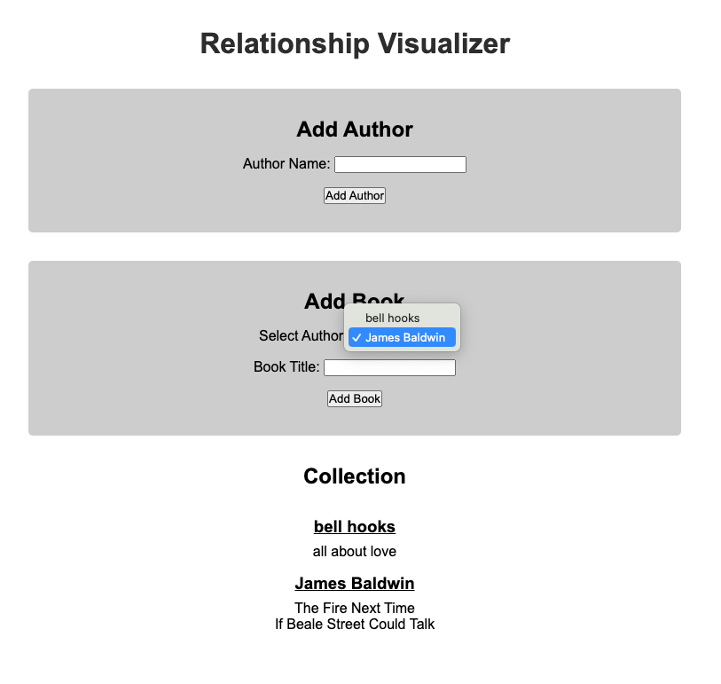

# Building a Has Many / Belongs To Frontend


Follow along with code examples [here](https://github.com/The-Marcy-Lab-School/5-1-1-has-many-belongs-to-front-end)!


## Overview

The accompanying repo contains a Vite app that has been built out for you to implement a **has many / belongs to** relationship between classes. 

The app allows users to maintain a list of **Authors** and **Books** by those authors.

In the provided repository, you will find a Vite project in the `app/` directory. Inside, there is a `src/` and `src-solution/` folder. Currently, the `index.html` file links to the `src-solution/`.

See what the completed app does by doing the following:
* Change directories into `app`
* `npm i`
* `npm run dev`
* Play around with the app!

### Build the Models from Scratch

To set up your project, return to `index.html` and change the `script` such that it loads the `src/main.js` file instead of the solution file.

Your task is to complete the `Author` and `Book` classes in the `src/` folder. 

Before you begin, read through the code and understand the structure. 
* The `main.js` file is the entry point. It already is making use of the `Author` and `Book` classes, even though they are incomplete. Read through the code in this file and make sense of what the file expects of the `Author` and `Book` class.
* The `models` folder has two files, `Author` and `Book.js`, each defining a class. `Book` is exclusively used by `Author` while `Author` is used exlusively within `main.js`.
* The `utils` folder has a `getId.js` file with an id-generating function for the classes above.
* The `utils` folder also has a `render-functions.js` file with functions for rendering the front end components. It doesn't interact with the classes at all. It just receives data from `main.js` to render.  You do not need to touch this file.

### Challenge: Build Your Own!

Once you've compelted the `Author` and `Book` classes, replace the classes in the `models` folder with classes of your own to demonstrate a new has many / belongs to relationship. You should also update the front-end code to utilize your new classes. 

Examples of has many / belongs to classes include:
- `Doctor` and `Appointment`
- `Playlist` and `Song`
- `Class` and `Student`
- `Team` and `Player`

Have fun!
