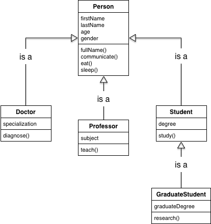

# Inheritance


Follow along with code examples [here](https://github.com/The-Marcy-Lab-School/5-1-3-inheritance)!


**Table of Contents:**
- [Inheritance and "Is A" Relationships](#inheritance-and-is-a-relationships)
- [Array is a Subclass of Object](#array-is-a-subclass-of-object)
- [Establishing Inheritance Between Custom Classes](#establishing-inheritance-between-custom-classes)
- [Extends and Super](#extends-and-super)
- [Refactor Challenge](#refactor-challenge)
- [Summary](#summary)

## Inheritance and "Is A" Relationships

**Inheritance** is a pillar of object-oriented programming. It describes a relationship between two classes: a **subclass** that inherits methods from a **superclass**. As a result, instances of the sub-class can use methods defined in a super-class. 

We call this an "Is A" relationship



**<details><summary>Question: Using the terms "subclass" and "superclass", what is the inheritance relationship between the `Professor` class and the `Person` class? What about the `GraduateStudent` class and the `Person` class?</summary>**

Both `Professor` and `GraduateStudent` are subclasses of the `Person` class.

</details>

## Array is a Subclass of Object

The `Array` class is a sub-class of the `Object` class which is the super-class.

Every Array instance gets methods from the `Array.prototype` which inherits methods from the `Object.prototype`. Therefore, all arrays can use `Object.prototype` methods like `toString()`.

Try running the following code:

```js
const arr = [1,2,3];

console.log(arr.toString());
console.log(arr); // expand the prototype chain to find the .toString() method

console.log(typeof arr); 
console.log(arr instanceof Array);
console.log(arr instanceof Object);
```

## Establishing Inheritance Between Custom Classes

Imagine we have a `Person` class. I want to make another class called `Programmer` that can do everything a `Person` can, with some additional properties and behaviors that only instances of `Programmer` will have.

**How NOT to do it**:
```js
class Person {
  constructor(name, age) {
    this.name = name;
    this.age = age;
    this.friends = [];
  }
  makeFriend(friend) {
    this.friends.push(friend)
    console.log(`Hi ${friend}, my name is ${this.name}, nice to meet you!`);
  }
  doActivity(activity) {
    console.log(`${this.name} is ${activity}`);
  }
}

class Programmer {
  constructor(name, age, language) {
    this.name = name;
    this.age = age;
    this.friends = [];
    this.favoriteLanguage = language;
  }
  makeFriend(friend) {
    this.friends.push(friend)
    console.log(`Hi ${friend}, my name is ${this.name}, nice to meet you!`);
  }
  doActivity(activity) {
    console.log(`${this.name} is ${activity}`);
  }
  code() {
    this.doActivity(`writing some ${this.favoriteLanguage} code.`);
  }
}
```

**<details><summary>Question: What bad practice exists this code?</summary>**

This code breaks the DRY rule (Don't Repeat Yourself). Much of the code in `Programmer` is the same as the code in `Person`. Wouldn't it be great for `Programmer` to automatically inherit the `makeFriend` and `doActivity` methods? 

</details>

## Extends and Super
To remove the repetitive code AND to establish a relationship between `Programmer` and `Person`, we use the `extends` and `super` keywords to define our `Programmer` class:

```js
class Person {
  constructor(name, age) {
    this.name = name;
    this.age = age;
    this.friends = [];
  }
  makeFriend(friend) {
    this.friends.push(friend)
    console.log(`Hi ${friend}, my name is ${this.name}, nice to meet you!`);
  }
  doActivity(activity) {
    console.log(`${this.name} is ${activity}`);
  }
}

class Programmer extends Person {
  constructor(name, age, language) {
    super(name, age);                 // invoke the Person constructor, setting the name, age, and friends properties on `this`
    this.favoriteLanguage = language; // add a favoriteLanguage property only for Programmers
  }
  
  // makeFriend is inherited
  // doActivity is inherited
  
  code() { // a new method only Programmer instances can use
    this.doActivity(`writing some ${this.favoriteLanguage} code.`);
  }
}
```

## Refactor Challenge

Create another subclass called `WebDeveloper` that extends the `Programmer` class. It should have its `favoriteLanguage` be set to `"JavaScript"` by default.

Add a `deploy` method to the `WebDeveloper` class that leverages the inherited `doActivity` method to print out a message saying `[Name] is deploying.`

Then, with a partner, discuss these questions:

**<details><summary>Question 1: What does `extends` do?</summary>**

`extends` makes the `WebDeveloper` inherit methods from `Programmer`. It sets `Programmer.prototype` as the prototype for `WebDeveloper`

</details>

**<details><summary>Question 2: What does `super` do?</summary>**

`super()` invokes the `Programmer` constructor function using its own value of `this`. Any properties that the `Programmer` constructor sets on `this` will be set on `WebDeveloper`.

</details>

**<details><summary>Question 3: What do we know about the relationship between a `Programmer` and a `Person`?</summary>**

* `WebDeveloper` is said to be a **subclass** of `Programmer`. 
* `Programmer` is said to be a **superclass** of `WebDeveloper`.
* `WebDeveloper` will inherit properties and methods from `Programmer` and `Person`.
* Instances of `WebDeveloper` are also instances of `Programmer` and of `Person`, but not all instances of `Person` or `Programmer` are instances of `WebDeveloper`.

</details>

**<details><summary>Question 4: How does the `code` method work?</summary>**

`code` invokes the `doActivity` method inherited from `Person.prototype`

</details>

## Summary

* **Inheritance** occurs when a **child class** inherits properties and methods from a **parent class**
  * The `extends` keyword creates this relationship
  * The `super` keyword references the parent class
  * You can invoke `super()` to invoke the parent class constructor.

```js
class Person {
  constructor(name, age) {
    this.name = name;
    this.age = age;
    this.friends = [];
  }
  makeFriend(friend) {
    this.friends.push(friend)
    console.log(`Hi ${friend}, my name is ${this.name}, nice to meet you!`);
  }
  doActivity(activity) {
    console.log(`${this.name} is ${activity}`);
  }
}

class Programmer extends Person {
  constructor(name, age, language) {
    super(name, age);                 // invoke the Person constructor, setting the name, age, and friends properties on `this`
    this.favoriteLanguage = language; // add a favoriteLanguage property only for Programmers
  }
  
  // makeFriend is inherited
  // doActivity is inherited
  
  code() { // a new method only Programmer instances can use
    this.doActivity(`writing some ${this.favoriteLanguage} code.`);
  }
}
```