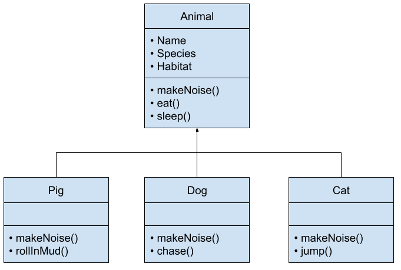

# Polymorphism


Follow along with code examples [here](https://github.com/The-Marcy-Lab-School/5-1-4-polymorphism)!


**Table of Contents:**
- [Polymorphism](#polymorphism-1)
- [Using Classes with Other Classes](#using-classes-with-other-classes)
- [Challenge: User and Admin](#challenge-user-and-admin)
- [Challenge](#challenge)
- [Summary](#summary)

## Polymorphism

Polymorphism means "many forms".

Polymorphism is a concept in object-oriented programming where multiple types of objects share "signatures" (they have the same property and method names even if their values/implementations are different).



The impact of polymorphism is that **our program can reliably use different types of objects in the same way** if they all descend from the same parent class.

```js
class Person {
  constructor(name) {
    this.name = name;
    this.friends = [];
  }
  makeFriend(friend) {
    this.friends.push(friend)
    console.log(`Hi ${friend}, my name is ${this.name}, nice to meet you!`);
  }
}

class Programmer extends Person {
  // the constructor can be inherited too as long as the signature doesn't need changing

  // here we totally override the parent method
  makeFriend(friend) {
    this.friends.push(friend);
    console.log('tap tap tap');
  }
}

class Musician extends Person {
  constructor(name, instrument) {
    super(name);
    this.instrument = instrument;
  }
  makeFriend(friend) { // Method Override
    super.makeFriend(friend)
    console.log(`I can play the ${this.instrument}. Do you know any instruments?`);
  }
}

const carmen = new Person("Carmen");
const reuben = new Programmer("Reuben");
const ben = new Musician("Ben", "Piano");
const people = [carmen, reuben, ben];

// Ben, reuben, and carmen are all hanging out. 
// Maya enters the room and wants to be friends with everyone!
// Because everyone is a Person, we can do this:
people.forEach(person => person.makeFriend("Maya"));

// Output:
// "Hi Maya, my name is Carmen, nice to meet you!"
// "Hi Maya, my name is Reuben, nice to meet you!"
// "Hi Maya, my name is Ben, nice to meet you!"
// "I can play the Piano. Do you know any instruments?"
```

This demonstrates polymorphism because `ben`, `reuben`, and `carmen` are all descendants of `Person` which we know defines a `makeFriend` method. Even though `reuben` and `carmen` are different subtypes, we can treat them as `Person` objects as well. 

A `Person` can come in "many forms".

**<details><summary>Question: What does `super.makeFriend(friend)` do?</summary>**

  `super.makeFriend(friend)` will call the superclass's `makeFriend` method, adding the `friend` argument to the `this.friends` array and printing out the greeting message. It is common when method overriding to invoke the superclass's version of the method and then adding on additional statements to execute.
  
</details>

Let's look at another example of polymorphism. In this example, we have a `Car` class and a `RaceCar` subclass. 

```js
class Car {
  constructor(make, model) {
    this.make = make;
    this.model = model;
  }
  
  drive() {
    console.log("Vrooom");
  }
}

class RaceCar extends Car {

  // the constructor can be inherited too as long as the signature doesn't need changing
  
  drive() { // Method Override
    console.log("Vah... Vah...");
    super.drive(); // invoke the parent class method
    console.log("WHEEEEEEE!!!!");
  }
}

const car1 = new Car("Chevy", "Cobalt");
const car2 = new RaceCar("Ferrari", "Portofino");
const car3 = new Car("Tesla", "Model X");

const cars = [car1, car2, car3];
cars.forEach((car) => car.makeSound()); 
// since they are all Cars, they all have drive, even if they behave differently
```

Both classes implement a method called `drive` but they have their own implementations. The code that calls these methods doesn't care how each class implements `drive()` — as long as instances of `Car` and `RaceCar` have a `makeSound` method at all, the code will work.

The subclass `RaceCar` uses the `Car` `drive` method sandwiched between two of its own `console.log` statements.

`Car` objects can come in many forms (they look the same, but they may behave differently).

## Using Classes with Other Classes

**Challenge: Refactor the `makeFriend` method so that instead of adding a friend's name, it takes in a Person object. When a person is added as a friend, both person objects should have each other as friends.**

<details><summary>Solution</summary>

We only have to modify the `Person` class and all subclasses will inherit the new behavior. Instead of passing in a friend's name, pass in the entire Person object and have both friends add each other to the friend list.

We have to be careful to not create an infinite recursion. We will end up with a **circular reference** though.

```js
class Person {
  constructor(name, age) {
    this.name = name;
    this.age = age;
    this.friends = [];
  }
  makeFriend(friend) {
    if (this.friends.includes(friend)) {
      return;
    }
    
    this.friends.push(friend)
    console.log(`Hi ${friend.name}, my name is ${this.name}, nice to meet you!`);
    
    friend.makeFriend(this);
  }
  doActivity(activity) {
    console.log(`${this.name} is ${activity}`);
  }
}

const ben = new Person("Ben", 28);
const carmen = new Person("Carmen", 22);
const reuben = new Person("Reuben", 35);

ben.makeFriend(carmen);
ben.makeFriend(reuben);

console.log(ben, reuben, carmen)
```

</details>

## Challenge: User and Admin

## Challenge

Create two classes, `User` and `Admin`.

A `User` should have the following properties:
* `username` a string provided to the constructor
* `isOnline` with a default value `false`

A `User` should have the following methods:
* `login` sets `isOnline` to `true` and prints `<username> has logged in!`
* `logout` sets `isOnline` to `false` and prints `<username> has logged out!`

An `Admin` should be a subclass of `User`. It should also have:
* A property `isAdmin` set to `true`
* A method called `doSecretAdminStuff` that just prints a message `"Doing secret admin stuff"`.

Then, create a user instance and an admin instance and demonstrate how to use all of their methods.

## Summary

* **Polymorphism** ("many forms") occurs when multiple types of objects share "signatures" (they have the same property and method names).
  * The impact of polymorphism is that **our program can reliably use different types of objects in the same way** if they all descend from the same parent class.
  * Method Overriding means that method signatures are the same even if their implementations are different

```js
class Car {
  constructor(make, model) {
    this.make = make;
    this.model = model;
  }
  
  drive() {
    console.log("Vrooom");
  }
}

class RaceCar extends Car {

  // the constructor can be inherited too as long as the signature doesn't need changing
  
  drive() { // Method Override
    console.log("Vah... Vah...");
    super.drive(); // invoke the parent class method
    console.log("WHEEEEEEE!!!!");
  }
}

const car1 = new Car("Chevy", "Cobalt");
const car2 = new RaceCar("Ferrari", "Portofino");
const car3 = new Car("Tesla", "Model X");

const cars = [car1, car2, car3];
cars.forEach((car) => car.makeSound()); 
// since they are all Cars, they all have drive, even if they behave differently
```