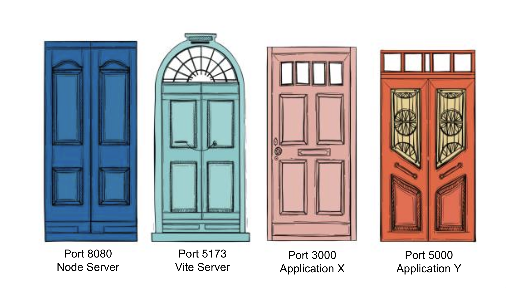

# 3. Server Basics with `node:http`


Follow along with code examples [here](https://github.com/The-Marcy-Lab-School/5-1-server-basics-node-http)!


Now that you know how the internet works, it's time to run your own server. Before jumping into Express, we'll build one using Node's built-in `node:http` module — no npm packages required. This forces you to confront what a server actually *is*: code that listens for incoming requests, inspects them, and constructs responses manually.

By the end, the complexity of doing this by hand will make the purpose of Express obvious.

We'll also use `curl`, a command-line tool for sending HTTP requests, to see exactly what's happening at the protocol level.

**Table of Contents:**

- [Essential Questions](#essential-questions)
- [Key Concepts](#key-concepts)
- [What Does "Listening" Mean?](#what-does-listening-mean)
- [Your First Server with `node:http`](#your-first-server-with-nodehttp)
  - [Creating the Server](#creating-the-server)
  - [The Request Object](#the-request-object)
    - [Query Strings](#query-strings)
  - [The Response Object](#the-response-object)
- [Routing Manually](#routing-manually)
- [Sending Requests with `curl`](#sending-requests-with-curl)
  - [Basic Requests](#basic-requests)
  - [Viewing Headers](#viewing-headers)
  - [Sending a POST Request](#sending-a-post-request)
- [Why Express?](#why-express)


## Essential Questions

By the end of this lesson, you should be able to answer these questions:

1. What does it mean for a server to be "listening"?
2. What are `host` and `port`? How do they together identify a server?
3. What is `localhost`? Why do we use it during development?
4. What does `http.createServer()` do? What are the `req` and `res` objects?
5. How do you inspect the URL and method of an incoming request?
6. How do you manually construct and send an HTTP response with `node:http`?
7. What does doing all of this by hand reveal about why a framework like Express is useful?

## Key Concepts

* **Listening** — a server is "listening" when it is actively waiting for incoming HTTP requests on a specified port.
* **Host** — the network address of a machine. During development, we use `localhost` (which means "this computer").
* **Port** — a number that identifies a specific process or application on a host. Different applications run on different ports.
* **`localhost`** — a hostname that always refers to your own computer. It resolves to the IP address `127.0.0.1`.
* **`node:http`** — Node's built-in module for creating HTTP servers and making HTTP requests. No installation required.
* **`http.createServer()`** — creates an HTTP server. The callback function you pass is called once for every incoming request.
* **`req` (IncomingMessage)** — the request object. Contains everything about the incoming request: URL, method, headers, body.
* **`res` (ServerResponse)** — the response object. Has methods for setting headers and writing the response body back to the client.
* **`res.writeHead()`** — sets the HTTP status code and response headers.
* **`res.end()`** — sends the response body and signals that the response is complete.
* **`curl`** — a command-line tool for sending HTTP requests and seeing the raw response.
* **Routing** — deciding what to do with a request based on its URL and method.

## What Does "Listening" Mean?

In the previous two lessons, we learned that servers receive requests and send responses. But a server doesn't just passively wait — it actively *listens* for incoming connections on a specific **port**.

Think of it this way: your computer has thousands of ports, like doors into an apartment building. Each door can be used by a different application to receive requests. When a server application starts listening on port `8080`, it's like opening that specific door and saying: "I'm here. Send requests to this door."



When your server is running locally, the **host** is `localhost` (your own computer) and the **port** is whatever number you chose. Together, `localhost:8080` uniquely identifies each server application on your machine.

<details>

<summary><strong>Q: Why can't two applications listen on the same port at the same time?</strong></summary>

Because the operating system uses the port number to decide which application receives incoming data. If two applications tried to listen on the same port, the system wouldn't know which one to send the data to. This is why you get an error like "address already in use" if you try to start a server on a port that's already taken. The fix is either to stop the other process or use a different port number.

</details>

## Your First Server with `node:http`

Node ships with a built-in `http` module. You don't need to install anything — just `require` it.

### Creating the Server

```js
// server.js
const http = require('node:http');

const server = http.createServer((req, res) => {
  const responseBody = JSON.stringify({ message: 'success', data: 'Hello World!' });

  res.writeHead(200, { 'Content-Type': 'application/json' });
  res.end(responseBody);
});

server.listen(8080, () => {
  console.log('Server listening on http://localhost:8080');
});
```

Run it:

```sh
node server.js
```

Visit `http://localhost:8080` in your browser. You'll see:

```json
{ "message": "success", "data": "Hello World!" }
```

That's your server receiving an HTTP request and sending back a JSON response — entirely in Node, with zero dependencies.

`http.createServer()` takes a **request listener** — a callback function that is called once for every incoming request. Every single request your server receives, no matter the URL or method, will invoke this callback.

### The Request Object

The first argument to the callback — conventionally named `req` — is an object containing everything about the incoming request.

The three most important properties are:

```js
const server = http.createServer((req, res) => {
  console.log(req.method); // 'GET', 'POST', 'PATCH', 'DELETE', etc.
  console.log(req.url);    // '/api/users', '/api/posts/3', etc.
  console.log(req.headers); // { host: 'localhost:8080', accept: '*/*', ... }

  //...
});
```

* **`req.method`** — the HTTP method of the request
* **`req.url`** — the path portion of the URL (everything after the host and port)
* **`req.headers`** — an object of all request headers

<details>

<summary><strong>Q: You visit <code>http://localhost:8080/api/users?sort=asc</code>. What is the value of <code>req.url</code>?</strong></summary>

`'/api/users?sort=asc'`

</details>

#### Query Strings

`req.url` includes both the pathname (`/api/users`) *and* all **query strings** (`sort=asc`). 

You can get these URL parts separately using the `new URL()` constructor:

```js
const { pathname, searchParams } = new URL(req.url, 'http://localhost:8080');
console.log(pathname);               // '/api/users'
console.log(searchParams.get('sort')); // 'asc'
```

Query strings are really useful for the client to customize how they want their response to return.

This is one of many things frameworks like Express can handle automatically for you.

### The Response Object

The second argument — `res` — is how you send a response back to the client. It has two key methods:

**`res.writeHead(statusCode, headers)`** — sets the status code and response headers. Must be called before `res.end()`.

**`res.end(body)`** — sends the response body and closes the connection. The `body` must be a string or Buffer.

```js
const server = http.createServer((req, res) => {
  // Set status 200 and Content-Type header
  res.writeHead(200, { 'Content-Type': 'application/json' });

  // Send the body — must be a string, so JSON.stringify() the data
  const responseBody = JSON.stringify({ message: 'success', data: [1, 2, 3] });
  res.end(responseBody);
});
```


`res.end()` must be called for every request, on every code path. Try removing it to see what happens!

If you forget to call it, the client will hang indefinitely waiting for a response. 


<details>

<summary><strong>Q: What happens if you call <code>res.end()</code> twice for the same request?</strong></summary>

Node will throw an error: `Error: write after end`. Once you've called `res.end()`, the response is closed — you can't write to it again. This is a common mistake in branching code where multiple code paths could reach a `res.end()` call. Use early `return` statements to prevent it:

```js
if (!found) {
  res.writeHead(404, { 'Content-Type': 'application/json' });
  res.end(JSON.stringify({ error: 'Not found' }));
  return; // ← stop here, don't fall through to the next res.end()
}

res.writeHead(200, { 'Content-Type': 'application/json' });
res.end(JSON.stringify(found));
```

Let's see it in action with routing.

</details>

## Routing Manually

Currently our server responds the same way to every request — any URL, any method. Real servers respond differently based on the requested endpoint. This is called **routing**.

With `node:http`, routing means inspecting `req.url` and `req.method` and branching with `if/else`:

```js
const http = require('node:http');

const todos = [
  { id: 1, task: 'Learn Node' },
  { id: 2, task: 'Build a server' },
];

const server = http.createServer((req, res) => {
  const { method, url } = req;

  // Route #1 — GET /api/todos → return all todos
  if (method === 'GET' && url === '/api/todos') {
    res.writeHead(200, { 'Content-Type': 'application/json' });
    res.end(JSON.stringify(todos));
    return;
  }

  // Route #2 — GET / → return a welcome message
  if (method === 'GET' && url === '/') {
    res.writeHead(200, { 'Content-Type': 'text/html' });
    res.end('<h1>Welcome to the API</h1>');
    return;
  }

  // Fallback Route — Anything else → 404
  res.writeHead(404, { 'Content-Type': 'application/json' });
  res.end(JSON.stringify({ error: 'Not found' }));
});

server.listen(8080, () => console.log('Listening on http://localhost:8080'));
```

<details>

<summary><strong>Q: How would you add a route that only responds to <code>POST /api/todos</code>?</strong></summary>

Add another `if` block before the catch-all 404. This assumes that the POST body is a JSON object in the format `{ "task": "description" }`:

```js
if (method === 'POST' && url === '/api/todos') {
  // Read the request body (it comes in as a stream)
  let body = '';
  req.on('data', (chunk) => { body += chunk; });
  
  // Once the request body has finished reading...
  req.on('end', () => {
    // Parse the task from the request body and add it to the list
    const { task } = JSON.parse(body);
    const newTodo = { id: todos.length + 1, task };
    todos.push(newTodo);

    // Send a response
    res.writeHead(201, { 'Content-Type': 'application/json' });
    res.end(JSON.stringify({ message: "Success: Todo Added", data: newTodo}));
  });
  return;
}
```

Notice that reading the request body requires listening to stream events (`data`, `end`) and assembling the body from the chunks of stream data. This is another thing Express handles automatically via `express.json()` middleware.

</details>

## Sending Requests with `curl`

While a browser is great for seeing rendered pages, it hides a lot of what's happening at the HTTP level. **`curl`** is a command-line tool that sends raw HTTP requests and shows you the raw response — no rendering, no UI, just the protocol.

### Basic Requests

With your server running, open a new terminal tab:

```sh
curl http://localhost:8080/
```

Output:

```
<h1>Welcome to the API</h1>
```

```sh
curl http://localhost:8080/api/todos
```

Output:

```json
[{"id":1,"task":"Learn Node"},{"id":2,"task":"Build a server"}]
```

```sh
curl http://localhost:8080/doesnotexist
```

Output:

```json
{"error":"Not found"}
```

### Viewing Headers

Use the `-i` flag to include response headers in the output:

```sh
curl -i http://localhost:8080/api/todos
```

Output:

```
HTTP/1.1 200 OK
Content-Type: application/json
Date: Sat, 22 Feb 2026 14:00:00 GMT
Connection: keep-alive
Transfer-Encoding: chunked

[{"id":1,"task":"Learn Node"},{"id":2,"task":"Build a server"}]
```

Notice:
* The **status line**: `HTTP/1.1 200 OK`
* **Response headers**: `Content-Type`, `Date`, `Connection`
* A blank line separating headers from the **body**
* The JSON **body**

This is the raw HTTP response — the same data your browser receives, before it does anything with it.

### Sending a POST Request

Use `-X` to set the method, `-H` to add a header, and `-d` to send a body:

```sh
curl -X POST http://localhost:8080/api/todos \
  -H "Content-Type: application/json" \
  -d '{"task": "Master Express"}'
```

Output:

```json
{ "message": "Success: Todo Added", "data": {"id":3,"task":"Master Express"}}
```

<details>

<summary><strong>Q: What is the difference between using <code>curl</code> and opening the URL in a browser to test your server?</strong></summary>

* A **browser** always sends `GET` requests when you type a URL. It can't easily send `POST`, `PATCH`, or `DELETE` without JavaScript. It also automatically processes and renders the response.
* **`curl`** gives you full control over the method, headers, and body. It shows you the raw response — headers and all — with no processing. It's essential for testing non-GET endpoints and seeing exactly what the server sends.

Later, we'll use **Postman** — a GUI tool that gives you `curl`'s flexibility with a more comfortable interface.

</details>

<details>

<summary><strong>Q: What does the <code>Content-Type: application/json</code> header in a <em>request</em> tell the server?</strong></summary>

It tells the server that the request body is formatted as JSON and should be parsed accordingly. Without this header, the server doesn't know how to interpret the raw bytes it receives in the body. Express's `express.json()` middleware uses this header to decide whether to JSON-parse the request body automatically.

</details>

## Why Express?

Look at what we had to do manually with `node:http`:

* **Routing** — write `if/else` chains to match every URL and method combination
* **Reading the request body** — listen to stream events (`data`, `end`), accumulate chunks, and parse manually
* **Setting headers on every response** — call `res.writeHead()` every single time
* **JSON serialization** — call `JSON.stringify()` on every outgoing object
* **Path parameters** — parse something like `/api/todos/3` yourself to extract the `3`
* **Query strings** — manually construct a `URL` object to parse `?sort=asc`
* **Error handling** — build your own pattern from scratch

None of these are difficult in isolation. But combined across an entire application with dozens of endpoints, the boilerplate becomes overwhelming and error-prone.

**Express is a framework that handles all of this for you.** The request listener pattern you just learned — `(req, res) => { ... }` — is exactly how Express works internally. Express wraps `node:http`, enhances `req` and `res` with useful properties and methods, and gives you a clean way to define routes and middleware.

```js
// node:http — manual routing
if (method === 'GET' && url === '/api/todos') {
  res.writeHead(200, { 'Content-Type': 'application/json' });
  res.end(JSON.stringify(todos));
}

// Express — the same thing
app.get('/api/todos', (req, res) => {
  res.json(todos); // status 200 + Content-Type + JSON.stringify, all in one
});
```

You now understand what's happening underneath. Next lesson, we build with Express.

<details>

<summary><strong>Q: Since Express is built on top of <code>node:http</code>, does that mean you could build anything Express can build using just <code>node:http</code>?</strong></summary>

Yes — Express doesn't add any new capabilities that `node:http` doesn't have. Everything Express does, you could write yourself with `node:http`. Express just removes the repetitive work. This is the point of a framework: it doesn't expand what's *possible*, it makes common patterns faster and less error-prone to implement. Understanding `node:http` first means you're never confused by what Express is "doing behind the scenes" — you've already seen the raw version.

</details>
