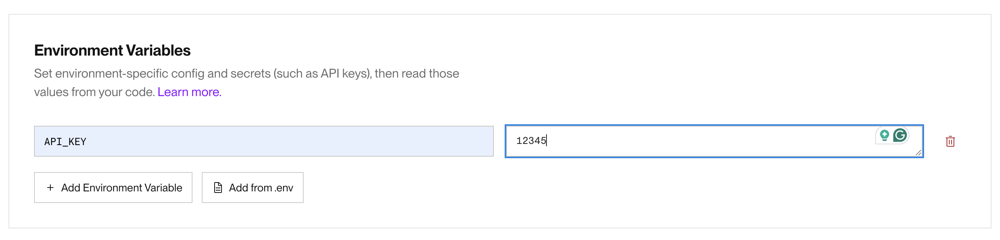
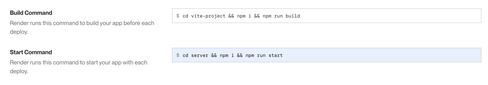

# 2. Building a Static Web Server with Middleware


Follow along with code examples [here](https://github.com/The-Marcy-Lab-School/5-3-express-middleware)!


In the last lecture, we learned about the basics of Express: endpoints and controllers. Today, we'll learn about a new kind of controller that will expand our server's capabilities: middleware.

**Table of Contents:**

- [Essential Questions](#essential-questions)
- [Key Concepts](#key-concepts)
- [Express Review](#express-review)
- [Middleware and `next()`](#middleware-and-next)
- [Static Web Servers](#static-web-servers)
  - [Serving Vite Static Assets](#serving-vite-static-assets)
  - [`express.static()` Middleware](#expressstatic-middleware)
  - [Fallback Middleware](#fallback-middleware)
- [Fetch Requests to the Same Origin](#fetch-requests-to-the-same-origin)
- [Deploying Web Server to Render](#deploying-web-server-to-render)
  - [Create a New Web Service](#create-a-new-web-service)
  - [Best Practice — Serving the Dist Folder and Continuous Deployment](#best-practice--serving-the-dist-folder-and-continuous-deployment)
- [Summary](#summary)

## Essential Questions

By the end of this lesson, you should be able to answer these questions:

1. What is middleware? How does it differ from a regular controller?
2. What is the role of `next()` in middleware? What happens if middleware never calls `next()` and never sends a response?
3. What are static assets? What is a static web server?
4. How do you serve static assets in an Express server?
5. What is a same-origin request? Why can you use a relative path like `/api/data` when the frontend is served by the same Express server?

## Key Concepts

* **Middleware** - a function in Express that intercepts and processes incoming HTTP requests. It can perform server-side actions such as parsing the request, modifying the response, or executing additional logic before passing control to the next middleware in the chain.
* **`next()`** — a function passed to every middleware and controller that, when called, passes the request to the next middleware or controller in the chain. Middleware must call `next()` (or send a response) to avoid leaving the request hanging.
* **`path` module** - a built-in Node module for constructing absolute file paths in a cross-platform way.
* **`__dirname`** — a Node variable that holds the absolute path of the directory containing the current file.
* **Static Assets** - unchanging files delivered to the client exactly as they are stored on a server. These include HTML, CSS, JavaScript files, images, videos, fonts, and documents.
  * Vite projects can be "built" to bundle and minify source files into an optimized `dist` folder — this is not strictly required for Vanilla JS (browsers support ES modules natively) but is recommended for performance. It is required for React projects.
* **Static Web Server** - a server that stores static assets and serves them directly to visiting clients, without generating content programmatically.
* **`express.static()`** - a built-in Express function that generates middleware for serving files from a specified directory. When a request matches a file in that directory, the file is sent as the response; otherwise, the request is passed to the next middleware or controller.
* **Same-Origin Fetch** - when a frontend is served by the same host as the API, fetch requests can use relative paths (e.g., `/api/data`) instead of absolute URLs. The browser sends the request to the same host that served the page.
* **Continuous Deployment** - a practice where every new code commit automatically triggers a redeploy of the application. On Render, this means the build and start commands run on every commit, keeping the live server in sync with the repository.

## Express Review

Remember how the Express app works?


1. A client sends a **request** to the server.
2. The server receives the request and **routes** it to the proper **controller** based on the specific **endpoint**.
3. The controller processes the request, interacts with any necessary data or services, and generates a **response**.
4. The server sends the response back to the client.
5. The client is now free to do what it likes with the response.

And here is how we can create a server with two endpoints: `/api/hello` and `/api/data`

```js
const express = require('express');
const app = express();

// When the endpoint is requested, controllers will send a response
// e.g. /api/hello?first=ada&last=lovelace
const serveHello = (req, res, next) => {
  const { first, last} = req.query; 
  if (!first || !last) {
    return res.send({ message: `hello stranger!`});
  }
  res.send({ message: `hello ${first} ${last}!`});
}

// e.g. /api/data
const serveData = (req, res, next) => {
  const data = [{ name: 'Carmen' }, { name: 'Maya' }, { name: 'Reuben' }];
  res.send(data)
}

// Define the method, endpoint URL, and controller
app.get('/api/hello', serveHello);
app.get('/api/data', serveData);

// Listen for requests on port 8080
const port = 8080;
app.listen(port, () => console.log(`listening at http://localhost:${port}`)); 
```

A **controller** is a callback function that parses a request and sends a response. It will be invoked asynchronously when the associated endpoint is sent a request.

Every controller is invoked with three values:

* A `req` object which holds data related to the request, including **query parameters**.
* A `res` object which has methods to send a response.
* A `next` function, typically only used by "Middleware".

Now its time to learn about that `next` method!

## Middleware and `next()`

When a server receives an HTTP request, it can do more than just send back a response. Often, the server will perform a number of server-side actions _before_ a response is sent.

For example, suppose that you wanted the server to keep track of every request that is sent to it by printing out some information like:

* the endpoint that was requested (`/api/hello` or `/api/data`, etc...)
* the request method (`GET` or `POST`, etc...)
* the time the request was received

<details>

<summary><strong>Q: Why would it be helpful to log information about every incoming request?</strong></summary>

Logging incoming HTTP requests can be incredibly helpful for debugging purposes.

Say you have 3 endpoints and one of them has a bug that causes the server to crash when an unexpected request is sent to it. If we print out every request that comes in to the server, we can simply look at the most recent request in the logs and know where to start debugging.

</details>

We can add this functionality to our `serveHello` controller, before we send the response, we can just add a few lines of code:


```js
const serveHello = (req, res, next) => {
  // print the current time and request information 
  const timeOfRequest = new Date().toLocaleString();
  console.log(`${req.method}: ${req.originalUrl} - ${timeOfRequest}`);

  // Then construct the response
  const { first, last} = req.query; 
  if (!first || !last) {
    return res.send({ message: `hello stranger!`});
  }
  res.send({ message: `hello ${first} ${last}!`});
}
```


However, now we also need to add this code to `serveData`. If we had more controllers, this would quickly become very repetitive.

Instead, we can use a **middleware**. Middleware in Express is a controller that can be invoked for all incoming requests before the final controller sends a response.


In many ways, middleware is like a controller. It receives the `req`, `res`, and `next` values. There are two key differences:

* We use `app.use` to register the middleware which means the function is invoked for ALL endpoints
* We use `next()` instead of `res.send()` (or other response methods).
  * `next()` invokes the next middleware / controller registered to handle the current request.


```js
// Middleware function for logging route requests
const logRoutes = (req, res, next) => {
  const time = new Date().toLocaleString();
  console.log(`${req.method}: ${req.originalUrl} - ${time}`);
  next(); // Passes the request to the next middleware/controller
};
// Register the logRoutes middleware globally to log all requests
app.use(logRoutes);

// Other endpoints and controllers
```


* We first create the `logRoutes` function to print out information about the request
* At the end, we invoke `next()`, passing along the request to one of our controllers to send a response.
* We register `logRoutes` using `app.use()` which causes it to be invoked for ALL endpoints.
* Order matters! Middleware should be defined before controllers to ensure that it is invoked before the response is sent to the client.

With this middleware, we do not need to add this logging logic to every controller. Instead, this middleware will automatically be invoked for every incoming request before the final controller sends a response.


Sometimes, middleware can invoke `res.send()` if we want to interrupt the response cycle and send a response before it reaches the intended controller. **In this way, middleware behaves like a guard clause.** Most of the time, it won't send a response, but it can if needed.

Examples of this include:

* Static asset middleware like `express.static()` (which you'll learn about next!)
* Rate limiter middleware like [`express-rate-limit`](https://www.npmjs.com/package/express-rate-limit)
* Error handling middleware like [`errorhandler`](https://expressjs.com/en/resources/middleware/errorhandler.html)


<details>

<summary><strong>Q: So, if a user sends a request to <code>http://localhost:8080/api/hello</code>, which functions are invoked and in what order?</strong></summary>

First the `logRoutes` middleware is invoked. The `next()` function is called which passes the request to the next controller, `serveHello`.

</details>

<details>

<summary><strong>Q: What would happen if the <code>logRoutes</code> controller DID send a response to the client? What would happen if it didn't invoke <code>next()</code>?</strong></summary>

If `logRoutes` did invoke `res.send()`, the `serveHello` controller would NOT be invoked as a response has already been sent.

If we simply didn't invoke `next()`, our server would "hang" — the response would never be completed and the client would likely receive a timeout error because the request took too long.

</details>

Middleware can be custom-made like this `logRoutes`. However, we can also utilize some of the out-of-the-box middleware controllers provided by Express.

## Static Web Servers

When you visit a website, like [https://google.com](https://google.com), you are immediately presented with a rendered website. What's happening there?


Now, imagine that the website is just the "static assets" of a Vite project deployed on GitHub pages! But instead of using GitHub pages, Google has its own servers to store those files and serve them to visiting users.

We call these **static web servers** because they store **static assets** (HTML, CSS, and JS files) and then provide a server application that serves those assets when requested.

Let's look at how we can serve the static assets of frontend from our server.


HTML, CSS, and JavaScript files are considered "static" because their content remains unchanged when being transferred from server to client.

APIs on the other hand serve dynamic content that changes depending on parameters of the request.


### Serving Vite Static Assets

Check out the `frontend/` directory in the repo for this lesson. So far, we've used Vite's development server to get these frontend static assets at `http://localhost:5173`. 

```sh
cd frontend
npm i
npm run dev
```

Now, we can have our own server to provide access to those static assets! Back in the server, we could add the following endpoint and controller:

```js
// The path module is useful for constructing file paths
const path = require('path');

const serveIndexHTML = (req, res, next) => {
  // path.join() constructs an absolute file from the arguments
  // __dirname provides the absolute path of the current module's parent directory.
  const filepath = path.join(__dirname, '../frontend/index.html');

  // Note we are using res.sendFile(), not res.send()
  res.sendFile(filepath);
};

app.get('/', serveIndexHTML);
```

> **Why an absolute path?** `__dirname` is a Node variable that holds the absolute path of the directory containing the current file. A bare relative path like `'../frontend'` is resolved from the process's working directory, which can vary depending on which directory you start the server from. Using `__dirname` with `path.join()` produces a path that works no matter where the server is started from.

This code serves the `index.html` file, but that file also needs access to `/src/main.js` and `/src/style.css`. Open the Console in your browser and you can see that those files are not being found. 

So, we need two more controllers:


```js
const serveIndexHTML = (req, res, next) => {
  const filepath = path.join(__dirname, '../frontend/index.html');
  res.sendFile(filepath);
}

const serveJS = (req, res, next) => {
  const filepath = path.join(__dirname, '../frontend/src/main.js');
  res.sendFile(filepath)
};

const serveCSS = (req, res, next) => {
  const filepath = path.join(__dirname, '../frontend/src/style.css');
  res.sendFile(filepath)
};

app.get('/', serveIndexHTML);
app.get('/src/main.js', serveJS);
app.get('/src/style.css', serveCSS);
```


Now, imagine that your application has hundreds of static assets! You would need an endpoint and controller for every file you'd want to serve.

### `express.static()` Middleware

Rather than defining endpoints for every single static asset that you wish to serve, we can use the `express.static()` middleware generator included with Express.

`express.static()` is not middleware itself. Instead, invoking this function will generate a middleware function that we can use. We just need to provide a file path to the folder containing our static assets:


```js
// The path module is useful for constructing relative file paths
const path = require('path');

// the file path is to the entire folder
const pathToFrontend = path.join(__dirname, '../frontend');

// generate middleware using the file path
const serveStatic = express.static(pathToFrontend);

// Register the serveStatic middleware before the remaining controllers
app.use(serveStatic);

// other controllers 
```


Explanation:

* Now, we just make a file path to the entire `frontend` folder and pass the file path to `express.static()` which returns a middleware function which we call `serveStatic`
* `app.use(serveStatic)` will checks all incoming requests to see if they match files in the provided folder. if they do, they will be sent to the client
* Order matters! Remember to add this before the rest of your controllers.

Like `logRoutes`, this middleware intercepts incoming requests before they reach the controllers. Unlike `logRoutes`, the middleware generated by `express.static()` can send a response to the client if a matching file is found. If not, it will pass the request to the controllers.

### Fallback Middleware

Another really useful custom middleware to create is a **fallback middleware** that handles unrecognized requests:
- if a request is sent starting with `/api` this middleware will just pass it along to be handled by the `/api` endpoints
- all other requests will just be sent the `index.html` file

```js
app.get('*', (req, res, next) => {
  if (req.originalUrl.startsWith('/api')) return next();
  res.sendFile(path.join(pathToFrontend, 'index.html'));
});
```

This treats non-API calls to our server as attempts to reach a page that doesn't exist. Rather than having the browser show them a 404, we can just redirect them straight back to the home page `index.html`.

## Fetch Requests to the Same Origin

When the frontend is served by the same Express server that handles your API, fetch requests can use **relative paths**.

In the `main.js` file of the demo frontend, notice how fetch requests are made:

```js
// A relative path fetches from the same host (we don't need http://localhost:8080)
const response = await fetch('/api/data');
```

When a browser makes a fetch request with a relative path like `/api/data`, it sends the request to the same host that served the page.

| If the page was served from...  | `/api/data` resolves to...               |
| ------------------------------- | ---------------------------------------- |
| `http://localhost:8080`         | `http://localhost:8080/api/data`         |
| `https://your-app.onrender.com` | `https://your-app.onrender.com/api/data` |

This means the same code works in development _and_ in production without any changes.

**The problem with running the Vite dev server separately**

When developing, you might be tempted to use Vite's dev server (`npm run dev`), which typically runs on `http://localhost:5173`. But if the page is served from port `5173` and the Express server is on port `8080`, a relative path like `/api/data` resolves to `http://localhost:5173/api/data` — pointing at Vite, not Express.

To make it work, you'd have to write an absolute URL:


```js
// Hardcoded absolute URL — works locally but breaks in production!
const response = await fetch('http://localhost:8080/api/data');
```


**The solution: serve the frontend from Express**

By using `express.static()` to serve the frontend from the same Express server, the frontend and API share the same origin. Relative paths in fetch requests resolve correctly in both development and production — no hardcoded URLs needed.

## Deploying Web Server to Render

Github Pages provides **static site hosting**.
  * This means that the server that Github Pages runs on your behalf can only send static files to the client (HTML, CSS, and JS files).
  * Github Pages static sites are not capable of receiving or sending messages via HTTP.

Render provides **web service and database hosting** (it can also host static sites).
  * This means that the server that Render runs on your behalf can send static assets, receive and send messages via HTTP, and interact with a database.
  * Render also can host your database giving you a one-stop-shop for running your fullstack application.

Start by creating an account using your **GitHub** account. This will let you easily deploy straight from a GitHub repository. This will take you to your Dashboard where you can see existing deployments.


### Create a New Web Service

1. Make sure you are signed in using your GitHub account
2. https://dashboard.render.com/ and click on **New +**
3. Select **Web Service**
4. Choose **Git Provider** to find a repository on your account. It may take some time for your repositories to load.
   * If your repository is public, you can provide a link to the repository but it will not be able to auto-deploy on future commits. As such, this is NOT the preferred method.
5. Fill out the information for your Server
   * Name - the name of your app (it will appear in the URL that render gives you. For example: `app-name-here.onrender.com`)
   * Language - Node
   * Branch - `draft` for assignments, `main` for portfolio projects
   * Region - select US East (Ohio)
   * Root Directory - Leave blank (will default to the root of your repo)
   * Build Command:
     * If your application has a database, see the next section
     *   If your application has a Vite frontend:

         ```sh
         cd [vite_folder_name] && npm i && npm run build && cd ../server && npm i
         ```
     *   If neither:

         ```sh
         cd server && npm i
         ```
   *   Start Command (assuming your `index.js` file is in `server/`):

       ```sh
       cd server && node index.js
       ```
   * Instance Type - select **Free**
6.  Add Any environment variables your application may need:

    
7. Select **Deploy Web Service**

This should take you to your web service's dashboard where you can see the latest build information and the URL. In a few minutes your server will be up and running!

Any time that you want to make an update to your deployed server, just commit and push the change to your repo! The deployment process will automatically run your "Build" and "Start" commands (unless you used a public git URL to setup your server in which cause auto-deployments are disabled).


### Best Practice — Serving the Dist Folder and Continuous Deployment

For Vite projects, running `npm run build` bundles and minifies the static asset files into an optimized `dist` folder. All JavaScript and CSS is condensed into one file each. When we deploy our project, this means fewer requests, smaller files, and [hashed filenames for cache-busting](https://www.keycdn.com/support/what-is-cache-busting) for our users.

In the provided repo, build the `dist` folder and note the file structure:

```
dist/
  - index.html
  - vite.svg
  - assets/
      - index-ABC123.js
      - index-ABC123.css
```

To have our deployed server use this `dist/` version of the frontend, update the `pathToFrontend` variable to reference the `dist/` directory — but only when running in a "production environment" (when they are deployed). 

```js
let pathToFrontend = path.join(__dirname, '../frontend');

// In production, refer to the dist directory
if (process.env.NODE_ENV === 'production') {
  pathToFrontend = path.join(__dirname, '../frontend/dist');
}
const serveStatic = express.static(pathToFrontend);
app.use(serveStatic);
```

* Render (and most hosting services) automatically sets the [environment variable](./6-environment-variables-deployment.md) `process.env.NODE_ENV` to `'production'`, which we use to conditionally set the file path.

In our deployment configuration, the "Build" and "Start" commands are executed before every new deploy as a part of the "Auto Deploy" process. Render will redeploy your application on every new commit. This means the `dist/` assets are always rebuilt before the server restarts, so any frontend changes are reflected in the new deployment.

After the "Build" command runs, the "Start" command runs to start the server. To ensure that our server works properly, we just need to make sure the server dependencies are installed and then run the `index.js` file with `node`:



As a result, the **continuous deployment** process would look like this:

1. A commit is made with changes to the project
2. Render detects the commit and begins a new deployment
3. The "build" command is executed, generating updated static assets
4. The "start" command is executed, starting the server
5. The deployment completes and the server is live!

## Summary

* **Controllers:** Callback functions that handle requests by parsing them and sending responses.
* **Middleware Functions**: Functions similar to controllers but pass requests to the next middleware without sending a response. They can also be executed for all requests while controllers typically handle a single endpoint.
* **Static Assets:** Unchanging files (e.g., HTML, CSS, JS) served by a web server. For Vanilla JS Vite projects, building is optional but recommended — it bundles, minifies, and adds cache-busting hashes to the output files.
* **Serving Static Assets**:
  1. Construct an absolute file path to the static assets folder using `path.join()` and `__dirname`.
  2. Use `express.static(pathToFrontend)` middleware to make static assets publicly available.
  3. Register the middleware with `app.use()`
* **Same-Origin Fetch Requests**: When the frontend is served by the same Express server as the API, fetch requests can use relative paths (e.g., `fetch('/api/data')`). The browser sends the request to the same host that served the page, so the same code works in both development and production without hardcoded URLs.
