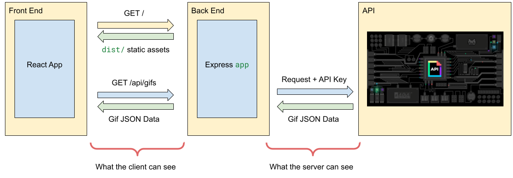

# 3. Securing API Keys and Environment Variables


Follow along with code examples [here](https://github.com/The-Marcy-Lab-School/5-4-env-variables-deployment)!


Thus far, we have not been able to deploy a project that uses an API key without likely exposing that API key to the public. Now that we have the power to build a server, we can finally do just that!

**Table of Contents:**

- [Key Concepts](#key-concepts)
- [Setup](#setup)
- [What is an API Key?](#what-is-an-api-key)
- [API Keys in Client-Side Code](#api-keys-in-client-side-code)
- [The Proxy Server Strategy](#the-proxy-server-strategy)
  - [Fetch In the Server-Side Controller](#fetch-in-the-server-side-controller)
  - [Same Origin Requests from the Frontend](#same-origin-requests-from-the-frontend)
  - [Environment Variables, Dotenv, and gitignore](#environment-variables-dotenv-and-gitignore)
  - [Deploying with Environment Variables](#deploying-with-environment-variables)


## Key Concepts

* **API Key** - a secret code that verifies your identity as a developer using an API's limited resources. Do not share these!
* **Environment Variable** — a hidden variable stored on the host's machine (your laptop or Render.com) and accessible in Node through the `process.env` object
* **`.env` file** - a file to store hidden variables like API keys. Ignored by GitHub and uploaded to Render for deployment.
* **`dotenv` module** - an npm package for importing `.env` files
* **Cross-origin requests** - HTTP requests made from one domain to another domain, protocol or port.
* **Request Proxy In Development** — faking the origin of the request in a frontend development server to match the origin of the backend server

## Setup

For this lecture, you'll need an API that requires an **API key** - a secret code that verifies your identity as a developer using an API's limited resources.

We'll use the New York Times API because the API is quite friendly to use. Make an account on the [NYT Developers Page](https://developer.nytimes.com/get-started) and follow the instructions to enable the "Top Stories API".

We'll use the endpoint below to access the top stories in the "Arts" section:

```
https://api.nytimes.com/svc/topstories/v2/arts.json?api-key=yourkey
```

Once you have an API key, clone the practice repository linked above and do the following:

* Install dependencies for the `frontend/` Vite project
    ```sh
    cd frontend
    npm i
    ```

* Then, inside of `frontend/fetch-helpers`, paste your API key string in the provided variable:

    ```js
    const API_KEY = "paste-api-key-here";
    ```

* Then, go to the `server/`, install dependencies and start it:
  
    ```sh
    cd ../server
    npm i
    npm run dev
    ```


You should see the application below served at [http://localhost:8080](http://localhost:8080):


## What is an API Key?

An **API key** is a unique, secret code used by API servers to identify and authenticate a client sending a request. It acts as a digital ID or passcode that allows the API provider to verify that the request for data or services is coming from an authorized source.

Since API keys are unique to each user, we want to be careful about exposing them to the public. There are two common places that we can accidentally do this:
1. In client-side code
2. In public GitHub repositories

**<details><summary>Q: Why is it not a good idea to share your API key? What really could go wrong?</summary>**

The API key is a way to verify your identity as a developer. Some APIs will charge you for each request that you make using your API key and if someone else gets a hold of your API key, they could steal your request resources.

</details>

## API Keys in Client-Side Code

Client-side/frontend code is inherently insecure because we just give the code to the user to run on their browser! If we're not careful, we may accidentally give away sensitive data.

Open [http://localhost:8080](http://localhost:8080) in your browser and open the developer tools. Click on the *Sources* tab, choose *Page* sources, and select the `src/fetch-helpers.js` file. You should see your API key:


It will also be plain to see if you view the *Networks* tab in the developer tools. Refresh the page and look through the *requests* sent by the application. 

Can you find the API key?


All requests sent by the client will appear in this Network tab. As long as our `frontend` application is sending the fetch request, and that request includes the API key, there will be no way to hide it from this Networks tab.

So, what do we do?


NEVER send requests with API keys from client-side (frontend) applications!


**<details><summary>Q: Doesn't the `dist/` version of the frontend hide the API key?</summary>**

TLDR: No. Here's why:

Recall that we can use the Vite build command to compress and minify our code making it much more difficult to read.

Our code uses this `dist/` version when we deploy to a production environment. 

```js
let pathToFrontend = path.join(__dirname, '../frontend');

if (process.env.NODE_ENV === 'production') {
  pathToFrontend = path.join(__dirname, '../frontend/dist');
}
```

1. Update this code to use `dist` no matter what
2. Return to the `frontend` app and run `npm run build`. 
3. Restart the server. 

If you look at the code now in the *Sources* tab, it will be much harder to find the API key (though not impossible). However, it will *still* be visible in the Networks tab. There is no escaping this!

</details>

## The Proxy Server Strategy

Server-side/backend code is inherently more secure since the client has no visibility into what the server is doing. A server can freely send requests with API keys and the client will not be able to see anything!

We can use this to our advantage by setting up our server as a middleman (a.k.a. a **proxy** or **proxy server**):
1. The client can send the server a simple request such as `GET /api/stories` without the API key
2. The server will send the request to the API *with* the API key
3. When the server gets the response, it will send the data along to the client!



In order to implement this, we need to build a server application that:

* Has its own API endpoint that the client can use without the client needing to know the API key.
* Securely stores the API key (we'll use environment variables for this)

### Fetch In the Server-Side Controller

The server-side code to fetch from the API is almost exactly the same code as the `getTopStories()` function in the `frontend/src/fetch-helpers.js` file. 

First, create a controller for a `GET /api/stories` endpoint

```js
// First, we make a controller for GET /api/stories
const serveTopArtStories = async (req, res, next) => {
  try {
    // We'll secure this value soon!
    const API_KEY = 'paste-your-api-key-here';
    const url = `https://api.nytimes.com/svc/topstories/v2/arts.json?api-key=${API_KEY}`;
    const response = await fetch(url);
    if (!response.ok) {
      throw Error(`Fetch failed. ${response.status} ${response.statusText}`);
    }
    const data = await response.json();
    const storiesWithTitle = data.results.filter(story => story.title);

    // send the fetched data to the client
    res.send(storiesWithTitle);
  } catch (error) {
    // or send an error. 503 means the service is unavailable
    res.status(503).send(error);
  }
}
```

Then, we make that controller available with an endpoint

```js
app.get('/api/stories', serveTopArtStories)
```

In your terminal, navigate to the `server/`, install dependencies and run it:

```sh
npm i
npm run dev
```

Now, visit [http://localhost:8080/api/stories](http://localhost:8080/api/stories) to see the fetched data! Open the *Network* tab again and you'll see that the API key is now hidden!

### Same Origin Requests from the Frontend


Now that our server has this `GET /api/stories` endpoint, our frontend doesn't need to fetch directly from the API anymore. 

Let's update the frontend application to use our server as a proxy instead of directly accessing the NYT API:

```js
// We no longer need the API key

export const getTopStories = async () => {
  try {
    // The URL is a relative path to the same-origin server
    const url = `/api/stories`; 
    const response = await fetch(url);

    if (!response.ok) {
      throw Error(`Fetch failed. ${response.status} ${response.statusText}`);
    }
    const data = await response.json();

    // The server filters the data for us, so we just return the data as is
    return { data, error: null }
  }
  catch (error) {
    console.log("Error caught! " + error.message);
    return { data: null, error: error };
  }
};
```

To test this out you may need to restart the server. Then visit the server [http://localhost:8080](http://localhost:8080) to see the updated frontend. Check out the *Networks* tab. Can you see the API key anymore?


Why is the API url just `/api/stories` and not `http://localhost:8080/api/stories`?

When we send requests to servers that we don't control, we include the full URL (e.g. [https://dog.ceo/api/breeds/image/random](https://dog.ceo/api/breeds/image/random)). These kinds of requests are **cross-origin** because the origin of the request and the destination are not the same.

In this case, the client-side code comes from the same origin as the server we are fetching from: `http://localhost:8080`. So, we can use a relative path instead and our browser assumes we are making a **same-origin request**.


### Environment Variables, Dotenv, and gitignore
There is one thing we need to clean up first — if we publish this code on GitHub, it will include our API key!

The most common way to store sensitive server-side data like API keys is with a `.env` file ("dot E-N-V file").

`.env` files have a really simple format. They are just listed in `key="value"` pairs

```
secretValue1="abc123"
anotherSecret="my password"
API_KEY="xyz"
```


To hide this file from our GitHub repository, we must add `.env` to our `.gitignore` file. Any other developer who wishes to work on this project must provide their own `.env` file with their own API keys.


To use the environment variables in our server code, we'll use the `dotenv` module from npm.

```
npm i dotenv
```

`dotenv` provides a `dotenv.config()` method which looks for `.env` files and loads them into a special object `process.env` object:

```js
const dotenv = require('dotenv');
dotenv.config();

// .env values are added to process.env
console.log(process.env.API_KEY); // xyz
```

With our `API_KEY` variable moved to the `.env` file, we can modify our controller:

```js
const serveTopArtStories = async (req, res, next) => {
  try {
    const url = `https://api.nytimes.com/svc/topstories/v2/arts.json?api-key=${process.env.API_KEY}`;
    // ...
}
```


In the previous lesson, we learned about the `process.env.NODE_ENV` value that is set by hosting services like Render. This is the exact same object that we are adding our API key to!


### Deploying with Environment Variables

`.env` files are so widely used that most server hosting services will provide a way to securely upload `.env` files. That way, your deployed server will have access to `.env` values without needing those values to be stored on GitHub.

For example, on Render, you can add environment variables when configuring your new web service.


