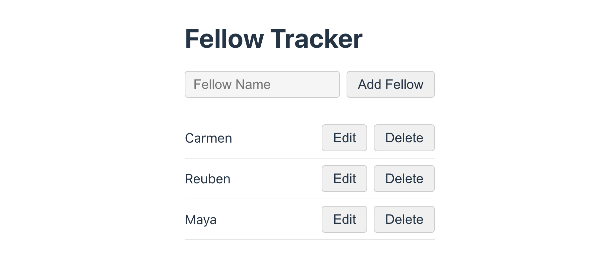
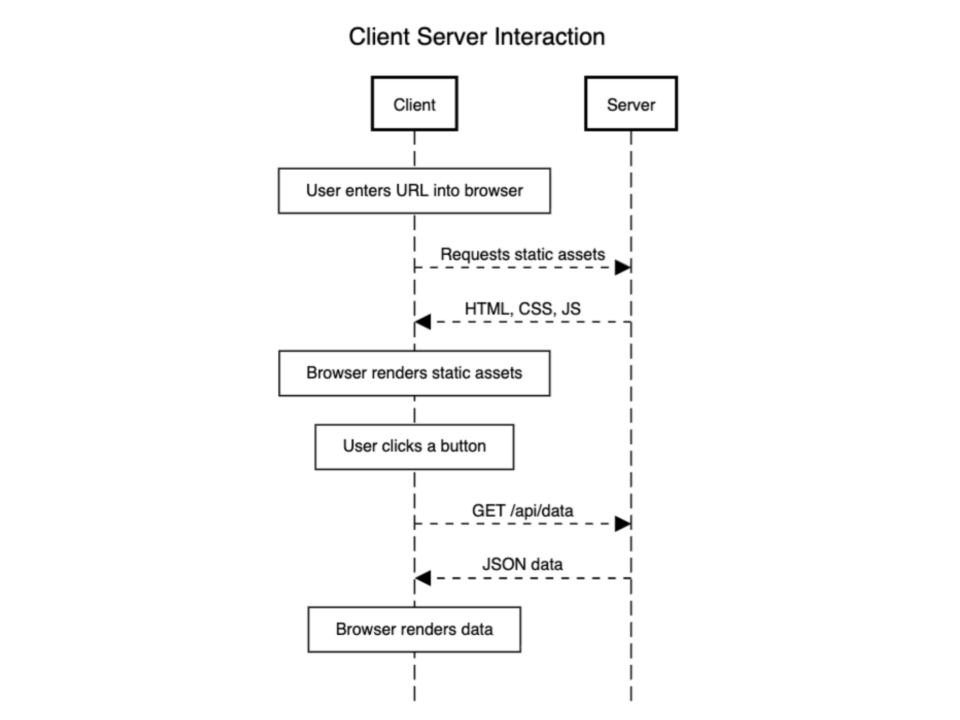

# 4. RESTful CRUD API


Follow along with code examples [here](https://github.com/The-Marcy-Lab-School/5-5-rest-api-model)!


You now have the skills to build a simple server application. But it can only perform one of the four CRUD capabilities.

In this lesson, you will learn how to add create, update, and delete endpoints and best practices for creating a "RESTful API".

**Table of Contents:**

- [Key Concepts](#key-concepts)
- [Introduction: Client → Server → Client → Server](#introduction-client--server--client--server)
- [CRUD Applications](#crud-applications)
  - [POST Requests, `express.json()`, `req.body`, and `app.post()`](#post-requests-expressjson-reqbody-and-apppost)
- [Making A RESTful API](#making-a-restful-api)
  - [Core Principles of REST](#core-principles-of-rest)
- [Route Parameters and `req.params`](#route-parameters-and-reqparams)
  - [PATCH and DELETE Challenge](#patch-and-delete-challenge)


## Key Concepts

* **RESTful API** — an API that conforms to the design principles of representational state transfer (REST).
* **`express.json()` Middleware** — parses JSON data from the request and adds it to `req.body` in the controller.
* **Route Parameters** — named URL segments that are used to capture the values specified at their position in the URL. The captured values are populated in the `req.params` object.
* **HTTP Response Codes**:
  * `201` — Success: Created
  * `204` — Success: No Content
  * `400` — Client Error: Invalid Request
  * `404` — Client Error: Not Found
  * `500` — Server Error: Internal Server Error
  * `503` — Server Error: Unavailable

## Introduction: Client → Server → Client → Server

Clone down the provided repository and `cd` into the starter folder. There, you will see a `frontend` and `server` provided for you. Run both applications and you'll see it is a simple application that shows a list of fellows and their unique IDs.



This application represents an essential pattern that we've seen a few times now:



This back and forth pattern between a server application and the frontend application (both from the same origin) underlies virtually every web application that you've ever used!

## CRUD Applications

This example application is quite limited in its capabilities. It only interacts with its server to read data using `GET` HTTP requests.

Take a look at the frontend fetch helpers and the server endpoints/controllers and you'll see familiar code:




```javascript
export const getFellows = async () => {
  try {
    const response = await fetch('/api/fellows');
    if (!response.ok) throw Error(`Fetch failed. ${response.status} ${response.statusText}`);
    const data = await response.json();
    return { data, error: null };
  } catch (error) {
    return { data: null, error };
  }
};
```





```javascript
// A mock "database" of fellows
const fellows = [
  { name: 'Carmen', id: getId() },
  { name: 'Reuben', id: getId() },
  { name: 'Maya', id: getId() },
];

const listFellows = (req, res) => {
  res.send(fellows);
}

app.get('/api/fellows', listFellows);
```




But think about an application like Google Calendar where you can create an account, create new events, edit events, and delete them too! Applications like these perform all of the CRUD operations.


That is, both their server and frontend are set up in such a way that enable users to create, read, update, and delete data via HTTP requests:

* Create — `POST` HTTP requests
* Read — `GET` HTTP requests
* Update — `PATCH`/`PUT` HTTP requests (`PUT` means replace the whole resource, `PATCH` means change just a part of the resource)
* Delete — `DELETE` HTTP requests

Let's look at how we can add create, update, and delete capabilities to our application!

### POST Requests, `express.json()`, `req.body`, and `app.post()`

To enable our frontend application to _create_ data, we will add `POST` endpoints on our server and send `POST` requests from the frontend, often triggered by a form.

Since `POST` requests are requests to create data, we need to send data in the `body` of the request. On the frontend, this means including a `config` object with our `fetch`.


```javascript
export const createFellow = async (fellowName) => {
  const config = {
    method: 'POST',
    headers: { 'Content-Type': 'application/json' },
    body: JSON.stringify({ fellowName }), // remember this request body structure
  };

  const response = await fetch('/api/fellows', config);
  if (!response.ok) throw Error(`Fetch failed. ${response.status} ${response.statusText}`);
  const data = await response.json();
  return { data, error: null };
};
```


On our server, we need to use the `express.json()` middleware which parses JSON data from incoming requests and stores it in `req.body`:


```javascript
// ... other middleware...

// express.json() parses incoming request bodies and puts JSON data in req.body
app.use(express.json()); 
```

In our controller, we can use the data found in `req.body` to create a new fellow object, add it to our "database" and send a response (or an error).
To distinguish POST and GET requests for the `/api/fellows` endpoint, we will use the `app.post()` method instead of `app.get()`:


```javascript
// POST /api/fellows
const createFellow = (req, res) => {
  // make sure this object matches the config.body on the frontend
  const { fellowName } = req.body;

  if (!fellowName) {
    // 400 means "invalid request"
    return res.status(400).send({ message: 'Invalid Name' });
  }

  const newFellow = { name: fellowName, id: getId() };
  fellows.push(newFellow);

  res.send(newFellow);
};

// Use app.post() instead of app.get()
app.post('/api/fellows', createFellow);
```


With the server controller built on the backend and the fetch helper built on the frontend, we can easily test our code by hard-coding a call in `main.js`:


```js
createFellow('Winnie the Pooh');
```


With this code fully tested from the frontend and backend, we can now wire it up to our form! See if you can figure out how to trigger the `createFellow` fetch helper inside the `handleAddFellow` function.

<details>

<summary><strong>Solution</strong></summary>

When handling the form submission, we use the input value to call `createFellow`. Then, to update the list with the new data, we call `loadFellows()` again to re-fetch and re-render.


```js
const handleAddFellow = async (e) => {
  e.preventDefault();
  const input = document.querySelector('#fellow-name-input');
  const fellowName = input.value.trim();
  if (!fellowName) return;

  const { error } = await createFellow(fellowName);
  if (error) return renderError(error.message);

  input.value = '';
  await loadFellows();
};
```


</details>

## Making A RESTful API

We now have an application that can create new fellows and read the full list of fellows that have been created! Our app also shows **Edit** and **Delete** buttons next to each fellow in the list.

Now, we want to add the following features:

* Update the name of a fellow
* Delete a fellow from the list

Before we go into the code for adding these features, we need to talk about designing our endpoints according to **REST** (**Re**presentational **S**tate **T**ransfer).

**Pop Quiz: Guess the action that each of these requests will perform!**

<details>

<summary><strong><code>GET /api/fellows/3</code></strong></summary>

Get the fellow with the id `3`

</details>

<details>

<summary><strong><code>PATCH /api/fellows/1</code></strong></summary>

Update the fellow with the id `1`

</details>

<details>

<summary><strong><code>DELETE /api/fellows/2</code></strong></summary>

Delete the fellow with the id `2`

</details>

<details>

<summary><strong><code>POST /api/fellows/2/bio</code></strong></summary>

Create a bio for the fellow with the id `2`

</details>

If you guessed these correctly, there is a good reason why! The endpoints are intuitive to understand thanks to the best practices encouraged by REST.

### Core Principles of REST

[restfulapi.net](https://restfulapi.net/) puts it best:

> REST is an acronym for REpresentational State Transfer... It has become one of the most widely used approaches for building web-based APIs (Application Programming Interfaces).
>
> REST is not a protocol or a standard, it is an architectural style. During the development phase, API developers can implement REST in a variety of ways.
>
> Like the other architectural styles, REST also has its guiding principles and constraints. These principles must be satisfied if a service interface is to be referred to as RESTful.

The guiding principles of REST can be found in detail in the website above. Here, we've provided a few easy ways to ensure you are building a RESTful API:

1. **Requests Should be Stateless**: Each request should contain all the information needed by the client for the current request. The server doesn't store the current client state.
   * For example, if a user selects a filter that is applied to a `GET` request, that filter must be provided with every request. The server should not be expected to remember the client's previous requests.
2. **Endpoints Describe Resources, Not Actions**: Use plural nouns (e.g., `/api/users`, `/api/posts`) instead of verbs (e.g., `/api/getUser`, `/api/createPost`) for endpoint URLs.
   * A common exception to this rule is `/api/login` and `/api/logout`
3. **HTTP Methods Matter**: Be consistent!
   * `GET` – Retrieve data
   * `POST` – Create data
   * `PUT / PATCH` – Update data
   * `DELETE` – Remove data
4. **Endpoints Should Use Proper Status Codes** (e.g., 200 OK, 201 Created, 400 Bad Request, 404 Not Found, 500 Internal Server Error)
5. **URLs Should Indicate a Clear Hierarchy of Resources:**
   * Use IDs to get individual resources: `/api/users/123`
   * Nest resources to indicate ownership: `/api/users/123/posts/456`
   * Avoid deep nesting that becomes hard to manage.

These principles help our API become "RESTful". But keep in mind that these are just guidelines that help make an API more intuitive and predictable for the client. Providing clear documentation will always be the best way to ensure your API is used properly.

## Route Parameters and `req.params`

In the client request `GET /api/fellows/3`, the value `3` indicates that I want to get the fellow with the ID `3`. 

On the server, we can define an endpoint with a variable placeholder for the ID using the syntax `:id`, like so:

```js
// :id is called a "route parameter"
app.get("/api/fellows/:id", findFellow);
```

The `:id` portion of the endpoint is called a **route parameter**. 

Now, when our server receives a request like `GET /api/fellows/3`, the `findFellow` controller can access the provided `id` from the `req.params` object. It can then find the corresponding value in the database and send it in the response (or send an error if not found):

```javascript
const findFellow = (req, res) => {
  // Make sure the property name matches the route parameter below
  const { id } = req.params;

  // Keep in mind, route parameters are stored as strings.
  const fellow = fellows.find(fellow => fellow.id === Number(id));

  if (!fellow) {
    // 404 means "Resource Not Found"
    return res.status(404).send({
      message: `No fellow with the id ${id}`
    });
  }

  res.send(fellow);
};

// req.params.id will hold the value of the requested id
app.get('/api/fellows/:id', findFellow);
```

### PATCH and DELETE Challenge

Now that we know how to make endpoints with route parameters and access their values with `req.params`, we can add PATCH and DELETE functionality.

Our frontend application wants the ability to edit and delete fellows in the `handleFellowsListClick()` event handler. 

Your challenge is add endpoints to the server to handle these requests:
1. `PATCH /api/fellows/:id` using `app.patch()`
2. `DELETE /api/fellows/:id` using `app.delete()` 

Then, update the frontend to use those endpoints:
1. Create the `updateFellow()` and `deleteFellow()` functions in `fetch-helpers.js`
2. Invoke them in the `handleFellowsListClick()` event handler


**<details><summary>Server Solution</summary>**

A `PATCH` request is similar to a `POST` request in that we expect the request body to include JSON data. Here, we expect a new `fellowName` to be provided. We again use the `id` route parameter to find the fellow with the matching `id` in our "database" and then update the `name` property.

```javascript
const updateFellow = (req, res) => {
  const { fellowName } = req.body;

  if (!fellowName) {
    return res.status(400).send({ message: 'Invalid Name' });
  }

  const { id } = req.params;
  const fellow = fellows.find(fellow => fellow.id === Number(id));

  if (!fellow) {
    return res.status(404).send({
      message: `No fellow with the id ${id}`
    });
  }

  fellow.name = fellowName;
  res.send(fellow);
};

app.patch('/api/fellows/:id', updateFellow);
```

Here, we use the `id` route parameter to find the index of the fellow with the matching `id` in our "database" so that we can splice that index out of the array.

```javascript
const deleteFellow = (req, res) => {
  const { id } = req.params;

  const fellowIndex = fellows.findIndex((fellow) => fellow.id === Number(id));
  if (fellowIndex < 0) {
    return res.status(404).send({
      message: `No fellow with the id ${id}`
    });
  }

  fellows.splice(fellowIndex, 1);
  // 204 means "no content" - the request was successful but there's no content to send back
  res.sendStatus(204);
};

app.delete('/api/fellows/:id', deleteFellow);
```
</details>

**<details><summary>Frontend Solution</summary>**

On the frontend, we can add the corresponding fetch helpers and wire them up to our event handlers:

Sending a `PATCH` request requires the `id` in the URL and the new `fellowName` in the request body.

```js
export const updateFellow = async (id, fellowName) => {
  try {
    const config = {
      method: 'PATCH',
      headers: { 'Content-Type': 'application/json' },
      body: JSON.stringify({ fellowName }),
    };
    const response = await fetch(`/api/fellows/${id}`, config);
    if (!response.ok) throw Error(`Fetch failed. ${response.status} ${response.statusText}`);
    const data = await response.json();
    return { data, error: null };
  } catch (error) {
    return { data: null, error };
  }
};
```

Sending a `DELETE` request only requires the `id` in the URL.

```javascript
export const deleteFellow = async (id) => {
  try {
    const config = { method: 'DELETE' };
    const response = await fetch(`/api/fellows/${id}`, config);
    if (!response.ok) throw Error(`Fetch failed. ${response.status} ${response.statusText}`);
    return { data: true, error: null };
  } catch (error) {
    return { data: null, error };
  }
};
```

Both update and delete are triggered from buttons inside the fellows list. We use **event delegation** — a single click listener on the `<ul>` that handles all button clicks via `e.target`. If an error is returned by either, we render it.

```js
const handleFellowsListClick = async (e) => {
  const clickedListItem = e.target.closest('li');
  if (!clickedListItem) return;

  const id = clickedListItem.dataset.id;

  // Handle Delete Clicks
  if (e.target.classList.contains('delete-btn')) {
    const { error } = await deleteFellow(id);
    if (error) return renderError(error.message);
    await loadFellows();
  }

  // Handle Edit/Save Button Clicks
  if (e.target.classList.contains('edit-btn')) {
    const nameSpan = clickedListItem.querySelector('span');
    const editInput = clickedListItem.querySelector('input');
    const editBtn = clickedListItem.querySelector('.edit-btn');

    // Click on "Edit" --> Switch to Edit Mode
    if (editBtn.textContent === 'Edit') {
      nameSpan.classList.add('hidden');
      editInput.classList.remove('hidden');
      editBtn.textContent = 'Save';
    }

    // Click on "Save" --> Update the fellow and reload fellows
    else {
      const { error } = await updateFellow(id, editInput.value.trim());
      if (error) return renderError(error.message);
      await loadFellows();
    }
  }
};

document.querySelector('#fellows-list').addEventListener('click', handleFellowsListClick);
```

</details>
