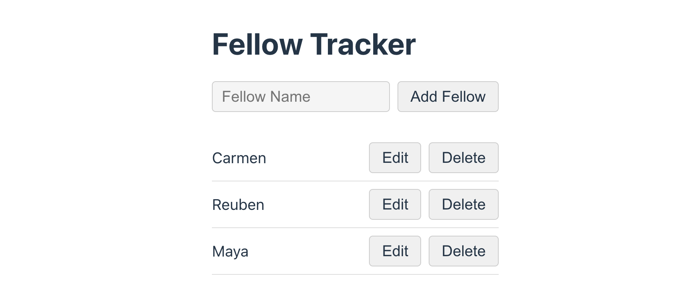
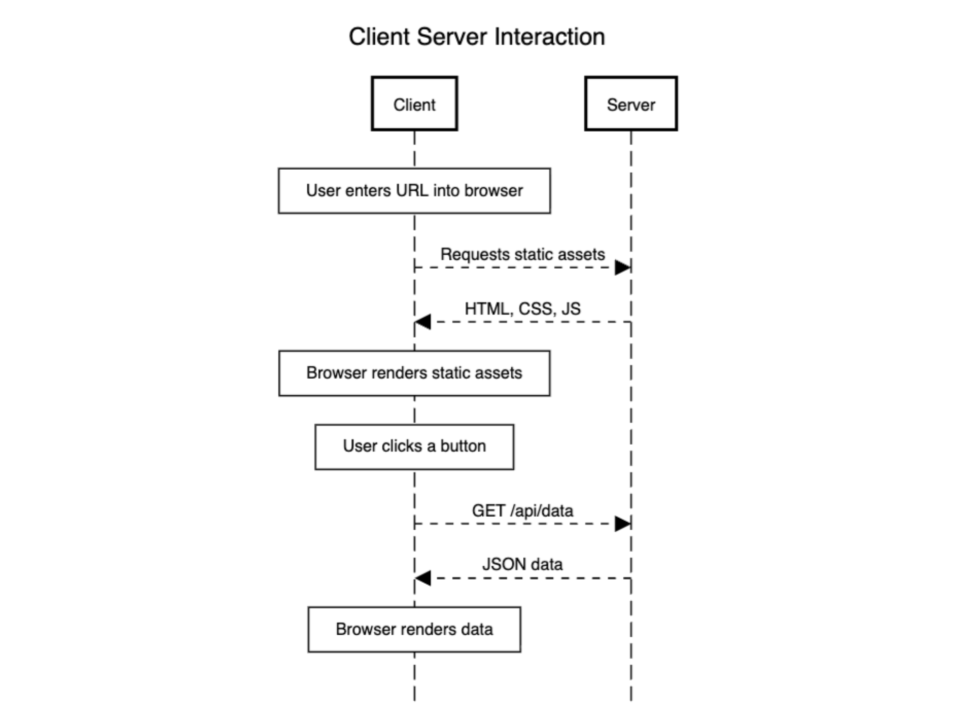

# 7. RESTful CRUD API


Follow along with code examples [here](https://github.com/The-Marcy-Lab-School/5-5-rest-api-model)!


You now have the skills to build a simple server application. But it can only perform one of the four CRUD capabilities.

In this lesson, you will learn how to add create, update, and delete endpoints and best practices for creating a "RESTful API".

**Table of Contents:**

* [Essential Questions](7-rest-crud-api.md#essential-questions)
* [Key Concepts](7-rest-crud-api.md#key-concepts)
* [Introduction: Client → Server → Client → Server](7-rest-crud-api.md#introduction-client--server--client--server)
* [What Makes an API RESTful?](7-rest-crud-api.md#what-makes-an-api-restful)
  * [Core Principles of REST](7-rest-crud-api.md#core-principles-of-rest)
  * [RESTful Principles Quiz](7-rest-crud-api.md#restful-principles-quiz)
* [API Contract](7-rest-crud-api.md#api-contract)
  * [Why Status Codes Matter](7-rest-crud-api.md#why-status-codes-matter)
  * [API Contract Challenge: Design Instagram](7-rest-crud-api.md#api-contract-challenge-design-instagram)
* [Implementing the Endpoints](7-rest-crud-api.md#implementing-the-endpoints)
  * [GET /api/fellows — Already Working](7-rest-crud-api.md#get-apifellows--already-working)
  * [POST /api/fellows — Creating a New Fellow](7-rest-crud-api.md#post-apifellows--creating-a-new-fellow)
  * [PATCH /api/fellows/:id — Updating a Fellow](7-rest-crud-api.md#patch-apifellowsid--updating-a-fellow)
  * [DELETE /api/fellows/:id — Removing a Fellow](7-rest-crud-api.md#delete-apifellowsid--removing-a-fellow)
  * [GET /api/fellows/:id — Completing the Contract](7-rest-crud-api.md#get-apifellowsid--completing-the-contract)

## Essential Questions

By the end of this lesson, you should be able to answer these questions:

1. What does CRUD stand for? Which HTTP method corresponds to each operation?
2. What does REST stand for and what are its core principles?
3. What does `express.json()` middleware do? Why is it needed for POST and PATCH requests?
4. What HTTP status codes should you use when a resource is successfully created? When a requested resource is not found?
5. Why do different HTTP status codes (201, 204, 400, 404) matter for the client?

## Key Concepts

* **RESTful API** — an API that conforms to the design principles of representational state transfer (REST).
* **API Contract** — a description of every endpoint an API exposes: the URL, HTTP method, expected request body, and possible responses. Defines the agreement between the server and any client that uses it.
* **`express.json()` Middleware** — parses JSON data from the request and adds it to `req.body` in the controller.
* **HTTP Response Codes**:
  * `201` — Success: Created
  * `204` — Success: No Content
  * `400` — Client Error: Invalid Request
  * `404` — Client Error: Not Found
  * `500` — Server Error: Internal Server Error
  * `503` — Server Error: Unavailable

## Introduction: Client → Server → Client → Server

Clone down the provided repository and `cd` into the starter folder. There, you will see a `frontend` and `server` provided for you. Run the server and you'll see it serves a simple application that shows a list of fellows and their unique IDs.



This application represents an essential pattern that we've seen a few times now:



This back and forth pattern between a server application and the frontend application (both from the same origin) underlies virtually every web application that you've ever used!

The starter code already has `listFellows` working on the server and `getFellows` working on the frontend. The `createFellow`, `updateFellow`, and `deleteFellow` fetch helpers exist as stubs with the wrong URL or missing config — you'll complete them as we go.

## What Makes an API RESTful?

Before writing any new endpoints, let's talk about how to _design_ them well.

**Pop Quiz: Guess the action that each of these requests will perform!**

<details>

<summary><strong><code>GET /api/fellows/3</code></strong></summary>

Get the fellow with the id `3`

</details>

<details>

<summary><strong><code>PATCH /api/fellows/1</code></strong></summary>

Update the fellow with the id `1`

</details>

<details>

<summary><strong><code>DELETE /api/fellows/2</code></strong></summary>

Delete the fellow with the id `2`

</details>

<details>

<summary><strong><code>POST /api/fellows/2/bio</code></strong></summary>

Create a bio for the fellow with the id `2`

</details>

If you guessed these correctly, there is a good reason why! The endpoints are intuitive to understand thanks to the best practices encouraged by **REST** (**Re**presentational **S**tate **T**ransfer).

### Core Principles of REST

[restfulapi.net](https://restfulapi.net/) puts it best:

> REST is an acronym for REpresentational State Transfer... It has become one of the most widely used approaches for building web-based APIs (Application Programming Interfaces).
>
> REST is not a protocol or a standard, it is an architectural style. During the development phase, API developers can implement REST in a variety of ways.
>
> Like the other architectural styles, REST also has its guiding principles and constraints. These principles must be satisfied if a service interface is to be referred to as RESTful.

The guiding principles of REST can be found in detail on that website. Here, we've provided a few easy ways to ensure you are building a RESTful API:

1. **Endpoints Describe Resources, Not Actions**: Use plural nouns (e.g., `/api/users`, `/api/posts`) instead of verbs (e.g., `/api/getUser`, `/api/createPost`) for endpoint URLs.
   * A common exception to this rule is `/api/login` and `/api/logout`
2. **URLs Should Indicate a Clear Hierarchy of Resources:**
   * Use IDs to get individual resources: `/api/users/:userId`
   * Nest resources to indicate ownership: `/api/users/:userId/posts/:postId`
   * Avoid deep nesting that becomes hard to manage.
3. **HTTP Methods Matter**: The same endpoint URL (e.g. `/api/users`) can perform many different operations depending on the HTTP method provided
   * `GET` – Retrieve data
   * `POST` – Create data
   * `PUT / PATCH` – Update data
   * `DELETE` – Remove data
4. **Endpoints Should Use Proper Status Codes**: Here are the most common ones to use:
   * 200 OK
   * 201 Created
   * 400 Bad Request (e.g. they sent a POST request with an empty body)
   * 404 Not Found
   * 500 Internal Server Error (e.g. the third-party API we are using is down)
5. **Requests Should be Stateless**: Each request should contain all the information needed by the client for the current request. The server doesn't store the current client state.
   * For example, if a user selects a filter that is applied to a `GET` request, that filter must be provided with every request. The server should not be expected to remember the client's previous requests.

These principles help our API become "RESTful". But keep in mind that these are just guidelines that help make an API more intuitive and predictable for the client. Providing clear documentation will always be the best way to ensure your API is used properly.

### RESTful Principles Quiz

Which of these endpoints below are RESTful? For those that are not, what rule do they break?

<details>

<summary><strong><code>GET /api/fellows</code></strong></summary>

✅ RESTful — The URL identifies a resource (the collection of fellows) using a plural noun. `GET` correctly expresses "retrieve." No verb in the URL, no state stored on the server.

</details>

<details>

<summary><strong><code>GET /api/getAllFellows</code></strong></summary>

❌ Not RESTful — **Verb in the URL** (breaks "Endpoints Describe Resources, Not Actions"). The path should describe a resource, not an action. The HTTP method `GET` already communicates "retrieve" — repeating it in the URL is redundant and non-standard.

✅ Fix: `GET /api/fellows`

</details>

<details>

<summary><strong><code>POST /api/fellows</code></strong></summary>

✅ RESTful — `POST` correctly signals "create a new resource," and `/api/fellows` identifies the collection that will own it. The URL is a noun, the method is the verb.

</details>

<details>

<summary><strong><code>POST /api/fellows/3/update</code></strong></summary>

❌ Not RESTful — breaks two rules at once. First, **verb in the URL** ("update" should not appear in the path). Second, **wrong HTTP method** — updating an existing resource is the job of `PATCH` or `PUT`, not `POST`.

✅ Fix: `PATCH /api/fellows/3`

</details>

<details>

<summary><strong><code>DELETE /api/fellows/7</code></strong></summary>

✅ RESTful — `DELETE` expresses "remove this resource," and `/api/fellows/7` clearly identifies the specific fellow by id. The URL hierarchy (`/fellows/:id`) follows the REST convention for addressing a single resource within a collection.

</details>

<details>

<summary><strong><code>GET /api/fellows/delete/5</code></strong></summary>

❌ Not RESTful — breaks two rules. First, **verb in the URL** ("delete" belongs in the HTTP method, not the path). Second, **wrong HTTP method** — `GET` requests are expected to be safe (read-only, no side effects). Using `GET` to delete data is unpredictable and dangerous; web crawlers and prefetch tools could accidentally trigger deletions.

✅ Fix: `DELETE /api/fellows/5`

</details>

## API Contract

Before writing a single line of implementation code, it helps to define the full **API contract** — the complete list of endpoints your server will expose, what each one expects, and what it returns.

Here is the contract for our fellows tracker:

<table data-full-width="true"><thead><tr><th>Method</th><th>URL</th><th>Request Body</th><th>Success</th><th>Error</th></tr></thead><tbody><tr><td><code>GET</code></td><td><code>/api/fellows</code></td><td>—</td><td>200, array of all fellows</td><td>—</td></tr><tr><td><code>GET</code></td><td><code>/api/fellows/:id</code></td><td>—</td><td>200, single fellow object</td><td>404 if not found</td></tr><tr><td><code>POST</code></td><td><code>/api/fellows</code></td><td><code>{ fellowName }</code></td><td>201, newly created fellow</td><td>400 if name missing</td></tr><tr><td><code>PATCH</code></td><td><code>/api/fellows/:id</code></td><td><code>{ fellowName }</code></td><td>200, updated fellow</td><td>404 if not found</td></tr><tr><td><code>DELETE</code></td><td><code>/api/fellows/:id</code></td><td>—</td><td>204, no content</td><td>404 if not found</td></tr></tbody></table>


Notice three REST conventions this table demonstrates:

1. **Resource-based URLs** — every path describes a _thing_ (`/api/fellows`), not an action (`/api/getFellows`).
2. **HTTP methods as verbs** — `GET`, `POST`, `PATCH`, and `DELETE` express the _action_ on that resource.
3. **Status codes as communication** — the response code tells the client exactly what happened, before they even parse the body.


### Why Status Codes Matter

A status code is not just a number — it is a contract between your server and every client that talks to it. Using the right code makes your API predictable and easier to debug.

* **`200 OK`** — The default success. Use it for `GET` and `PATCH` responses when there is a body to return.
* **`201 Created`** — Use this instead of `200` for `POST` responses. It signals "a new resource was created." Some clients and tools (like automated tests) specifically check for `201` after a create operation.
* **`204 No Content`** — Use this for `DELETE`. The operation succeeded but there is no body to send back. The `204` code signals to the client: _don't try to parse a body_.
* **`400 Bad Request`** — The client sent something invalid (e.g., a missing required field). This is the client's fault.
* **`404 Not Found`** — The requested resource doesn't exist. `400` and `404` communicate _different_ problems: `400` means "your request was malformed," while `404` means "we understood the request but couldn't find what you asked for."

### API Contract Challenge: Design Instagram

Before implementing the API contract above, try designing an API contract for Instagram **posts** and **comments**. This planning step will provide a clear vision for how you will implement your API and can even serve as useful instructions when offloading your work to a teammate (or an agentic AI tool).

Your API should have CRUD endpoints for posts and comments and it should follow the rules for making a RESTful API above.

<details>

<summary><strong>Solution</strong></summary>

<table data-full-width="true"><thead><tr><th>Method</th><th>URL</th><th>Request Body</th><th>Success &#x26; Response</th><th>Error &#x26; Response</th></tr></thead><tbody><tr><td><code>GET</code></td><td><code>/api/posts</code></td><td>—</td><td>200, array of all posts</td><td>—</td></tr><tr><td><code>GET</code></td><td><code>/api/posts/:postId</code></td><td>—</td><td>200, single post object</td><td>404 if not found</td></tr><tr><td><code>POST</code></td><td><code>/api/posts</code></td><td><code>{ img, content }</code></td><td>201, newly created post</td><td>400 if img or content missing</td></tr><tr><td><code>PATCH</code></td><td><code>/api/posts/:postId</code></td><td><code>{ img, content }</code></td><td>200, updated post</td><td>404 if not found</td></tr><tr><td><code>DELETE</code></td><td><code>/api/posts/:postId</code></td><td>—</td><td>204, no content</td><td>404 if not found</td></tr><tr><td><code>GET</code></td><td><code>/api/posts/:postId/comments</code></td><td>—</td><td>200, array of all comments for a post</td><td>—</td></tr><tr><td><code>POST</code></td><td><code>/api/posts/:postId/comments</code></td><td><code>{ content }</code></td><td>201, newly created comment</td><td>400 if content missing</td></tr><tr><td><code>PATCH</code></td><td><code>/api/posts/:postId/comments/:commentId</code></td><td><code>{ content }</code></td><td>200, updated comment</td><td>404 if not found</td></tr><tr><td><code>DELETE</code></td><td><code>/api/posts/:postId/comments/:commentId</code></td><td>—</td><td>204, no content</td><td>404 if not found</td></tr></tbody></table>

</details>

## Implementing the Endpoints

Now let's implement each endpoint in order, following the API contract above.

### GET /api/fellows — Already Working

The starter code already has this endpoint wired up. Let's take a quick look at both sides together:




```javascript
let id = 1;
const getId = () => id++;

// A mock "database" of fellows
const fellows = [
  { name: 'Carmen', id: getId() },
  { name: 'Reuben', id: getId() },
  { name: 'Maya', id: getId() },
];

const listFellows = (req, res) => {
  res.send(fellows);
};

app.get('/api/fellows', listFellows);
```





```javascript
export const getFellows = async () => {
  try {
    const response = await fetch('/api/fellows');
    if (!response.ok) throw Error(`Fetch failed. ${response.status} ${response.statusText}`);
    const data = await response.json();
    return { data, error: null };
  } catch (error) {
    return { data: null, error };
  }
};
```




This pattern — a fetch helper on the frontend that mirrors a controller on the server — is the foundation of every endpoint we'll build.

### POST /api/fellows — Creating a New Fellow

To enable our frontend application to _create_ data, we will add a `POST` endpoint on our server and send a `POST` request from the frontend, triggered by a form.

**Server considerations:**

* On the server, we need to decide how we expect request bodies to be structured. Let's say we expect an object with the structure `{ fellowName: String }`.
* We will also need to parse this JSON data from incoming requests. With `node:http` we had to write the code to parse JSON manually but with the `express.json()` middleware, it only takes one line and the data is accessibly in `req.body` in the controller:



```javascript
// Other middleware...

app.use(express.json()); // parses JSON data in the request body → req.body

// Other controllers...

// POST /api/fellows
const createFellow = (req, res) => {
  const { fellowName } = req.body; // We expect the client to send a { fellowName: String } request body

  if (!fellowName) {
    res.status(400).send({ message: 'Invalid Name' }); // 400 means "Invalid Request"
    return;
  }

  const newFellow = { name: fellowName, id: getId() };
  fellows.push(newFellow);

  res.status(201).send(newFellow); // 201 means "Success: Resource Created"
};

app.post('/api/fellows', createFellow);
```



With the built-in `node:http` package, we have to manually parse the incoming stream of data as chunks of strings and construct the `body` before parsing it as JSON:

```javascript
if (method === 'POST' && url === '/api/fellows') {
  // Read the request body (it comes in as a stream)
  let body = '';
  req.on('data', (chunk) => { body += chunk; });
  
  // Once the request body has finished reading...
  req.on('end', () => {
    // Parse the fellowName from the request body
    const requestBody = JSON.parse(body);
    const { fellowName } = requestBody;

    if (!fellowName) {
      res.writeHead(400, { 'Content-Type': 'application/json' });
      res.end(JSON.stringify({ message: 'Invalid Name'}));
      return;
    }
    
    const newFellow = { id: fellows.length + 1, fellowName };
    fellows.push(newFellow);

    // Send a response
    res.writeHead(201, { 'Content-Type': 'application/json' });
    res.end(JSON.stringify({ message: "Success: Fellow Added", data: newFellow}));
  });
  return;
}
```



**Frontend considerations:**

* Since `POST` requests are requests to create data, we need to send data in the `body` of the request. On the frontend, this means including a `config` object with our `fetch` call.
* We must also ensure that the structure of our request body matches the structure expected by our server:

```javascript
export const createFellow = async (fellowName) => {
  try {
    const config = {
      method: 'POST',
      headers: { 'Content-Type': 'application/json' },
      body: JSON.stringify({ fellowName }), // make sure this matches what the server expects
    };
    const response = await fetch('/api/fellows', config);
    if (!response.ok) throw Error(`Fetch failed. ${response.status} ${response.statusText}`);
    const data = await response.json();
    return { data, error: null };
  } catch (error) {
    return { data: null, error };
  }
};
```

With the server controller and the fetch helper both built, we can quickly test by importing the helper and hard-coding a call in `main.js`:


```js
createFellow('Winnie the Pooh');
```


With this code fully tested, we can now wire it up to our form! See if you can figure out how to trigger the `createFellow` fetch helper inside the `handleAddFellow` function.

<details>

<summary><strong>Solution</strong></summary>

When handling the form submission, we use the input value to call `createFellow`. Then, to update the list with the new data, we call `loadFellows()` again to re-fetch and re-render.


```js
const handleAddFellow = async (e) => {
  e.preventDefault();
  const input = document.querySelector('#fellow-name-input');
  const fellowName = input.value.trim();
  if (!fellowName) return;

  const { error } = await createFellow(fellowName);
  if (error) return renderError(error.message);

  input.value = '';
  await loadFellows();
};
```


</details>

### PATCH /api/fellows/:id — Updating a Fellow

Our frontend application shows an **Edit** button next to each fellow. The `updateFellow` fetch helper stub is in the starter code — it just uses the wrong URL and has no config.

**Your challenge:** implement PATCH on both sides.

**Server task:** Add an `updateFellow` controller and register it with `app.patch('/api/fellows/:id', updateFellow)`.

* Read `fellowName` from `req.body` — send `400` if it is missing.
* Find the fellow by `req.params.id` — send `404` if not found.
* Update `fellow.name` and send the updated fellow back with `200`.

**Client task:** Fix the `updateFellow` stub in `fetch-helpers.js`.

* Use method `'PATCH'`, set `Content-Type: application/json`, and put `{ fellowName }` in the body.
* The URL should be `/api/fellows/${id}`.

<details>

<summary><strong>Solution</strong></summary>

// PATCH /api/fellows/:idconst updateFellow = (req, res) => {  const { fellowName } = req.body;  if (!fellowName) {    return res.status(400).send({ message: 'Invalid Name' });  }  const { id } = req.params;  const fellow = fellows.find((fellow) => fellow.id === Number(id));  if (!fellow) {    return res.status(404).send({ message: \`No fellow with the id ${id}\` });  }  fellow.name = fellowName;  res.send(fellow);};app.patch('/api/fellows/:id', updateFellow);export const updateFellow = async (id, fellowName) => {  try {    const config = {      method: 'PATCH',      headers: { 'Content-Type': 'application/json' },      body: JSON.stringify({ fellowName }),    };    const response = await fetch(\`/api/fellows/${id}\`, config);    if (!response.ok) throw Error(\`Fetch failed. ${response.status} ${response.statusText}\`);    const data = await response.json();    return { data, error: null };  } catch (error) {    return { data: null, error };  \}};

To wire `updateFellow` into the UI, we use **event delegation** — a single click listener on the `<ul>` that handles all button clicks. When the user clicks "Edit" the row switches to edit mode; when they click "Save" it calls `updateFellow`:


```js
const handleFellowsListClick = async (e) => {
  const clickedListItem = e.target.closest('li');
  if (!clickedListItem) return;

  const id = clickedListItem.dataset.id;

  if (e.target.classList.contains('edit-btn')) {
    const nameSpan = clickedListItem.querySelector('span');
    const editInput = clickedListItem.querySelector('input');
    const editBtn = clickedListItem.querySelector('.edit-btn');

    // Click on "Edit" --> Switch to Edit Mode
    if (editBtn.textContent === 'Edit') {
      nameSpan.classList.add('hidden');
      editInput.classList.remove('hidden');
      editBtn.textContent = 'Save';
    }

    // Click on "Save" --> Update the fellow and reload fellows
    else {
      const { error } = await updateFellow(id, editInput.value.trim());
      if (error) return renderError(error.message);
      await loadFellows();
    }
  }
};
```


</details>

### DELETE /api/fellows/:id — Removing a Fellow

The frontend also shows a **Delete** button next to each fellow. The `deleteFellow` fetch helper stub is in the starter code — again with the wrong URL and no config.

**Your challenge:** implement DELETE on both sides.

**Server task:** Add a `deleteFellow` controller and register it with `app.delete('/api/fellows/:id', deleteFellow)`.

* Find the fellow's index using `findIndex` — send `404` if the index is `-1`.
* Remove the fellow with `splice` and respond with `res.sendStatus(204)` — no body.

**Client task:** Fix the `deleteFellow` stub in `fetch-helpers.js`.

* Use method `'DELETE'`.
* The URL should be `/api/fellows/${id}`.
* There is no response body for a `204` — return `{ data: true, error: null }` on success.

<details>

<summary><strong>Solution</strong></summary>

// DELETE /api/fellows/:idconst deleteFellow = (req, res) => {  const { id } = req.params;  const fellowIndex = fellows.findIndex((fellow) => fellow.id === Number(id));  if (fellowIndex < 0) {    return res.status(404).send({ message: \`No fellow with the id ${id}\` });  }  fellows.splice(fellowIndex, 1);  // 204 means "No Content" — success, but nothing to send back  res.sendStatus(204);};app.delete('/api/fellows/:id', deleteFellow);export const deleteFellow = async (id) => {  try {    const config = { method: 'DELETE' };    const response = await fetch(\`/api/fellows/${id}\`, config);    if (!response.ok) throw Error(\`Fetch failed. ${response.status} ${response.statusText}\`);    return { data: true, error: null };  } catch (error) {    return { data: null, error };  \}};

To wire `deleteFellow` into the UI, add a delete branch to the same `handleFellowsListClick` handler we used for update:


```js
const handleFellowsListClick = async (e) => {
  const clickedListItem = e.target.closest('li');
  if (!clickedListItem) return;

  const id = clickedListItem.dataset.id;

  // Handle Delete Clicks
  if (e.target.classList.contains('delete-btn')) {
    const { error } = await deleteFellow(id);
    if (error) return renderError(error.message);
    await loadFellows();
  }

  // Handle Edit/Save Button Clicks
  if (e.target.classList.contains('edit-btn')) {
    const nameSpan = clickedListItem.querySelector('span');
    const editInput = clickedListItem.querySelector('input');
    const editBtn = clickedListItem.querySelector('.edit-btn');

    if (editBtn.textContent === 'Edit') {
      nameSpan.classList.add('hidden');
      editInput.classList.remove('hidden');
      editBtn.textContent = 'Save';
    } else {
      const { error } = await updateFellow(id, editInput.value.trim());
      if (error) return renderError(error.message);
      await loadFellows();
    }
  }
};

document.querySelector('#fellows-list').addEventListener('click', handleFellowsListClick);
```


</details>

Finally, add a catch-all handler after all your routes to return a clean `404` JSON error for any unmatched `/api` requests:


```javascript
app.use((req, res) => res.status(404).send({ error: `Not found: ${req.originalUrl}` }));
```


### GET /api/fellows/:id — Completing the Contract

This app always reloads the full list after every mutation, so the frontend never calls this endpoint directly. But it is part of the REST contract — a client that wanted to show a single fellow's detail page would need it.

Recall from lesson 4 that route parameters let us capture values from the URL — `req.params.id` gives us the `:id` segment.




```javascript
// GET /api/fellows/:id
const findFellow = (req, res) => {
  const { id } = req.params;

  // Route parameters are stored as strings — convert before comparing
  const fellow = fellows.find((fellow) => fellow.id === Number(id));

  if (!fellow) {
    return res.status(404).send({ message: `No fellow with the id ${id}` });
  }

  res.send(fellow);
};

app.get('/api/fellows/:id', findFellow);
```





```javascript
export const getFellow = async (id) => {
  try {
    const response = await fetch(`/api/fellows/${id}`);
    if (!response.ok) throw Error(`Fetch failed. ${response.status} ${response.statusText}`);
    const data = await response.json();
    return { data, error: null };
  } catch (error) {
    return { data: null, error };
  }
};
```



