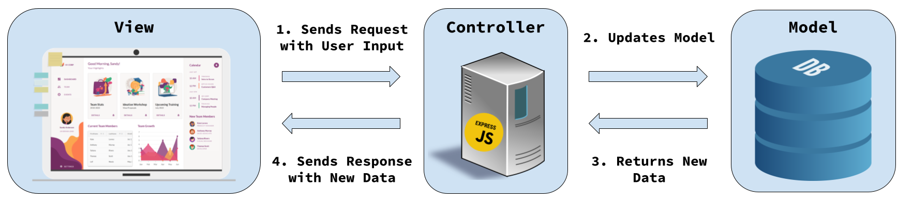

# 8. Model-View-Controller Architecture


Follow along with code examples [here](https://github.com/The-Marcy-Lab-School/5-5-rest-api-model)!


As your application grows in scale and scope, it is important to have a consistent approach for organizing its many components.

In this lesson, we'll learn how to implement one of the most popular patterns called the **Model-View-Controller Architecture**.

**Table of Contents:**

* [Essential Questions](8-model-view-controller.md#essential-questions)
* [Key Concepts](8-model-view-controller.md#key-concepts)
* [Organization and Separation of Concerns](8-model-view-controller.md#organization-and-separation-of-concerns)
  * [The Model-View-Controller (MVC) Architecture](8-model-view-controller.md#the-model-view-controller-mvc-architecture)
* [Implementing a Model for MVC](8-model-view-controller.md#implementing-a-model-for-mvc)
  * [Server Organization](8-model-view-controller.md#server-organization)
  * [Separating our Model](8-model-view-controller.md#separating-our-model)
  * [Separating our Controllers](8-model-view-controller.md#separating-our-controllers)
  * [index.js as the Coordinator](8-model-view-controller.md#indexjs-as-the-coordinator)
* [Challenge](8-model-view-controller.md#challenge)

## Essential Questions

By the end of this lesson, you should be able to answer these questions:

1. What is the MVC architecture? What is the responsibility of each layer (Model, View, Controller)?
2. What is "separation of concerns" and why does it matter as an application grows?
3. In the context of an Express server, what logic belongs in a model vs. a controller?
4. How do you structure a server directory to implement MVC?

## Key Concepts

* **Separation of Concerns** — the principle of dividing a program into distinct sections, each responsible for a specific aspect of the application's functionality.
* **Model-View-Controller (MVC)** — an architectural pattern that organizes application code into three distinct layers: Models, Views, and Controllers.
  * **Model** — the layer responsible for storing and managing application data. It provides a set of methods (an interface) for interacting with that data in a predictable, controlled manner.
  * **View** — the layer responsible for rendering data and providing user interfaces (buttons, forms, etc.) that allow users to see and request changes to the data.
  * **Controller** — the layer responsible for managing interactions between Views and Models. It parses user inputs from requests, invokes the appropriate Model methods, and sends responses back to the View.
* **Code Monolith** — a single, large, tightly coupled codebase that contains all application components, making it difficult to scale, maintain, and deploy.

## Organization and Separation of Concerns

In the last lesson, we built a RESTful API that lets users manage a list of fellows. They can:

* (Create) Add a new fellow to the list
* (Read) Get all fellows
* (Read) Get a single fellow
* (Update) Change the name of a fellow
* (Delete) Remove a fellow from the list

In that application, all of the logic was built into the `server/index.js` file. While we have some organization within the file, separating the concerns of one file into multiple files will enable our application to scale without becoming a "monolith"


In software development, a "**code monolith**" refers to a single, large, and typically tightly coupled codebase that contains all the application's components, often making it difficult to scale, maintain, and deploy


### The Model-View-Controller (MVC) Architecture

While there are many approaches for organization and separation of concerns, one highly popular approach is called the **Model-View-Controller (MVC) Architecture**.



This architecture pattern organizes our code into three distinct "layers"":

* The **Model** layer is responsible for storing and managing the data of an application. They provide an interface (a set of methods) for interacting with that data in a predictable manner.
* The **View** layer is responsible for rendering the data of an application. They provide user-interfaces with buttons, forms, and other components that allow the user to see and request changes to the data.
* The **Controller** layer is responsible for managing interactions between the views and models. They process user inputs from the views, invoke the appropriate methods of the models, and send response back to the views to be updated.


Often times, it can be hard to implement your application such that it strictly adheres to any one framework or architecture. Keep in mind that architectures like MVC present an ideal to strive for, not a strict pattern that must be followed at all times.


<details>

<summary><strong>What separate components of this architecture does our application already have?</strong></summary>

We have a Vanilla JS frontend application acting as the view component.

We have the Express server application acting as the controllers AND as the model. We need to separate the controller from the model.

</details>

## Implementing a Model for MVC

With our current application structure, we already have clear separation between the views (our frontend Vanilla JS application) and the controllers (our Express endpoints/controllers).

However, our controller and model logic is intertwined:



Notice that the controllers handle both the logic of parsing request inputs AND the logic of managing the data.

```javascript
// Our "Database"
const fellows = [
  { name: 'Carmen', id: getId() },
  { name: 'Reuben', id: getId() },
  { name: 'Maya', id: getId() },
];

// Our Controllers
const createFellow = (req, res) => {
  // Parse Inputs
  const { fellowName } = req.body;

  // Send Error Response
  if (!fellowName) {
    return res.status(400).send({ message: "Invalid Name" });
  }
  
  // Create a new fellow and add it to the "database"
  const newFellow = {
    name: fellowName,
    id: getId()
  }
  fellows.push(newFellow)

  // Send Response
  res.status(201).send(newFellow);
}

const findFellow = (req, res) => {
  // Parse Inputs
  const { id } = req.params;

  // Find the fellow in the "database"
  const fellow = fellows.find(fellow => fellow.id === Number(id));

  // Send Response
  if (!fellow) {
    return res.status(404).send({ 
      message: `No fellow with the id ${id}`
    });
  }

  res.send(fellow);
};

// ... and more...
```


<details>

<summary><strong>Q: Is it possible to test ONLY the code that interacts with the <code>fellows</code> array? For example, can we check to see if our logic for finding a fellow works without sending our server a request?</strong></summary>

No! And this is the main issue with our current implementation. Because the concerns are not separated, we can't easily test the different aspects of our server. If we separate the logic that interacts with the `fellows` array from the logic that interacts with the `req` and `res` objects, testing becomes possible.

</details>

We need to create a separate model that focuses solely on managing the `fellows` database and provides methods for our controllers to use.


### Server Organization

To create an MVC architecture, take a moment and build the following file structure for your server application.

```
server/
├── index.js
├── controllers/
│   └── fellowControllers.js
└── models/
    └── fellowModel.js
 
```

* `index.js` builds the `app`, configures middleware, and sets the endpoints. However, the controllers are now imported from the `fellowControllers.js` file.
* `controllers/fellowControllers.js` defines all of the controllers for endpoints relating to the `fellows` resource. Methods for interacting with the data will be imported from the `fellowModel.js` file.
* `models/fellowModel.js` defines methods for managing the `fellows` data and exports them.

By separating our code in this way, we show the separate "layers" of the application.

### Separating our Model

It is best to build backwards meaning we start with the data model, then build controllers that use the model, and finally wire them up in the `index.js` file.

To build a separate model layer to handle only data management logic, we will:

* Make a `models/fellowModel.js` file.
* Inside, define the `fellows` "database" and a set of functions for interacting with it.
* Export those functions as properties of a plain object so the only way to access the data is through the model's interface.


```js
let id = 1;
const getId = () => id++;

// Restrict access to our mock "database" to just this Model file
const fellows = [
  { name: 'Carmen', id: getId() },
  { name: 'Reuben', id: getId() },
  { name: 'Maya', id: getId() },
];

module.exports.create = (name) => {
  const newFellow = { name, id: getId() };
  fellows.push(newFellow);
  return newFellow;
};

module.exports.list = () => {
  return [...fellows];
};

module.exports.find = (id) => {
  const fellow = fellows.find((fellow) => fellow.id === id);
  if (!fellow) {
    return null;
  }
  return { ...fellow };
};

module.exports.update = (id, fellowName) => {
  const fellow = fellows.find((fellow) => fellow.id === id);
  if (!fellow) return null;
  fellow.name = fellowName;
  return { ...fellow };
};

module.exports.destroy = (id) => {
  const fellowIndex = fellows.findIndex((fellow) => fellow.id === id);
  if (fellowIndex < 0) {
    return false;
  }
  fellows.splice(fellowIndex, 1);
  return true;
};
```


The `fellows` array and all logic for interacting with it now live exclusively in this file. Nothing outside of `fellowModel.js` can touch the data directly — everything goes through the model's exported methods.

### Separating our Controllers

Now that we have a model, we can isolate our controllers into their own file. Each controller only needs to:

1. Parse the request inputs (`req.params`, `req.body`)
2. Call the appropriate model method
3. Send the response

* Move all of your controller functions into the `controllers/fellowControllers.js` file.
* Import the model at the top and call its methods instead of manipulating the data directly.
* Declare your controllers as properties of the `module.exports` object.


```js
const fellowModel = require('../models/fellowModel.js');

module.exports.createFellow = (req, res) => {
  const { fellowName } = req.body;
  if (!fellowName) {
    return res.status(400).send({ message: "Invalid Name" });
  }

  const newFellow = fellowModel.create(fellowName);
  res.send(newFellow);
};

module.exports.findFellow = (req, res) => {
  const { id } = req.params;
  const fellow = fellowModel.find(Number(id));

  if (!fellow) {
    return res.status(404).send({
      message: `No fellow with the id ${id}`
    });
  }
  res.send(fellow);
};

module.exports.updateFellow = (req, res) => {
  const { id } = req.params;
  const { fellowName } = req.body;

  if (!fellowName) {
    return res.status(400).send({ message: "Invalid Name" });
  }

  const updatedFellow = fellowModel.update(Number(id), fellowName);

  if (!updatedFellow) {
    return res.status(404).send({
      message: `No fellow with the id ${id}`
    });
  }

  res.send(updatedFellow);
};
```


Notice that the controllers no longer reference `fellows` directly — all data logic is delegated to `fellowModel`.

### index.js as the Coordinator

Finally, `index.js` acts as the coordinator / orchestrator. It builds the `app`, configures middleware, imports the controllers, and registers each endpoint. It does not contain any data logic or controller logic itself.

* Import the collection of controllers (it is an object containing all of our controller methods):

    ```js
    // Import the entire exports object
    const fellowControllers = require('./controllers/fellowControllers');
    ```

* Register each endpoint, passing the corresponding controller as the handler:

    ```js
    app.get('/api/fellows', fellowControllers.listFellows);
    app.get('/api/fellows/:id', fellowControllers.findFellow);
    app.post('/api/fellows', fellowControllers.createFellow);
    app.patch('/api/fellows/:id', fellowControllers.updateFellow);
    app.delete('/api/fellows/:id', fellowControllers.deleteFellow);
    ```

`index.js` knows *what* routes exist and *which controller* handles each one — nothing more. The three layers are now cleanly separated.

## Challenge

Build a `Song` model and a server application for maintaining a playlist. Each song should have an `id`, a `title`, and an `artist` (at minimum). The model should provide an interface for:

* Creating a new song
* Getting all songs
* Getting a single song
* Updating the title or artist of a song
* Deleting a song

Then, create an endpoint and a controller for each of these pieces of functionality. The endpoints should follow REST conventions and should all begin with `/api`

Test your endpoints using `curl` commands. Take note of the response headers and body:

```sh
# GET /api/songs
curl http://localhost:8080/api/songs

# POST /api/songs (with missing inputs)
curl -X POST http://localhost:8080/api/songs -H "Content-Type: application/json" -d '{"title":"Money Trees"}'

# POST /api/songs 
curl -X POST http://localhost:8080/api/songs -H "Content-Type: application/json" -d '{"title":"Money Trees","artist":"Kendrick Lamar"}'
curl http://localhost:8080/api/songs

# GET /api/songs/100 (with invalid ID)
curl http://localhost:8080/api/songs/100

# GET /api/songs/1
curl http://localhost:8080/api/songs/1

# PATCH /api/songs/100 (with invalid ID)
curl -X PATCH http://localhost:8080/api/songs/1 -H "Content-Type: application/json" -d '{"title":"Updated Title", "artist: "Updated Artist"}'

# PATCH /api/songs/1 (with missing inputs)
curl -X PATCH http://localhost:8080/api/songs/1 -H "Content-Type: application/json" -d '{"title":"Updated Title"}'

# PATCH /api/songs/1
curl -X PATCH http://localhost:8080/api/songs/1 -H "Content-Type: application/json" -d '{"title":"Updated Title", "artist: "Updated Artist"}'
curl http://localhost:8080/api/songs

# DELETE /api/songs/1
curl -X DELETE http://localhost:8080/api/songs/1
curl http://localhost:8080/api/songs
```

Finally, build a Vanilla JS frontend application that can interact with the songs API that you've built. It should be able to:

* Create: Add a new song to the list using a form.
* Read: Display a list of all songs.
* Update: Update a single song's title or artist using an inline edit form.
* Delete: Delete a single song using a delete button.

Structure your frontend using the same file organization as the fellow tracker:

* `index.html` — static shell with the form and list
* `src/fetch-helpers.js` — one exported function per API endpoint
* `src/dom-helpers.js` — `renderSongs()` and `renderError()`
* `src/main.js` — event listeners and handlers that call fetch helpers and re-render
