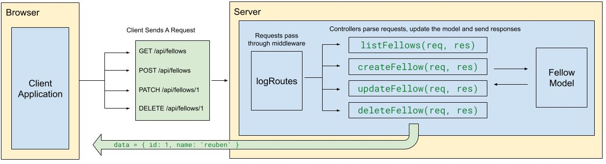

# Case Study: Bookmark Manager


Follow along with code examples [here](https://github.com/The-Marcy-Lab-School/swe-casestudy-5)!


- [Setup](#setup)
- [Overview](#overview)
- [Explore the Solution](#explore-the-solution)
  - [Trace the Flow](#trace-the-flow)
    - [Scenario 1: The page loads and bookmarks are rendered on the screen](#scenario-1-the-page-loads-and-bookmarks-are-rendered-on-the-screen)
    - [Scenario 2: The user fills out the form and submits a new bookmark](#scenario-2-the-user-fills-out-the-form-and-submits-a-new-bookmark)
    - [Scenario 3: The user clicks the Delete button on a bookmark](#scenario-3-the-user-clicks-the-delete-button-on-a-bookmark)
  - [Guided Reading Questions](#guided-reading-questions)
    - [`server/index.js`](#serverindexjs)
    - [`server/models/bookmarkModel.js`](#servermodelsbookmarkmodeljs)
    - [`server/controllers/bookmarkControllers.js`](#servercontrollersbookmarkcontrollersjs)
    - [`frontend/src/fetch-helpers.js`](#frontendsrcfetch-helpersjs)
- [Concepts Checklist](#concepts-checklist)

## Setup

```sh
cd server
npm i
npm run dev
```

The server will be running at [http://localhost:8080](http://localhost:8080).

## Overview

This case study application is a full-stack **Bookmark Manager** built with Express (backend) and vanilla JavaScript (frontend). Users can view their saved bookmarks, add new ones via a form, and delete them.

This case study demonstrates Express server setup, REST API design, the MVC (Model-View-Controller) architecture pattern, and connecting a frontend to a locally hosted backend via `fetch`.



The completed solution files are:

- `server/index.js` — Express server with middleware and routes
- `server/models/bookmarkModel.js` — In-memory data model
- `server/controllers/bookmarkControllers.js` — Route handler functions
- `frontend/index.html` — The HTML structure
- `frontend/src/fetch-helpers.js` — Functions that call the API
- `frontend/src/dom-helpers.js` — Functions that update the DOM
- `frontend/src/main.js` — Page load logic and event handlers

## Explore the Solution

### Trace the Flow

For each scenario below, trace the path through the code across files. In order of execution, write down the sequence of function calls:

- which file and function was involved
- a brief description of what it does
- what was returned or sent

An example is provided for the first scenario.

#### Scenario 1: The page loads and bookmarks are rendered on the screen

1. **`main.js`**: `main()` is called on page load.
2. **`main.js`**: `await getBookmarks()` is called.
3. **`frontend/src/fetch-helpers.js`**: `getBookmarks()` sends a `GET /api/bookmarks` request to the server.
4. **`server/index.js`**: The `logRoutes` middleware logs the request, then `app.get('/api/bookmarks', listBookmarks)` matches and calls `listBookmarks`.
5. **`server/controllers/bookmarkControllers.js`**: `listBookmarks()` calls `bookmarkModel.list()`.
6. **`server/models/bookmarkModel.js`**: `bookmarkModel.list()` returns a shallow copy of the in-memory bookmarks array.
7. **`server/controllers/bookmarkControllers.js`**: `res.send(bookmarks)` sends the array as JSON to the client.
8. **`frontend/src/fetch-helpers.js`**: `response.json()` parses the JSON and the array is returned.
9. **`main.js`**: `renderBookmarks(bookmarks)` is called with the resolved array.
10. **`frontend/src/dom-helpers.js`**: `renderBookmarks()` clears the list, updates the count, creates `<li>` elements with links and delete buttons, and appends them to `#bookmarks-list`.

#### Scenario 2: The user fills out the form and submits a new bookmark

<details>

<summary><strong>Answer</strong></summary>

1. **`main.js`**: The `submit` event fires on `#bookmark-form`, calling `handleFormSubmit`.
2. **`main.js`**: `event.preventDefault()` stops the page from reloading; `title` and `url` are read from `form.title.value` and `form.url.value`.
3. **`main.js`**: `await createBookmark(title, url)` is called.
4. **`frontend/src/fetch-helpers.js`**: `createBookmark()` sends a `POST /api/bookmarks` request with `Content-Type: application/json` and the bookmark data serialized in the request body.
5. **`server/index.js`**: `express.json()` middleware parses the request body into `req.body`. `app.post('/api/bookmarks', createBookmark)` matches and calls the `createBookmark` controller.
6. **`server/controllers/bookmarkControllers.js`**: The controller validates `title` and `url`, calls `bookmarkModel.create(title, url)`, adds a `createdAt` timestamp, and sends a `201` response with the new bookmark.
7. **`server/models/bookmarkModel.js`**: `bookmarkModel.create()` generates a new `id`, pushes the new bookmark into the array, and returns it.
8. **`main.js`**: `await getBookmarks()` is called to retrieve the full updated list.
9. **`main.js`**: `renderBookmarks(updated)` re-renders all bookmarks. `form.reset()` clears the form inputs.

</details>

#### Scenario 3: The user clicks the Delete button on a bookmark

<details>

<summary><strong>Answer</strong></summary>

1. **`main.js`**: A click event fires on `#bookmarks-list`, calling `handleDeleteBookmarkClick`.
2. **`main.js`**: `event.target.closest('.delete-btn')` finds the clicked button. If none is found, the handler returns early.
3. **`main.js`**: `await deleteBookmark(clickedBtn.dataset.bookmarkId)` is called with the bookmark's id stored in the button's `data-bookmark-id` attribute.
4. **`frontend/src/fetch-helpers.js`**: `deleteBookmark()` sends a `DELETE /api/bookmarks/:id` request to the server.
5. **`server/index.js`**: `app.delete('/api/bookmarks/:id', deleteBookmark)` matches and calls the `deleteBookmark` controller.
6. **`server/controllers/bookmarkControllers.js`**: The controller calls `bookmarkModel.destroy(Number(id))`.
7. **`server/models/bookmarkModel.js`**: `bookmarkModel.destroy()` finds the bookmark by index, removes it with `splice`, and returns `true`. Returns `false` if not found.
8. **`server/controllers/bookmarkControllers.js`**: `res.sendStatus(204)` sends an empty `204 No Content` response.
9. **`main.js`**: `await getBookmarks()` re-fetches the updated list, then `renderBookmarks(updated)` re-renders.

</details>

---

### Guided Reading Questions

Open each file and answer the questions.

#### `server/index.js`

1. What does `express.json()` middleware do, and why is it needed?
2. What does `express.static(pathToFrontend)` do? What is the `__dirname` variable's value and how is it used to construct the final `pathToFrontend` value? (console log both `__dirname` and `pathToFrontend` to find out)
3. What does the `logRoutes` middleware do, and what happens if you remove the `next()` call?
4. With the serving running, use `curl` to test each endpoint below. For each, record the **status code**, the **terminal log** printed by the server, and a **brief description** of the response:
    
```sh
# GET /api/bookmarks
curl http://localhost:8080/api/bookmarks

# POST /api/bookmarks
curl -X POST http://localhost:8080/api/bookmarks -H "Content-Type: application/json" -d '{"title":"GitHub","url":"https://github.com"}'

# GET /api/bookmarks/999
curl http://localhost:8080/api/bookmarks/999

# PATCH /api/bookmarks/1
curl -X PATCH http://localhost:8080/api/bookmarks/1 -H "Content-Type: application/json" -d '{"title":"Updated Title"}'

# DELETE /api/bookmarks/1
curl -X DELETE http://localhost:8080/api/bookmarks/1
curl http://localhost:8080/api/bookmarks #check to verify that the bookmark was deleted
```

<details>

<summary><strong>Answers</strong></summary>

1. `express.json()` parses incoming requests with a JSON body and attaches the result to `req.body`. Without it, `req.body` would be `undefined` when a client sends JSON (e.g., on `POST` or `PATCH` requests).
2. `express.static()` serves all files in a given folder as static assets. `__dirname` is a Node.js variable that holds the absolute path to the directory of the current file — in this case, the `server/` folder. `path.join(__dirname, '../frontend')` navigates one level up and into `frontend/`, so `pathToFrontend` is the absolute path to the `frontend/` folder. Visiting `http://localhost:8080` then delivers `frontend/index.html` automatically.
3. `logRoutes` logs the HTTP method, URL, and timestamp for every incoming request. If `next()` is removed, the request would hang — the middleware would never pass control to the next handler in the chain.
4. Sample curl commands and responses:

```sh
# GET /api/bookmarks
curl http://localhost:8080/api/bookmarks
# → 200, logs "GET: /api/bookmarks", returns the bookmarks array

# POST /api/bookmarks
curl -X POST http://localhost:8080/api/bookmarks -H "Content-Type: application/json" -d '{"title":"GitHub","url":"https://github.com"}'
# → 201, logs "POST: /api/bookmarks", returns the new bookmark object

# GET /api/bookmarks/999
curl http://localhost:8080/api/bookmarks/999
# → 404, logs "GET: /api/bookmarks/999", returns { "message": "Bookmark with id 999 not found" }

# PATCH /api/bookmarks/1
curl -X PATCH http://localhost:8080/api/bookmarks/1 -H "Content-Type: application/json" -d '{"title":"Updated Title"}'
# → 200, logs "PATCH: /api/bookmarks/1", returns the updated bookmark

# DELETE /api/bookmarks/1
curl -X DELETE http://localhost:8080/api/bookmarks/1
# → 204, logs "DELETE: /api/bookmarks/1", no response body
curl http://localhost:8080/api/bookmarks
# → 200, returns the remaining bookmarks (id 1 is gone)
```

</details>

#### `server/models/bookmarkModel.js`

1. Where is the "database" stored, and what are its limitations compared to a real database? What happens to the bookmark data if you restart the server?
2. Why does `bookmarkModel.list()` return `[...bookmarks]` instead of just `bookmarks`? Why do `find` and `update` return `{ ...bookmark }` instead of `bookmark`?
3. What does `bookmarkModel.find()` return if no bookmark matches the `id`? What does `bookmarkModel.destroy()` return if no match is found?

<details>

<summary><strong>Answers</strong></summary>

1. The bookmarks are stored in an in-memory JavaScript array (`const bookmarks = [...]`). Limitations: data is lost on server restart, it cannot be queried with SQL, there is no persistence to disk, and it does not scale across multiple server instances. All bookmark data resets to the three hardcoded initial values each time the module is reloaded.
2. `[...bookmarks]` returns a shallow copy of the array so callers can't accidentally mutate the internal store by modifying the returned reference. `{ ...bookmark }` does the same for individual objects — it returns a copy so callers cannot mutate the stored record directly.
3. `bookmarkModel.find()` returns `null` explicitly when no bookmark matches. `bookmarkModel.destroy()` returns `false` when no matching bookmark is found.

</details>

#### `server/controllers/bookmarkControllers.js`

1. Why does `getBookmark` call `Number(id)` when `id` comes from `req.params`?
2. What HTTP status code does `createBookmark` send on success, and why is `201` more appropriate than `200`?
3. There is an intentional design inconsistency in `createBookmark`. What is it, and how would you fix it?
4. How do `updateBookmark` and `deleteBookmark` handle the case where the target bookmark does not exist?
5. Look at the endpoints defined across `server/index.js` and the controllers. For each endpoint, identify the HTTP method, URL pattern, and which CRUD operation it performs. How do these endpoints follow REST conventions?

<details>

<summary><strong>Answers</strong></summary>

1. URL parameters are always strings. `bookmarkModel.find()` compares with `===`, so `"1" === 1` would be `false`. `Number(id)` converts the string to a number so the comparison works correctly.
2. `201 Created` is more semantically accurate — it signals that a new resource was successfully created, not just that the request succeeded. `200 OK` typically means the request succeeded but no new resource was created.
3. `createBookmark` adds `newBookmark.createdAt = new Date().toISOString()` in the controller. Adding fields to the data is a Model responsibility, not a Controller responsibility. To fix it, move the `createdAt` assignment into `bookmarkModel.create()`.
4. `updateBookmark` checks if the model method returned `null` and responds with `404`. `deleteBookmark` checks if `bookmarkModel.destroy()` returned `false` and responds with `404`. Both use `return` to short-circuit so `res.send()` is not called a second time. On success, `deleteBookmark` sends `res.sendStatus(204)` — a `204 No Content` response with no body.
5. REST analysis:

| Method   | URL                  | CRUD   | Notes                                     |
| -------- | -------------------- | ------ | ----------------------------------------- |
| `GET`    | `/api/bookmarks`     | Read   | Returns the full collection               |
| `GET`    | `/api/bookmarks/:id` | Read   | Returns a single resource by ID           |
| `POST`   | `/api/bookmarks`     | Create | Creates a new resource in the collection  |
| `PATCH`  | `/api/bookmarks/:id` | Update | Partially updates a single resource by ID |
| `DELETE` | `/api/bookmarks/:id` | Delete | Removes a single resource by ID           |

These follow REST conventions: resources are identified by URL (`/api/bookmarks` and `/api/bookmarks/:id`), HTTP methods express intent, and the response codes reflect the outcome.

</details>

#### `frontend/src/fetch-helpers.js`

1. The mod-4 fetch helpers targeted external URLs like `https://dummyjson.com/recipes`. These target `/api/bookmarks`. What is the difference, and why does this work?
2. All three helpers use `async`/`await` with `try`/`catch`. What does each helper return on failure?
3. `createBookmark` includes a `headers` object and a `body`. Why are both needed when making a `POST` request?

<details>

<summary><strong>Answers</strong></summary>

1. `/api/bookmarks` is a relative URL — it automatically prepends the current origin (`http://localhost:8080`). It works because the frontend is served by the same Express server as the API, so both share the same origin.
2. `getBookmarks` returns `[]` on failure. `createBookmark` returns `null` on failure. `deleteBookmark` returns `false` on failure. Callers must check for these values before using the result.
3. `headers: { 'Content-Type': 'application/json' }` tells the server the body is JSON-formatted text. `body: JSON.stringify(...)` converts the JavaScript object into a JSON string. Both are required — without the header, `express.json()` won't parse the body; without `JSON.stringify`, the body would be sent as `[object Object]`.

</details>

## Concepts Checklist

**Backend/Server Application**
- [ ] `express()` to create an Express application
- [ ] `app.listen()` to start the server on a port
- [ ] `express.static()` to serve a frontend from the same server
- [ ] `express.json()` to parse JSON request bodies
- [ ] Custom middleware with `(req, res, next)` and `next()`
- [ ] REST API design: GET, POST, PATCH, DELETE with semantically correct URLs
- [ ] URL parameters with `req.params`
- [ ] Request body with `req.body`
- [ ] HTTP status codes: `200`, `201`, `400`, `404`
- [ ] MVC architecture: Model, View (frontend), Controller layers
- [ ] In-memory data store with named exports using `module.exports.methodName`
- [ ] `Array.find()`, `Array.findIndex()`, and `Array.splice()` for data operations

**Frontend/Client Application:**
- [ ] `async`/`await` with `try`/`catch` in fetch helpers
- [ ] Relative URL fetch targeting a same-origin API
- [ ] `POST` fetch with `Content-Type` header and `JSON.stringify` body
- [ ] `DELETE` fetch with `method: 'DELETE'`
- [ ] `document.createElement` + modify + `append` pattern
- [ ] `innerHTML = ''` to clear containers before re-rendering
- [ ] `dataset` to store IDs on DOM elements
- [ ] Event delegation with `closest()` to handle dynamically rendered elements
- [ ] Re-fetching after mutations to keep the UI in sync with server state
