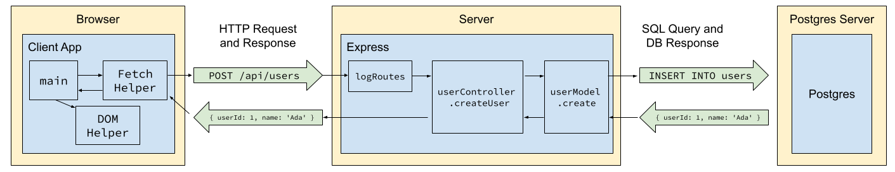

# 1. SQL and Databases


Follow along with code examples [here](https://github.com/The-Marcy-Lab-School/8-2-0-sql-and-databases)!


We've learned how to build a server application using Express. It can serve the static assets for a frontend and can handle requests through an API. But the data is not persistent!

This week, we'll learn about the tools needed to build a truly "fullstack" web application with a proper database.

Prior to this lecture, please follow these [PostgreSQL Setup Steps](../environment-setup/postgres-setup.md).

Let's dive in!

**Table of Contents**

- [Essential Questions](#essential-questions)
- [Key Concepts](#key-concepts)
- [What Is a Database and Why Use One?](#what-is-a-database-and-why-use-one)
- [Database Management Systems](#database-management-systems)
  - [Tables](#tables)
  - [Relational DBMSs, Primary Keys, Foreign Keys](#relational-dbmss-primary-keys-foreign-keys)
- [How does PostgreSQL Work?](#how-does-postgresql-work)
  - [SQL](#sql)
  - [SQL Syntax: SQL is Picky](#sql-syntax-sql-is-picky)
    - [Rule #1: The Semicolon Terminator `;`](#rule-1-the-semicolon-terminator-)
    - [Rule #2: Capitalization for Readability](#rule-2-capitalization-for-readability)
    - [Rule #3: Single Quotes for Strings `''`](#rule-3-single-quotes-for-strings-)
    - [Rule #4: Logical Clause Order](#rule-4-logical-clause-order)
    - [Pro-Tip: Indentation](#pro-tip-indentation)
- [Summary](#summary)

## Essential Questions

By the end of this lesson, you should be able to answer these questions:

1. What is the difference between a database and a database management system?
2. What makes PostgreSQL a "relational" database management system? How is data organized in one?
3. What is a primary key and why does every table need one?
4. How does a database fit into the fullstack architecture alongside the client and the server?
5. What is SQL and what kinds of operations can it perform on a database?

## Key Concepts

* **Fullstack** - refers to the combination of frontend (client-side) and backend (server-side) technologies, including a database.
* **PERN** - an acronym for a specific set of technologies used to build a fullstack web application: Postgres, Express, React, and Node. This acronym is useful when asked "what stack do you use?"
* **Database** - a structured collection of data that is organized in a manner for easy retrieval. The actual files on your computer where the data lives.
* **Database Management System (DBMS)** - a piece of software used to create, access, update and maintain a database.
* **Postgres** - a popular "relational" database management system that stores data in a table-like manner
* **Table** - a collection of related data organized in rows and columns.
  * A **row** represents a single object/instance/record in the table
  * A **column** represents a property/attribute/field of that object. Columns have data types such as integer, string, date, boolean, etc...
  * A **primary key** serves as the unique identifier for a row in a table
* **SQL (Structured Query Language)** - a language used by relational database management systems to create, read, update, or delete data from a database.

## What Is a Database and Why Use One?

The applications that we've built so far have used in-memory arrays and model files to manage collections of data. However, all of the changes that are made to those arrays are erased when the server stops. This is why we need a database. 

```js
// Variables store data in RAM. They do not persist once the program terminates.
const customers = [
  { customer_id: 1, name: 'Reuben', address: '123 Marcy Ave', },
  { customer_id: 2, name: 'Maya', address: '822 3rd Ave', },
  { customer_id: 3, name: 'Carmen', address: '567 Broadway',  }
];
```

A **database** is just data stored in some structured manner. For example, a spreadsheet stored in Google Sheets is a database.


Databases are often **persistent**, meaning their data is written to durable storage (disk) rather than held in the memory of a running process. This means that our servers can be shut down for updates, crash, and restart without disrupting the data. 

## Database Management Systems

A database on its own is just data in a file not being used.

A **database management system** (DBMS) is a program that makes it easier for its users to find, update, and manage the data in a database. In this case, the spreadsheet of data is the database and the Google Sheets application is the database management system.


**So, what's the difference between a database and a database management system?**

If a database is like a library, then a database management system is like a librarian with a catalog system. The librarian organizes the books and manages how visitors take and return books.




**Postgres** is one of the most popular database management systems in the world for a number of reasons:
* It is free and open-source
* It has a strong reputation for reliability
* It has a long history of updates and maintenance (since 1986!)
* It is widely available and supported

### Tables

PostgreSQL organizes its databases in **tables** that look a lot like spreadsheets:

.png>)

A table represents a single type of resource (**"entity"**) in the database (_e.g. users, posts, comments, likes, etc..._)
* Each **row** represents a single **record** in the table (_e.g. a single user in the users table_)
* Each **column** defines a property that all records of a table share (_e.g. a users table has `id`, `username`, and `password` columns_).

### Relational DBMSs, Primary Keys, Foreign Keys

Specifically, PostgreSQL is a **Relational DBMS (RDBMS)** meaning its tables have relationships connecting their data. 


> View this database on [Google Sheets](https://docs.google.com/spreadsheets/d/1Ca8yKI8SwsQht-ZgPE569_2BBS8iAuad9LdgB3nJhUY/edit?usp=sharing)

Relationships between tables is accomplished using **primary and foreign keys**:

* A **primary key** is a column that uniquely identifies each record in the table. In the example above, you can see each table has a `tablename_id` column (`customer_id`, `product_id`, and `order_id`)
* A **foreign key** is a column in a table that points to the primary key of another table, thus creating a relationship between the tables. In this example, every order has a reference to a particular `customer_id` (the customer who placed the order) and a `product_id` (the product they purchased).

A table that connects data from two other tables is often called a **bridge table** or **association table**.


While there are many types of database management systems, each with their own approach to managing a database, the top four DBMSs are all relational with [PostgreSQL as the most popular](https://survey.stackoverflow.co/2024/technology/#1-databases)!

Popular non-relational database management systems include [MongoDB](https://www.mongodb.com/), [Redis](https://redis.io/), and [Firebase](https://firebase.google.com/).


## How does PostgreSQL Work?

Database management systems (DBMS) like PostgreSQL function similarly to web servers:

* **Networking**: PostgreSQL runs on a specific host and port (defaulting to `5432`).
* **Interpretation**: It listens for incoming connections and interprets the SQL commands sent by the client.
* **Execution**: It processes the incoming commands and sends the resulting data back to the requester.



The primary distinction lies in the type of request being handled: while an Express server is built to parse HTTP requests, PostgreSQL is built to parse and execute **Structured Query Language (SQL)**.

### SQL

**SQL** is the universal language that relational database management systems are designed to parse and execute, transforming user instructions into tangible data actions (CRUD). 

For example, to create a new table in our PostgreSQL server, we can execute a **SQL statement** like this:

```sql
CREATE TABLE users (
    id SERIAL PRIMARY KEY,
    name VARCHAR(100) NOT NULL
);
```

SQL statements are composed of **keywords** and **clauses**. Keywords determine the CRUD operation to be performed on an entire database table or on the records inside. 

* Common keywords: `CREATE TABLE`, `INSERT INTO`, `SELECT...FROM`, `UPDATE`, `DELETE`

Clauses modify the statement.
* Common clauses: `WHERE`, `GROUP BY`, `ORDER BY`

The goal of SQL is to be easily readable by a human but structured to be consistently parsed by the DBMS.

For example, consider these SQL statements. What do you think they do?

```sql
INSERT INTO users (name) VALUES ('Alice');

SELECT * FROM users;

SELECT name FROM users;

SELECT name FROM users WHERE id = 1;

UPDATE users SET name = 'Alex' WHERE id = 1;

DELETE FROM users WHERE id = 2;
```

**<details><summary>Q: What do the SQL statements above do?</summary>**

1. Create a new record in the `users` table
2. Get all data from the `users` table
3. Get only the `name` data for all records in the `users` table
4. Get only the `name` data for the record with the id `1` in the `users` table
5. Update `name` of the the user with the id `1` in the `users` table to `'Alex'`
6. Delete the user with the id `2` from the `users` table. 

</details>

### SQL Syntax: SQL is Picky

SQL is highly structured; the DBMS acts as a strict interpreter that expects instructions in a specific format. To avoid syntax errors, keep these four fundamental rules in mind:

#### Rule #1: The Semicolon Terminator `;`
The semicolon tells the DBMS that a statement is complete and ready to be executed. While some environments allow single queries without them, using them is a "best practice" that prevents errors when running multiple commands in a row.

```sql
-- ✅ Good: Explicitly ends the command
SELECT * FROM users;

-- ❌ Bad: The DBMS may wait for more input
SELECT * FROM users
```

#### Rule #2: Capitalization for Readability
Technically, SQL is **case-insensitive**, meaning `select` and `SELECT` perform the same action. However, treating keywords as uppercase is the industry standard because it visually separates **commands** from **data**.

```sql
-- ✅ Good: Easy to distinguish keywords from table names
SELECT * FROM users WHERE id = 1;

-- ❌ Bad: Harder to scan quickly
select * from users where id = 1;
```

#### Rule #3: Single Quotes for Strings `''`
In SQL, single quotes are used for **string literals** (text data). Double quotes `""` are reserved for "identifiers" (like table or column names that contain spaces), so using them for values like names or emails will cause an error.

```sql
-- ✅ Good: Standard string literal
INSERT INTO users (name) VALUES ('Alice');

-- ❌ Bad: The DBMS will look for a column named "Alice"
INSERT INTO users (name) VALUES ("Alice");
```

#### Rule #4: Logical Clause Order
A DBMS interprets SQL in a specific sequence. For an `UPDATE` statement, the system needs to know **which table** first, **what to change** second, and **which rows** last.

```sql
-- ✅ Good: Logical flow (Target → Action → Filter)
UPDATE users SET name = 'Alex' WHERE id = 1;

-- ❌ Bad: SET must precede WHERE
UPDATE users WHERE id = 1 SET name = 'Alex'; 
```

#### Pro-Tip: Indentation
While not a strict "rule" that causes errors, using new lines for different clauses (like `FROM` and `WHERE`) makes complex queries much easier for you (and the DBMS's human maintainers) to read! Just be careful about where you put the semicolon.

```sql
-- Best: Easier to read
UPDATE users
SET name = 'Alex'
WHERE id = 1;

-- Fine
UPDATE users WHERE id = 1 SET name = 'Alex'; 
```

## Summary

* **Database** - a structured collection of data that is organized in a manner for easy retrieval (like books in a library)
* **Database Management System (DBMS)** - a piece of software used to organize and manage access to a database (like a librarian)


* **Postgres** - a popular "relational" database management system that stores data in a table-like manner
* **Table** - a collection of related data organized in rows and columns.
  * A **row** represents a single object/instance/record in the table
  * A **column** represents a property/attribute/field of that object. Columns have data types such as integer, string, date, boolean, etc...
  * A **primary key** serves as the unique identifier for a row in a table

.png>)

* **SQL (Structured Query Language)** - a language used by relational database management systems to create, read, update, or delete data from a database.

```sql
SELECT title, release_year FROM film WHERE length <= 90;
```
