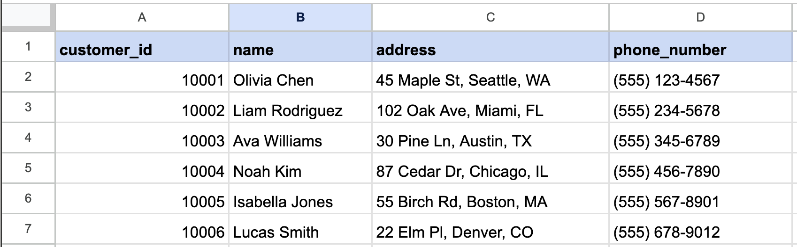
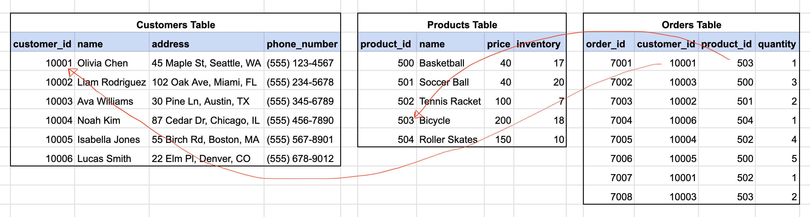
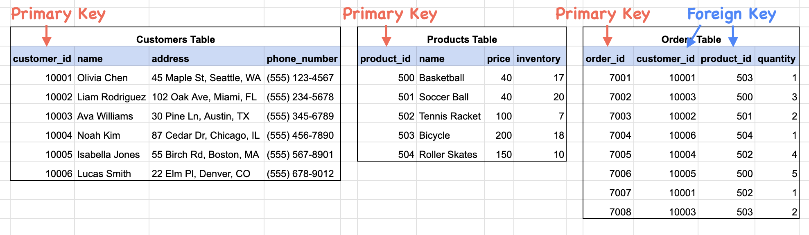

# 1. Intro to Databases & Postgres


Follow along with code examples [here](https://github.com/The-Marcy-Lab-School/6-1-intro-to-databases-postgres)!


We've learned how to build a server application using Express. It can serve the static assets for a frontend and can handle requests through an API. But the data is not persistent!

This module, we'll learn about the tools needed to build a truly "fullstack" web application with a proper database.

**Table of Contents**

- [Essential Questions](#essential-questions)
- [Key Concepts](#key-concepts)
- [Databases and Database Management Systems](#databases-and-database-management-systems)
  - [What Is a Database?](#what-is-a-database)
  - [What is a Database Management System?](#what-is-a-database-management-system)
- [PostgreSQL and Relational Database Management Systems](#postgresql-and-relational-database-management-systems)
  - [Tables (Entities), Rows (Records), and Columns](#tables-entities-rows-records-and-columns)
  - [Primary and Foreign Keys](#primary-and-foreign-keys)
- [How Does PostgreSQL Work?](#how-does-postgresql-work)
- [Installing Postgres](#installing-postgres)
- [Two Ways to Talk to Postgres](#two-ways-to-talk-to-postgres)
  - [Creating a Sample Database](#creating-a-sample-database)
  - [The `psql` CLI](#the-psql-cli)
  - [TablePlus](#tableplus)

## Essential Questions

By the end of this lesson, you should be able to answer these questions:

1. What is the difference between a database and a database management system?
2. What makes PostgreSQL a "relational" database management system? How is data organized in one?
3. What is a primary key? What is a foreign key?
4. How does a database fit into the fullstack architecture alongside the client and the server?
5. What is `psql`? What are the essential commands for navigating databases and tables?
6. What is TablePlus and how does it compare to `psql`?

## Key Concepts

* **Fullstack** - refers to the combination of frontend (client-side) and backend (server-side) technologies, including a database.
* **PERN** - an acronym for a specific set of technologies used to build a fullstack web application: Postgres, Express, React, and Node. This acronym is useful when asked "what stack do you use?"
* **Database** - a structured collection of data that is organized in a manner for easy retrieval. The actual files on your computer where the data lives.
* **Database Management System (DBMS)** - a piece of software used to create, access, update and maintain a database.
* **Postgres** - a popular "relational" database management system that stores data in a table-like manner.
* **Table** - a collection of related data organized in rows and columns.
  * A **row** represents a single object/instance/record in the table
  * A **column** represents a property/attribute/field of that object. Columns have data types such as integer, string, date, boolean, etc...
  * A **primary key** serves as the unique identifier for a row in a table
* **Foreign key** - a column in a table that points to the primary key of another table, creating a relationship between the two tables.
* **`psql`** - the official command-line interface for interacting with a PostgreSQL database.
* **TablePlus** - a GUI application for connecting to and exploring a PostgreSQL database visually.

## Databases and Database Management Systems

### What Is a Database?

The applications that we've built so far have used in-memory arrays and model files to manage collections of data. However, all of the changes that are made to those arrays are erased when the server stops. This is why we need a database.

```js
// Variables store data in RAM. They do not persist once the program terminates.
const customers = [
  { customer_id: 1, name: 'Reuben', address: '123 Marcy Ave' },
  { customer_id: 2, name: 'Maya', address: '822 3rd Ave' },
  { customer_id: 3, name: 'Carmen', address: '567 Broadway' }
];
```

A **database** is just data stored in some structured manner. For example, a spreadsheet stored in Google Sheets is a database.



Databases are often **persistent**, meaning their data is written to durable storage (disk/hard drive) rather than held in the memory of a running process. This means that our servers can be shut down for updates, crash, and restart without disrupting the data.

### What is a Database Management System?

A database on its own is just structured data in a file. The software that we use to interact with that structured data is called a **database management system (DBMS)**. A DBMS acts as a layer between the data and whoever wants to use it, making it easier to find, update, and manage the data in a database.

For example, Google Sheets is the DBMS that lets you manipulate a Google Sheets spreadsheet. It provides a GUI with buttons, dropdowns, and functions for interacting with the data.

**<details><summary>Q: Can you think of any real world analogies to a database and a database management system? Think about collections of things and the person, tool, or system that makes it easier to use that collection.</summary>**


A library is like a database and a librarian is like a database management system.

The books are inside of the library, however, without a librarian the books may be disorganized and finding the right book might be difficult. The librarian organizes the books and manages how visitors take and return books, ensuring that no books are lost in the process.

</details>

## PostgreSQL and Relational Database Management Systems

**PostgreSQL** (often shortened to "Postgres") is one of the most popular database management systems in the world for a number of reasons:
* It is free and open-source
* It has a strong reputation for reliability
* It has a long history of updates and maintenance (since 1986!)
* It is widely available and supported

Specifically, PostgreSQL is a **Relational DBMS (RDBMS)** meaning it organizes its data into smaller sub-categories called **tables** that can have **relationships** connecting their data.


While there are many types of database management systems, each with their own approach to managing a database, the top four DBMSs are all relational with [PostgreSQL as the most popular](https://survey.stackoverflow.co/2024/technology/#1-databases)!

Popular non-relational database management systems include [MongoDB](https://www.mongodb.com/), [Redis](https://redis.io/), and [Firebase](https://firebase.google.com/).


### Tables (Entities), Rows (Records), and Columns

A **table** represents a single type of resource (a.k.a. an **"entity"**) in the database (_e.g. customers, products, orders, users, posts, likes etc..._). They look a lot like spreadsheets:

> View this database on [Google Sheets](https://docs.google.com/spreadsheets/d/1Ca8yKI8SwsQht-ZgPE569_2BBS8iAuad9LdgB3nJhUY/view)



**Rows** represent individual resources (a.k.a. **"records"**) in the table (_e.g. a single customer record in the customers table_)

**Columns** define the properties that all records of a table share (_e.g. a customers table has `customer_id`, `name`, `address` and `phone_number` columns_).


Tables in SQL-based DBMSs like PostgreSQL exclusively use lowercase table and column names. Because of this, **lower_snake_case** is the standard naming convention used.


**<details><summary>Q: What relationships do you see between these three tables? What do those relationships tell us?</summary>**

Each row in the `orders` table refers to a specific row in each of the `customers` and `products` table. This relationship tells us for a given order which product was purchased and who purchased the product.

</details>

### Primary and Foreign Keys

Relationships between tables are accomplished using **primary and foreign keys**:



A **primary key** is a column that uniquely identifies each record in the table. 
* Primary keys are named after their table: `customer_id`, `product_id`, `order_id`. This naming convention avoids ambiguity when looking at many tables. 
* Primary key values are often sequential numbers and are often generated by the DBMS so that the developer doesn't need to. This avoids human error and ensures unique primary keys are used.

A **foreign key** is a column in a table that points to the primary key of another table, thus creating a relationship between the tables. 
* Foreign key columns use the same name as the primary key they reference.
* In the example above, every order has a reference to a particular `customer_id` (the customer who placed the order) and a `product_id` (the product they purchased). 

A table that connects data from two other tables is often called a **bridge table** or **association table**.

## How Does PostgreSQL Work?

Tables and databases managed by a DBMS like PostgreSQL are stored as files directly on your computer. However, these files are not human-readable plain text files; they are stored in a specific binary format optimized for performance and consistency.

While you might be able to find some recognizable strings in the raw data files, the database management system acts as the necessary interface to read and interpret the data correctly.

In many ways, DBMSs like PostgreSQL function similarly to web servers:

* **Server-Hosted Process**: PostgreSQL is a program (a process) that runs on a specific host and port (defaulting to `5432`)
* **Listens** Client applications can connect to that host and port. PostgreSQL listens for incoming connections.
* **Provides an Interface**: While servers provide endpoints for HTTP requests (GET `/api/customers`), PostgreSQL can interpret SQL queries (`SELECT * FROM customers`).
* **Executes**: PostgreSQL executes the requested action on the database and sends the resulting data back to the requester.


The primary distinction from an Express server lies in the type of request being handled: while an Express server parses HTTP requests, PostgreSQL parses and executes **Structured Query Language (SQL)** — the universal language for interacting with a relational database. We'll dig into SQL starting in the next lesson.

For now, the key thing to understand is that PostgreSQL is a **separate process** running on your machine. Your Node Express server doesn't contain your data — it talks to PostgreSQL to read and write it.

## Installing Postgres

Now that we know what a database is and how PostgreSQL fits into your overall software architecture, let's install it and start playing around with databases!



1. Go to [https://postgresapp.com/](https://postgresapp.com/) and download the Latest Release version for your Mac.
2. Open the downloaded file, drag Postgres.app to your Applications folder, and run it.
3. Click **Initialize** to create your first database cluster. The app should now show **Running**.
4. Add the Postgres CLI tools to your PATH so you can use `psql` from any terminal window:

   ```sh
   sudo mkdir -p /etc/paths.d && echo /Applications/Postgres.app/Contents/Versions/latest/bin | sudo tee /etc/paths.d/postgresapp
   ```

5. **Restart your terminal**, then verify the installation:

   ```sh
   psql --version
   ```

   You should see a version number (e.g. `psql (PostgreSQL) 16.x`).



1. Open your Ubuntu terminal.
2. Update your package list:

   ```sh
   sudo apt update
   ```

3. Install Postgres:

   ```sh
   sudo apt install postgresql postgresql-contrib
   ```

   Type `Y` if prompted to confirm.

4. Verify the installation:

   ```sh
   psql --version
   ```

5. Start the Postgres service:

   ```sh
   sudo service postgresql start
   ```

6. Confirm it is running:

   ```sh
   sudo service postgresql status
   ```

   You should see it listed as **online** on port `5432`.

7. Connect to Postgres as the default `postgres` user to set a password:

   ```sh
   sudo -u postgres psql
   ```

8. Inside `psql`, run the following (replace `your_password` with something short and memorable — `123` is fine for local dev):

   ```sql
   ALTER USER postgres WITH ENCRYPTED PASSWORD 'your_password';
   ```

   Then quit:

   ```sql
   \q
   ```




**Keeping Postgres running**

* **Mac**: Postgres.app must be open and showing **Running** in your menu bar. Click it to start/stop.
* **Windows/WSL**: Run `sudo service postgresql start` each time you open a new terminal session. You can check the status with `sudo service postgresql status`.


## Two Ways to Talk to Postgres

There are two main tools you'll use to interact with your PostgreSQL databases: the `psql` CLI and TablePlus. Before exploring either one, let's create a sample database to work with.

### Creating a Sample Database

The follow-along repo for this lesson includes a `setup.sql` file. Running it will create a database called `films_db` with a `films` table pre-loaded with data — giving you something real to explore.

**Run the setup file from your terminal:**



```sh
psql -f setup.sql
```


```sh
sudo -u postgres psql -f setup.sql
```



The `setup.sql` file contains the following SQL — you don't need to understand every line yet, but you can see what it's doing:

```sql
DROP DATABASE IF EXISTS films_db;
CREATE DATABASE films_db;
\c films_db

CREATE TABLE films (
  film_id   SERIAL PRIMARY KEY,
  title     TEXT NOT NULL,
  director  TEXT NOT NULL,
  year      INT  NOT NULL,
  genre     TEXT NOT NULL
);

INSERT INTO films (title, director, year, genre) VALUES
  ('The Matrix',                          'Lana Wachowski',   1999, 'sci-fi'),
  ('Inception',                           'Christopher Nolan',2010, 'sci-fi'),
  ('Get Out',                             'Jordan Peele',     2017, 'horror'),
  ('Parasite',                            'Bong Joon-ho',     2019, 'thriller'),
  ('Moonlight',                           'Barry Jenkins',    2016, 'drama'),
  ('Everything Everywhere All at Once',   'Daniel Kwan',      2022, 'sci-fi'),
  ('Black Panther',                       'Ryan Coogler',     2018, 'action');
```

After the script runs you should see output confirming the database and table were created with rows inserted.

### The `psql` CLI

`psql` is the official command-line interface that ships with Postgres. It lets you connect to a database and run SQL commands directly from your terminal.

**Open psql and connect to the sample database:**



```sh
psql films_db
```


```sh
sudo -u postgres psql films_db
```



You'll see a prompt like:

```
psql (16.x)
Type "help" for help.

films_db=#
```

**Essential `psql` commands:**

These "backslash commands" are `psql`-specific — they control the `psql` tool itself, not the database:

| Command        | What it does                                  |
| -------------- | --------------------------------------------- |
| `\l`           | List all databases                            |
| `\c dbname`    | Connect to a specific database                |
| `\dt`          | List all tables in the current database       |
| `\d tablename` | Describe a table (show its columns and types) |
| `\q`           | Quit `psql`                                   |

**Try these now against `films_db` (`--` is a comment for the command below):**

```sql
-- see all databases, including films_db
\l                

-- see the films table
\dt               

-- inspect the films table structure
\d films          

-- see all the rows (don't forget the `;`, if you did, enter it on the next line!)
SELECT * FROM films;  

-- quit when done
\q                
```

**<details><summary>Q: What's the difference between a `psql` backslash command and a SQL statement?</summary>**

Backslash commands (like `\l`, `\dt`, `\q`) are built into the `psql` application itself — they don't get sent to Postgres. They control the `psql` tool (list databases, switch connections, quit).

SQL statements (like `SELECT`, `INSERT`, `CREATE TABLE`) are the actual language PostgreSQL understands. They get sent to the PostgreSQL process and executed against the database. SQL statements end with a semicolon `;`. Backslash commands do not.

</details>

### TablePlus

TablePlus is a GUI application that connects to your PostgreSQL databases and lets you browse tables, run queries, and view results visually — without memorizing CLI commands.

**Install TablePlus** from [https://tableplus.com/](https://tableplus.com/). Download the version for your OS, install, and open it.

**Create a connection to `films_db`:**

1. Click **Create a new connection** and select **PostgreSQL**
2. Fill in the connection details — **User** and **Password** differ by OS (see below):
   - **Name:** `films_db` (just a label)
   - **Host:** `127.0.0.1`
   - **Port:** `5432`
   - **Database:** `films_db`
3. Click **Test** — all fields should highlight green
4. Click **Connect**



Leave both **User** and **Password** blank.

Postgres.app configures your macOS username as a superuser and trusts all local connections — no password needed. When TablePlus sees a blank username, it uses your system username automatically.



- **User:** `postgres`
- **Password:** the password you set during installation

**Why does WSL require a password when Mac doesn't?**

Postgres controls who can connect through a configuration file called `pg_hba.conf`. In that file, "local" means a **Unix socket connection** — a low-level file-based connection that never touches the network. It does *not* mean "my own machine."

TablePlus connects over **TCP** to `127.0.0.1:5432`. Even though that's your own computer, Postgres classifies it as a network connection and applies stricter rules. WSL's default Postgres installation requires a username and password for all TCP connections. Mac's Postgres.app is configured to trust them.

Think of it this way: `psql` in your terminal uses a Unix socket (no password needed). TablePlus uses TCP (password required on WSL).



**Explore `films_db` in TablePlus:**

* Click **films** in the left sidebar to view all rows in the table
* Click the **SQL** button in the top toolbar to open a query editor — try running `SELECT * FROM films;` (don't forget the `;`!)
* Results appear in the main panel with rows and columns clearly labeled

**<details><summary>Q: When should you use `psql` vs. TablePlus?</summary>**

Both tools connect to the same PostgreSQL database — the choice is about workflow preference.

`psql` is fast for quick checks and is available anywhere (no GUI needed). It's also what you'd use on a remote server. TablePlus is better for exploring an unfamiliar database, visualizing table structure, or running queries where you want to see results in a table format.

In practice, most developers use both: `psql` for quick scripting and TablePlus for visual exploration.

</details>
