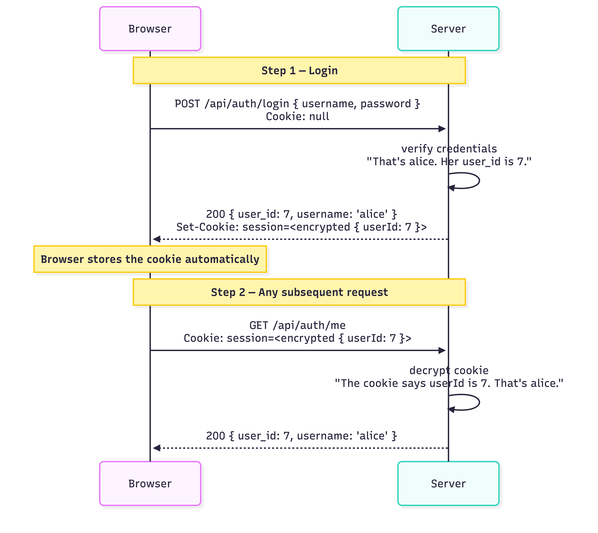
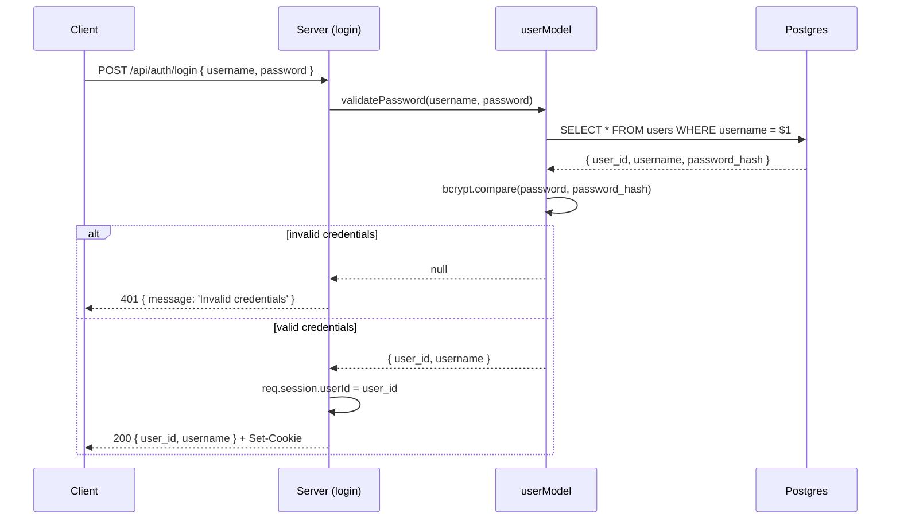
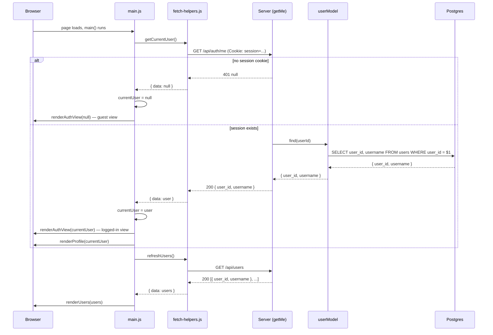

# 10. Sessions and Login


Follow along with code examples [here](https://github.com/The-Marcy-Lab-School/6-10-sessions-and-login)!


In lesson 9, you built a registration endpoint that hashes passwords and stores a new user. But the server doesn't yet remember them — the response goes out and the server immediately forgets everything. This lesson introduces **sessions** and **cookies** to solve that, and uses them to add auto-login on register, login, `/api/auth/me`, and logout.

**Table of Contents**

- [Essential Questions](#essential-questions)
- [Key Concepts](#key-concepts)
- [Setup](#setup)
- [The Problem: HTTP is Stateless](#the-problem-http-is-stateless)
- [The Solution: Sessions and Cookies](#the-solution-sessions-and-cookies)
- [Setting Up `cookie-session`](#setting-up-cookie-session)
  - [Setting Cookie Data on Login](#setting-cookie-data-on-login)
  - [Auto-Login on Register](#auto-login-on-register)
  - [Staying Logged In With The `/api/auth/me` Pattern](#staying-logged-in-with-the-apiauthme-pattern)
  - [Logout](#logout)
- [Putting It Together: Auth Endpoints](#putting-it-together-auth-endpoints)

## Essential Questions

By the end of this lesson, you should be able to answer these questions:

1. What does it mean that HTTP is stateless? Why is that a problem for keeping users logged-in?
2. What is a session? What is a cookie? How do they work together?
3. How do we create, update, or delete cookies on the server?
4. What is the login flow, step by step?
5. What is the `/api/auth/me` pattern? Why is it useful for frontends?

## Key Concepts

* **Stateless** — HTTP is stateless: every request is independent. The server has no memory of previous requests from the same client.
* **Session** — a way for the server to persist information across multiple requests from the same user, typically by storing it server-side and giving the client a token to identify the session.
* **Cookie** — a small piece of data set by a server and automatically sent by the browser with every subsequent request to that domain.
* **`cookie-session`** — an npm package that stores session data directly in an encrypted, signed cookie (no server-side session store needed).
* **`req.session`** — the session object provided by `cookie-session`. You can read from and write to it inside any controller or middleware.
* **Auto-login on register** — setting `req.session.userId` immediately after a successful registration so the user is logged in without a separate login request.
* **`userModel.validatePassword(username, password)`** — the model method from lesson 9 that handles the username lookup and bcrypt comparison internally. Returns `{ user_id, username }` or `null`.
* **`/api/auth/me`** — a convention for an endpoint that returns the currently logged-in user based on the session.

## Setup

1. Edit `db/pool.js` and update the user and password fields to match your local Postgres setup (On macOS you may be able to delete those fields entirely)

2. Run these commands to set up the database, seed, and start the server:

    ```sh
    cd server

    # Install dependencies
    npm install

    # Create the database (run once)
    createdb users_db           # Mac
    sudo -u postgres createdb users_db   # Windows/WSL

    # Seed the database with hashed passwords
    node db/seed.js

    # Start the server (port 3000)
    npm run dev
    ```

3. Open the app and sign in to one of the users below

Seeded users (all have these passwords):

| Username | Password    |
| -------- | ----------- |
| alice    | password123 |
| bob      | hunter2     |
| carol    | opensesame  |

## The Problem: HTTP is Stateless

HTTP is a **stateless** protocol. Every request your server receives is completely independent — the server has no memory of previous requests.

```
Client → POST /api/auth/login { username, password }
Server → 200 OK { user_id: 7, username: 'alice' }

Client → GET /api/auth/me
Server → ??? I've never seen this person before.
```

After a user logs in, the server processes the login request, sends back a response, and immediately forgets everything. 

This means that any time in the future that the user visits the page, or if they refresh, the user will have to login again.

## The Solution: Sessions and Cookies

Go to GitHub.com. Do you need to log in to your account or are you already logged in? If you were already logged in, that means that you have a **session cookie** stored in your browser.

**Session cookies** are small files containing a unique identifier (e.g. a user ID) given to a client (the browser) by a server. When a user returns to the website, the client (the browser) automatically sends the session cookie back to the server showing that they've already been authenticated:



This means that we don't have to write any frontend code to continue sending our login credentials to the server with ever request. **The cookie is sent automatically by the browser** with every request to the same domain.

## Setting Up `cookie-session`

To implement session cookies, we will use the `cookie-session` package. It handles:
- Creating session cookies
- Sending them to the client
- Extracting cookies from requests

Install the package:

```sh
npm install cookie-session
```

Add it to your Express app as middleware, before your routes:

```js
const cookieSession = require('cookie-session');

// other middleware...

// ⚠️ secret is hardcoded for development only — move to .env before deploying
app.use(cookieSession({
  name: 'session',
  secret: 'dev-only-secret-replace-before-deploying', 
  maxAge: 24 * 60 * 60 * 1000,
}));

// routes...
```

`cookieSession()` is a function that generates middleware for managing session cookies. It takes a configuration object with the following properties:
* `name: 'session'` — defines the name of the cookie as it appears in the browser DevTools (go to Application → Cookies to see cookies). Defaults to `'session'`.
* `secret: '...'` — defines a private string used to "sign" the cookie. The signature lets the server detect if the cookie was tampered with. The cookie data (e.g. `{ userId: 7 }`) is encoded, not encrypted — it is readable by anyone who has the cookie so we should never store sensitive data like passwords in the session.
* `maxAge: 24 * 60 * 60 * 1000` — defines how long the cookie will be valid. In this case, we calculate 24 hours in milliseconds.


The `secret` is used to "sign" the cookie, which prevents tampering. It is like the password for the cookie. It must be kept private — never commit it to GitHub in your production apps. Use a long, random string in production and always store it in a `.env` file.


Once this middleware is in place, `req.session` is available in every controller
* You can read from it to see if a user has a valid cookie
* You can write to it when a user logs in / registers to set their cookie
* You can also set it to `null` to delete the cookie

```js
// Writing to the session (sets a cookie in the response)
req.session.userId = 7;

// Reading from the session (reads from the incoming cookie)
const userId = req.session.userId; // 7

// Clearing the session (removes the cookie)
req.session = null;
```

### Setting Cookie Data on Login

Now that we have `req.session`, we can send cookies to our users when they login.

In our `login` controller, after the `userModel` validates the login credentials, we can save the validated user's ID in `req.session`. When we send the response, the session cookie will be included with that `userId` data:

```js
// controllers/authControllers.js
const login = async (req, res, next) => {
  try {
    const { username, password } = req.body;

    const user = await userModel.validatePassword(username, password);

    if (!user) {
      return res.status(401).send({ message: 'Invalid credentials' });
    }

    // Add a { userId } property to the session object with the new user's user_id value
    req.session.userId = user.user_id;

    res.send(user);
  } catch (err) {
    next(err);
  }
};
```

The one new line — `req.session.userId = user.user_id` — tells `cookie-session` to set a cookie containing the user's ID. Every subsequent request from that browser will include that cookie, and `req.session.userId` will be available in any controller.

To see the cookie in you browser, try this out:
1. Run the server and connect to it in your browser
2. Open your browser's DevTools and go to Applications → Cookies → `http://localhost:8080`.
3. Confirm that you have NO cookies
4. Log in to one of the users using the registration form (username: `alice`, password: `password123`)
5. Observe that new cookie has been stored in your browser with the name `session`! 
  
The `session.userId` data has been encoded using Base64 encoding. Unlike encryption, encoded strings can easily be reversed. Try copying the cookie from your browser and pasting it into this online decoder tool: [https://www.base64decode.org/](https://www.base64decode.org/)

We can visualize this login flow like this:



### Auto-Login on Register

We want to do the same thing when a user registers a new account:

```js
const register = async (req, res, next) => {
  try {
    const { username, password } = req.body;
    if (!username || !password) {
      return res.status(400).send({ error: 'Username and password are required.' });
    }

    const existingUser = await userModel.findByUsername(username);
    if (existingUser) {
      return res.status(409).send({ message: 'Username already taken' });
    }

    const user = await userModel.create(username, password);

    // Add a { userId } property to the session object with the new user's user_id value
    req.session.userId = user.user_id;

    res.status(201).send(user);
  } catch (err) {
    next(err);
  }
};
```

### Staying Logged In With The `/api/auth/me` Pattern

So, why do we store the user ID in the cookie? Why not some other piece of data like their username?

When a user returns to your app after previously logging in, their session cookie is still in their browser. The frontend needs a way to say: "I have a cookie, don't ask me to log in again!"

The `/api/auth/me` endpoint handles this. It uses `userModel.find(user_id)` — a new model method that looks up a user by their `user_id`:

```js
// models/userModel.js
module.exports.find = async (user_id) => {
  const { rows } = await pool.query(
    'SELECT user_id, username FROM users WHERE user_id = $1',
    [user_id]
  );
  return rows[0] || null;
};
```

The `getMe` controller can invoke `userModel.find()` with the user id stored in the session cookie
* If there is no `userId` in the cookie or there no user with the given `userId`: the user is not logged in → `401` Not Authenticated.
* If there *is* a found user: `200` and send them their `user` data!

```js
// GET /api/auth/me
const getMe = async (req, res, next) => {
  try {
    // Get the userId from the session cookie
    const { userId } = req.session;

    // No session — user is not logged in
    if (!userId) return res.status(401).send(null);

    // Session exists — look up and return the user
    const user = await userModel.find(userId);

    // If no valid user — user is not logged in
    if (!user) return res.status(401).send(null);

    // The user was found — user IS logged in
    res.send(user);
  } catch (err) {
    next(err);
  }
};
```

The frontend calls `GET /api/auth/me` when the app loads in `main.js`. 
* If it returns a user, `currentUser` is set and the logged-in view and the profile are rendered 
* If it returns `401`, `currentUser` stays `null` and the guest view is rendered





```javascript
const handleFetch = async (url, config) => {
  try {
    const response = await fetch(url, config);
    if (!response.ok) throw new Error(`${response.status} ${response.statusText}`);
    const data = await response.json();
    return { data, error: null };
  } catch (error) {
    return { data: null, error };
  }
};

const baseURL = '/api';

// ============================================
// Auth
// ============================================

export const getCurrentUser = async () => {
  // If no session exists, the request returns 401 — we treat that as "not logged in"
  const { data } = await handleFetch(`${baseURL}/auth/me`);
  return { data };
};

// more fetch helpers...
```





```javascript
// imports, etc...

let currentUser = null;

// event handlers, etc....

const main = async () => {
  const { data } = await getCurrentUser();
  currentUser = data;           // null if not logged in, { user_id, username } if logged in
  renderAuthView(currentUser);  // one function handles both guest and logged-in views
  if (currentUser) renderProfile(currentUser);
  await refreshUsers();         // always load the users list on startup
};

main();
```







**<details><summary>Q: Why call `/api/auth/me` on every page load instead of just after login?</summary>**

When a user logs in and is redirected to a new page, that page loads fresh — it doesn't inherit any JavaScript state from the login page. Calling `/api/auth/me` on every page load lets the app determine the current auth state from the session, regardless of how the user arrived at the page.

</details>

### Logout

Before we had session cookies, a user was immediately logged out when they refreshed their browser. Now, a new `/api/auth/logout` endpoint should be called which sets teh session to `null`:

```js
// DELETE /api/auth/logout
const logout = (req, res) => {
  req.session = null; // tells cookie-session to delete the cookie
  res.send({ message: 'Logged out' });
};
```

Setting `req.session = null` tells `cookie-session` to remove the cookie from the browser. On the next request, `req.session.userId` will be `undefined`.

Try it out with your DevTools open and see the cookie disappear!

**<details><summary>Q: A user logs out, but they saved their session cookie before logging out and manually restore it in their browser. Can they log back in?</summary>**

With `cookie-session` (client-side sessions), yes — in theory. Because `cookie-session` doesn't maintain a server-side session store, it can't invalidate old cookies after they're issued. Setting `req.session = null` clears the cookie from the browser, but a saved copy of the old cookie value would still work.

This is a known limitation of client-side sessions. Mitigations include short `maxAge` values and rotating the `SESSION_SECRET` to invalidate all existing cookies at once. For production applications handling sensitive data, server-side sessions (`express-session` with a database store) are more appropriate.

</details>

## Putting It Together: Auth Endpoints

Here is the complete set of auth controllers:

```js
// controllers/authControllers.js
const userModel = require('../models/userModel');

const register = async (req, res, next) => {
  try {
    const { username, password } = req.body;
    if (!username || !password) {
      return res.status(400).send({ error: 'Username and password are required.' });
    }
    const existingUser = await userModel.findByUsername(username);
    if (existingUser) {
      return res.status(400).send({ message: 'Username already taken' });
    }
    const user = await userModel.create(username, password);
    req.session.userId = user.user_id;
    res.status(201).send(user);
  } catch (err) {
    next(err);
  }
};

const login = async (req, res, next) => {
  try {
    const { username, password } = req.body;
    const user = await userModel.validatePassword(username, password);
    if (!user) {
      return res.status(401).send({ message: 'Invalid credentials' });
    }
    req.session.userId = user.user_id;
    res.send({ user_id: user.user_id, username: user.username });
  } catch (err) {
    next(err);
  }
};

const getMe = async (req, res, next) => {
  try {
    const { userId } = req.session;
    if (!userId) {
      return res.status(401).send(null);
    }
    const user = await userModel.find(userId);
    if (!user) {
      return res.status(401).send(null);
    }
    res.send({ user_id: user.user_id, username: user.username });
  } catch (err) {
    next(err);
  }
};

const logout = (req, res) => {
  req.session = null;
  res.send({ message: 'Logged out' });
};

module.exports = { register, login, getMe, logout };
```

And the corresponding routes in `index.js`:

```js
// ---- Auth Routes ----
app.post('/api/auth/register', register);
app.post('/api/auth/login', login);
app.get('/api/auth/me', getMe);
app.delete('/api/auth/logout', logout);
```

Here's a summary of the four auth endpoints:

| Method   | Endpoint             | What it does                              |
| -------- | -------------------- | ----------------------------------------- |
| `POST`   | `/api/auth/register` | Hash password, create user, set session   |
| `POST`   | `/api/auth/login`    | Verify credentials, set session cookie    |
| `GET`    | `/api/auth/me`       | Return current user from session (or 401) |
| `DELETE` | `/api/auth/logout`   | Clear the session cookie                  |

With these four endpoints, your application has a complete authentication system. The next lesson adds **authorization** — protecting routes so only authenticated users can access them.

**<details><summary>Q: A user visits your app for the first time. Walk through exactly which auth endpoints get called and when.</summary>**

1. **App loads** → frontend calls `GET /api/auth/me`
   - No session cookie exists
   - Server returns `401`
   - Frontend shows the login/register form

2. **User registers** → frontend calls `POST /api/auth/register`
   - Server hashes the password, creates the user
   - Server sets `req.session.userId` and returns the user
   - Frontend shows the logged-in view

3. **User returns the next day** → browser sends the session cookie automatically
   - Frontend calls `GET /api/auth/me`
   - Server reads `req.session.userId`, looks up the user
   - Frontend shows the logged-in view without requiring a new login

4. **User logs out** → frontend calls `DELETE /api/auth/logout`
   - Server sets `req.session = null`
   - Cookie is cleared
   - Frontend shows the login form

</details>
