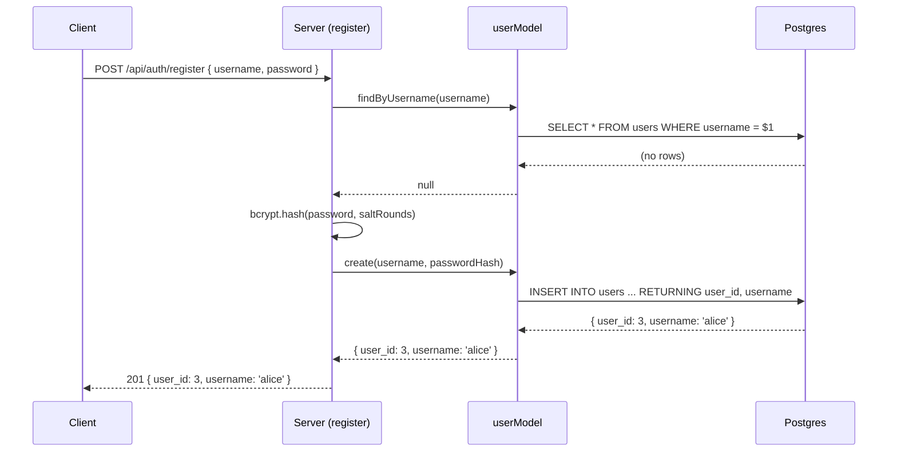
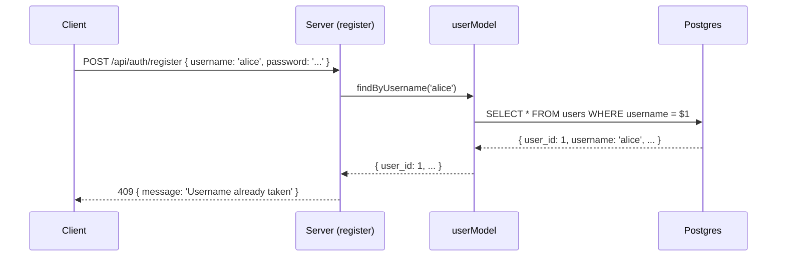

# 10. User Model and Registration


Follow along with code examples [here](https://github.com/The-Marcy-Lab-School/6-10-user-model-and-registration)!


In lesson 9, you learned why plaintext passwords are dangerous and how bcrypt solves the problem. Now let's apply it. In this lesson, you'll update the user system from lesson 8 — replacing the plaintext `password` column with a `password_hash`, rebuilding the `userModel` with bcrypt-aware methods, and writing a proper registration endpoint that hashes passwords before storing them.

**Table of Contents**

- [Essential Questions](#essential-questions)
- [Key Concepts](#key-concepts)
- [Seeding with Hashed Passwords](#seeding-with-hashed-passwords)
- [The User Model](#the-user-model)
  - [Why `validatePassword` Lives in the Model](#why-validatepassword-lives-in-the-model)
- [The Registration Endpoint](#the-registration-endpoint)
- [Auth Routes in `index.js`](#auth-routes-in-indexjs)
- [Tracing the Registration Flow](#tracing-the-registration-flow)

## Essential Questions

By the end of this lesson, you should be able to answer these questions:

1. How does our database schema change to store hashed passwords?
2. How does seeding change now that we need to hash passwords?
3. Which layer should be responsible for hashing and validating passwords—the model or the controller?

## Key Concepts

* **`password_hash`** — the column name for a stored hashed password. The name signals to every developer that this column never holds a plaintext password.
* **`bcrypt.hash(password, saltRounds)`** — hashes a plaintext password before storing. Called in the seed file and inside the model's `create` and `update` methods. Controllers never call `bcrypt` directly.
* **`userModel.validatePassword(username, password)`** — a model method that looks up a user by username and calls `bcrypt.compare()` internally. Returns `{ user_id, username }` if valid, or `null` if not. The controller never sees `password_hash`.

## Seeding with Hashed Passwords

In lesson 8, the seed file was a `.sql` file that stored passwords in plaintext:

```sql
\c users_db

DROP TABLE IF EXISTS users;

-- WARNING: storing passwords in plaintext is insecure.
-- Lesson 9 fixes this by hashing passwords with bcrypt.
CREATE TABLE users (
  user_id  SERIAL PRIMARY KEY,
  username TEXT NOT NULL UNIQUE,
  password TEXT NOT NULL
);

INSERT INTO users (username, password) VALUES
  ('alice', 'password123'),
  ('bob',   'hunter2');
```

Two things need to change before we can store password hashes with bcrypt.

**The column name.** `password` becomes `password_hash`. This signals to every developer who reads the schema that this column never holds a plaintext password. If you ever see a query that writes a raw string into `password_hash`, something is wrong.

**The file type.** We can't use a `.sql` file because SQL has no way to hash passwords. The seed file needs to be JavaScript so it can hash passwords before inserting them with `bcrypt.hash`. Everything else stays the same:



 

```javascript
// db/seed.js
const bcrypt = require('bcrypt');
const pool = require('./pool');

const seed = async () => {
  await pool.query('DROP TABLE IF EXISTS users');
  await pool.query(`
    CREATE TABLE users (
      user_id       SERIAL PRIMARY KEY,
      username      TEXT NOT NULL UNIQUE,
      password_hash TEXT NOT NULL
    )
  `);

  const saltRounds = 8;
  const hash1 = await bcrypt.hash('password123', saltRounds);
  const hash2 = await bcrypt.hash('hunter2', saltRounds);

  await pool.query(
    'INSERT INTO users (username, password_hash) VALUES ($1, $2), ($3, $4)',
    ['alice', hash1, 'bob', hash2]
  );

  console.log('Database seeded.');
  await pool.end(); // use pool.end for one-off scripts like seed files
};

seed();
```



 

```sql
-- seed.sql
\c users_db

DROP TABLE IF EXISTS users;

CREATE TABLE users (
  user_id  SERIAL PRIMARY KEY,
  username TEXT NOT NULL UNIQUE,
  password TEXT NOT NULL
);

INSERT INTO users (username, password) VALUES
  ('alice', 'password123'),
  ('bob',   'hunter2');
```



 

Run it once to create the table and insert sample data:

```sh
node db/seed.js
```

This is also your first look at `bcrypt` in the application. `bcrypt.hash(password, saltRounds)` takes a plaintext string and returns a hash. You'll see the same call inside `userModel.create()`.

## The User Model

The user model has six functions. Five are updated versions of what you built in lesson 8. The new one is `validatePassword`.

```js
// models/userModel.js
const bcrypt = require('bcrypt');
const pool = require('../db/pool');

const SALT_ROUNDS = 8;

// Unchanged
module.exports.list = async () => {
  const { rows } = await pool.query('SELECT user_id, username FROM users ORDER BY user_id');
  return rows;
};


module.exports.findByUsername = async (username) => { /* unchanged */ };
module.exports.destroy = async (userId) => { /* unchanged */ };

// Now hashes the password before storing
module.exports.create = async (username, password) => {
  const passwordHash = await bcrypt.hash(password, SALT_ROUNDS);
  const query = 'INSERT INTO users (username, password_hash) VALUES ($1, $2) RETURNING user_id, username';
  const result = await pool.query(query, [username, passwordHash]);
  return result.rows[0];
};

module.exports.update = async (userId, password) => {
  const passwordHash = await bcrypt.hash(password, SALT_ROUNDS);
  const query = 'UPDATE users SET password_hash = $1 WHERE user_id = $2 RETURNING user_id, username';
  const result = await pool.query(query, [passwordHash, userId]);
  return result.rows[0] || null;
};

module.exports.validatePassword = async (username, password) => {
  const 
  const user = await 
  if (!user) return null;
  const isValid = await bcrypt.compare(password, user.password_hash);
  if (!isValid) return null;
  return { user_id: user.user_id, username: user.username };
};
```


Notice that `list`, `create`, `find`, `update`, and `destroy` all select only `user_id, username` — never `password_hash`. The only function that ever reads `password_hash` is `findByUsername`, and it is called only from `validatePassword`. Controllers never see the hash.


### Why `validatePassword` Lives in the Model

You might wonder: why not call `bcrypt.compare()` in the login controller? The answer is encapsulation.

If the comparison lives in the controller, the controller needs to call `findByUsername`, get back the full row including `password_hash`, and then compare. That means `password_hash` is flowing through a layer that shouldn't see it.

By putting `validatePassword` in the model, the controller only ever receives `{ user_id, username }` or `null`. The `password_hash` never leaves the model layer. This makes it impossible to accidentally expose the hash in a response.

**<details><summary>Q: `validatePassword` returns `null` for both a missing username and a wrong password. Why not distinguish between the two?</summary>**

Telling an attacker whether a username exists gives them useful information — they now know which usernames are valid and can focus their attacks. Returning the same response for both cases prevents this kind of username enumeration. The client sees "invalid credentials" regardless of which check failed.

</details>

## The Registration Endpoint

The registration controller has two steps:

```js
// controllers/authControllers.js
const userModel = require('../models/userModel');

const register = async (req, res, next) => {
  try {
    const { username, password } = req.body;

    // Step 1: Check if the username is already taken
    const existingUser = await userModel.findByUsername(username);
    if (existingUser) {
      return res.status(400).send({ message: 'Username already taken' });
    }

    // Step 2: Create the user — the model hashes the password internally
    const user = await userModel.create(username, password);

    res.status(201).send(user); // { user_id, username }
  } catch (err) {
    next(err);
  }
};

module.exports = { register };
```

**<details><summary>Q: Why check for an existing username before hashing the password?</summary>**

`bcrypt.hash()` is intentionally slow — that's part of what makes it secure. If we hashed first and then discovered the username was taken, we'd have wasted an expensive computation. Checking the database first short-circuits early.

</details>

**<details><summary>Q: The register endpoint returns `{ user_id, username }`. Why not return `password_hash`?</summary>**

The `password_hash` is not useful to the client — it can't be used to authenticate future requests (that's what the session cookie is for). `userModel.create()` already excludes it with `RETURNING user_id, username`, so the hash never reaches the controller.

</details>

## Auth Routes in `index.js`

Auth routes go in a dedicated section in `index.js`. For now only `register` is wired up — `login`, `/me`, and `logout` come in lesson 11.

```js
// index.js
const express = require('express');
const { register } = require('./controllers/authControllers');
const { listUsers, updateUser, deleteUser } = require('./controllers/userControllers');

const app = express();
app.use(express.json());

// ---- Auth Routes ----
app.post('/api/auth/register', register);

// ---- User Routes ----
app.get('/api/users', listUsers);
app.patch('/api/users/:user_id', updateUser);
app.delete('/api/users/:user_id', deleteUser);

// ---- Error-Handling Middleware ----
app.use((err, req, res, next) => {
  console.error(err);
  res.status(err.status || 500).send({ message: err.message || 'Internal server error' });
});

app.listen(3000, () => console.log('Server running on http://localhost:3000'));
```

## Tracing the Registration Flow



If the username is already taken, the flow short-circuits early:



The next lesson introduces `cookie-session`, uses it to add auto-login on register, and builds out the remaining auth surface: login, `/api/auth/me`, and logout.
