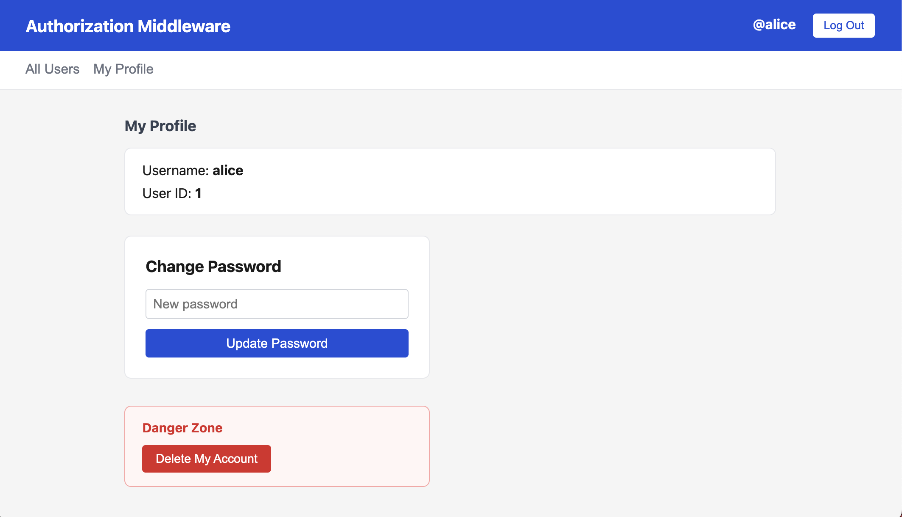
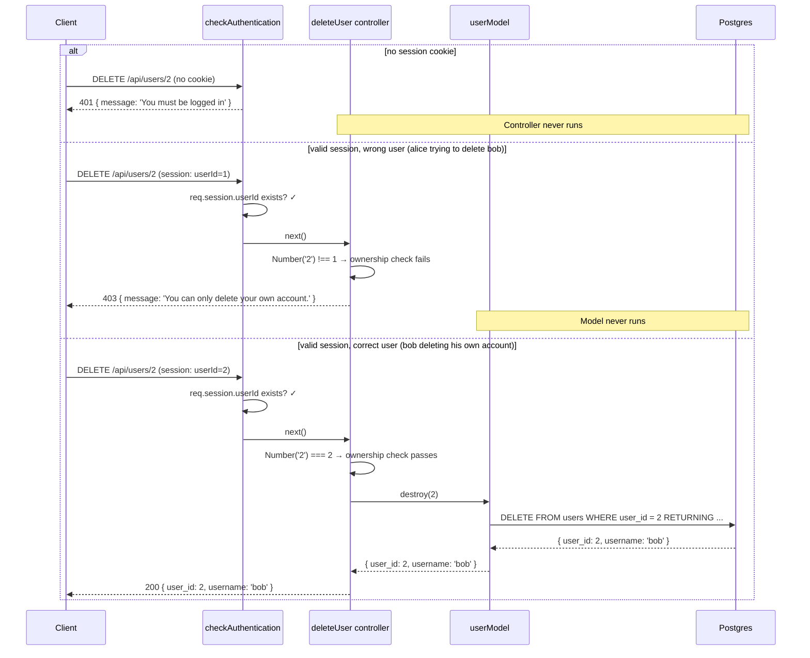

# 11. Authorization Middleware


Follow along with code examples [here](https://github.com/The-Marcy-Lab-School/6-11-authorization-middleware)!


You now have a server that hashes passwords, issues session cookies, and can tell you who is logged in. But there's still a wide-open gap: nothing stops a request from modifying or deleting a user it has no right to touch. This lesson closes that gap with **authorization middleware**.

**Table of Contents**

- [Essential Questions](#essential-questions)
- [Key Concepts](#key-concepts)
- [Setup](#setup)
  - [File Structure](#file-structure)
- [Authentication vs. Authorization](#authentication-vs-authorization)
- [The Frontend as a First Line of Defense](#the-frontend-as-a-first-line-of-defense)
- [Why the Frontend Isn't Enough](#why-the-frontend-isnt-enough)
- [Writing Authorization Middleware](#writing-authorization-middleware)
  - [The `checkAuthentication` Middleware](#the-checkauthentication-middleware)
  - [Applying It to Routes](#applying-it-to-routes)
- [Ownership-Based Authorization](#ownership-based-authorization)
  - [Tracing a Protected Request End to End](#tracing-a-protected-request-end-to-end)
- [Testing Protected Routes with curl](#testing-protected-routes-with-curl)
- [How the Frontend Handles 401 and 403](#how-the-frontend-handles-401-and-403)
- [The Complete Auth Picture](#the-complete-auth-picture)

## Essential Questions

By the end of this lesson, you should be able to answer these questions:

1. What is the difference between authentication and authorization?
2. Why isn't the frontend enough to protect an API endpoint?
3. What problem does authorization middleware solve? Why not just put the check inside every controller?
4. How does middleware use `next()` to either continue the request or short-circuit it?
5. What is ownership-based authorization? How do you implement it?
6. When should you return `401` vs. `403`?

## Key Concepts

* **Authentication** — verifying *who you are* (proving your identity, typically through login).
* **Authorization** — determining *what you're allowed to do* (checking permissions after identity is established).
* **Protected route** — an endpoint that requires a valid session to access.
* **`checkAuthentication` middleware** — a custom middleware function that checks for a valid session and either allows the request to continue (`next()`) or sends a `401` and stops.
* **Ownership** — a resource that belongs to a specific user. Ownership authorization confirms the logged-in user owns the resource before allowing modifications.
* **`401 Unauthorized`** — "I don't know who you are. Log in."
* **`403 Forbidden`** — "I know who you are, but you can't do this."

## Setup

1. Clone down the repo linked above
2. Open `db/pool.js` and update the user and password fields to match your local Postgres setup (On macOS you may be able to delete those fields entirely).
3. Then run:

    ```sh
    # cd into server
    cd server

    # Install dependencies
    npm install

    # Create the database (run one of these)
    createdb users_db           # Mac
    sudo -u postgres createdb users_db   # Windows/WSL

    # Copy the env template, then fill in a SESSION_SECRET value with a random 32+ char string
    cp .env.template .env

    # Seed and start
    npm run db:seed
    npm run dev
    ```


Try visiting [https://randomkeygen.com/](https://randomkeygen.com/) to generate a random 32-character string for your `SESSION_SECRET`.


### File Structure

The repo builds on lesson 10. Notice that `middleware/checkAuthentication.js` is a new file — but it is not yet wired up to any routes. That's the work of this lesson.

```
server/
├── controllers/
│   ├── authControllers.js      # unchanged from lesson 10
│   └── userControllers.js      # will add ownership checks
├── db/
│   ├── pool.js
│   └── seed.js
├── middleware/
│   ├── checkAuthentication.js  # written — but not yet applied to routes
│   └── logRoutes.js
├── models/
│   └── userModel.js
└── index.js                    # TODO: apply checkAuthentication to PATCH and DELETE
```

## Authentication vs. Authorization

The terms authentication and authorization are related and often grouped together under the nickname "auth". However, they are distinct:

|                          | Authentication              | Authorization                               |
| ------------------------ | --------------------------- | ------------------------------------------- |
| **Answers the Question** | Who are you?                | What are you allowed to do?                 |
| **How**                  | Login (username + password) | Session check + permission check            |
| **Status on failure**    | 401 Unauthorized            | 403 Forbidden                               |
| **Order**                | Before authorization        | After authentication                        |
| **Example**              | Logging into an app         | Editing *your own* post, not someone else's |

Authentication always comes first. You can't authorize someone whose identity you haven't verified.

**<details><summary>Q: A logged-in user tries to delete another user's account. Is this an authentication failure or an authorization failure?</summary>**

**Authorization failure.** The user is authenticated — we know who they are (they have a valid session). But they don't have *permission* to delete someone else's account. The server should return `403 Forbidden`, not `401 Unauthorized`.

* `401` — "I don't know who you are. Log in."
* `403` — "I know who you are, but you can't do this."

</details>

## The Frontend as a First Line of Defense

With the server running, open the frontend in your browser. Register a new account. After registering, click **My Profile** in the nav.

The profile section shows your username and user ID, a form to change your password, and a button: **Delete My Account**.



Notice what the frontend does *not* show: a list of all users with delete buttons. There's no way to accidentally delete someone else's account using this UI. The only delete button is for the account you're currently logged into.

A well-designed UI like this guides users towards using the application the right way while making it hard to do things they aren't allowed or supposed to do. Open `frontend/src/main.js` and trace through what happens when you click **Delete My Account**:

```js
// Delete account: remove own record -> log out -> return to guest view
deleteAccountBtn.addEventListener('click', async () => {
  if (!confirm('Delete your account? This cannot be undone.')) return;
  await deleteUser(currentUser.user_id);  // always uses the logged-in user's own ID
  await logout();
  currentUser = null;
  renderAuthView(null);
  showUsersSection();
  await refreshUsers();
});
```

`currentUser.user_id` was set when you logged in and comes from `req.session` — so the frontend always sends the right ID. The confirmation dialog adds another layer of protection against accidents.

Go ahead and try it: click the button, confirm the dialog, and watch your account disappear from the All Users list.

Then register a new account so you have a user to work with.

## Why the Frontend Isn't Enough

The frontend protects against *accidents*. It does nothing to stop an *attacker*.

The frontend is just HTML, CSS, and JavaScript running in the browser. Anyone with network access can skip the UI entirely and talk to your API directly — no cookie, no confirmation dialog, no login required. Open a terminal and run:

```sh
curl -X DELETE http://localhost:8080/api/users/1
```

Response:

```json
{ "user_id": 1, "username": "alice" }
```

Alice is gone. No session was required. The `DELETE /api/users/:user_id` route in `index.js` currently has no protection:

```js
// index.js — currently unprotected
app.patch('/api/users/:user_id', updateUser);
app.delete('/api/users/:user_id', deleteUser);
```

Any HTTP client — curl, Postman, a script, a browser extension — can call these endpoints. Knowing someone's `user_id` (visible in the All Users list, in the URL, or in any API response) is all it takes.

**Security must live on the server.** The frontend is a convenience layer for legitimate users. It is never the last line of defense.

## Writing Authorization Middleware

The fix is to check for a valid session before the controller runs. If there's no session, it sends `401` and stops. The controller never runs.

You could put this check inside every controller:

```js
const deleteUser = async (req, res, next) => {
  if (!req.session.userId) {
    return res.status(401).send({ message: 'Must be logged in' });
  }
  // ... rest of delete logic
};
```

That works, but if you have many protected endpoints you'd write the same check over and over. Middleware solves this by extracting the check into one reusable function you register per route.

### The `checkAuthentication` Middleware

Open `server/middleware/checkAuthentication.js`. It's already written — read through it:


```js
const checkAuthentication = (req, res, next) => {
  const { userId } = req.session;

  // No session — user is not logged in
  if (!userId) {
    return res.status(401).send({ message: 'You must be logged in to do that.' });
  }

  // Session is valid — continue to the controller and execute the protected endpoint
  next();
};

module.exports = checkAuthentication;
```


This is a regular Express middleware function — three parameters, the same shape as `logRoutes`. The key behavior:

* **If the session is missing:** send `401` and return. The controller never runs.
* **If the session is valid:** call `next()` to pass control to the next handler.

Every code path through a middleware must either call `next()`, call `next(err)`, or send a response. If you forget `next()` when the session is valid, the request hangs — the client waits forever and eventually times out.

Import `checkAuthentication` at the top of the `index.js`:


```js
const checkAuthentication = require('./middleware/checkAuthentication');
```

### Applying It to Routes

Most middleware we apply to every single route with `app.use()`, such as `logRoutes()`:

```js
app.use(logRoutes);
```

In this case, we want to protect just two of the routes, not all of them. Open `server/index.js` and find the TODO above the endpoints for `updateUser` and `deleteUser`:

```js
// 🔎 TODO: add checkAuthentication middleware to these two routes
app.patch('/api/users/:user_id', updateUser);
app.delete('/api/users/:user_id', deleteUser);
```

Then, add `checkAuthentication` to those two routes between the path and the controller:


```js
app.get('/api/users', listUsers);
app.patch('/api/users/:user_id', checkAuthentication, updateUser);
app.delete('/api/users/:user_id', checkAuthentication, deleteUser);
```


As a result, `checkAuthentication` is used only for those two endpoints.

Save the file. Now try the same curl command that worked before:

```sh
curl -X DELETE http://localhost:8080/api/users/1
```

```json
{ "message": "You must be logged in to do that." }
```

The route is protected. When a request hits `DELETE /api/users/1`:
1. Express calls `checkAuthentication`
2. If session is missing → `401`, stops here. `deleteUser` never runs.
3. If session is valid → `next()` is called, Express calls `deleteUser`

**<details><summary>Q: If you wanted only logged in users to be able to see the full list of users, what would you do?</summary>**

```js
app.get('/api/users', checkAuthentication, listUsers);
```

</details>


**Applying middleware to a group of routes**

If you have many routes that all require the same middleware, `app.use()` with a path prefix applies it to every route that starts with that path:

```js
// Every route under /api/admin requires authentication
app.use('/api/admin', checkAuthentication);

app.get('/api/admin/users', listAdmin);
app.delete('/api/admin/users/:user_id', deleteAdmin);
```

Routes under other paths are unaffected.


## Ownership-Based Authorization

`checkAuthentication` answers "are you logged in?" But there's still a problem. Register two accounts in the browser. Notice that both get sequential `user_id` values — you can see them in the All Users list.

Now, in your browser, log in as alice (password: `"password123"`) and open the DevTools Console. Then, paste this `fetch()` call:

```sh
fetch(`api/users/2`, { method: 'DELETE' });
```

Alice deleted Bob! She was authenticated — she had a valid session — but she shouldn't be authorized to delete someone else's account.

**Being logged in is necessary but shouldn't be sufficient.** Some actions require that you *own* the resource too. Ownership authorization goes inside the controller, after `checkAuthentication` has already confirmed the user is logged in:


```js
const userModel = require('../models/userModel');

// PATCH /api/users/:user_id { password }
const updateUser = async (req, res, next) => {
  try {
    const userId = Number(req.params.user_id);

    // Ownership check — logged-in user can only update their own account
    // req.params.user_id is a string; req.session.userId is a number — use Number() before comparing
    if (userId !== req.session.userId) {
      return res.status(403).send({ message: 'You can only update your own account.' });
    }

    const { password } = req.body;
    const user = await userModel.update(userId, password);
    if (!user) return res.status(404).send({ message: 'User not found' });
    res.send(user);
  } catch (err) {
    next(err);
  }
};

// DELETE /api/users/:user_id
const deleteUser = async (req, res, next) => {
  try {
    const userId = Number(req.params.user_id);

    // Ownership check
    if (userId !== req.session.userId) {
      return res.status(403).send({ message: 'You can only delete your own account.' });
    }

    const user = await userModel.destroy(userId);
    if (!user) return res.status(404).send({ message: 'User not found' });
    res.send(user);
  } catch (err) {
    next(err);
  }
};
```


The flow for a complete ownership check:
1. `checkAuthentication` confirms `req.session.userId` exists — if not, `401` and stop
2. The controller converts the route param to a number: `Number(req.params.user_id)`
3. If `userId !== req.session.userId` → `403 Forbidden`
4. If they match → proceed with the update or delete


Route params (`req.params.user_id`) are always strings. `req.session.userId` is the number you stored at login. Use `Number()` to convert before comparing with `!==`.


**<details><summary>Q: Why does ownership authorization return `403` instead of `401`?</summary>**

Because the user *is* authenticated — we know who they are. `401` specifically means "I don't know who you are, please log in." Since we do know who they are and are denying them based on permissions, the correct code is `403 Forbidden`.

</details>

### Tracing a Protected Request End to End

Here is the complete flow for `DELETE /api/users/2` after both `checkAuthentication` and the ownership check are in place:



Three possible outcomes — unauthenticated, authenticated but not the owner, and the owner — each gets a different status code.

## Testing Protected Routes with curl

With both `checkAuthentication` and ownership checks in place, verify all three outcomes:

```sh
# No session — expect 401
curl -X DELETE http://localhost:8080/api/users/2

# Login as alice (user 1) and save the cookie
curl -c cookies.txt -X POST http://localhost:8080/api/auth/login \
  -H 'Content-Type: application/json' \
  -d '{"username": "alice", "password": "password123"}'

# Alice tries to delete bob (user 2) — expect 403
curl -b cookies.txt -X DELETE http://localhost:8080/api/users/2

# Alice deletes her own account (user 1) — expect 200
curl -b cookies.txt -X DELETE http://localhost:8080/api/users/1
```

`-c cookies.txt` saves the session cookie to a file. `-b cookies.txt` sends it with subsequent requests. This mirrors exactly how a browser behaves.

## How the Frontend Handles 401 and 403

The authorization rules are enforced on the server, but the frontend also needs to respond gracefully when a request fails. Recall that every fetch goes through `handleFetch`, which returns `{ data, error }`:

```js
const handleFetch = async (url, config) => {
  try {
    const response = await fetch(url, config);
    if (!response.ok) throw new Error(`${response.status} ${response.statusText}`);
    const data = await response.json();
    return { data, error: null };
  } catch (error) {
    return { data: null, error };
  }
};
```

A `401` or `403` response makes `response.ok` false, which throws, which puts the error in the `error` field. The caller then decides what to show:

```js
// In main.js — change password handler
const { error } = await updatePassword(currentUser.user_id, newPassword);
if (error) return showError('change-password-error', 'Could not update password.');
```

In practice, the frontend will never trigger a `403` — it always sends `currentUser.user_id`, which matches the session. The middleware and ownership check protect against direct API calls from outside the UI.

**<details><summary>Q: Should the frontend redirect to a login page when it receives a 401?</summary>**

It depends on the app. A single-page application that checks `/api/auth/me` on every load already handles the "not logged in" state by rendering a guest view. For those apps, receiving a `401` on an API call is best handled by re-calling `getCurrentUser()` and letting `renderAuthView` react appropriately — which might show the login form.

Multi-page apps typically redirect to a dedicated login page when any protected request returns `401`.

</details>

## The Complete Auth Picture

Here is the full set of routes built across lessons 9–11:

```
POST   /api/auth/register  → hash password, create user, set session
POST   /api/auth/login     → validate credentials, set session
GET    /api/auth/me        → return current user from session (or 401)
DELETE /api/auth/logout    → clear session

GET    /api/users          → public (no middleware)
PATCH  /api/users/:user_id → checkAuthentication → updateUser (+ ownership check)
DELETE /api/users/:user_id → checkAuthentication → deleteUser (+ ownership check)
```

In `index.js`:


```js
const checkAuthentication = require('./middleware/checkAuthentication');
const { register, login, getMe, logout } = require('./controllers/authControllers');
const { listUsers, updateUser, deleteUser } = require('./controllers/userControllers');

// ---- Auth Routes (public) ----
app.post('/api/auth/register', register);
app.post('/api/auth/login', login);
app.get('/api/auth/me', getMe);
app.delete('/api/auth/logout', logout);

// ---- User Routes ----
app.get('/api/users', listUsers);
app.patch('/api/users/:user_id', checkAuthentication, updateUser);
app.delete('/api/users/:user_id', checkAuthentication, deleteUser);
```


The next lesson adds a new user-owned resource (bookmarks) to the app and prepares the codebase for deployment by moving all sensitive configuration into environment variables.
