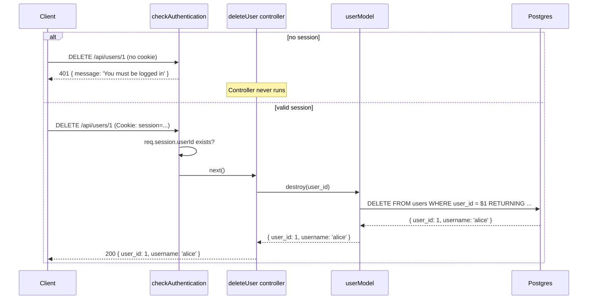

# 11. Authorization Middleware


Follow along with code examples [here](https://github.com/The-Marcy-Lab-School/6-11-authorization-middleware)!


Authentication answers "who are you?" Authorization answers "what are you allowed to do?" In lesson 8, we noted that the `PATCH /api/users/:user_id` and `DELETE /api/users/:user_id` endpoints were intentionally unprotected — anyone could modify or delete any user without being logged in. This lesson fixes that by using middleware to enforce authorization.

**Table of Contents**

- [Essential Questions](#essential-questions)
- [Key Concepts](#key-concepts)
- [Authentication vs. Authorization](#authentication-vs-authorization)
- [The Problem: Unprotected Endpoints](#the-problem-unprotected-endpoints)
- [Writing Authorization Middleware](#writing-authorization-middleware)
  - [The `checkAuthentication` Middleware](#the-checkauthentication-middleware)
  - [Applying It to Routes](#applying-it-to-routes)
  - [Applying It to a Group of Routes](#applying-it-to-a-group-of-routes)
- [Ownership-Based Authorization](#ownership-based-authorization)
- [Testing Protected Routes with curl](#testing-protected-routes-with-curl)
- [The Complete Auth Picture](#the-complete-auth-picture)

## Essential Questions

By the end of this lesson, you should be able to answer these questions:

1. What is the difference between authentication and authorization?
2. What problem does authorization middleware solve? Why not just put the check inside every controller?
3. How does middleware use `next()` to either continue the request or short-circuit it?
4. How do you protect a single route vs. a group of routes?
5. What is ownership-based authorization? How do you implement it?
6. When should you return `401` vs. `403`?

## Key Concepts

* **Authentication** — verifying *who you are* (proving your identity, typically through login).
* **Authorization** — determining *what you're allowed to do* (checking permissions after identity is established).
* **Protected route** — an endpoint that requires a valid session to access.
* **`checkAuthentication` middleware** — a custom middleware function that checks for a valid session and either allows the request to continue (`next()`) or sends a `401` and stops.
* **Ownership** — a resource that belongs to a specific user. Ownership authorization confirms the logged-in user owns the resource before allowing modifications.
* **`401 Unauthorized`** — "I don't know who you are. Log in."
* **`403 Forbidden`** — "I know who you are, but you can't do this."

## Authentication vs. Authorization

These two terms are related but distinct:

|                       | Authentication              | Authorization                               |
| --------------------- | --------------------------- | ------------------------------------------- |
| **Question**          | Who are you?                | What are you allowed to do?                 |
| **How**               | Login (username + password) | Session check + permission check            |
| **Status on failure** | 401 Unauthorized            | 403 Forbidden                               |
| **Comes first?**      | Yes                         | After authentication                        |
| **Example**           | Logging into an app         | Editing *your own* post, not someone else's |

Authentication always comes first. You can't authorize someone whose identity you haven't verified.

**<details><summary>Q: A logged-in user tries to delete another user's account. Is this an authentication failure or an authorization failure?</summary>**

**Authorization failure.** The user is authenticated — we know who they are (they have a valid session). But they don't have *permission* to delete someone else's account. The server should return `403 Forbidden`, not `401 Unauthorized`.

* `401` — "I don't know who you are. Log in."
* `403` — "I know who you are, but you can't do this."

</details>

## The Problem: Unprotected Endpoints

Without authorization middleware, every endpoint is public:

```js
// Anyone can do this — logged in or not
app.delete('/api/users/:user_id', deleteUser);
```

A user who knows the URL can delete accounts without being logged in. You might be tempted to handle this inside each controller:

```js
const deleteUser = async (req, res, next) => {
  // Checking auth inside every controller — repetitive
  if (!req.session.userId) {
    return res.status(401).send({ message: 'Must be logged in' });
  }
  // ... rest of delete logic
};
```

This works, but if you have many protected endpoints, you'd write the same check repeatedly. Middleware solves this by extracting the check into a single reusable function.

## Writing Authorization Middleware

### The `checkAuthentication` Middleware

Authorization middleware is a regular Express function — it receives `req`, `res`, and `next`. The key behavior:

* **If the session is valid:** call `next()` to pass control to the next middleware or controller
* **If the session is missing:** send a `401` and stop — the controller never runs

```js
// middleware/checkAuthentication.js
const checkAuthentication = (req, res, next) => {
  const { userId } = req.session;

  if (!userId) {
    return res.status(401).send({ message: 'You must be logged in to do that.' });
  }

  next(); // session is valid — continue to the controller
};

module.exports = checkAuthentication;
```

**<details><summary>Q: What happens if you forget to call `next()` when the session is valid?</summary>**

The request hangs. The middleware returns without sending a response or calling `next()`, so Express doesn't know what to do next. The client's request will eventually time out. Every code path through middleware must either call `next()`, call `next(err)`, or send a response.

</details>

### Applying It to Routes

Pass the middleware as an argument between the path and the controller:

```js
const checkAuthentication = require('./middleware/checkAuthentication');

// Public — no middleware
app.get('/api/users', listUsers);

// Protected — must be logged in
app.patch('/api/users/:user_id', checkAuthentication, updateUser);
app.delete('/api/users/:user_id', checkAuthentication, deleteUser);
```

When a request hits `DELETE /api/users/1`:
1. Express calls `checkAuthentication`
2. If session is missing → `401`, stops here. `deleteUser` never runs.
3. If session is valid → `next()` is called, Express calls `deleteUser`



**<details><summary>Q: You have a user API where anyone can list users, but only logged-in users can update or delete. Which routes get the middleware?</summary>**

```js
// Public
app.get('/api/users', listUsers);

// Protected
app.patch('/api/users/:user_id', checkAuthentication, updateUser);
app.delete('/api/users/:user_id', checkAuthentication, deleteUser);
```

Only the write operations require authentication. The read-only endpoint remains public.

</details>

### Applying It to a Group of Routes

If you have many routes that all require authentication, you can apply the middleware with a path prefix using `app.use()`. Any route that starts with that path will pass through the middleware first:

```js
// All routes under /api/admin require authentication
app.use('/api/admin', checkAuthentication);

app.get('/api/admin/users', listUsers);
app.delete('/api/admin/users/:user_id', deleteUser);
```

Routes under other paths are unaffected.

## Ownership-Based Authorization

Being logged in is the first check. But some actions require that you own the resource. A logged-in user shouldn't be able to edit or delete someone else's account.

Ownership authorization goes inside the controller, after `checkAuthentication` has confirmed the user is logged in:

```js
// controllers/userControllers.js
const userModel = require('../models/userModel');

const updateUser = async (req, res, next) => {
  try {
    const userId = Number(req.params.user_id);

    // Ownership check — logged-in user can only update their own account
    if (userId !== req.session.userId) {
      return res.status(403).send({ message: 'You can only update your own account.' });
    }

    const { password } = req.body;
    const user = await userModel.update(userId, password);

    if (!user) return res.status(404).send({ message: 'User not found' });
    res.send(user);
  } catch (err) {
    next(err);
  }
};

const deleteUser = async (req, res, next) => {
  try {
    const userId = Number(req.params.user_id);

    // Ownership check
    if (userId !== req.session.userId) {
      return res.status(403).send({ message: 'You can only delete your own account.' });
    }

    const user = await userModel.destroy(userId);
    if (!user) return res.status(404).send({ message: 'User not found' });
    res.send(user);
  } catch (err) {
    next(err);
  }
};
```

The flow for a valid ownership check:
1. `checkAuthentication` confirms `req.session.userId` exists
2. The controller converts the route param to a number: `Number(req.params.user_id)`
3. If `userId !== req.session.userId` → `403 Forbidden`
4. If they match → proceed


Route params (`req.params.user_id`) are always strings. `req.session.userId` is the number you stored at login. Use `Number()` to convert before comparing with `!==`.


**<details><summary>Q: Why does ownership authorization return `403` instead of `401`?</summary>**

Because the user *is* authenticated — we know who they are. `401` specifically means "I don't know who you are, please log in." Since we do know who they are and are denying them based on permissions, the correct code is `403 Forbidden`.

</details>

**<details><summary>Q: Could you extract the ownership check into its own middleware? What would that look like?</summary>**

You could, but it becomes complex quickly — ownership middleware needs to know which model to query and which field to compare. A factory function is one approach:

```js
const checkOwnership = (getResource) => async (req, res, next) => {
  try {
    const resource = await getResource(req);
    if (!resource) return res.status(404).send({ message: 'Not found' });
    if (resource.user_id !== req.session.userId) {
      return res.status(403).send({ message: 'Forbidden' });
    }
    req.resource = resource; // make it available to the controller
    next();
  } catch (err) {
    next(err);
  }
};
```

For most apps, handling ownership directly in the controller is simpler and perfectly fine. Use a dedicated middleware only when the same ownership check appears across many controllers.

</details>

## Testing Protected Routes with curl

When testing protected routes, you need an active session cookie. The workflow:

```sh
# Step 1: Login and capture the cookie
curl -c cookies.txt -X POST http://localhost:3000/api/auth/login \
  -H 'Content-Type: application/json' \
  -d '{"username": "alice", "password": "password123"}'

# Step 2: Use the cookie on a protected route
curl -b cookies.txt -X PATCH http://localhost:3000/api/users/1 \
  -H 'Content-Type: application/json' \
  -d '{"password": "newpassword"}'

# Step 3: Test without the cookie — expect 401
curl -X PATCH http://localhost:3000/api/users/1 \
  -H 'Content-Type: application/json' \
  -d '{"password": "newpassword"}'
```

`-c cookies.txt` saves the session cookie to a file. `-b cookies.txt` sends it with subsequent requests. This mirrors exactly how a browser behaves.

## The Complete Auth Picture

Here is the full authentication and authorization system built across lessons 9–11:

```
POST   /api/auth/register  → hash password, create user, set session
POST   /api/auth/login     → validate credentials, set session
GET    /api/auth/me        → return current user from session (or 401)
DELETE /api/auth/logout    → clear session

GET    /api/users          → public (no middleware)
PATCH  /api/users/:user_id → checkAuthentication → updateUser (+ ownership check)
DELETE /api/users/:user_id → checkAuthentication → deleteUser (+ ownership check)
```

In `index.js`:

```js
const checkAuthentication = require('./middleware/checkAuthentication');
const { register, login, getMe, logout } = require('./controllers/authControllers');
const { listUsers, updateUser, deleteUser } = require('./controllers/userControllers');

// ---- Auth Routes (public) ----
app.post('/api/auth/register', register);
app.post('/api/auth/login', login);
app.get('/api/auth/me', getMe);
app.delete('/api/auth/logout', logout);

// ---- User Routes ----
app.get('/api/users', listUsers);
app.patch('/api/users/:user_id', checkAuthentication, updateUser);
app.delete('/api/users/:user_id', checkAuthentication, deleteUser);
```

The next lesson brings the frontend into the picture: a complete fullstack Vanilla JS app using these endpoints.
