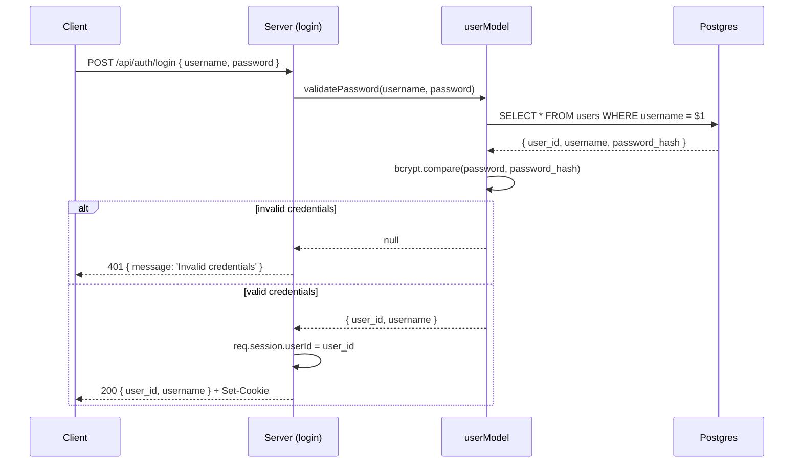
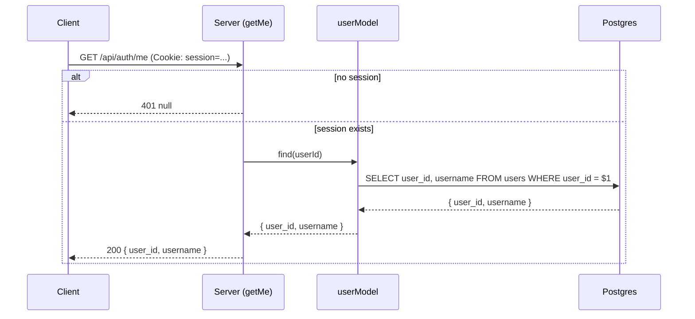

# 11. Sessions and Login


Follow along with code examples [here](https://github.com/The-Marcy-Lab-School/6-11-sessions-and-login)!


In lesson 10, you built a registration endpoint that hashes passwords and stores a new user. But the server doesn't yet remember them — the response goes out and the server immediately forgets everything. This lesson introduces **sessions** and **cookies** to solve that, and uses them to add auto-login on register, login, `/api/auth/me`, and logout.

**Table of Contents**

- [Essential Questions](#essential-questions)
- [Key Concepts](#key-concepts)
- [The Problem: HTTP is Stateless](#the-problem-http-is-stateless)
- [The Solution: Sessions and Cookies](#the-solution-sessions-and-cookies)
  - [How Cookie-Based Sessions Work](#how-cookie-based-sessions-work)
- [Setting Up `cookie-session`](#setting-up-cookie-session)
- [Auto-Login on Register](#auto-login-on-register)
- [Building the Login Endpoint](#building-the-login-endpoint)
  - [The Login Flow](#the-login-flow)
  - [The Login Controller](#the-login-controller)
- [The `/api/auth/me` Pattern](#the-apiauthme-pattern)
- [Logout](#logout)
- [Putting It Together: Auth Endpoints](#putting-it-together-auth-endpoints)

## Essential Questions

By the end of this lesson, you should be able to answer these questions:

1. What does it mean that HTTP is stateless? Why is that a problem for login?
2. What is a session? What is a cookie? How do they work together?
3. What does `cookie-session` do? What does `req.session` give you access to?
4. What does "auto-login on register" mean? How is it implemented?
5. What is the login flow, step by step?
6. What is the `/api/auth/me` pattern? Why is it useful for frontends?
7. How do you implement logout with `cookie-session`?

## Key Concepts

* **Stateless** — HTTP is stateless: every request is independent. The server has no memory of previous requests from the same client.
* **Session** — a way for the server to persist information across multiple requests from the same user, typically by storing it server-side and giving the client a token to identify the session.
* **Cookie** — a small piece of data set by a server and automatically sent by the browser with every subsequent request to that domain.
* **`cookie-session`** — an npm package that stores session data directly in an encrypted, signed cookie (no server-side session store needed).
* **`req.session`** — the session object provided by `cookie-session`. You can read from and write to it inside any controller or middleware.
* **Auto-login on register** — setting `req.session.userId` immediately after a successful registration so the user is logged in without a separate login request.
* **`userModel.validatePassword(username, password)`** — the model method from lesson 10 that handles the username lookup and bcrypt comparison internally. Returns `{ user_id, username }` or `null`.
* **`/api/auth/me`** — a convention for an endpoint that returns the currently logged-in user based on the session.

## The Problem: HTTP is Stateless

HTTP is a **stateless** protocol. Every request your server receives is completely independent — the server has no memory of previous requests.

```
Client → POST /api/auth/login { username, password }
Server → 200 OK { user_id: 7, username: 'alice' }

Client → GET /api/auth/me
Server → ??? I've never seen this person before.
```

After a user logs in, the server processes the login request, sends back a response, and immediately forgets everything. The next request arrives as if the login never happened.

**<details><summary>Q: Why doesn't the server just save the user ID in a JavaScript variable after login?</summary>**

A JavaScript variable in your server code is shared across *all* users. Setting `let currentUser = user` after login would overwrite the previous user's session every time anyone logged in. There's no way to associate a server-side variable with a specific browser connection — HTTP doesn't maintain persistent connections between requests.

</details>

## The Solution: Sessions and Cookies

The solution is **sessions**: the server associates some data (like a user ID) with a specific client, and gives the client a **cookie** — a small token that the browser automatically includes with every subsequent request.

### How Cookie-Based Sessions Work

```
1. User submits login credentials
   Client → POST /api/auth/login { username, password }

2. Server verifies credentials
   Server: "That's alice. Her user_id is 7."

3. Server sets a session cookie in the response
   Server → Set-Cookie: session=<encrypted data>
   (The encrypted data contains { userId: 7 })

4. Browser stores the cookie automatically

5. User makes another request
   Client → GET /api/auth/me
             Cookie: session=<encrypted data>   ← sent automatically

6. Server reads the cookie and decrypts it
   Server: "The cookie says userId is 7. That's alice."
   Server → alice's user data
```

The cookie is sent automatically by the browser with every request to the same domain — no extra frontend code needed.

**<details><summary>Q: What is the difference between a session stored in a cookie and a session stored in a database?</summary>**

* **Cookie-based sessions** (`cookie-session`): session data is encrypted and stored in the cookie itself. No server-side storage needed. Simpler to set up, but limited in size and harder to invalidate (the server doesn't track sessions).

* **Database-backed sessions** (`express-session` with a store): the server stores session data in a database or Redis and puts only a session ID in the cookie. More flexible — no size limit, and you can explicitly delete sessions — but requires additional infrastructure.

For learning and small apps, `cookie-session` is sufficient. Production applications often use database-backed sessions.

</details>

## Setting Up `cookie-session`

Install the package:

```sh
npm install cookie-session
```

Add it to your Express app as middleware, before your routes:

```js
require('dotenv').config();
const cookieSession = require('cookie-session');

app.use(cookieSession({
  name: 'session',
  secret: process.env.SESSION_SECRET,
  maxAge: 24 * 60 * 60 * 1000, // 24 hours in milliseconds
}));
```

Add `SESSION_SECRET` to your `.env` file:

```
SESSION_SECRET=some-long-random-secret-string
```


The `secret` is used to sign the cookie, which prevents tampering. It must be kept private — never commit it to GitHub. Use a long, random string in production.


Once this middleware is in place, `req.session` is available in every controller. You can read from it and write to it:

```js
// Writing to the session (sets a cookie in the response)
req.session.userId = 7;

// Reading from the session (reads from the incoming cookie)
const userId = req.session.userId; // 7

// Clearing the session (removes the cookie)
req.session = null;
```

## Auto-Login on Register

Now that `req.session` is available, we can update the registration controller from lesson 10 to start a session immediately after creating the user. This way, a user who registers is automatically logged in — they don't have to submit a second form.

```js
const register = async (req, res, next) => {
  try {
    const { username, password } = req.body;

    const existingUser = await userModel.findByUsername(username);
    if (existingUser) {
      return res.status(409).send({ message: 'Username already taken' });
    }

    const user = await userModel.create(username, password);

    // Start a session — the user is now logged in
    req.session.userId = user.user_id;

    res.status(201).send(user);
  } catch (err) {
    next(err);
  }
};
```

The one new line — `req.session.userId = user.user_id` — tells `cookie-session` to set an encrypted cookie containing the user's ID. Every subsequent request from that browser will include that cookie, and `req.session.userId` will be available in any controller.

## Building the Login Endpoint

### The Login Flow

Login has three steps:

1. Call `userModel.validatePassword(username, password)` — this finds the user and compares the password against the stored hash in one step
2. If it returns `null`, the credentials are invalid — return `401`
3. If it returns a user, set the session and return the user

### The Login Controller

```js
// controllers/authControllers.js
const userModel = require('../models/userModel');

const login = async (req, res, next) => {
  try {
    const { username, password } = req.body;

    // Step 1: Validate the credentials (findByUsername + bcrypt.compare in one call)
    const user = await userModel.validatePassword(username, password);

    // Step 2: If invalid, return 401 — same message for wrong username and wrong password
    if (!user) {
      return res.status(401).send({ message: 'Invalid credentials' });
    }

    // Step 3: Credentials are valid — start a session
    req.session.userId = user.user_id;

    res.send({ user_id: user.user_id, username: user.username });
  } catch (err) {
    next(err);
  }
};
```


Both "user not found" and "wrong password" return the same `401 Invalid credentials`. This is intentional — telling an attacker whether a username exists gives them information. Always use the same generic message for both failure cases.


Notice how clean the login controller is compared to lesson 8's naive version. It doesn't touch `bcrypt` directly — `userModel.validatePassword()` handles the hash comparison internally. The controller only sees `{ user_id, username }` or `null`.



## The `/api/auth/me` Pattern

When a user returns to your app after previously logging in, their session cookie is still in their browser. The frontend needs a way to ask: "Am I still logged in? Who am I?"

The `/api/auth/me` endpoint handles this:

```js
const getMe = async (req, res, next) => {
  try {
    const { userId } = req.session;

    // No session — user is not logged in
    if (!userId) return res.status(401).send(null);

    // Session exists — look up and return the user
    const user = await userModel.find(userId);
    if (!user) return res.status(401).send(null);

    res.send({ user_id: user.user_id, username: user.username });
  } catch (err) {
    next(err);
  }
};
```

The frontend calls `GET /api/auth/me` when the app loads. If the response is `200`, the user is logged in. If it's `401`, the app shows the login screen.

```js
// public/app.js
const checkLoginStatus = async () => {
  const response = await fetch('/api/auth/me');
  if (response.ok) {
    const user = await response.json();
    renderLoggedInView(user);
  } else {
    renderLoginForm();
  }
};

checkLoginStatus();
```



**<details><summary>Q: Why call `/api/auth/me` on every page load instead of just after login?</summary>**

When a user logs in and is redirected to a new page, that page loads fresh — it doesn't inherit any JavaScript state from the login page. Calling `/api/auth/me` on every page load lets the app determine the current auth state from the session, regardless of how the user arrived at the page.

</details>

## Logout

Logout clears the session:

```js
const logout = (req, res) => {
  req.session = null; // tells cookie-session to delete the cookie
  res.send({ message: 'Logged out' });
};
```

Setting `req.session = null` tells `cookie-session` to remove the cookie from the browser. On the next request, `req.session.userId` will be `undefined`.

**<details><summary>Q: A user logs out, but they saved their session cookie before logging out and manually restore it in their browser. Can they log back in?</summary>**

With `cookie-session` (client-side sessions), yes — in theory. Because `cookie-session` doesn't maintain a server-side session store, it can't invalidate old cookies after they're issued. Setting `req.session = null` clears the cookie from the browser, but a saved copy of the old cookie value would still work.

This is a known limitation of client-side sessions. Mitigations include short `maxAge` values and rotating the `SESSION_SECRET` to invalidate all existing cookies at once. For production applications handling sensitive data, server-side sessions (`express-session` with a database store) are more appropriate.

</details>

## Putting It Together: Auth Endpoints

Here is the complete set of auth controllers:

```js
// controllers/authControllers.js
const userModel = require('../models/userModel');

const register = async (req, res, next) => {
  try {
    const { username, password } = req.body;
    const existingUser = await userModel.findByUsername(username);
    if (existingUser) return res.status(409).send({ message: 'Username already taken' });
    const user = await userModel.create(username, password);
    req.session.userId = user.user_id;
    res.status(201).send(user);
  } catch (err) {
    next(err);
  }
};

const login = async (req, res, next) => {
  try {
    const { username, password } = req.body;
    const user = await userModel.validatePassword(username, password);
    if (!user) return res.status(401).send({ message: 'Invalid credentials' });
    req.session.userId = user.user_id;
    res.send({ user_id: user.user_id, username: user.username });
  } catch (err) {
    next(err);
  }
};

const getMe = async (req, res, next) => {
  try {
    const { userId } = req.session;
    if (!userId) return res.status(401).send(null);
    const user = await userModel.find(userId);
    if (!user) return res.status(401).send(null);
    res.send({ user_id: user.user_id, username: user.username });
  } catch (err) {
    next(err);
  }
};

const logout = (req, res) => {
  req.session = null;
  res.send({ message: 'Logged out' });
};

module.exports = { register, login, getMe, logout };
```

And the corresponding routes in `index.js`:

```js
// ---- Auth Routes ----
app.post('/api/auth/register', register);
app.post('/api/auth/login', login);
app.get('/api/auth/me', getMe);
app.delete('/api/auth/logout', logout);
```

Here's a summary of the four auth endpoints:

| Method   | Endpoint              | What it does                                   |
| -------- | --------------------- | ---------------------------------------------- |
| `POST`   | `/api/auth/register`  | Hash password, create user, set session        |
| `POST`   | `/api/auth/login`     | Verify credentials, set session cookie         |
| `GET`    | `/api/auth/me`        | Return current user from session (or 401)      |
| `DELETE` | `/api/auth/logout`    | Clear the session cookie                       |

With these four endpoints, your application has a complete authentication system. The next lesson adds **authorization** — protecting routes so only authenticated users can access them.

**<details><summary>Q: A user visits your app for the first time. Walk through exactly which auth endpoints get called and when.</summary>**

1. **App loads** → frontend calls `GET /api/auth/me`
   - No session cookie exists
   - Server returns `401`
   - Frontend shows the login/register form

2. **User registers** → frontend calls `POST /api/auth/register`
   - Server hashes the password, creates the user
   - Server sets `req.session.userId` and returns the user
   - Frontend shows the logged-in view

3. **User returns the next day** → browser sends the session cookie automatically
   - Frontend calls `GET /api/auth/me`
   - Server reads `req.session.userId`, looks up the user
   - Frontend shows the logged-in view without requiring a new login

4. **User logs out** → frontend calls `DELETE /api/auth/logout`
   - Server sets `req.session = null`
   - Cookie is cleared
   - Frontend shows the login form

</details>
