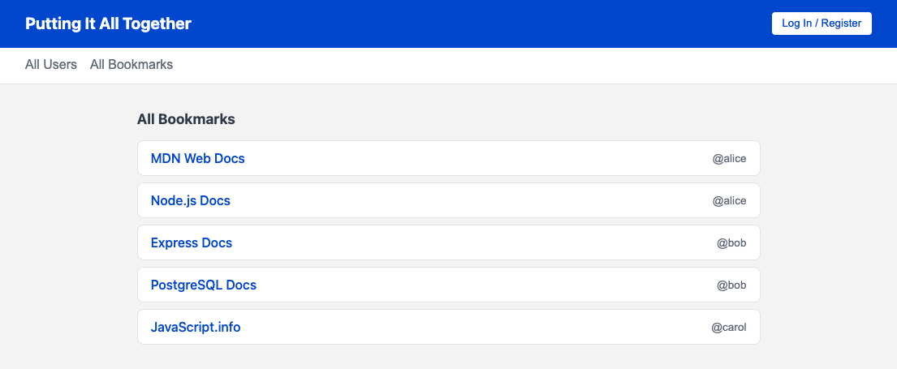
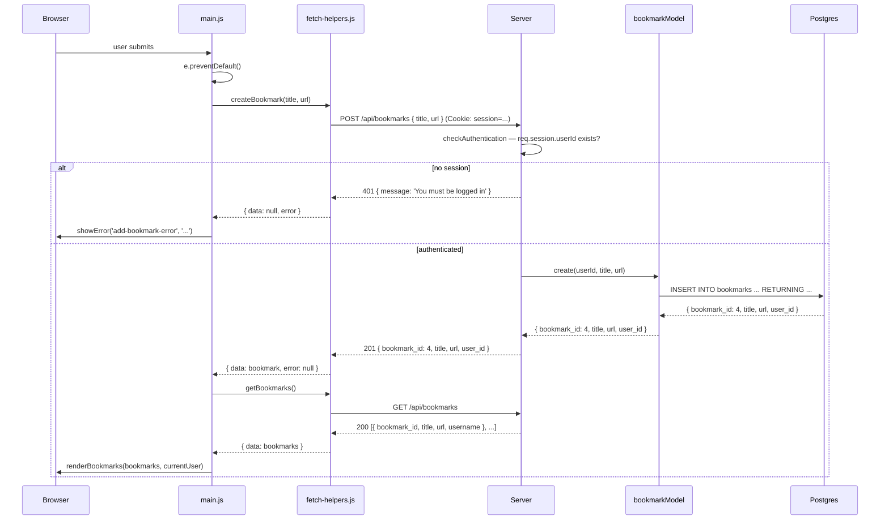

# 12. Adding User-Owned Resources


Follow along with code examples [here](https://github.com/The-Marcy-Lab-School/6-12-adding-user-owned-resources)!


Across lessons 8–11 you built a complete authentication and authorization system from scratch. This lesson reviews what you've built and why each piece matters, then extends the app with a new user-owned resource — bookmarks — using every pattern you've learned.

**Table of Contents**

- [Essential Questions](#essential-questions)
- [Key Concepts](#key-concepts)
- [Setup](#setup)
- [Review: What We've Built So Far](#review-what-weve-built-so-far)
  - [The Route List](#the-route-list)
- [Adding a User-Owned Resource: Bookmarks](#adding-a-user-owned-resource-bookmarks)
  - [Every Layer Changes](#every-layer-changes)
  - [Schema and Seeds](#schema-and-seeds)
  - [The Bookmark Model](#the-bookmark-model)
  - [Bookmark Controllers and Routes](#bookmark-controllers-and-routes)
    - [Adding Ownership Checks](#adding-ownership-checks)
    - [Adding Routes](#adding-routes)
- [Updating the Frontend](#updating-the-frontend)
  - [Fetch Helpers](#fetch-helpers)
  - [DOM Helpers](#dom-helpers)
  - [Main](#main)
- [The Complete Picture](#the-complete-picture)

## Essential Questions

By the end of this lesson, you should be able to answer these questions:

1. When adding a new user-owned resource, which layers of the app need to change? How does each layer change and in what order?
2. When a model method needs data from two tables, what SQL clause do you use?
3. How do you check ownership for a resource like bookmarks in a manner that can be fully trusted?
4. What should happen to user-owned resources likes bookmarks when the associated user is deleted?

## Key Concepts

* **Foreign key** — a column in one table that references the primary key of another table, creating a relationship between rows.
* **`ON DELETE CASCADE`** — a foreign key option that automatically deletes related rows when the referenced row is deleted. Deleting a user deletes all their bookmarks.
* **`JOIN`** — a SQL clause that combines rows from two tables based on a matching column. Used here to attach a `username` to each bookmark row without storing it in the `bookmarks` table.

## Setup

1. Edit `server/db/pool.js` and update the user and password fields to match your local Postgres setup (On macOS you may be able to delete those fields entirely)

2. Run these commands to set up the database, seed, and start the server:

```sh
cd server

# Install dependencies
npm install

# Create the database (run once)
createdb users_db           # Mac
sudo -u postgres createdb users_db   # Windows/WSL

# Seed the database
npm run db:seed

# Start the server
npm run dev
```

## Review: What We've Built So Far

Here is a summary of the system built across lessons 8–11. Each lesson added one layer to the stack.

| Lesson | What changed                                                                                                               | Key idea                                                          |
| ------ | -------------------------------------------------------------------------------------------------------------------------- | ----------------------------------------------------------------- |
| **8**  | Swapped in-memory model for Postgres; added register and login controllers                                                 | MVC model swap — controllers and routes never changed             |
| **9**  | Added `bcrypt.hash()` on create/update; `bcrypt.compare()` on login; renamed column to `password_hash`                     | Passwords must never be stored in plaintext                       |
| **10** | Added `cookie-session`; set `req.session.userId` on login/register; added `GET /api/auth/me` and `DELETE /api/auth/logout` | Sessions let the server remember who is logged in across requests |
| **11** | Added `checkAuthentication` middleware; added ownership checks in `updateUser` and `deleteUser`                            | Authentication gates entry; ownership gates modifications         |

### The Route List

By the end of lesson 11, the app has these routes:

```
POST   /api/auth/register  → hash password, create user, set session
POST   /api/auth/login     → validate credentials, set session
GET    /api/auth/me        → return current user from session (or 401)
DELETE /api/auth/logout    → clear session

GET    /api/users          → public
PATCH  /api/users/:user_id → checkAuthentication → updateUser (+ ownership)
DELETE /api/users/:user_id → checkAuthentication → deleteUser (+ ownership)
```

This lesson adds four more for a new resource that every user can create: bookmarks.

## Adding a User-Owned Resource: Bookmarks

With the foundation of our codebase set, you're ready to add bookmarks. A bookmark is a titled URL saved by a specific user. Users can view all bookmarks in a public feed, view any user's profile to see their bookmarks, and create or delete their own.



### Every Layer Changes

One of the most important things to internalize as a full-stack developer is that adding a new resource isn't a one-file change — it touches every layer of the application:


Every layer in the application needs an update. The order in which you build them matters too: start from the right (the database) and work your back to the browser, so each layer has something to build on before you need it.

| Order | Layer                    | What changes                                                                                       |
| ----- | ------------------------ | -------------------------------------------------------------------------------------------------- |
| 1     | **Schema / Seeds**       | New `bookmarks` table with a FK to `users` and seed bookmark rows                                  |
| 2     | **Model methods**        | New file `bookmarkModel.js` with query methods for list, listByUser, create, find, update, destroy |
| 3     | **Controllers + Routes** | New file `bookmarkControllers.js` and wire up bookmark routes in `index.js`                        |
| 4     | **Fetch helpers**        | New functions in `fetch-helpers.js` to call the bookmark endpoints                                 |
| 5     | **Main**                 | New event listeners and a `showProfile` navigation helper in `main.js`                             |
| 6     | **HTML / CSS**           | New bookmarks section and restructured profile section in `index.html`                             |
| 7     | **DOM helpers**          | New render functions in `dom-helpers.js` for bookmark cards and the updated profile view           |

Work through each layer below. Four of them have a challenge — these are the moments where the pattern is new enough that writing it yourself builds the most understanding.

### Schema and Seeds

Bookmarks belong to users, so the `bookmarks` table needs a **foreign key** to create this relationship. 

**🔎 Challenge 1: Write the `bookmarks` table**

Inside the `seed.js` file, use what you know about the `users` table to write the `CREATE TABLE` statement for `bookmarks`. The table needs:
- A primary key
- A `title` and `url` that cannot be null
- A `user_id` column that references `users(user_id)`

Consider: what should happen to a user's bookmarks when that user is deleted? Look up what `ON DELETE CASCADE` does in SQL.

**<details><summary>Solution</summary>**

```js
await pool.query(`
  CREATE TABLE bookmarks (
    bookmark_id  SERIAL PRIMARY KEY,
    title        TEXT NOT NULL,
    url          TEXT NOT NULL,
    user_id      INTEGER REFERENCES users(user_id) ON DELETE CASCADE
  )
`);
```

Here `user_id` references `users(user_id)`, telling Postgres that every bookmark must be owned by a real user.

`ON DELETE CASCADE` means Postgres automatically deletes a user's bookmarks when that user is deleted. Without it, trying to delete a user who has bookmarks would fail with a foreign key violation.

</details>

**Additional Changes:**

1. The seed file also needs to drop and create the tables in the right order. Because `bookmarks` has a foreign key pointing at `users`, you can't drop `users` while `bookmarks` still references it — you'd get a constraint violation. You must drop dependent tables first:

    ```js
    // Drop in reverse dependency order
    await pool.query('DROP TABLE IF EXISTS bookmarks');
    await pool.query('DROP TABLE IF EXISTS users');
    ```

2. Then create them in forward order (`users` first, so `bookmarks` can reference it).

3. Finally, to seed bookmarks you need the `user_id` values that Postgres generated for your seed users. Adding `RETURNING user_id` to the insert query gives you those values without a separate lookup:

    ```js
    // 1. Hash the passwords first
    const aliceHash = await bcrypt.hash('password123', SALT_ROUNDS);
    const bobHash = await bcrypt.hash('hunter2', SALT_ROUNDS);
    const carolHash = await bcrypt.hash('opensesame', SALT_ROUNDS);

    // 2. Define a SQL query string that returns the user_id
    const insertUserSql = 'INSERT INTO users (username, password_hash) VALUES ($1, $2) RETURNING user_id;';

    // 3. Execute queries and store the full result objects
    const aliceResponse = await pool.query(insertUserSql, ['alice', aliceHash]);
    const bobResponse = await pool.query(insertUserSql, ['bob', bobHash]);
    const carolResponse = await pool.query(insertUserSql, ['carol', carolHash]);

    // 4. Extract the IDs for later use (e.g., seeding bookmarks)
    const aliceId = aliceResponse.rows[0].user_id;
    const bobId = bobResponse.rows[0].user_id;
    const carolId = carolResponse.rows[0].user_id;

    // NEW: seed some bookmarks so the app has data to display on first load
    const bookmarkQuery = 'INSERT INTO bookmarks (user_id, title, url) VALUES ($1, $2, $3)';
    await pool.query(bookmarkQuery, [aliceId, 'MDN Web Docs', 'https://developer.mozilla.org']);
    await pool.query(bookmarkQuery, [aliceId, 'Node.js Docs', 'https://nodejs.org/en/docs']);
    await pool.query(bookmarkQuery, [bobId, 'Express Docs', 'https://expressjs.com']);
    await pool.query(bookmarkQuery, [bobId, 'PostgreSQL Docs', 'https://www.postgresql.org/docs']);
    await pool.query(bookmarkQuery, [carolId, 'JavaScript.info', 'https://javascript.info']);
    ```


**<details><summary>🔍 Investigation: What happens if you swap the DROP TABLE order?</summary>**

Look at the order the tables are dropped in the seed file. What would happen if you swapped the two `DROP TABLE` lines so that `users` was dropped before `bookmarks`?

The `bookmarks` table has a `user_id` column that references `users(user_id)`, so Postgres won't allow `users` to be dropped while `bookmarks` still depends on it. You'd get a foreign key violation error. You always have to drop the dependent table first.

</details>

**<details><summary>🔍 Investigation: What breaks if you remove `ON DELETE CASCADE`?</summary>**

Imagine you removed `ON DELETE CASCADE` from the `bookmarks` table definition. Describe what would break in two separate scenarios: (1) running `npm run db:seed`, and (2) a logged-in user clicking "Delete My Account" in the running app.

(1) The seed script drops and re-creates the tables on every run. Without `CASCADE`, `DROP TABLE IF EXISTS users` would fail with a foreign key violation any time bookmark rows already exist — Postgres refuses to drop a table that other rows are still pointing at.

(2) In the running app, `DELETE FROM users WHERE user_id = $1` would also fail with a foreign key violation if that user has any bookmarks. `ON DELETE CASCADE` tells Postgres to automatically delete all of a user's bookmarks when the user is deleted, solving both problems.

</details>

---

### The Bookmark Model

The bookmark model follows the same conventions as `userModel.js`: every method returns data or `null`, uses parameterized queries, and never exposes more data than necessary.

This app has two list methods with different purposes:

- `listByUser(user_id)` — returns bookmarks for one specific user. Used when rendering a user's profile.
- `list()` — returns *all* bookmarks for the public feed. Because this is shown to anyone, each bookmark also needs to display who posted it — which means joining the `users` table to get the `username`.

`listByUser` is the simpler of the two:

```js
// Returns all bookmarks for a specific user
module.exports.listByUser = async (user_id) => {
  const query = `
    SELECT bookmark_id, title, url, user_id
    FROM bookmarks
    WHERE user_id = $1
    ORDER BY bookmark_id
  `;
  const { rows } = await pool.query(query, [user_id]);
  return rows;
};
```

---

**🔎 Challenge 2: Write `list()` with a JOIN**

`list()` needs to return every bookmark across all users, but also include the `username` of whoever posted it. A `SELECT * FROM bookmarks` won't give you `username` — that lives in the `users` table.

Complete the query in `list` so that each returned row includes `bookmark_id`, `title`, `url`, `user_id`, and `username`.

**<details><summary>Solution</summary>**

```js
// Returns all bookmarks joined with the username of the owner
module.exports.list = async () => {
  const query = `
    SELECT bookmarks.bookmark_id, bookmarks.title, bookmarks.url, bookmarks.user_id, users.username
    FROM bookmarks
    JOIN users ON bookmarks.user_id = users.user_id
    ORDER BY bookmarks.bookmark_id
  `;
  const { rows } = await pool.query(query);
  return rows;
};
```

The `JOIN` connects each bookmark row to its matching user row on `user_id`, making `username` available in the result. Without it, the public feed would only have a `user_id` number — not a human-readable name.

</details>

---

The remaining model methods — `create`, `find`, `update`, and `destroy` — follow the same patterns you've seen in `userModel.js`. One worth noting is `find`: it's used by the update and delete controllers to look up a bookmark's owner *before* deciding whether the request is allowed.


```js
// Creates a bookmark owned by the given user
module.exports.create = async (user_id, title, url) => {
  const query = `
    INSERT INTO bookmarks (user_id, title, url)
    VALUES ($1, $2, $3)
    RETURNING bookmark_id, title, url, user_id
  `;
  const { rows } = await pool.query(query, [user_id, title, url]);
  return rows[0];
};

// Looks up a single bookmark — used to check ownership before update/delete
module.exports.find = async (bookmark_id) => {
  const query = 'SELECT bookmark_id, title, url, user_id FROM bookmarks WHERE bookmark_id = $1';
  const { rows } = await pool.query(query, [bookmark_id]);
  return rows[0] || null;
};

// Updates title and url, returns the updated row or null
module.exports.update = async (bookmark_id, title, url) => {
  const query = `
    UPDATE bookmarks
    SET title = $1, url = $2
    WHERE bookmark_id = $3
    RETURNING bookmark_id, title, url, user_id
  `;
  const { rows } = await pool.query(query, [title, url, bookmark_id]);
  return rows[0] || null;
};

// Deletes a bookmark, returns the deleted row or null
module.exports.destroy = async (bookmark_id) => {
  const query = `
    DELETE FROM bookmarks
    WHERE bookmark_id = $1
    RETURNING bookmark_id, title, url, user_id
  `;
  const { rows } = await pool.query(query, [bookmark_id]);
  return rows[0] || null;
};
```


### Bookmark Controllers and Routes

There are five bookmark controllers. Two of them (`listBookmarks` and `listUserBookmarks`) are public and straightforward — they just call the model and send the result:


```js
const bookmarkModel = require('../models/bookmarkModel');

// GET /api/bookmarks — all bookmarks with owner username (public)
const listBookmarks = async (req, res, next) => {
  try {
    const bookmarks = await bookmarkModel.list();
    res.send(bookmarks);
  } catch (err) {
    next(err);
  }
};

// GET /api/users/:user_id/bookmarks — bookmarks for one user (public)
const listUserBookmarks = async (req, res, next) => {
  try {
    const userId = Number(req.params.user_id);
    const bookmarks = await bookmarkModel.listByUser(userId);
    res.send(bookmarks);
  } catch (err) {
    next(err);
  }
};
```


---

**🔎 Challenge 3: Write `createBookmark`**

Using `listBookmarks` as a guide, write the `createBookmark` controller for `POST /api/bookmarks { title, url }`. It should create a bookmark and send it back to the client. If an error occurs, pass it along to the error handling middleware with `next(err)`.

The controller `bookmarkModel.create(user_id, title, url)` can be given the `title` and `url` from the body, but where does the `user_id` come from?

- `req.body.user_id`?
- `req.params.user_id`?
- `req.session.userId`?

Think about which of these the server can trust, and which could be forged by the client.

**<details><summary>Solution</summary>**

```js
// POST /api/bookmarks { title, url }
const createBookmark = async (req, res, next) => {
  try {
    const { title, url } = req.body;
    const bookmark = await bookmarkModel.create(req.session.userId, title, url);
    res.status(201).send(bookmark);
  } catch (err) {
    next(err);
  }
};
```

`user_id` comes from `req.session.userId` — the session value set by the server when the user logged in. The client never supplies the owner. If you took `user_id` from `req.body` or `req.params` instead, any user could claim to be creating a bookmark on behalf of someone else. The server is the only trustworthy source of who is making the request.

</details>

---

#### Adding Ownership Checks

You've seen ownership checks before — in lesson 11's `updateUser` and `deleteUser`, the check was:

```js
if (req.params.user_id !== req.session.userId) { ... }
```

That worked because the URL `PATCH /api/users/:user_id` contained the `user_id` directly. For bookmarks, the URL `PATCH /api/bookmarks/:bookmark_id` only contains a `bookmark_id`. You have to look up who owns that bookmark in the database:

```js
// PATCH /api/bookmarks/:bookmark_id { title, url }
const updateBookmark = async (req, res, next) => {
  try {
    const bookmarkId = Number(req.params.bookmark_id);

    const existing = await bookmarkModel.find(bookmarkId);
    if (!existing) return res.status(404).send({ message: 'Bookmark not found' });

    if (existing.user_id !== req.session.userId) {
      return res.status(403).send({ message: 'You can only update your own bookmarks.' });
    }

    const { title, url } = req.body;
    const bookmark = await bookmarkModel.update(bookmarkId, title, url);
    res.send(bookmark);
  } catch (err) {
    next(err);
  }
};
```

**🔎 Challenge 4: Write `deleteBookmark`**

Implement the `deleteBookmark` controller using the same pattern

**<details><summary>Solution</summary>**

```js
// DELETE /api/bookmarks/:bookmark_id
const deleteBookmark = async (req, res, next) => {
  try {
    const bookmarkId = Number(req.params.bookmark_id);

    const existing = await bookmarkModel.find(bookmarkId);
    if (!existing) return res.status(404).send({ message: 'Bookmark not found' });

    if (existing.user_id !== req.session.userId) {
      return res.status(403).send({ message: 'You can only delete your own bookmarks.' });
    }

    const bookmark = await bookmarkModel.destroy(bookmarkId);
    res.send(bookmark);
  } catch (err) {
    next(err);
  }
};
```

</details>

---

#### Adding Routes

With all five controllers written, register their routes in `index.js`. The public GET routes don't need `checkAuthentication`. The write routes do — applied individually, since `GET /api/bookmarks` is public:


```js
const { listBookmarks, listUserBookmarks, createBookmark, updateBookmark, deleteBookmark } = require('./controllers/bookmarkControllers');

// Under user routes — returns bookmarks for one user
app.get('/api/users/:user_id/bookmarks', listUserBookmarks);

// Bookmark routes
app.get('/api/bookmarks', listBookmarks);                                    // public
app.post('/api/bookmarks', checkAuthentication, createBookmark);             // must be logged in
app.patch('/api/bookmarks/:bookmark_id', checkAuthentication, updateBookmark); // must be logged in + own
app.delete('/api/bookmarks/:bookmark_id', checkAuthentication, deleteBookmark); // must be logged in + own
```



**Why not `/api/users/:user_id/bookmarks` for all bookmark routes?**

You might expect user-owned resources to be nested under the user in every URL — `POST /api/users/:user_id/bookmarks`, `DELETE /api/users/:user_id/bookmarks/:bookmark_id`. This seems intuitive, but it introduces a redundancy problem.

For `POST /api/users/:user_id/bookmarks`, you'd still need to confirm `req.params.user_id === req.session.userId` — because a logged-in user could try to post a bookmark under a *different* user's ID. But `req.session.userId` already tells the server who the owner is. The `:user_id` URL param just adds something to validate that the session already knows.

For `DELETE /api/users/:user_id/bookmarks/:bookmark_id`, the same applies: the ownership check should use the database (`bookmark.user_id`) as the source of truth, not the URL — so the nested `:user_id` is again redundant.

The one exception is `GET /api/users/:user_id/bookmarks` — here, `:user_id` is doing real work by telling the server *whose* bookmarks to return, not asserting ownership.



**<details><summary>🔍 Investigation: Which bookmark routes need `checkAuthentication`, and why don't the GET routes need it?</summary>**

Look at the four bookmark routes:

```js
app.get('/api/bookmarks', listBookmarks);                                      // public
app.post('/api/bookmarks', checkAuthentication, createBookmark);               // must be logged in
app.patch('/api/bookmarks/:bookmark_id', checkAuthentication, updateBookmark); // must be logged in + own
app.delete('/api/bookmarks/:bookmark_id', checkAuthentication, deleteBookmark); // must be logged in + own
```

The two GET routes (`/api/bookmarks` and `/api/users/:user_id/bookmarks`) are public because they only *read* data — any visitor can see the bookmark feed or browse a user's profile without an account. There's no risk to a user's data.

The POST, PATCH, and DELETE routes all *write* data, so they need a verified identity first. `checkAuthentication` runs before the controller and returns 401 if there's no session — the controller never runs for an unauthenticated request. The ownership check inside the controller is a second, separate gate: you must be logged in *and* you must own the resource.

</details>

## Updating the Frontend

The frontend changes are given here rather than as challenges — the new patterns in play (event delegation, `data-*` attributes, the profile-for-any-user design) are meaningful, but the core concepts of this lesson live in the backend. Study this code and make sure you understand how each piece connects to the server changes above.

### Fetch Helpers

Four new functions cover the bookmark endpoints. `getUserBookmarks` sits under Users because it hits a user route:


```js
// Returns bookmarks for one user — used when rendering a profile
export const getUserBookmarks = (user_id) => {
  return handleFetch(`${baseURL}/users/${user_id}/bookmarks`);
};

// ============================================
// Bookmarks
// ============================================

// Returns all bookmarks with owner username — used for the public feed
export const getBookmarks = () => {
  return handleFetch(`${baseURL}/bookmarks`);
};

export const createBookmark = (title, url) => {
  const config = {
    method: 'POST',
    headers: { 'Content-Type': 'application/json' },
    body: JSON.stringify({ title, url }),
  };
  return handleFetch(`${baseURL}/bookmarks`, config);
};

export const deleteBookmark = (bookmark_id) => {
  return handleFetch(`${baseURL}/bookmarks/${bookmark_id}`, { method: 'DELETE' });
};
```


### DOM Helpers

Two new render functions are added. Because both the public feed and the profile section render bookmark cards, a shared private helper `createBookmarkCard` builds the `<li>` element in one place — the two exported functions just call it with different options:


```js
// Private helper — builds a single bookmark card element
// showByline: include the @username attribution (public feed only)
// showDelete: include the delete button (own bookmarks only)
const createBookmarkCard = (bookmark, showDelete = false, showByline = false) => {
  const li = document.createElement('li');
  li.className = 'bookmark-card';
  li.dataset.bookmarkId = bookmark.bookmark_id;
  li.dataset.userId = bookmark.user_id; // owner — lets delete handlers re-navigate without a state variable

  const link = document.createElement('a');
  link.href = bookmark.url;
  link.target = '_blank';
  link.rel = 'noopener noreferrer';
  link.textContent = bookmark.title;
  li.append(link);

  if (showByline) {
    const byline = document.createElement('span');
    byline.className = 'bookmark-byline';
    const usernameBtn = document.createElement('button');
    usernameBtn.className = 'username-link';
    usernameBtn.dataset.username = bookmark.username;
    usernameBtn.textContent = `@${bookmark.username}`;
    byline.append(usernameBtn);
    li.append(byline);
  }

  if (showDelete) {
    const deleteBtn = document.createElement('button');
    deleteBtn.className = 'delete-bookmark-btn';
    deleteBtn.textContent = 'Delete';
    li.append(deleteBtn);
  }

  return li;
};
```


**<details><summary>🔍 Investigation: Why isn't `createBookmarkCard` exported?</summary>**

`createBookmarkCard` is a *private helper* — it exists to avoid repeating the card-building logic inside `renderBookmarks` and `renderProfile`, but it's an implementation detail of this module. `main.js` never needs to call it directly; it just calls `renderBookmarks` or `renderProfile` and gets back a fully populated list.

Exporting it would expose an internal function that callers shouldn't depend on. If the card's HTML structure ever changed, you'd only need to update `createBookmarkCard` — not every file that imported it. Keeping it unexported makes that boundary explicit: this function belongs to `dom-helpers.js` and nothing else.

</details>


```js
// Renders the public bookmarks feed
// currentUser determines which cards get a delete button
export const renderBookmarks = (bookmarks, currentUser) => {
  bookmarksList.innerHTML = '';
  if (bookmarks.length === 0) {
    bookmarksList.innerHTML = 'No bookmarks added yet';
    return;
  }
  bookmarks.forEach((bookmark) => {
    const isBookmarkOwner = Boolean(currentUser && bookmark.user_id === currentUser.user_id);
    bookmarksList.append(createBookmarkCard(bookmark, isBookmarkOwner, true));
  });
};
```


**<details><summary>🔍 Investigation: What does `Boolean(currentUser && bookmark.user_id === currentUser.user_id)` evaluate to in each scenario?</summary>**

`showDelete` in `createBookmarkCard` expects a boolean — `true` shows the delete button, `false` hides it. The expression passed in is `Boolean(currentUser && bookmark.user_id === currentUser.user_id)`.

**Scenario 1: no one is logged in (`currentUser` is `null`)**

`null && ...` short-circuits immediately — the right side is never evaluated. The result is `null`. `Boolean(null)` is `false`. No delete buttons appear for any bookmark. This is correct: guests can't delete anything.

**Scenario 2: a user is logged in (`currentUser` is `{ user_id: 3, username: 'alice' }`)**

`currentUser` is truthy, so the `&&` evaluates the right side. If `bookmark.user_id === 3`, the expression is `Boolean(true)` → `true` — Alice's bookmark gets a delete button. If `bookmark.user_id !== 3`, the expression is `Boolean(false)` → `false` — no delete button for bookmarks she doesn't own.

`Boolean()` here makes the intent explicit: we're deliberately converting a potentially-null or boolean value into a guaranteed boolean before passing it as a flag argument.

</details>


```js
// Renders any user's profile — info, bookmarks, and (for own profile) settings
export const renderProfile = (user, bookmarks, isOwnProfile) => {
  profileUsername.textContent = user.username;
  profileUserId.textContent = user.user_id;

  profileBookmarksList.innerHTML = '';
  bookmarks.forEach((bookmark) => {
    profileBookmarksList.append(createBookmarkCard(bookmark, isOwnProfile));
  });

  if (isOwnProfile) {
    ownProfileSettings.classList.remove('hidden');
  } else {
    ownProfileSettings.classList.add('hidden');
  }
};
```


`renderAuthView` is also updated to show or hide the add-bookmark form and the "My Profile" nav button depending on whether a user is logged in:

```js
export const renderAuthView = (currentUser) => {
  if (currentUser) {
    // ...
    showProfileBtn.classList.remove('hidden');
    addBookmarkForm.classList.remove('hidden');
  } else {
    // ...
    showProfileBtn.classList.add('hidden');
    profileSection.classList.add('hidden');
    addBookmarkForm.classList.add('hidden');
  }
};
```

### Main

`main.js` adds a `showProfile` helper. Because the profile section can now display *any* user (not just the logged-in user), `showProfile` centralizes the work of fetching that user's bookmarks, computing `isOwnProfile`, and navigating to the section:


```js
let currentUser = null;

// Fetches bookmarks for a user, renders their profile, and navigates to it
const showProfile = async (user) => {
  const { data: bookmarks } = await getUserBookmarks(user.user_id);
  const isOwnProfile = currentUser && currentUser.user_id === user.user_id;
  renderProfile(user, bookmarks || [], isOwnProfile);
  showProfileSection();
};
```


Clicking a user card in the All Users list calls `showProfile` using data attributes that `renderUsers` stored on each `<li>` — no extra fetch needed:

```js
// data-user-id and data-username are set by renderUsers
usersList.addEventListener('click', async (e) => {
  const card = e.target.closest('.user-card');
  if (!card) return;
  await showProfile({
    user_id: Number(card.dataset.userId),
    username: card.dataset.username,
  });
});
```

The All Bookmarks list has two delegated click targets — the delete button and the `@username` byline link:

```js
bookmarksList.addEventListener('click', async (e) => {
  const li = e.target.closest('.bookmark-card');
  if (!li) return;

  const deleteBtn = e.target.closest('.delete-bookmark-btn');
  if (deleteBtn) {
    const bookmarkId = Number(li.dataset.bookmarkId);
    await deleteBookmark(bookmarkId);
    await refreshBookmarks();
    return;
  }

  const usernameBtn = e.target.closest('.username-link');
  if (usernameBtn) {
    await showProfile({
      user_id: Number(li.dataset.userId),
      username: usernameBtn.dataset.username,
    });
  }
});
```

The profile bookmark list only needs to handle deletes — and after deleting, it re-renders the same profile. Rather than keeping a separate `profileUser` state variable, the handler reads the owner's id from the deleted card's `data-user-id` attribute (set by `createBookmarkCard`) and the username from the already-rendered `#profile-username` element:

```js
profileBookmarksList.addEventListener('click', async (e) => {
  const deleteBtn = e.target.closest('.delete-bookmark-btn');
  if (!deleteBtn) return;
  const li = deleteBtn.closest('.bookmark-card');
  const bookmarkId = Number(li.dataset.bookmarkId);
  await deleteBookmark(bookmarkId);
  await showProfile({
    user_id: Number(li.dataset.userId),
    username: document.querySelector('#profile-username').textContent,
  });
});
```

## The Complete Picture

Here is the sequence for adding a bookmark, tracing the request from the browser through every layer:



And a summary of every route and its access rules:

| Method   | Endpoint                        | Auth required | Ownership required     |
| -------- | ------------------------------- | ------------- | ---------------------- |
| `POST`   | `/api/auth/register`            | No            | —                      |
| `POST`   | `/api/auth/login`               | No            | —                      |
| `GET`    | `/api/auth/me`                  | No            | —                      |
| `DELETE` | `/api/auth/logout`              | No            | —                      |
| `GET`    | `/api/users`                    | No            | —                      |
| `GET`    | `/api/users/:user_id/bookmarks` | No            | —                      |
| `PATCH`  | `/api/users/:user_id`           | Yes           | Yes (own account)      |
| `DELETE` | `/api/users/:user_id`           | Yes           | Yes (own account)      |
| `GET`    | `/api/bookmarks`                | No            | —                      |
| `POST`   | `/api/bookmarks`                | Yes           | — (session sets owner) |
| `PATCH`  | `/api/bookmarks/:bookmark_id`   | Yes           | Yes (own bookmark)     |
| `DELETE` | `/api/bookmarks/:bookmark_id`   | Yes           | Yes (own bookmark)     |

Every pattern in this table — from the model layer to the ownership check — you built yourself, one layer at a time.
