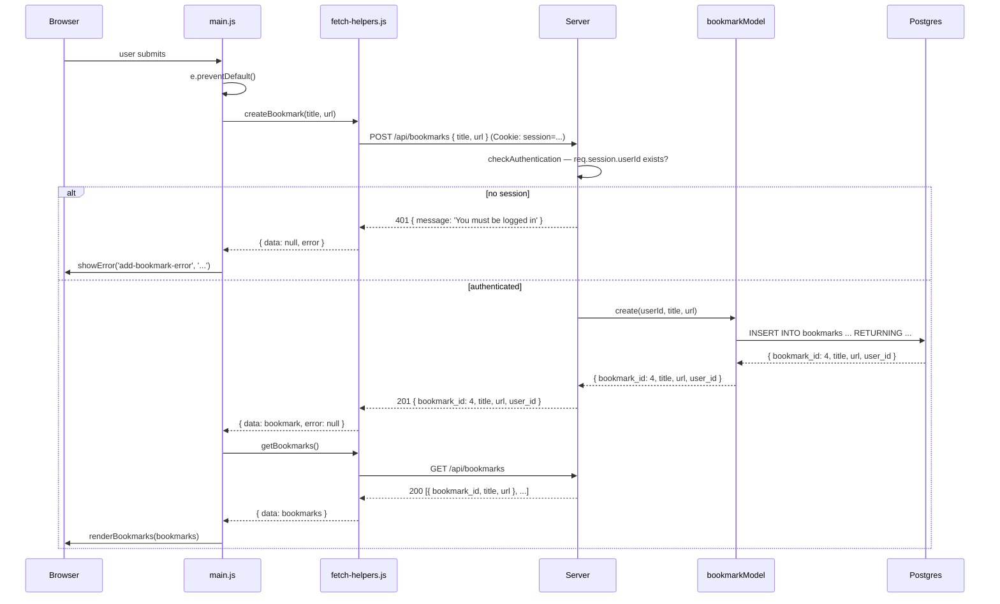

# 12. Putting It All Together


Follow along with code examples [here](https://github.com/The-Marcy-Lab-School/6-12-putting-it-all-together)!


Across lessons 8–11 you built a complete authentication and authorization system from scratch. Before adding new features, this lesson does two things: it reviews what you've built and why each piece matters, then extends the app with a new user-owned resource — bookmarks — using every pattern you've learned.

Along the way, you'll also move all sensitive configuration into environment variables, the standard practice before any real deployment.

**Table of Contents**

- [Essential Questions](#essential-questions)
- [Key Concepts](#key-concepts)
- [Review: What We've Built So Far](#review-what-weve-built-so-far)
  - [The Route List](#the-route-list)
- [Hardening for Deployment: Environment Variables](#hardening-for-deployment-environment-variables)
  - [What Goes in `.env`](#what-goes-in-env)
  - [Updating `pool.js`](#updating-pooljs)
  - [The `.env.template` Pattern](#the-envtemplate-pattern)
- [Adding a User-Owned Resource: Bookmarks](#adding-a-user-owned-resource-bookmarks)
  - [Schema Design](#schema-design)
  - [The Bookmark Model](#the-bookmark-model)
  - [Bookmark Controllers](#bookmark-controllers)
  - [Challenge: Ownership Checks](#challenge-ownership-checks)
  - [Bookmark Routes](#bookmark-routes)
- [Updating the Frontend](#updating-the-frontend)
  - [Fetch Helpers](#fetch-helpers)
  - [DOM Helpers](#dom-helpers)
  - [Main](#main)
- [The Complete Picture](#the-complete-picture)

## Essential Questions

By the end of this lesson, you should be able to answer these questions:

1. What sensitive values must never be committed to GitHub? Where should they live instead?
2. How does moving database credentials to `.env` change `pool.js`?
3. What is the difference between `.env` and `.env.template`? Why commit one but not the other?
4. When adding a new user-owned resource, which layers of the app need to change?
5. How do you check ownership for a resource like bookmarks, where the owner isn't in the URL?

## Key Concepts

* **Environment variable** — a variable set outside the application code, typically in a `.env` file. Used to store secrets and configuration that varies between environments (development, production).
* **`.env`** — the file that holds your actual secrets. Never committed to version control.
* **`.env.template`** — a committed file that documents which environment variables the app needs, with empty values. New developers copy this and fill in their own values.
* **`dotenv`** — the npm package that reads `.env` and loads its values into `process.env`.
* **Foreign key** — a column in one table that references the primary key of another table, creating a relationship between rows.
* **`ON DELETE CASCADE`** — a foreign key option that automatically deletes related rows when the referenced row is deleted. Deleting a user deletes all their bookmarks.

## Review: What We've Built So Far

Here is a summary of the system built across lessons 8–11. Each lesson added one layer to the stack.

| Lesson | What changed | Key idea |
|--------|--------------|----------|
| **8** | Swapped in-memory model for Postgres; added register and login controllers | MVC model swap — controllers and routes never changed |
| **9** | Added `bcrypt.hash()` on create/update; `bcrypt.compare()` on login; renamed column to `password_hash` | Passwords must never be stored in plaintext |
| **10** | Added `cookie-session`; set `req.session.userId` on login/register; added `GET /api/auth/me` and `DELETE /api/auth/logout` | Sessions let the server remember who is logged in across requests |
| **11** | Added `checkAuthentication` middleware; added ownership checks in `updateUser` and `deleteUser` | Authentication gates entry; ownership gates modifications |

### The Route List

By the end of lesson 11, the app has these routes:

```
POST   /api/auth/register  → hash password, create user, set session
POST   /api/auth/login     → validate credentials, set session
GET    /api/auth/me        → return current user from session (or 401)
DELETE /api/auth/logout    → clear session

GET    /api/users          → public
PATCH  /api/users/:user_id → checkAuthentication → updateUser (+ ownership)
DELETE /api/users/:user_id → checkAuthentication → deleteUser (+ ownership)
```

This lesson adds four more at the bottom.

## Hardening for Deployment: Environment Variables

Before adding bookmarks, there's housekeeping to do. Open `server/db/pool.js` from any previous lesson:

```js
const config = {
  host: 'localhost',
  port: 5432,
  database: 'users_db',
  user: 'username',     // ← hardcoded
  password: 'password', // ← hardcoded
};
```

And look at the `SESSION_SECRET` in `index.js`:

```js
app.use(cookieSession({
  secret: process.env.SESSION_SECRET, // already in .env — good
}));
```

The session secret is already in `.env`. Database credentials should be too. If you push this repo to GitHub with hardcoded credentials, those credentials are permanently exposed in the git history — even if you delete them later.

### What Goes in `.env`

Any value that:
- Is a secret (password, API key, signing secret)
- Varies between environments (dev database vs. production database)
- Should never be visible in the codebase

In this app, that means:

```
SESSION_SECRET=some-long-random-string

PGHOST=localhost
PGPORT=5432
PGDATABASE=users_db
PGUSER=
PGPASSWORD=
```


`.env` must be in `.gitignore`. Never commit it. If you accidentally commit secrets, rotate them immediately — deleting the file doesn't remove it from git history.


### Updating `pool.js`

With those values in `.env`, the `pg` connection config reads from `process.env` instead of hardcoded values:






```js
const { Pool } = require('pg');

// Values come from .env via dotenv — never hardcode credentials
const pool = new Pool({
  host:     process.env.PGHOST,
  port:     process.env.PGPORT,
  database: process.env.PGDATABASE,
  user:     process.env.PGUSER,
  password: process.env.PGPASSWORD,
});

module.exports = pool;
```






```js
const { Pool } = require('pg');

const config = {
  host: 'localhost',
  port: 5432,
  database: 'users_db',
  user: 'username',
  password: 'password',
};

const pool = new Pool(config);
module.exports = pool;
```





`dotenv` (already called at the top of `index.js` with `require('dotenv').config()`) loads `.env` into `process.env` before any of these values are read.

### The `.env.template` Pattern

`.env` is gitignored — so how do teammates know which variables to set? The answer is `.env.template`: a committed file with all the variable names and empty (or example) values.


```
SESSION_SECRET=''

PGHOST=localhost
PGPORT=5432
PGDATABASE=users_db
PGUSER=
PGPASSWORD=
```


When a new developer clones the repo, their first step is:

```sh
cp server/.env.template server/.env
# then fill in the real values
```

This makes setup self-documenting: the template is always up to date because it's in version control, and no real secrets are ever committed.

## Adding a User-Owned Resource: Bookmarks

With the codebase hardened, you're ready to add bookmarks. A bookmark is a titled URL saved by a specific user. It's a natural user-owned resource: users create their own bookmarks and no one else can modify or delete them.

As with the user system in lessons 8–11, you'll build layer by layer: schema first, then model, then controllers, then routes, then frontend.

### Schema Design

Bookmarks belong to users, so the `bookmarks` table needs a foreign key:


```js
await pool.query(`
  CREATE TABLE bookmarks (
    bookmark_id  SERIAL PRIMARY KEY,
    title        TEXT NOT NULL,
    url          TEXT NOT NULL,
    user_id      INTEGER REFERENCES users(user_id) ON DELETE CASCADE
  )
`);
```


`user_id INTEGER REFERENCES users(user_id)` is the foreign key. It tells Postgres: every value in this column must exist as a `user_id` in the `users` table.

`ON DELETE CASCADE` means: when a user is deleted, Postgres automatically deletes all their bookmarks. Without it, deleting a user with bookmarks would fail with a foreign key violation.


The seed file also drops `bookmarks` before `users`. Order matters: you can't drop `users` while `bookmarks` still has foreign keys pointing at it.

```js
await pool.query('DROP TABLE IF EXISTS bookmarks');
await pool.query('DROP TABLE IF EXISTS users');
```


### The Bookmark Model

The bookmark model follows the same conventions as the user model: methods return data or `null`, never throw to the controller deliberately, and use parameterized queries.


```js
const pool = require('../db/pool');

// Returns all bookmarks for a specific user
module.exports.list = async (user_id) => {
  const query = `
    SELECT bookmark_id, title, url, user_id
    FROM bookmarks
    WHERE user_id = $1
    ORDER BY bookmark_id
  `;
  const { rows } = await pool.query(query, [user_id]);
  return rows;
};

// Creates a bookmark owned by the user
module.exports.create = async (user_id, title, url) => {
  const query = `
    INSERT INTO bookmarks (user_id, title, url)
    VALUES ($1, $2, $3)
    RETURNING bookmark_id, title, url, user_id
  `;
  const { rows } = await pool.query(query, [user_id, title, url]);
  return rows[0];
};

// Finds a single bookmark by id — used for ownership check before update/delete
module.exports.find = async (bookmark_id) => {
  const query = 'SELECT bookmark_id, title, url, user_id FROM bookmarks WHERE bookmark_id = $1';
  const { rows } = await pool.query(query, [bookmark_id]);
  return rows[0] || null;
};

// Updates a bookmark's title and url
module.exports.update = async (bookmark_id, title, url) => {
  const query = `
    UPDATE bookmarks
    SET title = $1, url = $2
    WHERE bookmark_id = $3
    RETURNING bookmark_id, title, url, user_id
  `;
  const { rows } = await pool.query(query, [title, url, bookmark_id]);
  return rows[0] || null;
};

// Deletes a bookmark — returns the deleted row or null
module.exports.destroy = async (bookmark_id) => {
  const query = `
    DELETE FROM bookmarks
    WHERE bookmark_id = $1
    RETURNING bookmark_id, title, url, user_id
  `;
  const { rows } = await pool.query(query, [bookmark_id]);
  return rows[0] || null;
};
```


Notice `find` — it's used specifically by the update and delete controllers before they check ownership. The controller needs to know *who owns* a bookmark before it can decide whether to allow the operation.

### Bookmark Controllers

The `listBookmarks` and `createBookmark` controllers are straightforward: they get `user_id` from the session, not the URL.


```js
const bookmarkModel = require('../models/bookmarkModel');

// GET /api/bookmarks — returns the current user's bookmarks
const listBookmarks = async (req, res, next) => {
  try {
    const bookmarks = await bookmarkModel.list(req.session.userId);
    res.send(bookmarks);
  } catch (err) {
    next(err);
  }
};

// POST /api/bookmarks { title, url }
const createBookmark = async (req, res, next) => {
  try {
    const { title, url } = req.body;
    const bookmark = await bookmarkModel.create(req.session.userId, title, url);
    res.status(201).send(bookmark);
  } catch (err) {
    next(err);
  }
};

// updateBookmark and deleteBookmark — see the challenge below

module.exports = { listBookmarks, createBookmark, updateBookmark, deleteBookmark };
```


### Challenge: Ownership Checks

You've seen ownership checks in lesson 11's `updateUser` and `deleteUser`. The pattern for bookmarks is slightly different: in lesson 11, you could compare `req.params.user_id` directly to `req.session.userId`. For bookmarks, the URL param is a `bookmark_id` — you don't know who owns it until you look it up.

**Implement `updateBookmark` and `deleteBookmark` using this pattern:**

1. Convert `req.params.bookmark_id` to a number
2. Call `bookmarkModel.find(bookmarkId)` to look up the bookmark
3. If it doesn't exist → `404`
4. If `existing.user_id !== req.session.userId` → `403`
5. Otherwise → proceed with the update or delete

**<details><summary>Solution: `updateBookmark` and `deleteBookmark`</summary>**

```js
// PATCH /api/bookmarks/:bookmark_id { title, url }
const updateBookmark = async (req, res, next) => {
  try {
    const bookmarkId = Number(req.params.bookmark_id);

    // Look up the bookmark first so we can check ownership
    const existing = await bookmarkModel.find(bookmarkId);
    if (!existing) return res.status(404).send({ message: 'Bookmark not found' });

    // Ownership check — the bookmark's user_id must match the session userId
    if (existing.user_id !== req.session.userId) {
      return res.status(403).send({ message: 'You can only update your own bookmarks.' });
    }

    const { title, url } = req.body;
    const bookmark = await bookmarkModel.update(bookmarkId, title, url);
    res.send(bookmark);
  } catch (err) {
    next(err);
  }
};

// DELETE /api/bookmarks/:bookmark_id
const deleteBookmark = async (req, res, next) => {
  try {
    const bookmarkId = Number(req.params.bookmark_id);

    const existing = await bookmarkModel.find(bookmarkId);
    if (!existing) return res.status(404).send({ message: 'Bookmark not found' });

    if (existing.user_id !== req.session.userId) {
      return res.status(403).send({ message: 'You can only delete your own bookmarks.' });
    }

    const bookmark = await bookmarkModel.destroy(bookmarkId);
    res.send(bookmark);
  } catch (err) {
    next(err);
  }
};
```

</details>

### Bookmark Routes

All four bookmark routes require authentication. Register them in `index.js` after the user routes:


```js
const { listBookmarks, createBookmark, updateBookmark, deleteBookmark } = require('./controllers/bookmarkControllers');

// ---- Bookmark Routes (all protected) ----
app.get('/api/bookmarks', checkAuthentication, listBookmarks);
app.post('/api/bookmarks', checkAuthentication, createBookmark);
app.patch('/api/bookmarks/:bookmark_id', checkAuthentication, updateBookmark);
app.delete('/api/bookmarks/:bookmark_id', checkAuthentication, deleteBookmark);
```


`checkAuthentication` gates every bookmark route. The ownership check for `PATCH` and `DELETE` then runs inside the controller, just like in lesson 11.

## Updating the Frontend

The frontend gains a "My Bookmarks" tab in the nav (shown only when logged in), a form to add new bookmarks, and a list of bookmark cards with delete buttons. The split between `fetch-helpers.js`, `dom-helpers.js`, and `main.js` follows the same pattern established in lesson 8.

### Fetch Helpers

Three new functions — `getBookmarks`, `createBookmark`, and `deleteBookmark` — follow the same `handleFetch` pattern as everything else:


```js
// ============================================
// Bookmarks
// ============================================

export const getBookmarks = () => {
  return handleFetch(`${baseURL}/bookmarks`);
};

export const createBookmark = (title, url) => {
  const config = {
    method: 'POST',
    headers: { 'Content-Type': 'application/json' },
    body: JSON.stringify({ title, url }),
  };
  return handleFetch(`${baseURL}/bookmarks`, config);
};

export const deleteBookmark = (bookmark_id) => {
  return handleFetch(`${baseURL}/bookmarks/${bookmark_id}`, { method: 'DELETE' });
};
```


Note what's absent: no `updateBookmark` fetch helper. The UI only supports adding and deleting — a deliberate scope decision to keep the frontend simple. The `PATCH` endpoint exists on the server; the frontend can be extended to use it later.

### DOM Helpers

`renderBookmarks` builds a list of cards. Each card has a title link and a delete button. The delete button stores the `bookmark_id` in a `data-bookmark-id` attribute — `main.js` will read it when handling clicks.


```js
export const renderBookmarks = (bookmarks) => {
  bookmarksList.innerHTML = '';
  bookmarks.forEach((bookmark) => {
    const li = document.createElement('li');
    li.className = 'bookmark-card';
    li.dataset.bookmarkId = bookmark.bookmark_id; // used by event delegation

    const link = document.createElement('a');
    link.href = bookmark.url;
    link.target = '_blank';
    link.rel = 'noopener noreferrer';
    link.textContent = bookmark.title;

    const deleteBtn = document.createElement('button');
    deleteBtn.className = 'delete-bookmark-btn';
    deleteBtn.textContent = 'Delete';

    li.append(link, deleteBtn);
    bookmarksList.append(li);
  });
};
```


`renderAuthView` is also updated to show or hide the bookmarks nav button alongside the profile button:

```js
export const renderAuthView = (currentUser) => {
  if (currentUser) {
    // ...
    showBookmarksBtn.classList.remove('hidden');
    showProfileBtn.classList.remove('hidden');
  } else {
    // ...
    showBookmarksBtn.classList.add('hidden');
    bookmarksSection.classList.add('hidden');
    showProfileBtn.classList.add('hidden');
    profileSection.classList.add('hidden');
  }
};
```

### Main

`main.js` wires up three new interactions: the nav tab, the add form, and the delete button. The delete button uses event delegation — one listener on the list catches clicks on any card's button:


```js
// Add bookmark: submit form -> create -> refresh list
addBookmarkForm.addEventListener('submit', async (e) => {
  e.preventDefault();
  hideError('add-bookmark-error');
  const { data, error } = await createBookmark(
    addBookmarkForm.title.value,
    addBookmarkForm.url.value,
  );
  if (error) return showError('add-bookmark-error', 'Could not save bookmark.');
  addBookmarkForm.reset();
  await refreshBookmarks();
});

// Delete bookmark: click event bubbles up to the list
bookmarksList.addEventListener('click', async (e) => {
  const deleteBtn = e.target.closest('.delete-bookmark-btn');
  if (!deleteBtn) return;
  const li = deleteBtn.closest('.bookmark-card');
  const bookmarkId = Number(li.dataset.bookmarkId);
  await deleteBookmark(bookmarkId);
  await refreshBookmarks();
});

// Nav: show My Bookmarks section
showBookmarksBtn.addEventListener('click', async () => {
  showBookmarksSection();
  await refreshBookmarks();
});
```


**<details><summary>Q: Why use event delegation for bookmark deletion instead of adding a listener to each button directly?</summary>**

The bookmark cards are created dynamically by `renderBookmarks`. If you called `deleteBtn.addEventListener(...)` inside the `forEach`, you'd need to re-attach listeners every time the list re-renders. Event delegation attaches one listener to the static `#bookmarks-list` element and catches clicks that bubble up from any button inside it — regardless of when those buttons were created.

</details>

## The Complete Picture

Here is the full route list for the finished application, with the auth and ownership requirements for each:



And a summary of every route and its access rules:

| Method   | Endpoint                        | Auth required | Ownership required |
|----------|---------------------------------|---------------|--------------------|
| `POST`   | `/api/auth/register`            | No            | —                  |
| `POST`   | `/api/auth/login`               | No            | —                  |
| `GET`    | `/api/auth/me`                  | No            | —                  |
| `DELETE` | `/api/auth/logout`              | No            | —                  |
| `GET`    | `/api/users`                    | No            | —                  |
| `PATCH`  | `/api/users/:user_id`           | Yes           | Yes (own account)  |
| `DELETE` | `/api/users/:user_id`           | Yes           | Yes (own account)  |
| `GET`    | `/api/bookmarks`                | Yes           | — (filtered by session) |
| `POST`   | `/api/bookmarks`                | Yes           | — (session sets owner)  |
| `PATCH`  | `/api/bookmarks/:bookmark_id`   | Yes           | Yes (own bookmark) |
| `DELETE` | `/api/bookmarks/:bookmark_id`   | Yes           | Yes (own bookmark) |

Every pattern in this table — from the model swap in lesson 8 to the ownership check in lesson 11 — you built yourself, one layer at a time.
