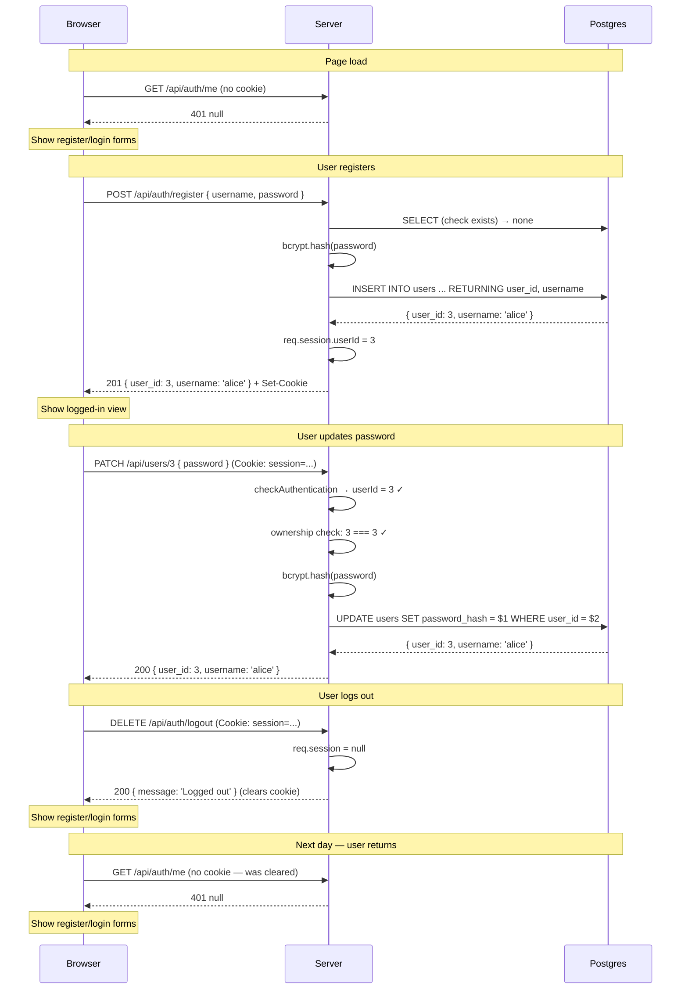

# 13. Fullstack with Auth


Follow along with code examples [here](https://github.com/The-Marcy-Lab-School/6-13-fullstack-with-auth)!


In lessons 8–12, you built each piece of the auth system separately: a Postgres-backed user model, registration, hashed passwords, sessions, login, and authorization middleware. This lesson puts them all together into a complete fullstack application — a Vanilla JS frontend communicating with an Express backend, with registration, login, logout, and protected resources.

**Table of Contents**

- [Essential Questions](#essential-questions)
- [Key Concepts](#key-concepts)
- [Project Structure](#project-structure)
- [The Complete Backend](#the-complete-backend)
  - [The Full `index.js`](#the-full-indexjs)
- [Preparing for Production](#preparing-for-production)
  - [Environment Variables for `pool.js`](#environment-variables-for-pooljs)
  - [The `.env` File](#the-env-file)
- [The Frontend](#the-frontend)
  - [Checking Login Status on Load](#checking-login-status-on-load)
  - [Register and Login](#register-and-login)
  - [Logout](#logout)
  - [Making Authenticated Requests](#making-authenticated-requests)
- [Tracing the Full Auth Flow](#tracing-the-full-auth-flow)
- [Ownership in a Multi-Resource App](#ownership-in-a-multi-resource-app)

## Essential Questions

By the end of this lesson, you should be able to answer these questions:

1. How does the frontend know whether the user is logged in when the page loads?
2. Why does `fetch` send session cookies automatically without any extra configuration?
3. What is the sequence of events from clicking "Register" to seeing the logged-in view?
4. How does the server enforce ownership — that users can only modify their own data?
5. How do you structure a `index.js` that has both public and protected routes?

## Key Concepts

* **`express.static('public')`** — serves files from a `public/` directory. The Express server hosts both the API and the frontend from the same port.
* **Same-origin requests** — when the frontend and backend are served from the same origin (same host and port), `fetch` automatically sends cookies with every request — no extra configuration needed.
* **`response.ok`** — a Fetch API property that is `true` when the response status is 200–299. Use this to check whether an API call succeeded before parsing the response body.
* **Optimistic UI** — updating the UI based on a successful server response, not a prediction. Always wait for a `200` before showing the logged-in view.

## Project Structure

```
project/
├── server/
│   ├── index.js
│   ├── .env
│   ├── db/
│   │   ├── pool.js
│   │   └── seed.js
│   ├── models/
│   │   └── userModel.js
│   ├── controllers/
│   │   ├── authControllers.js
│   │   └── userControllers.js
│   └── middleware/
│       └── checkAuthentication.js
└── public/
    ├── index.html
    └── app.js
```

`express.static('public')` in `index.js` tells Express to serve files from `public/` — so the browser can access `index.html` at `http://localhost:3000` and `app.js` at `http://localhost:3000/app.js`.

Because the frontend is served from the same origin as the API, `fetch` sends session cookies automatically with every request to any path on that origin.

## The Complete Backend

### The Full `index.js`

```js
// server/index.js
require('dotenv').config();
const path = require('path');
const express = require('express');
const cookieSession = require('cookie-session');
const checkAuthentication = require('./middleware/checkAuthentication');
const { register, login, getMe, logout } = require('./controllers/authControllers');
const { listUsers, updateUser, deleteUser } = require('./controllers/userControllers');

const app = express();

app.use(express.json());
app.use(express.static(path.join(__dirname, '..', 'public')));

app.use(cookieSession({
  name: 'session',
  secret: process.env.SESSION_SECRET,
  maxAge: 24 * 60 * 60 * 1000, // 24 hours
}));

// ---- Auth Routes (public) ----
app.post('/api/auth/register', register);
app.post('/api/auth/login', login);
app.get('/api/auth/me', getMe);
app.delete('/api/auth/logout', logout);

// ---- User Routes ----
app.get('/api/users', listUsers);
app.patch('/api/users/:user_id', checkAuthentication, updateUser);
app.delete('/api/users/:user_id', checkAuthentication, deleteUser);

// ---- Error-Handling Middleware ----
app.use((err, req, res, next) => {
  console.error(err);
  res.status(err.status || 500).send({ message: err.message || 'Internal server error' });
});

app.listen(3000, () => console.log('Server running on http://localhost:3000'));
```

Auth routes are public — anyone can attempt to register or log in. User modification routes are protected with `checkAuthentication`. `GET /api/users` is left public so anyone can see the user list.

## Preparing for Production

So far, `pool.js` has had hardcoded credentials that only work on your local machine:

```js
const config = {
  host: 'localhost',
  port: 5432,
  database: 'users_db',
  user: 'username',   // <-- your local Postgres user
  password: 'password',
};
```

This works locally, but when you deploy to a hosting platform (Render, Railway, etc.), the database runs on a remote server. The platform provides a single **connection string** — a URL that contains the host, port, database name, username, and password all in one — and injects it as an environment variable called `DATABASE_URL`.

### Environment Variables for `pool.js`

Update `pool.js` to use `DATABASE_URL` when it's available, and fall back to the local config when it isn't:

```js
// db/pool.js
const { Pool } = require('pg');

const config = process.env.DATABASE_URL
  ? {
      connectionString: process.env.DATABASE_URL,
      ssl: { rejectUnauthorized: false }, // required by most hosting providers
    }
  : {
      host: 'localhost',
      port: 5432,
      database: 'users_db',
    };

const pool = new Pool(config);

module.exports = pool;
```

When `DATABASE_URL` is set (in production), `pg` connects using the connection string. When it isn't set (local dev), it uses the hardcoded local config. The same `pool.js` works in both environments without any changes at deploy time.


`ssl: { rejectUnauthorized: false }` disables SSL certificate verification. Most hosted Postgres providers use self-signed certificates, which Node rejects by default. This option allows the connection to proceed. In a high-security production environment you'd configure proper SSL certificates instead.


### The `.env` File

Create a `.env` file in `server/` with your secrets. This file is **never committed to GitHub**:

```
SESSION_SECRET=some-long-random-string
# DATABASE_URL is not set locally — pool.js uses the hardcoded config above
```

Add `.env` to `.gitignore`:

```
node_modules/
.env
```

On your hosting platform, set both `SESSION_SECRET` and `DATABASE_URL` as environment variables through the platform's dashboard. The platform injects them automatically when the server starts — no `.env` file needed in production.


Never commit `.env` to GitHub. If `SESSION_SECRET` leaks, an attacker can forge any session cookie. If `DATABASE_URL` leaks, an attacker has direct access to your database.


## The Frontend

The frontend is a single HTML file and a single JavaScript file. There are no build tools, no bundlers, no frameworks — just HTML and `fetch`.

```html
<!-- public/index.html -->
<!DOCTYPE html>
<html lang="en">
<head>
  <meta charset="UTF-8">
  <title>User App</title>
</head>
<body>
  <div id="app"></div>
  <script src="app.js"></script>
</body>
</html>
```

### Checking Login Status on Load

The first thing the app does is call `/api/auth/me` to find out if the user is already logged in:

```js
// public/app.js

const checkLoginStatus = async () => {
  const response = await fetch('/api/auth/me');
  if (response.ok) {
    const user = await response.json();
    renderApp(user);
  } else {
    renderAuthForms();
  }
};

checkLoginStatus();
```

`fetch` sends the session cookie automatically because the request goes to the same origin. If the session exists and is valid, the server returns the user and the app renders the logged-in view. If not, the auth forms are shown.

### Register and Login

```js
const renderAuthForms = () => {
  document.getElementById('app').innerHTML = `
    <section>
      <h2>Register</h2>
      <form id="register-form">
        <input name="username" placeholder="Username" required />
        <input name="password" type="password" placeholder="Password" required />
        <button type="submit">Register</button>
      </form>
      <p id="register-error"></p>
    </section>
    <section>
      <h2>Log In</h2>
      <form id="login-form">
        <input name="username" placeholder="Username" required />
        <input name="password" type="password" placeholder="Password" required />
        <button type="submit">Log In</button>
      </form>
      <p id="login-error"></p>
    </section>
  `;

  document.getElementById('register-form').addEventListener('submit', handleRegister);
  document.getElementById('login-form').addEventListener('submit', handleLogin);
};

const handleRegister = async (e) => {
  e.preventDefault();
  const form = e.target;
  const response = await fetch('/api/auth/register', {
    method: 'POST',
    headers: { 'Content-Type': 'application/json' },
    body: JSON.stringify({
      username: form.username.value,
      password: form.password.value,
    }),
  });
  if (response.ok) {
    const user = await response.json();
    renderApp(user);
  } else {
    const data = await response.json();
    document.getElementById('register-error').textContent = data.message;
  }
};

const handleLogin = async (e) => {
  e.preventDefault();
  const form = e.target;
  const response = await fetch('/api/auth/login', {
    method: 'POST',
    headers: { 'Content-Type': 'application/json' },
    body: JSON.stringify({
      username: form.username.value,
      password: form.password.value,
    }),
  });
  if (response.ok) {
    const user = await response.json();
    renderApp(user);
  } else {
    document.getElementById('login-error').textContent = 'Invalid credentials';
  }
};
```

Both handlers wait for `response.ok` before updating the UI. Never update UI state based on an assumption — always confirm the server succeeded first.

**<details><summary>Q: Why do we re-render the entire app rather than just updating a small part of the page after login?</summary>**

In a small app with no framework, re-rendering the relevant section is the simplest approach — it avoids tracking which elements to show or hide. In a production app using React or another framework, you'd manage this with component state and conditionally render the logged-in vs. logged-out views. The fundamental pattern (`/api/auth/me` on load → render based on result) is the same either way.

</details>

### Logout

```js
const handleLogout = async () => {
  await fetch('/api/auth/logout', { method: 'DELETE' });
  renderAuthForms();
};
```

After logout, the server clears the session cookie. The next call to `/api/auth/me` will return `401`.

### Making Authenticated Requests

```js
const renderApp = (currentUser) => {
  document.getElementById('app').innerHTML = `
    <h2>Welcome, ${currentUser.username}!</h2>
    <button id="logout-btn">Log Out</button>
    <h3>All Users</h3>
    <ul id="user-list"></ul>
    <hr>
    <h3>Your Account</h3>
    <form id="update-form">
      <input name="password" type="password" placeholder="New password" required />
      <button type="submit">Update Password</button>
    </form>
    <button id="delete-btn">Delete My Account</button>
    <p id="action-message"></p>
  `;

  document.getElementById('logout-btn').addEventListener('click', handleLogout);
  document.getElementById('update-form').addEventListener('submit', (e) => handleUpdate(e, currentUser.user_id));
  document.getElementById('delete-btn').addEventListener('click', () => handleDelete(currentUser.user_id));

  loadUsers();
};

const loadUsers = async () => {
  const response = await fetch('/api/users');
  if (!response.ok) return;
  const users = await response.json();
  const list = document.getElementById('user-list');
  list.innerHTML = users.map((u) => `<li>${u.username}</li>`).join('');
};

const handleUpdate = async (e, userId) => {
  e.preventDefault();
  const form = e.target;
  const response = await fetch(`/api/users/${userId}`, {
    method: 'PATCH',
    headers: { 'Content-Type': 'application/json' },
    body: JSON.stringify({ password: form.password.value }),
  });
  const msg = document.getElementById('action-message');
  if (response.ok) {
    msg.textContent = 'Password updated.';
    form.reset();
  } else {
    const data = await response.json();
    msg.textContent = data.message;
  }
};

const handleDelete = async (userId) => {
  const response = await fetch(`/api/users/${userId}`, { method: 'DELETE' });
  if (response.ok) {
    renderAuthForms(); // logged-out view after deleting own account
  }
};
```

`fetch` sends the session cookie automatically — no extra headers or configuration needed. The server reads the cookie, checks the session, and either proceeds with the request or returns `401`.

## Tracing the Full Auth Flow

Here is the complete sequence from a new user's first visit through their first protected action:



## Ownership in a Multi-Resource App

In this lesson, the only resource is users. Real applications have multiple resource types — posts, bookmarks, notes, etc. — each owned by a user. The ownership check pattern is the same regardless of the resource:

1. Add a `user_id` foreign key column to the resource table
2. When creating a resource, set `user_id = req.session.userId`
3. When updating or deleting a resource, fetch it first and compare its `user_id` to `req.session.userId`

```sql
CREATE TABLE posts (
  post_id  SERIAL PRIMARY KEY,
  user_id  INTEGER NOT NULL REFERENCES users(user_id),
  title    TEXT NOT NULL,
  body     TEXT NOT NULL
);
```

```js
// Creating a post — owned by the logged-in user
const createPost = async (req, res, next) => {
  try {
    const { title, body } = req.body;
    const post = await postModel.create(req.session.userId, title, body);
    res.status(201).send(post);
  } catch (err) {
    next(err);
  }
};

// Updating a post — only the owner can do this
const updatePost = async (req, res, next) => {
  try {
    const postId = Number(req.params.post_id);
    const post = await postModel.find(postId);
    if (!post) return res.status(404).send({ message: 'Post not found' });

    if (post.user_id !== req.session.userId) {
      return res.status(403).send({ message: 'You can only edit your own posts.' });
    }

    const updated = await postModel.update(postId, req.body);
    res.send(updated);
  } catch (err) {
    next(err);
  }
};
```

And in `index.js`:

```js
// ---- Post Routes ----
app.get('/api/posts', listPosts);                                // public
app.post('/api/posts', checkAuthentication, createPost);         // must be logged in
app.patch('/api/posts/:post_id', checkAuthentication, updatePost); // must own the post
app.delete('/api/posts/:post_id', checkAuthentication, deletePost);
```

This pattern — foreign key, ownership check in the controller, `checkAuthentication` middleware at the route — scales to any number of resource types.

**<details><summary>Q: You're building a notes app where notes are private (only the owner can see them). How would `listNotes` differ from `listPosts`?</summary>**

`listPosts` returns all posts regardless of who's asking. `listNotes` should only return notes belonging to the logged-in user — so it uses the session to filter:

```js
const listNotes = async (req, res, next) => {
  try {
    const notes = await noteModel.listByUser(req.session.userId);
    res.send(notes);
  } catch (err) {
    next(err);
  }
};
```

Model method:

```js
const listByUser = async (userId) => {
  const result = await pool.query(
    'SELECT note_id, user_id, title, body FROM notes WHERE user_id = $1',
    [userId]
  );
  return result.rows;
};
```

Since every note endpoint is private, you'd also apply `checkAuthentication` to the entire notes group — either via `app.use('/api/notes', checkAuthentication)` or by including it on each route individually.

</details>
