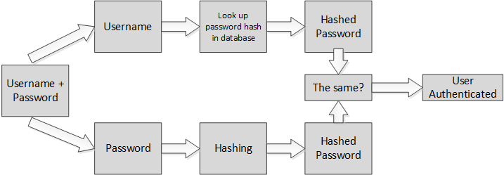

# 12. Hashing Passwords with Bcrypt


Follow along with code examples [here](https://github.com/The-Marcy-Lab-School/8-4-0-hashing-salting-bcrypt)!


**Table of Contents:**

- [Essential Questions](#essential-questions)
- [Terms](#terms)
- [Pre-Learning](#pre-learning)
- [Hashing](#hashing)
  - [Authenticating Users](#authenticating-users)
  - [A Simple Example](#a-simple-example)
- [The Importance of Secure Hash Functions](#the-importance-of-secure-hash-functions)
  - [Hashing with Bcrypt](#hashing-with-bcrypt)
  - [Salting](#salting)
- [Bcrypt Helpers](#bcrypt-helpers)
- [Summary — The Password Validation Workflow](#summary--the-password-validation-workflow)


## Essential Questions

By the end of this lesson, you should be able to answer these questions:

1. What is hashing? What are the two key properties a hashing function must have?
2. Why should passwords never be stored in plaintext in a database?
3. How can a server authenticate a user if it never stores their actual password?
4. What is a salt and why does bcrypt add one before hashing a password?
5. What is the tradeoff when choosing the number of salt rounds?

## Key Concepts

* **Hashing** - a mathematical algorithm that transforms a string of characters into a fixed-length string of characters.
* **Password Salt** - A salt is a random string of data that is added to the input data before the hash function is applied. This changes the hash value that is produced, even for the same input data.
* **Salt Rounds** - the number of times a password has been salted before being hashed
* **Plaintext password** - the password as it was entered by the user, before it is hashed.
* **Bcrypt** - a Node module that provides functions for hashing strings and verifying hashed strings.

## Pre-Learning

Check out this video to learn about hashing, salting, and various attacks used by hackers to get accessed to your password!

[Video: Password Hashing, Salts, Peppers | Explained!](https://www.youtube.com/watch?v=--tnZMuoK3E\&ab_channel=Seytonic)

## Hashing

**Hashing** is a process of transforming a string of characters into a fixed-length string of characters called a **hash**.


A **hashing function** is a function that performs a hashing algorithm.

Hashing functions have two key properties:

1. They must be pure — they must produce the same output when given the same input!
2. They should be "one way" — it is easy to generate a hash from a given string, but relatively impossible to determine the original string from a given hash.

As a result, hashing is commonly used for password storage: when a user creates an account, the username will be stored in the database alongside the hashed password.


<details>

<summary><strong>Q: Why is it important that hashing functions are "one way" when it comes to password storage?</strong></summary>

Without password hashing, a hacker who obtains a user database can simply read the passwords in plain text.

With password hashing, the passwords are stored as hash values, and an attacker would need to spend significant time and resources attempting to convert the hash values back into the original passwords.

</details>

### Authenticating Users

By storing the hashed password, the database itself never "knows" your actual password. Despite this, when a user returns to sign in, the server can still validate a given username and password combination through some clever logic.



This process is called **authentication:**

* When the user returns to log in to their account, they provide their username and password.
* The server uses the provided username to find the associated hashed password in the database.
* The server then hashes the provided password. Since hashing algorithms are pure, the provided password's hash should match the hash stored in the database.
* If the hashes match, the user is authenticated!

### A Simple Example

Below is a very simple hashing function that can help demonstrate the authentication process.

This function converts each character in the given string into its ASCII character code (`"a"` → `97`, `"b"` → `98`, etc...)

```js
// Convert a given string to its ASCII codes
const simpleHash = (str) => {
  let hash = '';
  for (let i = 0; i < str.length; i++) {
    hash += str.charCodeAt(i);
  }
  return hash;
}

// the passwordToTest should produce the same hash as the storedHash
const validatePassword = (passwordToTest, storedHash) => {
  return simpleHash(passwordToTest) === storedHash;
}

const hashedPassword = simpleHash("abc");  // 979899

console.log(validatePassword("xyz", hashedPassword));
// false, the given password produces a different hash!

console.log(validatePassword("abc", hashedPassword));
// true, the given password produces the same hash!
```

## The Importance of Secure Hash Functions

Remember, a hashing function should have the following properties:

1. They must be pure — they must produce the same output when given the same input!
2. They should be "one way" — it is easy to generate a hash from a given string, but relatively impossible to determine the original string from a given hash.

<details>

<summary><strong>Q: For the algorithm above, given the hashed string <code>999897</code>, what is the plain-text string that would generate that hashed string?</strong></summary>

```js
simpleHash("cba") //-> "999897"
```

</details>

This algorithm is clearly not "one way"!

If an attacker had a database full of passwords hashed using this algorithm, they would be able to crack the passwords in no time!

This is where the secure hashing module `bcrypt` come in!

### Hashing with Bcrypt

The `bcrypt` node module gives us the `bcrypt.hash` and `bcrypt.compare` methods for hashing and authenticating strings.

They are both asynchronous methods that return promises

* `bcrypt.hash` resolves to the hash string
* `bcrypt.compare` resolves to a boolean

The strings produced by `bcrypt.hash` are much more complex and are nearly impossible to reverse-engineer!

```js
const bcrypt = require('bcrypt');

// Make an async wrapper function so we can use await
const testHashing = async () => {
  const saltRounds = 8; 

  const hashedPassword = await bcrypt.hash('secret', saltRounds);

  console.log(hashedPassword); // a complex string!
  
  const isValid = await bcrypt.compare('secret', hashedPassword);

  console.log(isValid); // true!
}

testHashing();
```

### Salting

You may have noticed the `saltRounds` argument provided to `bcrypt.hash`:

```js
const saltRounds = 8; // a.k.a. cost = 8

const hashedPassword = await bcrypt.hash('secret', saltRounds);
```

To understand what this does, we should break down the structure of a bcrypt hash string:


A **salt** is a random string of data that is added to the input data before the hash function is applied. This ensures that even if two users have the same password, they will have unique password hashes.


When you invoke `bcrypt.hash`, it will automatically generate a salt value and add it to your input string before hashing. You can test this by invoking `bcrypt.hash` twice with the same input:

```js
// bcrypt.hash automatically adds a salt for you.
// So, the hashes will be different!
console.log(await bcrypt.hash('secret', 8));
console.log(await bcrypt.hash('secret', 8));
```

However, instead of salting only once, the `saltRounds` argument determines the number of times that it re-salts and re-hashes your string before arriving at the final hash.

```
hash(password + salt) => hashedPassword1
hash(hashedPassword1 + salt) => hashedPassword2
hash(hashedPassword2 + salt) => hashedPassword3
...
hash(hashedPassword6 + salt) => hashedPassword7
hash(hashedPassword7 + salt) => hashedPassword8 

=> hashedPassword8 is stored in the database
```

This repeated process of salting and hashing increases the computational cost of generating a hash, further protecting against brute force attempts to crack a password.

The hash string has all of the information needed to re-compute the stored hash value _as long as the matching password is given_.


When authenticating a password, the `bcrypt.compare` function will extract the cost and the salt value from the stored hash value and apply them to the given password.

Again, since this process is pure, the resulting hash function should match the stored hash function!


The Salt Rounds is also called the **cost factor** since there is a tradeoff to be considered.

A higher number of salt rounds means attackers need to spend equally more time and resources to crack passwords through brute force methods (see [Rainbow Table Attacks](https://nordvpn.com/blog/what-is-rainbow-table-attack/) and [Dictionary Attacks](https://nordvpn.com/blog/dictionary-attack/)).

However, it also means that your server needs to take more time to generate secure passwords. So, the recommended number of rounds is `12` as it strikes a nice balance between security and performance (though `8` is satisfactory for a learning project).


## Bcrypt Helpers

Both hashing and comparing can throw errors if the functions are not used properly. So we've created these helpers to handle those errors for us.

```js
const hashPassword = async (password, saltRounds = 8) => {
  try {
    const hashedPassword = await bcrypt.hash(password, saltRounds);
    return hashedPassword;
  } catch (err) {
    return console.error(err.message);
  }
};
const isValidPassword = async (password, hash) => {
  try {
    const isValid = await bcrypt.compare(password, hash);
    return isValid;
  } catch (err) {
    return console.error(err.message);
  }
};
```

## Summary — The Password Validation Workflow

So, to recap:

**Hashing** is a process of transforming a string of characters into a fixed-length string of characters called a **hash**.

**Hashing functions** have two key properties:

1. They must be pure — they must produce the same output when given the same input!
2. They should be "one way" — it is easy to generate a hash from a given string, but relatively impossible to determine the original string from a given hash.

We should always hash passwords before storing them in a database


Authentication is possible by hashing a given password and comparing it against the stored hash:


