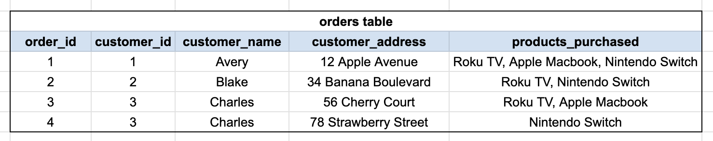
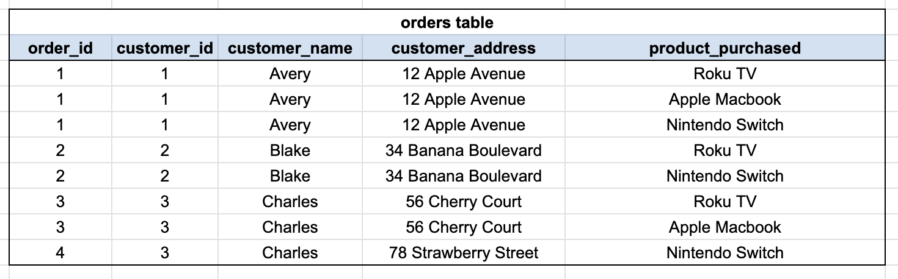
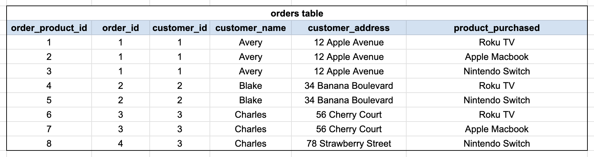
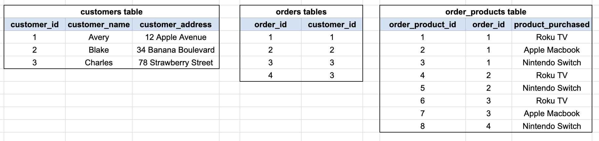
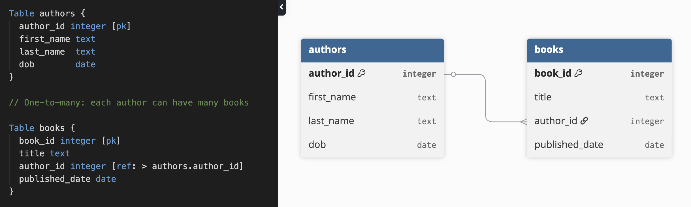

# 5. Schema Design & Normalization


Follow along with code examples [here](https://github.com/The-Marcy-Lab-School/6-5-schema-design-and-normalization)!


You now know how to write SQL queries against existing tables. Before those tables can exist, someone has to design them. That process is **schema design** — deciding what tables to create, what columns they hold, and how they relate to each other.

In this lesson, you'll learn what normalization means, why it matters, and how to translate a well-designed schema into SQL with foreign keys.

**Table of Contents**

- [Essential Questions](#essential-questions)
- [Key Concepts](#key-concepts)
- [What is Schema Design?](#what-is-schema-design)
- [Normalization](#normalization)
  - [Normalization Rule #1: Unique Primary Keys](#normalization-rule-1-unique-primary-keys)
  - [Normalization Rule #2: Atomic Values](#normalization-rule-2-atomic-values)
  - [Don't Forget The Primary Key!](#dont-forget-the-primary-key)
  - [Normalization Rule #3: Primary Key Dependency](#normalization-rule-3-primary-key-dependency)
- [The Three-Step Design Process](#the-three-step-design-process)
  - [Step 1 — Identify Tables](#step-1--identify-tables)
  - [Step 2 — Define Columns](#step-2--define-columns)
  - [Step 3 — Determine Relationships](#step-3--determine-relationships)
- [From Design to SQL](#from-design-to-sql)
  - [See It in Action](#see-it-in-action)
- [Normalization Rules Challenge](#normalization-rules-challenge)
- [Practice](#practice)
- [ERDs: Design Before You Code (Extension)](#erds-design-before-you-code-extension)

## Essential Questions

By the end of this lesson, you should be able to answer these questions:

1. What is normalization and what problems does it prevent?
2. What are the three rules of normalization? What problem does each one solve?
3. What is a database schema and why is it worth designing before writing any code?
4. What is the difference between a one-to-many and a many-to-many relationship? How is each represented in a relational database?
5. How do you add a foreign key constraint to a `CREATE TABLE` statement? Why does the order in which you create tables matter?

## Key Concepts

* **Normalization** — the practice of structuring a database so that every fact is stored in exactly one place, eliminating redundancy and keeping data consistent.
* **Normal forms** — a set of rules for normalization. The three rules covered in this lesson address the most common design problems: unique primary keys, atomic values, and primary key dependency.
* **Schema** — the structure of a database: which tables exist, which columns each table has, the data types of those columns, and the constraints enforced on them.
* **Schema design** — the process of planning that structure before writing any code.
* **One-to-many** — a relationship where one row in table A can be referenced by many rows in table B (e.g., one user has many posts).
* **Many-to-many** — a relationship where rows in each table can reference many rows in the other (e.g., a student can enroll in many classes; a class can have many students).
* **Association/junction table** — a table that represents a many-to-many relationship by storing two foreign keys, one referencing each side.
* **ERD (Entity Relationship Diagram)** — a visual diagram showing each table's columns and the relationships between tables. *(See the Extension section.)*

## What is Schema Design?

> sche·ma /ˈskēmə/ (noun) — a representation of a plan in the form of an outline or model.

When you write `CREATE TABLE`, you are declaring your schema in SQL. Consider the SQL below that declares the schema for a database of authors and books:

```sql
CREATE TABLE authors (
  author_id SERIAL PRIMARY KEY,
  first_name TEXT NOT NULL,
  last_name INT NOT NULL,
  dob DATE
);

CREATE TABLE books (
  book_id SERIAL PRIMARY KEY,
  title TEXT NOT NULL,
  published_date DATE,
  author_id INT NOT NULL REFERENCES authors(author_id),
);
```

With this database, we can answer questions like:
- When was the author Toni Morrison born?
- Who wrote the book Between the World and Me?
- How many books did Brandon Sanderson write?

Before you can create tables like this, you have to plan and decide what your schema will look like. **Schema design** is this planning process and involves asking:
- What kinds of questions do I want to be able to answer with my data?
- To answer those questions, which tables will need to exist and what columns will they have?
- What is the best data type for each column?
- Which constraints should be enforced for each column?
- What relationships exist between tables?

## Normalization

The foundation of every well-designed relational database are the guiding principles of **normalization**. A "normalized" database is one that avoids two common database issues:
1. **Data Corruption** — the data becomes inaccurate and inconsistent
2. **Data Redundancy** — values are repeated unnecessarily or appear multiple times

Understanding the principles of normalization will allow you to defend and explain the *why* behind every decision you make in your schema design.

Consider the database table below which stores data for orders from an electronics store:



**<details><summary>Q: Where do you see corrupted (inaccurate and/or inconsistent) data? Where do you see redundant data?</summary>**

As you can see, Charles updated their address between orders 3 and 4. This data is now inconsistent making it difficult to accurately answer the question "What is Charles' address?"

```sql
-- This will return two rows that tell us conflicting information!
SELECT customer_address FROM orders WHERE customer_id = 3;
```
In addition, the `customer_name` column is redundant. The `customer_id` column uniquely identifies the customer on its own making the `customer_name` column unnecessary and opens the door for potential data corruption.

</details>

### Normalization Rule #1: Unique Primary Keys

The fundamental rule of all relational databases is that there must be a **primary key**: a column that uniquely identifies each row in a table. 

Primary keys also allow for the existence of foreign keys: columns in tables that reference the primary key of another table.

**<details><summary>Q: What is the primary key in the `orders` table? How do you know?</summary>**

`order_id` because it is unique for every single row.

</details>

### Normalization Rule #2: Atomic Values

Atomicity ("being like an atom") means that every cell must contains a single, indivisible value — no comma-separated lists, no arrays, no packed strings. A cell that follows this rule is "atomic".

Consider this `orders` table again and notice that `products_purchased` is *not* atomic. 


Storing multiple values in one column feels convenient, but it creates real problems:
- **Updates are fragile** — renaming a product (e.g. from `'Apple Macbook'` to `'Apple Macbook Pro'`) means hunting inside comma-separated strings across every row to make the change
- **Querying is awkward** — "find all orders that include `'Laptop'`" is possible but awkward with a simple `WHERE` clause. Again, string parsing is required.

We can fix this by giving each `product_purchased` value its own row:



We've satisfied the rule of atomicity! But we've caused another issue.

**<details><summary>Q: This solution introduces a new issue, can you see it?</summary>**

The primary key `order_id` is no longer unique! Multiple rows share the same primary key value. Additionally, we have way more repetition in our data!

Technically, we can uniquely identify each row if we treat the combination of the `order_id` and the `product_purchased` as a **composite key**. Composite keys aren't strictly a bad practice but can be inconvenient to work with. A single unique primary key is much better!

</details>

### Don't Forget The Primary Key!

Remember, every table needs a single unique, primary key to identify each row. We *could* do this by adding a column called `order_product_id`:





Don't do this!



The issue with this design is that we now have a lot of redundant and repetitive data. This is caused by having too many columns that are dependent on non-primary key columns.

**<details><summary>Q: Which columns are dependent on a non-primary key column? Look for rows that have pairs of columns whose values are always the same.</summary>**

Both `customer_name` and `customer_address` depend on the on `customer_id` (every row with `customer_id=1` has `customer_name=Avery` and `customer_address='12 Apple Avenue'`)

Similarly, the `customer_id` value is dependent on `order_id` (every row with `order_id=1` has `customer_id=1`).

None of these columns depend on `order_product_id`.

</details>

The existence of non-primary key dependencies creates repetitive/redundant data and opportunities for data corruption:

* If Charles (`customer_id=3`) changes their address in the database, then every row with `customer_id=3` must also be changed. Miss one and the data is inconsistent. We can see that this already happened!
* An order can only ever have one customer attached to it making it redundant to list the customer next to the order when listing out the products in an order.

### Normalization Rule #3: Primary Key Dependency

The third rule of normalization avoids redundancy and repetitive data by requiring that every column must depend solely on the primary key — not on some other column.

We fix this by extracting each dependency into its own table:

* **`customers`** tells us details about each customer and nothing else
* **`orders`** tells us who placed each order
* **`order_products`** tells us which products were purchased in each order



Now, when Charles updates his address, the change only happens in one place. Additionally, the orders table only needs to know the `customer_id`, not the name or address.

## The Three-Step Design Process

Normalization is something that you can do to improve the design of an existing database. But we can and should use those principles from the start when designing a database from scratch.

A normalized schema emerges naturally from following three steps:

1. **Identify tables** — what distinct types of things does the app need to store? Each type of entity that has its own properties and its own lifecycle gets its own table.
2. **Define columns** — what properties does each entity have? If a property could change independently of the others (like a product name), it belongs in its own table, not repeated as a column on a related table.
3. **Determine relationships** — how do the entities relate? If the relationship produces multiple values per row, you need a junction table (Rule #2). If a column's value is determined by a non-primary column, it needs to move to its own table (Rule #3).

We'll apply these steps to design a school database. Here are the user stories:

- We can see all students at the school
- We can see all teachers at the school
- We can see all courses available
- We can see which students are enrolled in which courses
- We can see which teacher is assigned to each course

### Step 1 — Identify Tables

Each distinct entity — something with its own properties and its own existence — gets its own table.

**<details><summary>Q: Based on the user stories, what tables do we need?</summary>**

- `students` — a student exists independently; they have their own name, DOB, etc.
- `teachers` — a teacher exists independently; they have their own name, etc.
- `classes` — a class exists independently; it has a title and an assigned teacher
- `enrollments` — the relationship between students and classes needs its own table (a student can be in many classes, a class can have many students — this is a many-to-many, which means a junction table)

Without `enrollments`, the only alternative would be storing courses as a comma-separated list on the `students` table — a direct violation of atomicity.

</details>

### Step 2 — Define Columns

For each table, define a primary key column named after the table (`student_id`, `teacher_id`, `class_id`). Foreign keys use the exact same name as the primary key they reference.

Then ask: which additional information is needed to answer the user story questions? Which table does each piece of information belong to?

**<details><summary>School Solution</summary>**

- `students`: `student_id`, `first_name`, `last_name`, `dob`
- `teachers`: `teacher_id`, `first_name`, `last_name`
- `classes`: `class_id`, `title`, `teacher_id` — not `teacher_name`. A teacher's name belongs in the `teachers` table. Putting `teacher_name` directly on `classes` would break Rule #3: the name depends on the teacher, not on the class.
- `enrollments`: `enrollment_id`, `student_id`, `class_id`

</details>

### Step 3 — Determine Relationships

For each table, ask: is each relationship one-to-many or many-to-many?

- **One-to-many**: one row in table A is referenced by many rows in table B. The foreign key lives on the "many" side.
- **Many-to-many**: rows in each table can reference many rows in the other. Requires a junction table.

**<details><summary>School Solution</summary>**

- A teacher can teach many classes, but each class has only one teacher → **one-to-many**. `teacher_id` lives on `classes`.
- A student can be enrolled in many classes, and a class can have many students → **many-to-many**. The `enrollments` junction table holds both `student_id` and `class_id`.

</details>

**<details><summary>Q: Why does the `enrollments` table exist? What would go wrong if you tried to store enrollment data directly on the `students` table instead?</summary>**

A student can be enrolled in many classes and a class can have many students — this is a many-to-many relationship. There is no way to represent that with a single foreign key column on either table.

The only alternative would be storing courses as a comma-separated list (e.g., `courses = "Math, Science, History"`) directly on the `students` table. That breaks the rule of atomicity — multiple values in one cell. Querying it is awkward, updating it is fragile, and you can't enforce foreign keys to the `classes` table.

The `enrollments` junction table solves this by giving each student-class pairing its own row. This is normalization in practice: a relationship that produces multiple values per entity gets its own table.

</details>

## From Design to SQL

Once you've identified your tables, columns, and relationships, you translate each table into a `CREATE TABLE` statement.

In SQL, foreign key relationships use `REFERENCES table(column_name)` directly on the foreign key column:

```sql
CREATE TABLE classes (
  class_id    SERIAL  PRIMARY KEY,
  title       TEXT    NOT NULL,
  teacher_id  INTEGER REFERENCES teachers(teacher_id)
);
```

**Creation order matters**

A `REFERENCES` constraint means Postgres enforces the relationship at the database level — any attempt to insert a row into `classes` with a `teacher_id` that doesn't exist in `teachers` will be rejected. Because of this, **referenced tables must be created before the tables that reference them**:

- `students` and `teachers` have no foreign keys — create them first
- `classes` references `teachers` — create it after `teachers`
- `enrollments` references both `students` and `classes` — create it last

Here is the complete `school_db` schema. Read through it and trace each `REFERENCES` back to the table and column it points to before running it:

```sql
-- No foreign keys — create first
CREATE TABLE students (
  student_id  SERIAL PRIMARY KEY,
  first_name  TEXT   NOT NULL,
  last_name   TEXT   NOT NULL,
  dob         DATE
);

-- No foreign keys — create first
CREATE TABLE teachers (
  teacher_id  SERIAL PRIMARY KEY,
  first_name  TEXT   NOT NULL,
  last_name   TEXT   NOT NULL
);

-- References teachers — create after teachers
CREATE TABLE classes (
  class_id    SERIAL  PRIMARY KEY,
  title       TEXT    NOT NULL,
  teacher_id  INTEGER REFERENCES teachers(teacher_id)
);

-- References students and classes — create last
CREATE TABLE enrollments (
  enrollment_id  SERIAL  PRIMARY KEY,
  student_id     INTEGER REFERENCES students(student_id),
  class_id       INTEGER REFERENCES classes(class_id),
  UNIQUE (student_id, class_id)
);
```

**<details><summary>Q: The `enrollments` table has both a `SERIAL PRIMARY KEY` and a `UNIQUE (student_id, class_id)` constraint. What does the `UNIQUE` constraint add that the primary key doesn't already provide?</summary>**

The primary key (`enrollment_id`) uniquely identifies each row — it's the row's identifier. But it says nothing about the *combination* of `student_id` and `class_id`. Without the `UNIQUE` constraint, nothing would stop the same student from being enrolled in the same class twice, producing two rows with different `enrollment_id` values but identical `student_id` and `class_id`.

`UNIQUE (student_id, class_id)` enforces the business rule that a student can only be enrolled in a given class once. The primary key and the unique constraint serve different purposes: the primary key identifies the row; the unique constraint enforces a real-world constraint on the data.

</details>

**<details><summary>Q: What happens if you try to `CREATE TABLE classes` before `CREATE TABLE teachers`?</summary>**

Postgres throws an error: `relation "teachers" does not exist`. The `REFERENCES teachers(teacher_id)` clause needs `teachers` to already exist so Postgres can verify the column it's linking to. Always create parent tables before child tables.

</details>

**<details><summary>Q: In the school schema, which tables are "parents" and which are "children"? What determines this?</summary>**

- `students` and `teachers` are parents — their primary keys are referenced by other tables, but they don't reference anyone themselves
- `classes` is a child of `teachers` — it holds `teacher_id REFERENCES teachers`
- `enrollments` is a child of both `students` and `classes` — it holds foreign keys pointing to both

A table is a "parent" when its primary key is referenced by another table's foreign key. A table is a "child" when it holds a foreign key column pointing at a parent.

</details>

**<details><summary>Q: What does Postgres do if you try to INSERT a row into `classes` with a `teacher_id` that doesn't exist in `teachers`?</summary>**

Postgres rejects the insert with a foreign key violation error:

```
ERROR: insert or update on table "classes" violates foreign key constraint
DETAIL: Key (teacher_id)=(99) is not present in table "teachers".
```

This is referential integrity — the database itself guarantees that every `teacher_id` in `classes` points to a real teacher. You don't need to check this in your application code because Postgres won't let the bad data in.

</details>

### See It in Action

The `school-setup.sql` file in the follow-along repo contains exactly the `CREATE TABLE` statements above, plus seed data to query against.

Run it to create `school_db`:



```sh
psql -f school-setup.sql
```


```sh
sudo -u postgres psql -f school-setup.sql
```



Then connect and explore:



```sh
psql school_db
```


```sh
sudo -u postgres psql school_db
```



```sql
-- Inspect a table's columns and constraints
\d students
\d enrollments

-- Query across the schema
SELECT * FROM students;
SELECT * FROM enrollments;

-- What classes is Alice enrolled in?
-- (teaser for the next lesson — don't worry about the syntax yet)
SELECT students.first_name, classes.title
FROM students
  INNER JOIN enrollments ON students.student_id = enrollments.student_id
  INNER JOIN classes     ON enrollments.class_id = classes.class_id
WHERE students.first_name = 'Alice';
```

Run `\d enrollments` and compare the output to the `CREATE TABLE enrollments` statement above — the `REFERENCES` constraints and the `UNIQUE` constraint should all appear exactly as written.

## Normalization Rules Challenge

Consider this `employees` table. Which normalization rules does it break? How would you fix it?

| employee_id | employee_name | department_id | department_name | project_names               |
| ----------- | ------------- | ------------- | --------------- | --------------------------- |
| 1           | Ana           | 10            | Engineering     | Website Redesign, API Audit |
| 2           | Ben           | 10            | Engineering     | API Audit                   |
| 3           | Cara          | 20            | Marketing       | Brand Refresh               |
| 4           | Dan           | 20            | Marketing       | Brand Refresh, Social Media |

**<details><summary>Which rules does this table break?</summary>**

**Rule #2 — Atomic Values:** `project_names` stores multiple values in a single cell (e.g., `"Website Redesign, API Audit"`). Each project must get its own row.

**Rule #3 — Primary Key Dependency:** `department_name` depends on `department_id`, not on `employee_id`. If the Engineering department is renamed, every Engineering employee's row must be updated — and it's easy to miss one.

</details>

**<details><summary>How would you fix it?</summary>**

Extract each dependency into its own table and use a junction table for the many-to-many relationship between employees and projects.

**`departments`**

| department_id | department_name |
| ------------- | --------------- |
| 10            | Engineering     |
| 20            | Marketing       |

**`employees`**

| employee_id | employee_name | department_id |
| ----------- | ------------- | ------------- |
| 1           | Ana           | 10            |
| 2           | Ben           | 10            |
| 3           | Cara          | 20            |
| 4           | Dan           | 20            |

**`projects`**

| project_id | project_name     |
| ---------- | ---------------- |
| 1          | Website Redesign |
| 2          | API Audit        |
| 3          | Brand Refresh    |
| 4          | Social Media     |

**`employee_projects`** (junction table)

| employee_project_id | employee_id | project_id |
| ------------------- | ----------- | ---------- |
| 1                   | 1           | 1          |
| 2                   | 1           | 2          |
| 3                   | 2           | 2          |
| 4                   | 3           | 3          |
| 5                   | 4           | 3          |
| 6                   | 4           | 4          |

Now `department_name` lives in exactly one place — rename Engineering once and every employee inherits it automatically. And each project assignment gets its own row with its own primary key, making queries like "find all employees on the API Audit project" trivial.

</details>

## Practice

In groups, design a schema for one of the following. Follow the three-step process, then translate your design to SQL. Be ready to explain every structural decision in terms of normalization.

- An online store (users, products, orders, order items)
- A photo-sharing app with comments (users, photos, comments)
- A restaurant reservation system (customers, restaurants, tables, reservations)
- A job board (companies, job listings, applicants, applications)

**Step 1 — Plan your schema**

Work through the three steps on paper or a whiteboard:
- Which tables do you need? What does each one represent?
- What columns does each table have? Where does each piece of information belong?
- What are the relationships? Which are one-to-many? Which are many-to-many?

For each decision, be able to answer:
- **Why is this a separate table?** (What redundancy or violation would occur if it weren't?)
- **Why does this column live here and not somewhere else?** (What does it depend on?)
- **Why does this relationship need a junction table?**

**Step 2 — Translate your design to SQL**

Write a `CREATE TABLE` statement for every table. For each statement:
- Use `SERIAL PRIMARY KEY` for the primary key column
- Use `REFERENCES other_table(other_table_id)` for every foreign key column
- Order your statements so that parent tables are created before child tables
- Run your SQL in `psql` and use `\d table_name` to verify the constraints appear as expected

**Extension:** Visualize your schema in [dbdiagram.io](https://dbdiagram.io) using DBML.

## ERDs: Design Before You Code (Extension)

An **Entity Relationship Diagram (ERD)** is a visual representation of your schema — each table's columns and the relationships between them — before you write any SQL.



Creating a diagram like this gives everyone a single source of truth *before* anyone writes a line of application code.

**Database Markup Language (DBML)** is a plain-text format for describing a database schema. When you paste it into [dbdiagram.io](https://dbdiagram.io), it renders a visual ERD you can share with your team.

Try pasting the following into the dbdiagram editor:

```dbml
Table authors {
  author_id integer [pk]
  first_name text
  last_name  text
  dob        date
}

// One-to-many: each author can have many books

Table books {
  book_id integer [pk]
  title text
  author_id integer [ref: > authors.author_id]
  published_date date
}
```

**<details><summary>Q: What is the point of creating a diagram like this vs. using SQL to create the database directly in PostgreSQL?</summary>**

Diagrams are easy to collaborate on and make changes before committing anything to code. As a team, you can align on your design decisions before getting to work where changes will become more costly.

</details>

Here is the complete school database in DBML. Paste it into dbdiagram.io and compare the diagram to the `CREATE TABLE` statements you already wrote:

```dbml
Table students {
  student_id integer [pk]
  first_name varchar
  last_name  varchar
  dob        date
}

Table teachers {
  teacher_id integer [pk]
  first_name varchar
  last_name  varchar
}

// Each class can have one teacher
Table classes {
  class_id   integer [pk]
  title      varchar
  teacher_id integer [ref: - teachers.teacher_id]
}

// Students and classes can each have many enrollments
Table enrollments {
  enrollment_id integer [pk]
  student_id    integer [ref: > students.student_id]
  class_id      integer [ref: > classes.class_id]
}
```

In DBML, relationships use these symbols:
* one-to-one: `[ref: - table.column]`
* many-to-one: `[ref: > table.column]` (use `<` to flip direction)