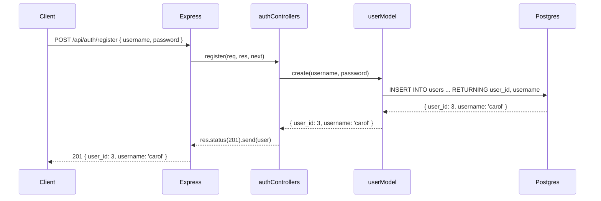
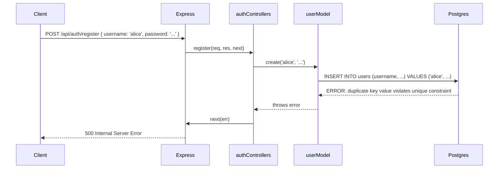
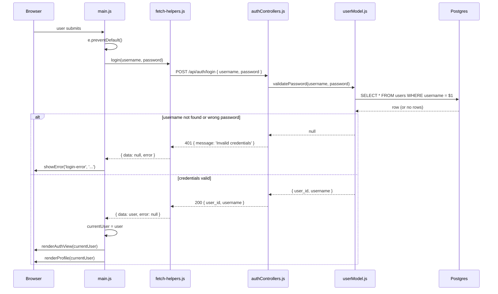

# 8. Postgres Models


Follow along with code examples [here](https://github.com/The-Marcy-Lab-School/6-8-postgres-models)!


Every application we've built so far has had data — pets, bookmarks, posts — but that data disappears the moment you restart the server. In this lesson we'll connect our Express server to Postgres so that data persists.

We'll build a user management system: registration, login, and basic CRUD operations on users. Along the way, you'll see the key architectural pattern of this module: **the model swap** — replacing an in-memory model with a Postgres-backed one without changing a single line of controller or route code.

By the end of this lesson, you'll have a working app — and two obvious problems with it. Identifying them is the point. They're the exact problems that lessons 9 and 12 solve.

**Table of Contents**

- [Essential Questions](#essential-questions)
- [Key Concepts](#key-concepts)
- [Setup](#setup)
  - [File Structure](#file-structure)
  - [Test the Endpoints](#test-the-endpoints)
- [Building the User API](#building-the-user-api)
  - [The In-Memory User Model](#the-in-memory-user-model)
  - [User Controllers](#user-controllers)
  - [Auth Controllers](#auth-controllers)
  - [API Routes](#api-routes)
- [Where Does `pg` Fit Into an Express Application?](#where-does-pg-fit-into-an-express-application)
  - [`pg.Pool` Setup](#pgpool-setup)
  - [Challenge: Write the Postgres User Model](#challenge-write-the-postgres-user-model)
  - [The Model Swap](#the-model-swap)
- [Error Handling](#error-handling)
  - [`try/catch` in Every Controller](#trycatch-in-every-controller)
  - [Error-Handling Middleware](#error-handling-middleware)
  - [Tracing a Request End to End](#tracing-a-request-end-to-end)
- [The Frontend Application](#the-frontend-application)
  - [Tracing a Login Request End to End](#tracing-a-login-request-end-to-end)
- [What's Wrong With This Code?](#whats-wrong-with-this-code)

## Essential Questions

By the end of this lesson, you should be able to answer these questions:

1. What is the difference between an in-memory model and a Postgres-backed model?
2. When you swap a model from in-memory to Postgres, what changes in your controllers and routes?
3. What is authentication? How does a server handle login and registration?
4. How should our server handle database errors?

## Key Concepts

* **In-memory model** — a model that stores data in JavaScript arrays and objects. All data is lost when the server restarts.
* **Postgres-backed model** — a model that uses `pool.query()` to read and write data in a database. Data persists across server restarts.
* **Authentication** — the process of verifying a user's identity (e.g. a user logging in with a username and password).
* **`try/catch` in controllers** — catches any error thrown by a model method and forwards it to the error-handling middleware via `next(err)`.
* **Error-handling middleware** — an Express middleware with exactly four parameters `(err, req, res, next)` that sends a structured error response when something goes wrong.

## Setup

**Before you begin:** Clone down the repo above and follow the setup steps below.

```sh
# cd into server
cd server

# Install dependencies
npm install

# Start the server
npm run dev
```

### File Structure

```
server/
├── controllers/
│   ├── authControllers.js        # register and login
│   └── userControllers.js        # listUsers, updateUser, deleteUser
├── db/
│   ├── pool.js                   # Postgres connection pool (edit for local setup)
│   └── seed.sql                  # Database schema and sample data
├── models/
│   ├── userModel-in-memory.js    # Starting point (in-memory data)
│   └── userModel.js              # Postgres User model (TODO)
└── index.js                      # Main Express app & authentication routes
```

### Test the Endpoints

Once the server is running, test the API with these `curl` commands:

**Authentication**

| Method | Path                 | Description       |
| ------ | -------------------- | ----------------- |
| POST   | `/api/auth/register` | Create a new user |
| POST   | `/api/auth/login`    | Log in            |

```sh
# Register a new user
curl -X POST http://localhost:3000/api/auth/register \
  -H "Content-Type: application/json" \
  -d '{"username": "alice", "password": "password123"}'

# Login
curl -X POST http://localhost:3000/api/auth/login \
  -H "Content-Type: application/json" \
  -d '{"username": "alice", "password": "password123"}'

# Login with wrong password (expect 401)
curl -X POST http://localhost:3000/api/auth/login \
  -H "Content-Type: application/json" \
  -d '{"username": "alice", "password": "wrongpassword"}'
```

**Users**

| Method | Path                  | Description       |
| ------ | --------------------- | ----------------- |
| GET    | `/api/users`          | List all users    |
| PATCH  | `/api/users/:user_id` | Update a password |
| DELETE | `/api/users/:user_id` | Delete a user     |

```sh
# List all users
curl http://localhost:3000/api/users

# Update a user's password
curl -X PATCH http://localhost:3000/api/users/1 \
  -H "Content-Type: application/json" \
  -d '{"password": "newpassword"}'

# Delete a user
curl -X DELETE http://localhost:3000/api/users/1
```

## Building the User API

### The In-Memory User Model

The app starts with an in-memory model — data stored in a JavaScript array:


```javascript
let users = [
  { user_id: 1, username: 'alice', password: 'password123' },
  { user_id: 2, username: 'bob',   password: 'hunter2' },
];
let nextId = 3;

// Returns all users — never exposes password
module.exports.list = () => {
  return users.map(({ user_id, username }) => ({ user_id, username }));
}

// Stores the user and returns user_id and username — never exposes password
module.exports.create = (username, password) => {
  const user = { user_id: nextId++, username, password };
  users.push(user);
  return { user_id: user.user_id, username: user.username };
};

// Returns user_id and username — never exposes password
// Used only to check whether a username is already taken (register)
// Returns null if not found
module.exports.findByUsername = (username) => {
  const user = users.find((u) => u.username === username);
  if (!user) return null;
  return { user_id: user.user_id, username: user.username };
};

// Finds the user by username and validates the password
// Returns user_id and username if credentials match — never exposes password
// Returns null if not found or password doesn't match
module.exports.validatePassword = (username, password) => {
  const user = users.find((u) => u.username === username);
  if (!user || user.password !== password) return null;
  return { user_id: user.user_id, username: user.username };
};

// Updates the user's password and returns user_id and username
// Returns null if user not found
module.exports.update = (user_id, password) => {
  const user = users.find((u) => u.user_id === Number(user_id));
  if (!user) return null;
  user.password = password;
  return { user_id: user.user_id, username: user.username };
};

// Deletes the user and returns user_id and username
// Returns null if user not found
module.exports.destroy = (user_id) => {
  const idx = users.findIndex((u) => u.user_id === Number(user_id));
  if (idx === -1) return null;
  const [user] = users.splice(idx, 1);
  return { user_id: user.user_id, username: user.username };
};
```


A few things worth noticing before moving on:

- Every method returns only `user_id` and `username` — the password is **never** sent back to a caller
- `findByUsername()` is used only by `register` to check whether a username is already taken — because it returns no password, it's safe to hand back to the controller as-is
- `validatePassword()` handles login: it does the internal lookup, compares the password, and returns `{ user_id, username }` on success or `null` on failure — the controller never touches the password field directly

These conventions carry over directly to the Postgres version.

### User Controllers

The user controllers handle listing, updating, and deleting users:


```javascript
const userModel = require('../models/userModel-in-memory');

// GET /api/users
const listUsers = async (req, res, next) => {
  try {
    const users = await userModel.list();
    res.send(users);
  } catch (err) {
    next(err);
  }
};

// PATCH /api/users/:user_id { password }
const updateUser = async (req, res, next) => {
  try {
    const { password } = req.body;
    const user = await userModel.update(req.params.user_id, password);
    if (!user) return res.status(404).send({ message: 'User not found' });
    res.send(user);
  } catch (err) {
    next(err);
  }
};

// DELETE /api/users/:user_id
const deleteUser = async (req, res, next) => {
  try {
    const user = await userModel.destroy(req.params.user_id);
    if (!user) return res.status(404).send({ message: 'User not found' });
    res.send(user);
  } catch (err) {
    next(err);
  }
};

module.exports = { listUsers, updateUser, deleteUser };
```


### Auth Controllers

**Authentication** is the process of verifying a user's identity. The most common form of authentication is a user logging in with a username and password combination.

The repo comes with two authentication endpoints: `register` and `login`. These are the first time you're seeing authentication logic, so the controllers are heavily commented:


```javascript
const userModel = require('../models/userModel-in-memory');

// POST /api/auth/register { username, password }
const register = async (req, res, next) => {
  try {
    // 1. Pull the username and password out of the request body
    const { username, password } = req.body;

    // 2. Check if the username is already taken
    const existingUser = await userModel.findByUsername(username);
    if (existingUser) {
      return res.status(400).send({ message: 'Username already taken' });
    }

    // 3. Store the new user — the model returns only user_id and username, never the password
    const user = await userModel.create(username, password);

    // 4. Respond with the new user and a 201 Created status
    res.status(201).send(user);
  } catch (err) {
    next(err);
  }
};

// POST /api/auth/login { username, password }
const login = async (req, res, next) => {
  try {
    // 1. Pull the username and password out of the request body
    const { username, password } = req.body;

    // 2. Validate credentials — the model handles the lookup and comparison.
    //    Returns user_id and username if valid, null otherwise.
    //    The same generic message is returned for both cases so an attacker
    //    can't tell whether the username or the password was wrong.
    const user = await userModel.validatePassword(username, password);
    if (!user) {
      return res.status(401).send({ message: 'Invalid credentials' });
    }

    // 3. Credentials are valid — respond with user_id and username
    res.send(user);
  } catch (err) {
    next(err);
  }
};

module.exports = { register, login };
```


Notice that `validatePassword` encapsulates the lookup *and* the comparison — the controller never touches the password field directly. The comparison itself is still a plain `!==` string check, which works but has a serious security flaw we'll address in lesson 9.

### API Routes

All five routes are registered in `index.js`.


```javascript
// ====================================
// Auth routes
// ====================================

app.post('/api/auth/register', register);
app.post('/api/auth/login', login);

// ====================================
// User routes
// ====================================

app.get('/api/users', listUsers);
app.patch('/api/users/:user_id', updateUser);
app.delete('/api/users/:user_id', deleteUser);
```


## Where Does `pg` Fit Into an Express Application?

Now that we understand how the application works, how will we use `pg` to make our data persistent?

When a client sends a `POST /api/auth/register` request, the server uses `pg` to run an `INSERT INTO users` SQL query against Postgres instead of pushing into a JavaScript array.


The beauty of this MVC architecture is that our controllers won't need to change at all when we make this swap. Just the models.

### `pg.Pool` Setup

1. First, edit `db/pool.js` and update the user and password fields to match your local Postgres setup. (On macOS you may be able to delete those fields entirely)

    ```js
    const { Pool } = require('pg');

    const config = {
      host: 'localhost',
      port: 5432,
      database: 'users_db',
      user: 'username', // <-- update me (or delete for MacOS)
      password: 'password', // <-- update me (or delete for MacOS)
    }

    // Create the pool and export it
    const pool = new Pool(config);

    module.exports = pool;
    ```


Note that `pool.js` creates the connection pool and exports it. Every model that needs to query the database just needs to import it:

```javascript
const pool = require('../db/pool');
```

There is one shared pool of connections across the whole server. You never run queries inside `pool.js` — it just creates and exports the pool. Querying is the model's job.


2. Then, run the commands below to create the `users_db` and seed it:

    ```sh
    # Create the database (run once)
    createdb users_db           # Mac
    sudo -u postgres createdb users_db   # Windows/WSL

    # Initialize the schema
    psql -f db/seed.sql                    # Mac
    sudo -u postgres psql -f db/seed.sql   # Windows/WSL

    # Start the server
    npm run dev
    ```


### Challenge: Write the Postgres User Model

The app currently runs on the in-memory model. Your job is to implement the Postgres-backed version.

This is the schema you are working with:

```sql
CREATE TABLE users (
  user_id  SERIAL PRIMARY KEY,
  username TEXT NOT NULL UNIQUE,
  password TEXT NOT NULL
);
```

Open `userModel.js`. The method signatures and comments are already there — you just need to fill in the SQL (refer back to lesson 7 to see how to use `pool.query()` and lesson 2 to review CRUD operations):


```javascript
const pool = require('../db/pool');

// Returns all users — never expose the password
module.exports.list = async () => {
  // TODO
};

// Stores the user and returns user_id and username — never expose password
module.exports.create = async (username, password) => {
  // TODO
};

// Returns user_id and username — never exposes password
// Used only to check whether a username is already taken (register)
// Returns null if not found
module.exports.findByUsername = async (username) => {
  // TODO
};

// Finds the user by username and validates the password
// Returns user_id and username if credentials match — never exposes password
// Returns null if not found or password doesn't match
module.exports.validatePassword = async (username, password) => {
  // TODO
};

// Updates the user's password and returns user_id and username — never expose password
// Returns null if not found
module.exports.update = async (user_id, password) => {
  // TODO
};

// Deletes the user and returns user_id and username
// Returns null if not found
module.exports.destroy = async (user_id) => {
  // TODO
};
```


Use `userModel-in-memory.js` as your reference for what each function should accept and return. Only the internals change — every method is now `async`, data comes from Postgres instead of an array, and `RETURNING user_id, username` replaces the manual return object.

**<details><summary>Solution: `userModel.js`</summary>**

```javascript
const pool = require('../db/pool');

module.exports.list = async () => {
  const { rows } = await pool.query('SELECT user_id, username FROM users ORDER BY user_id');
  return rows;
};

module.exports.create = async (username, password) => {
  const query = 'INSERT INTO users (username, password) VALUES ($1, $2) RETURNING user_id, username';
  const { rows } = await pool.query(query, [username, password]);
  return rows[0];
};

module.exports.findByUsername = async (username) => {
  const query = 'SELECT user_id, username FROM users WHERE username = $1';
  const { rows } = await pool.query(query, [username]);
  return rows[0] || null;
};

module.exports.validatePassword = async (username, password) => {
  const query = 'SELECT * FROM users WHERE username = $1';
  const { rows } = await pool.query(query, [username]);
  const user = rows[0];
  if (!user || user.password !== password) return null;
  return { user_id: user.user_id, username: user.username };
};

module.exports.update = async (user_id, password) => {
  const query = 'UPDATE users SET password = $1 WHERE user_id = $2 RETURNING user_id, username';
  const { rows } = await pool.query(query, [password, user_id]);
  return rows[0] || null;
};

module.exports.destroy = async (user_id) => {
  const query = 'DELETE FROM users WHERE user_id = $1 RETURNING user_id, username';
  const { rows } = await pool.query(query, [user_id]);
  return rows[0] || null;
};
```

</details>

### The Model Swap

Once your Postgres model is complete, open both controller files and change this one line in each:

```javascript
// Before
const userModel = require('../models/userModel-in-memory');

// After
const userModel = require('../models/userModel');
```

That's it. The controllers, routes, and everything else stay exactly the same. Test your endpoints with the `curl` commands from the Setup section — they should now read from and write to the database.


The controllers don't care where the user data comes from. They only know that `userModel.validatePassword(username, password)` returns `{ user_id, username }` or `null`. Whether that check runs against a JavaScript array or a Postgres database is the model's problem — not the controller's.

**This is why MVC matters.**


## Error Handling

In-memory model methods never fail — they operate on local variables and return immediately. Postgres model methods can fail for many reasons: the database is down, a query has a syntax error, a unique constraint is violated, the connection times out. Any of these will cause `pool.query()` to throw.

### `try/catch` in Every Controller

Unhandled rejections crash the request — the client gets no response or a generic network error. With `try/catch`, you catch the error and handle it gracefully without crashing the server.

Every controller in this repo follows the same pattern:

1. `await` the model method inside `try`
2. Send a success response if everything worked, or a `4xx` if the client made a mistake
3. In `catch`, call `next(err)` and let the error-handling middleware take it from there

**<details><summary>Q: Why handle user errors (`4xx`) separately from the `catch` block?</summary>**

`user === null` means the query *succeeded* but found no matching row — that's a 404, the resource doesn't exist.

An error caught by `catch` means something actually *broke* — a database failure, a malformed query, a connection timeout. That's a 500.

These are different problems that deserve different status codes. `if (!user)` handles the "not found" case; `catch` handles the "something went wrong" case.

</details>

### Error-Handling Middleware

Writing a `catch` block in every controller would be highly repetitive. Instead, every `catch` block calls `next(err)` and defers to a single error-handling middleware registered in `index.js`:


```javascript
// Error-handling middleware — must have exactly four parameters
const handleError = (err, req, res, next) => {
  console.error(err);
  res.status(500).send({ message: 'Internal Server Error' });
};

app.use(handleError);
```


This must be registered *after* all your routes. When any controller calls `next(err)`, Express skips all remaining middleware and routes and passes control directly to this handler.


Express identifies an error-handling middleware *only* by its four-parameter signature `(err, req, res, next)`. If you write it with three parameters, Express will treat it as regular middleware and never call it for errors.


### Tracing a Request End to End

Here is the full sequence for a successful `POST /api/auth/register` request:



Each layer only knows about the layers directly next to it:

- The client knows nothing about Express internals
- The controller knows nothing about SQL
- The model knows nothing about HTTP

**<details><summary>Q: What does the flow look like when a database error occurs?</summary>**

Suppose two users try to register with the same username. The `username` column has a `UNIQUE` constraint, so Postgres will reject the second insert:



`pool.query()` throws, the controller's `catch` block calls `next(err)`, and `handleError` sends the error response. No stack trace leaks. No silent crash.

</details>

## The Frontend Application

The repo includes a minimal frontend built with Vanilla JS and Vite. Run it alongside the server to see the full stack in action:

```sh
# In a second terminal, from the repo root
cd frontend
npm install
npm run dev   # starts at http://localhost:5173, proxies /api → localhost:3000
```

The frontend has three sections:

- **Auth** — login and register forms, hidden until "Log In / Register" is clicked
- **All Users** — a list of every registered user, always visible
- **My Profile** — view your username/ID, change your password, or delete your account (visible after login)

The questions below guide you through how the frontend is structured. Try to answer each one by reading the code before opening the answer.

**<details><summary>What is each file responsible for? Why split them at all?</summary>**

| File               | Responsibility                                                                                                                                       |
| ------------------ | ---------------------------------------------------------------------------------------------------------------------------------------------------- |
| `fetch-helpers.js` | Communicates with the server. Takes data in, returns data. Never touches the DOM.                                                                    |
| `dom-helpers.js`   | Reads from and writes to the DOM. Owns its own `querySelector` references. Never calls `fetch`.                                                      |
| `main.js`          | The coordinator. Holds event listeners, calls fetch helpers when the user acts, passes results to dom helpers. Also owns the `currentUser` variable. |

The split means each file can be read and understood in isolation. If something renders wrong, the problem is in `dom-helpers.js`. If an API call returns bad data, the problem is in `fetch-helpers.js`. `main.js` stays focused on wiring them together.

</details>

**<details><summary>What does the CSS class `"hidden"` do?</summary>**

In `styles.css`:

```css
.hidden {
  display: none !important;
}
```

Adding the `hidden` class to an element removes it from the layout entirely. Removing it makes the element visible again. The `!important` ensures no other rule can override it.

In JavaScript, `element.classList.add('hidden')` hides an element and `element.classList.remove('hidden')` shows it. This logic is used throughout the functions found in `dom-helpers.js`. 

</details>

**<details><summary>Which sections are shown / hidden for guests?</summary>**

On initial load, `currentUser` is `null` and `renderAuthView(null)` runs. In that state:

- **Visible:** `#guest-controls` (the "Log In / Register" button), `#users-section` (All Users list)
- **Hidden:** `#auth-controls` (username display), `#auth-section` (login/register forms), `#show-profile-btn` (My Profile tab), `#profile-section`

The auth forms only appear when the guest clicks "Log In / Register".

</details>

**<details><summary>Which sections can logged-in users see / access?</summary>**

After a successful login or register, `renderAuthView(currentUser)` runs with a real user object:

- **Visible:** `#auth-controls` (shows `@username` in the header), `#show-profile-btn` (My Profile tab), `#users-section`
- **Hidden:** `#guest-controls`, `#auth-section`

The profile section becomes accessible via the nav — it shows username, user ID, a change-password form, and a delete-account button.

</details>

**<details><summary>How is the fetch code organized? What is the point of the `baseURL` variable?</summary>**

All fetch calls live in `fetch-helpers.js` and flow through a single `handleFetch` wrapper:

```javascript
const handleFetch = async (url, config) => {
  try {
    const response = await fetch(url, config);
    if (!response.ok) throw new Error(`${response.status} ${response.statusText}`);
    const data = await response.json();
    return { data, error: null };
  } catch (error) {
    return { data: null, error };
  }
};
```

`handleFetch` applies `try/catch` once so the individual fetch functions don't need to. Every caller gets the same `{ data, error }` shape regardless of whether the request succeeded or failed.

`baseURL = '/api'` means if the API path ever changes (e.g. to `/api/v2`), only one line in one file needs to update. It also keeps each individual fetch function short:

```javascript
export const getUsers = () => handleFetch(`${baseURL}/users`);
```

</details>

**<details><summary>How does the frontend keep track of the logged-in user's information?</summary>**

A plain JavaScript variable in `main.js`:

```javascript
let currentUser = null;
```

After a successful login or register, it is set to the user object returned by the server:

```javascript
const { data: user, error } = await login(username, password);
currentUser = user; // { user_id: 1, username: 'alice' }
```

It is set back to `null` when the account is deleted. There is no cookie, no `localStorage`, no session — just a variable in memory.

</details>


**<details><summary>What happens when the user refreshes the page?</summary>**

All JavaScript restarts from scratch and `currentUser` initialises to `null` again. There is no `GET /api/auth/me` call on startup — this server has no session endpoint — so the server never tells the frontend who was logged in. The user always appears as a guest after a refresh, even if they had just logged in seconds before.

This is the fundamental problem that lesson 10 solves with `cookie-session`.

</details>

**<details><summary>8. Every fetch function returns `{ data, error }`. Why check `if (error)` rather than `if (!data)`?</summary>**

Because `data` can legitimately be `null` even when a request succeeds.

`if (!data)` would falsely treat a successful-but-null response as a failure. For example, a `DELETE` endpoint that returns an empty body, or a future `GET /api/auth/me` returning `null` when no one is logged in, would both have `data: null` — but that's not an error.

Checking `if (error)` is precise: it triggers only when `handleFetch`'s `catch` block fired, meaning something actually went wrong (network failure, non-2xx response, parse error).

</details>

**<details><summary>9. `renderAuthView` is called with either a user object or `null`. How does one function handle both states?</summary>**

```javascript
export const renderAuthView = (currentUser) => {
  if (currentUser) {
    currentUsernameEl.textContent = `@${currentUser.username}`;
    guestControls.classList.add('hidden');
    authControls.classList.remove('hidden');
    authSection.classList.add('hidden');
    showProfileBtn.classList.remove('hidden');
  } else {
    guestControls.classList.remove('hidden');
    authControls.classList.add('hidden');
    authSection.classList.add('hidden');
    showProfileBtn.classList.add('hidden');
    profileSection.classList.add('hidden');
  }
};
```

Passing a user object takes the `if` branch — shows the username and profile tab, hides guest controls. Passing `null` takes the `else` branch and reverses everything.

One function for both states means the logged-in and logged-out UI are always mirrors of each other. You can't update one path without seeing the other. It also means `main.js` only ever calls one thing — `renderAuthView(currentUser)` — regardless of what `currentUser` is.

</details>

### Tracing a Login Request End to End

The diagram below traces a login request through every layer of the stack — from the form submit in the browser to Postgres and back.



Each layer only communicates with the layers directly beside it. `main.js` knows nothing about SQL. `userModel.js` knows nothing about the DOM. The boundary between `fetch-helpers.js` and `authControllers.js` is the HTTP request — the line that crosses from browser to server.

**<details><summary>Generate a Sequence Diagram of Your Own Using Mermaid!</summary>**

Go to [https://mermaid.ai/](https://mermaid.ai/) and make a new Diagram. Then, paste the syntax below into the editor on the left:

```
sequenceDiagram
  participant B as Browser
  participant M as main.js
  participant F as fetch-helpers.js
  participant C as authControllers.js
  participant UM as userModel.js
  participant DB as Postgres

  B->>M: user submits #login-form
  M->>M: e.preventDefault()
  M->>F: login(username, password)
  F->>C: POST /api/auth/login { username, password }
  C->>UM: validatePassword(username, password)
  UM->>DB: SELECT * FROM users WHERE username = $1
  DB-->>UM: row (or no rows)

  alt username not found or wrong password
    UM-->>C: null
    C-->>F: 401 { message: 'Invalid credentials' }
    F-->>M: { data: null, error }
    M->>B: showError('login-error', '...')
  else credentials valid
    UM-->>C: { user_id, username }
    C-->>F: 200 { user_id, username }
    F-->>M: { data: user, error: null }
    M->>M: currentUser = user
    M->>B: renderAuthView(currentUser)
    M->>B: renderProfile(currentUser)
  end
```

</details>

## What's Wrong With This Code?

The app works. Users can register, log in, and be managed through the API. But there are two serious problems worth naming before moving on.

**Problem 1: Passwords are stored in plaintext.**

Look at the database directly:

```sql
SELECT * FROM users;
```

```
 user_id | username |  password
---------+----------+------------
       1 | alice    | password123
       2 | bob      | hunter2
```

Every password is readable as plain text. If an attacker gains access to this database, every user's password is immediately exposed. Since most people reuse passwords across sites, a breach of your app can compromise their email, bank, and other accounts too.

Lesson 9 fixes this by introducing **hashing** — a technique that makes it safe to handle passwords at all.

**Problem 2: Anyone can update or delete any user.**

Try this:

```sh
curl -X DELETE http://localhost:3000/api/users/1
```

User 1 is gone — and we didn't have to be logged in to do it. Any client can modify or delete any user.

Lesson 12 fixes this by introducing **authorization middleware** — a layer that verifies who is making the request before allowing certain actions to proceed.
