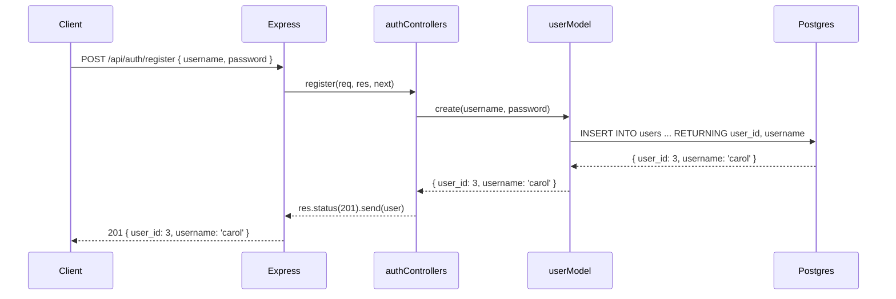
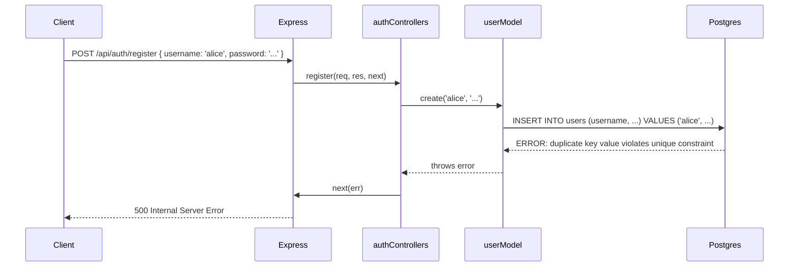

# 8. Postgres Models


Follow along with code examples [here](https://github.com/The-Marcy-Lab-School/6-8-postgres-models)!


Every application we've built so far has had data — pets, bookmarks, posts — but that data disappears the moment you restart the server. In this lesson we'll connect our Express server to Postgres so that data persists.

We'll build a user management system: registration, login, and basic CRUD operations on users. Along the way, you'll see the key architectural pattern of this module: **the model swap** — replacing an in-memory model with a Postgres-backed one without changing a single line of controller or route code.

By the end of this lesson, you'll have a working app — and two obvious problems with it. Identifying them is the point. They're the exact problems that lessons 9 and 12 solve.

**Table of Contents**

- [Essential Questions](#essential-questions)
- [Key Concepts](#key-concepts)
- [Setup](#setup)
  - [Files](#files)
  - [Test the Endpoints](#test-the-endpoints)
- [Building the User API](#building-the-user-api)
  - [The In-Memory User Model](#the-in-memory-user-model)
  - [User Controllers](#user-controllers)
  - [Auth Controllers](#auth-controllers)
  - [API Routes](#api-routes)
- [Where Does `pg` Fit Into an Express Application?](#where-does-pg-fit-into-an-express-application)
  - [`pg.Pool` Setup](#pgpool-setup)
  - [Challenge: Write the Postgres User Model](#challenge-write-the-postgres-user-model)
  - [The Model Swap](#the-model-swap)
- [Error Handling](#error-handling)
  - [`try/catch` in Every Controller](#trycatch-in-every-controller)
  - [Error-Handling Middleware](#error-handling-middleware)
  - [Tracing a Request End to End](#tracing-a-request-end-to-end)
- [What's Wrong With This Code?](#whats-wrong-with-this-code)

## Essential Questions

By the end of this lesson, you should be able to answer these questions:

1. What is the difference between an in-memory model and a Postgres-backed model?
2. When you swap a model from in-memory to Postgres, what changes in your controllers and routes?
3. What is authentication? How does a server handle login and registration?
4. How should our server handle database errors?

## Key Concepts

* **In-memory model** — a model that stores data in JavaScript arrays and objects. All data is lost when the server restarts.
* **Postgres-backed model** — a model that uses `pool.query()` to read and write data in a database. Data persists across server restarts.
* **Authentication** — the process of verifying a user's identity (e.g. a user logging in with a username and password).
* **`try/catch` in controllers** — catches any error thrown by a model method and forwards it to the error-handling middleware via `next(err)`.
* **Error-handling middleware** — an Express middleware with exactly four parameters `(err, req, res, next)` that sends a structured error response when something goes wrong.

## Setup

**Before you begin:** Clone down the repo above and follow the setup steps below.

```sh
# cd into server
cd server

# Install dependencies
npm install

# Start the server
npm run dev
```

### Files

- `index.js` — Express app with authentication and user routes
- `db/pool.js` — connection pool (edit this to match your local Postgres setup)
- `db/seed.sql` — creates the `users` table and seeds sample data
- `models/userModel-in-memory.js` — in-memory User model (the starting point)
- `models/userModel.js` — Postgres User model (TODOs — fill this in!)
- `controllers/authControllers.js` — `register` and `login` handlers
- `controllers/userControllers.js` — `listUsers`, `updateUser`, `deleteUser` handlers

### Test the Endpoints

Once the server is running, test the API with these `curl` commands:

**Authentication**

| Method | Path                 | Description       |
| ------ | -------------------- | ----------------- |
| POST   | `/api/auth/register` | Create a new user |
| POST   | `/api/auth/login`    | Log in            |

```sh
# Register a new user
curl -X POST http://localhost:3000/api/auth/register \
  -H "Content-Type: application/json" \
  -d '{"username": "alice", "password": "password123"}'

# Login
curl -X POST http://localhost:3000/api/auth/login \
  -H "Content-Type: application/json" \
  -d '{"username": "alice", "password": "password123"}'

# Login with wrong password (expect 401)
curl -X POST http://localhost:3000/api/auth/login \
  -H "Content-Type: application/json" \
  -d '{"username": "alice", "password": "wrongpassword"}'
```

**Users**

| Method | Path                  | Description       |
| ------ | --------------------- | ----------------- |
| GET    | `/api/users`          | List all users    |
| PATCH  | `/api/users/:user_id` | Update a password |
| DELETE | `/api/users/:user_id` | Delete a user     |

```sh
# List all users
curl http://localhost:3000/api/users

# Update a user's password
curl -X PATCH http://localhost:3000/api/users/1 \
  -H "Content-Type: application/json" \
  -d '{"password": "newpassword"}'

# Delete a user
curl -X DELETE http://localhost:3000/api/users/1
```

## Building the User API

### The In-Memory User Model

The app starts with an in-memory model — data stored in a JavaScript array:


```javascript
let users = [
  { user_id: 1, username: 'alice', password: 'password123' },
  { user_id: 2, username: 'bob',   password: 'hunter2' },
];
let nextId = 3;

// Returns all users — never exposes password
module.exports.list = () =>
  users.map(({ user_id, username }) => ({ user_id, username }));

// Stores the user and returns user_id and username — never exposes password
module.exports.create = (username, password) => {
  const user = { user_id: nextId++, username, password };
  users.push(user);
  return { user_id: user.user_id, username: user.username };
};

// Returns the full user object including password — used only for login comparison
module.exports.findByUsername = (username) =>
  users.find((u) => u.username === username) || null;

// Updates the user's password and returns user_id and username
// Returns null if user not found
module.exports.update = (user_id, password) => {
  const user = users.find((u) => u.user_id === Number(user_id));
  if (!user) return null;
  user.password = password;
  return { user_id: user.user_id, username: user.username };
};

// Deletes the user and returns user_id and username
// Returns null if user not found
module.exports.destroy = (user_id) => {
  const idx = users.findIndex((u) => u.user_id === Number(user_id));
  if (idx === -1) return null;
  const [user] = users.splice(idx, 1);
  return { user_id: user.user_id, username: user.username };
};
```


A few things worth noticing before moving on:

- `list()` returns only `user_id` and `username` — it deliberately hides the `password` field
- `findByUsername()` is the *only* function that returns the full user object including `password` — the login controller needs it to compare passwords
- Every other function hides the password in its return value — the caller never needs to see it back

These conventions carry over directly to the Postgres version.

### User Controllers

The user controllers handle listing, updating, and deleting users:


```javascript
const userModel = require('../models/userModel-in-memory');

// GET /api/users
const listUsers = async (req, res, next) => {
  try {
    const users = await userModel.list();
    res.send(users);
  } catch (err) {
    next(err);
  }
};

// PATCH /api/users/:user_id { password }
const updateUser = async (req, res, next) => {
  try {
    const { password } = req.body;
    const user = await userModel.update(req.params.user_id, password);
    if (!user) return res.status(404).send({ message: 'User not found' });
    res.send(user);
  } catch (err) {
    next(err);
  }
};

// DELETE /api/users/:user_id
const deleteUser = async (req, res, next) => {
  try {
    const user = await userModel.destroy(req.params.user_id);
    if (!user) return res.status(404).send({ message: 'User not found' });
    res.send(user);
  } catch (err) {
    next(err);
  }
};

module.exports = { listUsers, updateUser, deleteUser };
```


### Auth Controllers

**Authentication** is the process of verifying a user's identity. The most common form of authentication is a user logging in with a username and password combination.

The repo comes with two authentication endpoints: `register` and `login`. These are the first time you're seeing authentication logic, so the controllers are heavily commented:


```javascript
const userModel = require('../models/userModel-in-memory');

// POST /api/auth/register { username, password }
const register = async (req, res, next) => {
  try {
    // 1. Pull the username and password out of the request body
    const { username, password } = req.body;

    // 2. Store the new user — the model returns only user_id and username, never the password
    const user = await userModel.create(username, password);

    // 3. Respond with the new user and a 201 Created status
    res.status(201).send(user);
  } catch (err) {
    next(err);
  }
};

// POST /api/auth/login { username, password }
const login = async (req, res, next) => {
  try {
    // 1. Pull the username and password out of the request body
    const { username, password } = req.body;

    // 2. Look up the user by username — returns the full row including password
    const user = await userModel.findByUsername(username);

    // 3. If no user was found, or the password doesn't match, reject the request.
    //    The same generic message is returned for both cases so an attacker
    //    can't tell whether the username or the password was wrong.
    if (!user || user.password !== password) {
      return res.status(401).send({ message: 'Invalid credentials' });
    }

    // 4. Credentials are valid — respond with user_id and username only
    res.send({ user_id: user.user_id, username: user.username });
  } catch (err) {
    next(err);
  }
};

module.exports = { register, login };
```


Notice step 3 in `login`: the password comparison is a plain `!==` string check. It works — but it has a serious security flaw we'll address in lesson 9.

### API Routes

All five routes are registered in `index.js`.


```javascript
// ====================================
// Auth routes
// ====================================

app.post('/api/auth/register', register);
app.post('/api/auth/login', login);

// ====================================
// User routes
// ====================================

app.get('/api/users', listUsers);
app.patch('/api/users/:user_id', updateUser);
app.delete('/api/users/:user_id', deleteUser);
```


## Where Does `pg` Fit Into an Express Application?

Now that we understand how the application works, how will we use `pg` to make our data persistent?

When a client sends a `POST /api/auth/register` request, the server uses `pg` to run an `INSERT INTO users` SQL query against Postgres instead of pushing into a JavaScript array.


The beauty of this MVC architecture is that our controllers won't need to change at all when we make this swap. Just the models.

### `pg.Pool` Setup

1. First, edit `db/pool.js` and update the user and password fields to match your local Postgres setup. (On macOS you may be able to delete those fields entirely)

    ```js
    const { Pool } = require('pg');

    const config = {
      host: 'localhost',
      port: 5432,
      database: 'users_db',
      user: 'username', // <-- update me (or delete for MacOS)
      password: 'password', // <-- update me (or delete for MacOS)
    }

    // Create the pool and export it
    const pool = new Pool(config);

    module.exports = pool;
    ```


Note that `pool.js` creates the connection pool and exports it. Every model that needs to query the database just needs to import it:

```javascript
const pool = require('../db/pool');
```

There is one shared pool of connections across the whole server. You never run queries inside `pool.js` — it just creates and exports the pool. Querying is the model's job.


2. Then, run the commands below to create the `users_db` and seed it:

    ```sh
    # Create the database (run once)
    createdb users_db           # Mac
    sudo -u postgres createdb users_db   # Windows/WSL

    # Initialize the schema
    psql -f db/seed.sql                    # Mac
    sudo -u postgres psql -f db/seed.sql   # Windows/WSL

    # Start the server
    npm run dev
    ```


### Challenge: Write the Postgres User Model

The app currently runs on the in-memory model. Your job is to implement the Postgres-backed version.

This is the schema you are working with:

```sql
CREATE TABLE users (
  user_id  SERIAL PRIMARY KEY,
  username TEXT NOT NULL UNIQUE,
  password TEXT NOT NULL
);
```

Open `userModel.js`. The method signatures and comments are already there — you just need to fill in the SQL. We've implemented the first two for you:


```javascript
const pool = require('../db/pool');

// Returns all users — never expose the password
module.exports.list = async () => {
  const { rows } = await pool.query('SELECT user_id, username FROM users ORDER BY user_id');
  return rows;
};

// Stores the user and returns user_id and username — never expose password
module.exports.create = async (username, password) => {
  const query = 'INSERT INTO users (username, password) VALUES ($1, $2) RETURNING user_id, username';
  const { rows } = await pool.query(query, [username, password]);
  return rows[0];
};


// Returns the full user object including password — used only for login comparison
// Returns null if not found
module.exports.findByUsername = async (username) => {
  // TODO
};

// Updates the user's password and returns user_id and username — never expose password
// Returns null if not found
module.exports.update = async (user_id, password) => {
  // TODO
};

// Deletes the user and returns user_id and username
// Returns null if not found
module.exports.destroy = async (user_id) => {
  // TODO
};
```


Use `userModel-in-memory.js` as your reference for what each function should accept and return. Only the internals change — every method is now `async`, data comes from Postgres instead of an array, and `RETURNING user_id, username` replaces the manual return object.

**<details><summary>Solution: `userModel.js`</summary>**

```javascript
const pool = require('../db/pool');

module.exports.list = async () => {
  const { rows } = await pool.query('SELECT user_id, username FROM users ORDER BY user_id');
  return rows;
};

module.exports.create = async (username, password) => {
  const query = 'INSERT INTO users (username, password) VALUES ($1, $2) RETURNING user_id, username';
  const { rows } = await pool.query(query, [username, password]);
  return rows[0];
};

module.exports.findByUsername = async (username) => {
  const query = 'SELECT * FROM users WHERE username = $1';
  const { rows } = await pool.query(query, [username]);
  return rows[0] || null;
};

module.exports.update = async (user_id, password) => {
  const query = 'UPDATE users SET password = $1 WHERE user_id = $2 RETURNING user_id, username';
  const { rows } = await pool.query(query, [password, user_id]);
  return rows[0] || null;
};

module.exports.destroy = async (user_id) => {
  const query = 'DELETE FROM users WHERE user_id = $1 RETURNING user_id, username';
  const { rows } = await pool.query(query, [user_id]);
  return rows[0] || null;
};
```

</details>

### The Model Swap

Once your Postgres model is complete, open both controller files and change this one line in each:

```javascript
// Before
const userModel = require('../models/userModel-in-memory');

// After
const userModel = require('../models/userModel');
```

That's it. The controllers, routes, and everything else stay exactly the same. Test your endpoints with the `curl` commands from the Setup section — they should now read from and write to the database.


The controllers don't care where the user data comes from. They only know that `userModel.findByUsername(username)` returns a user or `null`. Whether that user comes from a JavaScript array or a Postgres database is the model's problem — not the controller's.

**This is why MVC matters.**


## Error Handling

In-memory model methods never fail — they operate on local variables and return immediately. Postgres model methods can fail for many reasons: the database is down, a query has a syntax error, a unique constraint is violated, the connection times out. Any of these will cause `pool.query()` to throw.

### `try/catch` in Every Controller

Unhandled rejections crash the request — the client gets no response or a generic network error. With `try/catch`, you catch the error and handle it gracefully without crashing the server.

Every controller in this repo follows the same pattern:

1. `await` the model method inside `try`
2. Send a success response if everything worked, or a `4xx` if the client made a mistake
3. In `catch`, call `next(err)` and let the error-handling middleware take it from there

**<details><summary>Q: Why handle user errors (`4xx`) separately from the `catch` block?</summary>**

`user === null` means the query *succeeded* but found no matching row — that's a 404, the resource doesn't exist.

An error caught by `catch` means something actually *broke* — a database failure, a malformed query, a connection timeout. That's a 500.

These are different problems that deserve different status codes. `if (!user)` handles the "not found" case; `catch` handles the "something went wrong" case.

</details>

### Error-Handling Middleware

Writing a `catch` block in every controller would be highly repetitive. Instead, every `catch` block calls `next(err)` and defers to a single error-handling middleware registered in `index.js`:


```javascript
// Error-handling middleware — must have exactly four parameters
const handleError = (err, req, res, next) => {
  console.error(err);
  res.status(500).send({ message: 'Internal Server Error' });
};

app.use(handleError);
```


This must be registered *after* all your routes. When any controller calls `next(err)`, Express skips all remaining middleware and routes and passes control directly to this handler.


Express identifies an error-handling middleware *only* by its four-parameter signature `(err, req, res, next)`. If you write it with three parameters, Express will treat it as regular middleware and never call it for errors.


### Tracing a Request End to End

Here is the full sequence for a successful `POST /api/auth/register` request:



Each layer only knows about the layers directly next to it:

- The client knows nothing about Express internals
- The controller knows nothing about SQL
- The model knows nothing about HTTP

**<details><summary>Q: What does the flow look like when a database error occurs?</summary>**

Suppose two users try to register with the same username. The `username` column has a `UNIQUE` constraint, so Postgres will reject the second insert:



`pool.query()` throws, the controller's `catch` block calls `next(err)`, and `handleError` sends the error response. No stack trace leaks. No silent crash.

</details>

## What's Wrong With This Code?

The app works. Users can register, log in, and be managed through the API. But there are two serious problems worth naming before moving on.

**Problem 1: Passwords are stored in plaintext.**

Look at the database directly:

```sql
SELECT * FROM users;
```

```
 user_id | username |  password
---------+----------+------------
       1 | alice    | password123
       2 | bob      | hunter2
```

Every password is readable as plain text. If an attacker gains access to this database, every user's password is immediately exposed. Since most people reuse passwords across sites, a breach of your app can compromise their email, bank, and other accounts too.

Lesson 9 fixes this by introducing **hashing** — a technique that makes it safe to handle passwords at all.

**Problem 2: Anyone can update or delete any user.**

Try this:

```sh
curl -X DELETE http://localhost:3000/api/users/1
```

User 1 is gone — and we didn't have to be logged in to do it. Any client can modify or delete any user.

Lesson 12 fixes this by introducing **authorization middleware** — a layer that verifies who is making the request before allowing certain actions to proceed.
