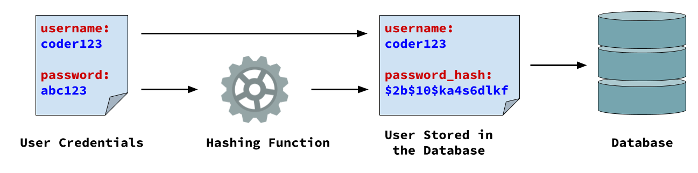

# 9. Hashing Passwords with Bcrypt


Follow along with code examples [here](https://github.com/The-Marcy-Lab-School/6-9-hashing-passwords-bcrypt)!


Every application we've built so far has had data — pets, bookmarks, posts — but no users. Adding users means letting people create accounts and log in. The moment you do that, you're responsible for protecting their passwords.

This lesson is about **hashing** — the technique that makes it safe to handle passwords at all. It's the foundation for everything in the next few lessons: building a registration endpoint, login, and protected routes.

**Table of Contents**

- [Essential Questions](#essential-questions)
- [Key Concepts](#key-concepts)
- [Why We Never Store Passwords in Plaintext](#why-we-never-store-passwords-in-plaintext)
- [How Hashing Works](#how-hashing-works)
  - [Authenticating with a Hash](#authenticating-with-a-hash)
  - [A Simple Example](#a-simple-example)
  - [Why Simple Hashing Isn't Enough](#why-simple-hashing-isnt-enough)
- [Bcrypt](#bcrypt)
  - [Hashing a Password with `bcrypt.hash()`](#hashing-a-password-with-bcrypthash)
  - [Salting](#salting)
  - [Comparing Passwords with `bcrypt.compare()`](#comparing-passwords-with-bcryptcompare)
- [Summary: The Password Validation Workflow](#summary-the-password-validation-workflow)
- [Practice](#practice)

## Essential Questions

By the end of this lesson, you should be able to answer these questions:

1. Why should passwords never be stored in plaintext?
2. What two properties must every hashing function have, and why does each matter?
3. How can a server verify a password if it never stores the actual password?
4. What is a salt, and why does bcrypt add one automatically?
5. What is the tradeoff when choosing the number of salt rounds?

## Key Concepts

* **Hashing** — a process that transforms a string into a fixed-length string called a **hash**. One-way: easy to produce a hash from a string, computationally impossible to reverse.
* **Hash** — the fixed-length output of a hashing function.
* **Plaintext password** — the password as entered by the user, before hashing. Never stored.
* **`password_hash`** — the column name for a stored hashed password. The name signals to every future developer that this column never holds a plain password.
* **Salt** — a random string added to the password before hashing, ensuring two identical passwords produce different hashes.
* **Salt rounds** — the number of times bcrypt re-salts and re-hashes the input. Higher = more secure but slower.
* **`bcrypt`** — a Node module that provides `bcrypt.hash()` for hashing and `bcrypt.compare()` for verification.

## Why We Never Store Passwords in Plaintext

When a user creates an account, they give you their password. Let's say its the string `"mypassword"`. What do you do with it?

The wrong answer — and a historically common one — is to store it directly in the database as-is. This is called storing a **plaintext password**, and it creates a serious vulnerability.

Databases get breached. Whether through a hack, a misconfigured server, or a bug that leaks data, it happens to companies large and small. When a database is breached and passwords are stored in plaintext, every password is immediately readable. Worse: since most people reuse passwords across sites, a breach of your app can compromise your users' email, bank, and social media accounts too.

Instead, we should convert the plaintext password `"mypassword"` into a **password hash**:

```
                   "mypassword"
                        ↓
                 hashing function
                        ↓
"$2b$08$N9qo8uLOickgx2ZMRZoMyeIjZAgcfl7p92ldGxad68LJZdL17lhWy"
```

Password hashes are impossible to reverse to figure out the plaintext password. This makes them safe to store in our databases!

So, how do we convert a plaintext password into a password hash? And how can we validate a plaintext password provided by a user against a password hash stored in a database?

Let's find out!

## How Hashing Works

A **hashing function** transforms a string into a hash. In order to be useful for password storage, the hashing function must have these two properties:

1. **One-way** — given a hash, it is computationally impossible to recover the original input. You can go from `"secret"` → `"abc123xyz..."`, but not from `"abc123xyz..."` → `"secret"`. This is what makes stolen hashes useless to an attacker.

2. **Pure (deterministic)** — the same input always produces the same output. `hash("secret")` always returns the same hash, no matter when or where it's called. This is what makes verification possible: hash the submitted password, compare to the stored hash.

Both properties are required. A function that is pure but not one-way lets attackers reverse hashes into passwords. A function that is one-way but not pure would produce different hashes for the same password, making verification impossible.

### Authenticating with a Hash

Because hashing is pure and one-way, a server can verify a password without ever storing it:


1. The user submits a username and password
2. The server uses the username to retrieve the stored `password_hash` in the database
3. The server uses the submitted password to generate a password hash
4. Compare the generated hash with the hash found in the database:
   1. If the two hashes match → authentication succeeds
   2. If they don't match → authentication fails

The original password never needs to be recovered — or stored. Even if an attacker steals the database, all they get is hashes.

### A Simple Example

Here is a simple hashing function that converts each character to its [ASCII](https://www.asciitable.com/) code. Notice that it is a pure function:

```js
const simpleHash = (str) => {
  let hash = '';
  for (let i = 0; i < str.length; i++) {
    hash += str.charCodeAt(i);
  }
  return hash;
};

// It is pure: if we hash the same password, we will always the get the same result
console.log(simpleHash('abc')); // '979899'
console.log(simpleHash('abc')); // '979899'

// save the hash in a variable to simulate storing it in a db
const hashedPassword = simpleHash('abc'); 

// To validate a password, hash the given password and compare it against a stored hash
const validatePassword = (passwordToTest, storedHash) => {
  return simpleHash(passwordToTest) === storedHash;
};

console.log(validatePassword('xyz', hashedPassword)); // false
console.log(validatePassword('abc', hashedPassword)); // true
```

This demonstrates the verification pattern: hash once to store, hash again to verify.

### Why Simple Hashing Isn't Enough

**<details><summary>Q: Given the hash `'999897'`, what plaintext string produced it?</summary>**

```js
simpleHash('cba'); // '999897'
```

`'c'` = 99, `'b'` = 98, `'a'` = 97. The hash is easily reversible by inspection — this algorithm is not one-way.

</details>

Our simple example fails the one-way requirement. A real-world hashing algorithm must be computationally irreversible: an attacker with a list of hashes shouldn't be able to work backwards to the passwords, even with significant computing power. This is where `bcrypt` comes in.

## Bcrypt

`bcrypt` is a Node module that provides production-grade hashing and verification. Install it:

```sh
npm install bcrypt
```

And import it at the top of the file where you want to use it:

```js
const bcrypt = require('bcrypt');
```

### Hashing a Password with `bcrypt.hash()`

`bcrypt.hash()` takes a plaintext password and a `saltRounds` number. It returns a Promise that resolves to the hash string:

```js
// Hashing is asynchronous so we need an async function
const main = async () => {
  const saltRounds = 8;
  const hashedPassword = await bcrypt.hash('mypassword', saltRounds);

  console.log(hashedPassword);
  // $2b$08$N9qo8uLOickgx2ZMRZoMyeIjZAgcfl7p92ldGxad68LJZdL17lhWy
}
main();
```

The resulting hash is a long, complex string — nothing like our readable simple example. 

Bcyrpt is well-regarded in the software industry for being [nearly impossible to reverse](https://specopssoft.com/blog/hashing-algorithm-cracking-bcrypt-passwords) assuming your password is strong.

So what is that `saltRounds` number for?

### Salting

Run `bcrypt.hash()` twice with the same password and you get two different hashes:

```js
console.log(await bcrypt.hash('mypassword', 8));
// $2b$08$N9qo8uLOickgx2ZMRZoMyeIjZAgcfl7p92ldGxad68LJZdL17lhWy

console.log(await bcrypt.hash('mypassword', 8));
// $2b$08$RVGAMi.W8o9yN9H3SfOvE.TjARHnJWCVJFIB1CUo/Z1pJt7j6kxuq
```

This is because each time `bcrypt.hash` is called, it generates a random string called a **salt** and mixes it into the password before hashing. Since the salt is different every time, the resulting hash is different too — even for the same password.


This matters because without salting, an attacker could use a **rainbow table** — a precomputed lookup of common passwords and their hashes. 


If `"password123"` always produces the same hash, a stolen database can be searched for any hashes in the rainbow table. Unique salts make these precomputed tables useless.


`saltRounds` controls how computationally expensive the hash is to produce. Higher rounds = exponentially harder to brute-force, but also slower on every registration and login.

`12` is the production standard. `8` is fine for a learning project.


### Comparing Passwords with `bcrypt.compare()`

`bcrypt.compare()` takes a plaintext password and a stored hash, and returns `true` if they match. It handles the salt automatically — you never need to think about it:

```js
const isValid = await bcrypt.compare('mypassword', hashedPassword);
console.log(isValid); // true

const isWrong = await bcrypt.compare('wrongpassword', hashedPassword);
console.log(isWrong); // false
```

Like `bcrypt.hash()`, this is async and returns a Promise.

**<details><summary>Q: Why doesn't `bcrypt.compare()` need the salt as a separate argument?</summary>**

bcrypt embeds the salt inside the hash string when it creates it. `bcrypt.compare()` extracts it automatically. You only ever store one thing — the hash — and it contains everything needed to verify any future password submission.

</details>

**<details><summary>Q: You call `bcrypt.hash('secret', 8)` twice and get `hash1` and `hash2` — two different strings. What does `bcrypt.compare('secret', hash2)` return?</summary>**

`true`. Both hashes were produced from `'secret'` with different salts, but `bcrypt.compare` extracts the correct salt from whichever hash you pass it. Either hash correctly represents the password `'secret'`.

</details>

## Summary: The Password Validation Workflow

**At registration** — hash once and store:



1. User submits a password
2. Server calls `bcrypt.hash(password, saltRounds)` to produce a hash
3. Server stores the username and `password_hash` in the database — never the original password

**At login** — hash again and compare:


1. User submits a username and password
2. Server retrieves the `password_hash` stored for that username
3. Server calls `bcrypt.compare(password, storedHash)`
4. If `true` → authentication succeeds; if `false` → 401

The next lesson puts this into practice: you'll build the `userModel` and the registration endpoint.

## Practice

Work through these in the follow-along repo. Create an `index.js` file and run it with `node index.js`.

1. Hash the string `'opensesame'` with `saltRounds = 8`. Store the result in a variable and log it.
2. Run the hash a second time. Store and log it to verify that you get a different hash string.
3. Use `bcrypt.compare()` to verify that `'opensesame'` matches both of your stored hashes.
4. Use `bcrypt.compare()` to verify that `'wrongpassword'` matches neither hash
5. Write a function `tryLogin(submittedPassword, storedHash)` that returns `true` if the password matches and `false` otherwise — do not call `bcrypt.compare()` directly in the caller

**<details><summary>Solution</summary>**

```js
const bcrypt = require('bcrypt');

const tryLogin = async (submittedPassword, storedHash) => {
  return bcrypt.compare(submittedPassword, storedHash);
};

const main = async () => {
  const hash1 = await bcrypt.hash('opensesame', 8);
  const hash2 = await bcrypt.hash('opensesame', 8);

  console.log(hash1);
  console.log(hash2);
  console.log(hash1 === hash2); // false — different salts

  console.log(await tryLogin('opensesame', hash1));    // true
  console.log(await tryLogin('opensesame', hash2));    // true
  console.log(await tryLogin('wrongpassword', hash1)); // false
  console.log(await tryLogin('wrongpassword', hash2)); // false
};

main();
```

</details>
