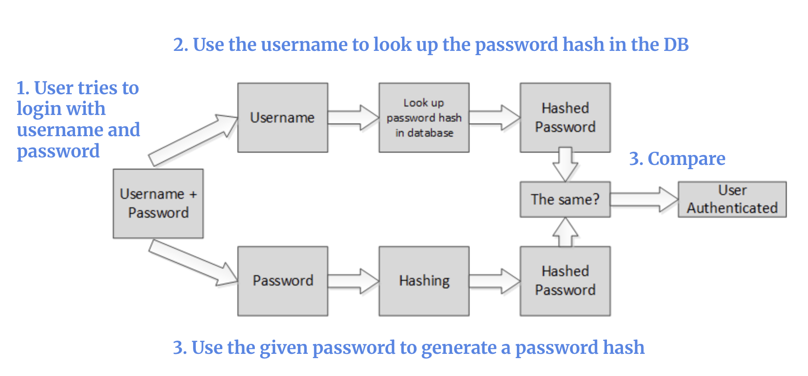
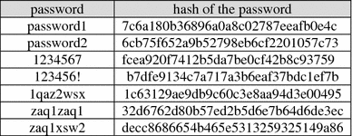
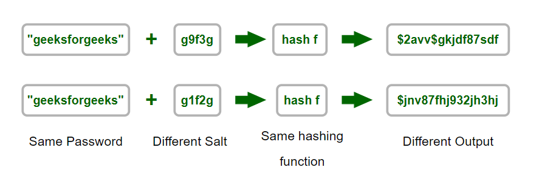
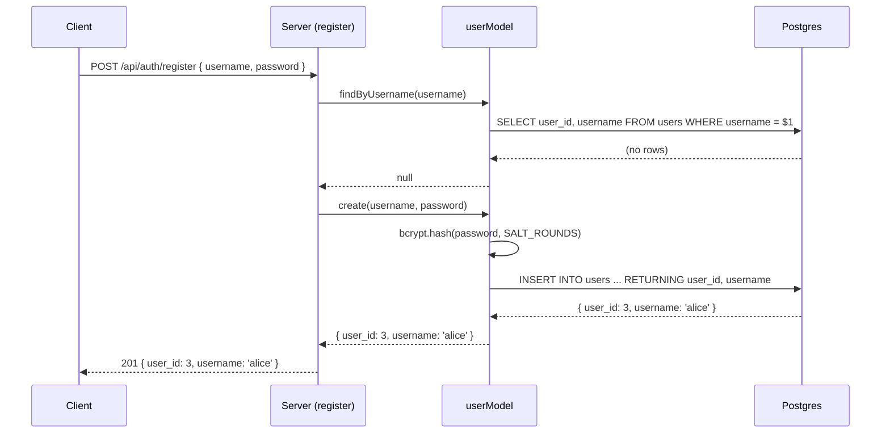
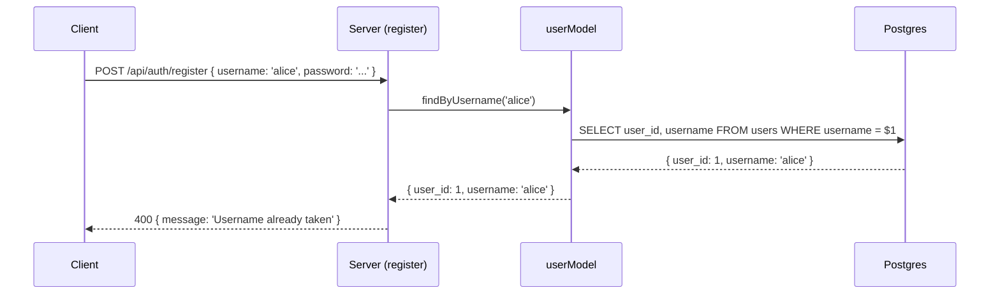
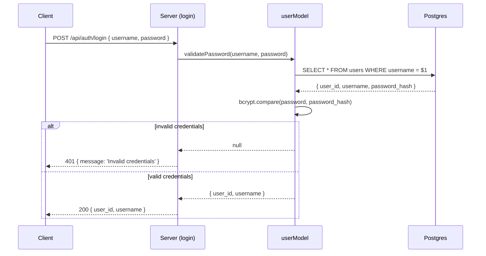

# 9. Hashing Passwords with BCrypt


Follow along with code examples [here](https://github.com/The-Marcy-Lab-School/6-9-hashing-passwords-bcrypt)!


In lesson 8, you built a working user system — registration, login, and basic CRUD, all backed by Postgres. But there's a flaw hiding in plain sight.

Look at the seed file from lesson 8:

```sql
INSERT INTO users (username, password) VALUES
  ('alice', 'password123'),
  ('bob',   'hunter2');
```

Passwords are stored exactly as the user typed them. If the database is ever breached, every password is immediately readable. This lesson fixes that.

The fix is **hashing** — a technique that makes it safe to store and verify passwords. You'll learn how it works, practice the bcrypt API in isolation, then apply it directly to the user model from lesson 8.

**Table of Contents**

- [Essential Questions](#essential-questions)
- [Key Concepts](#key-concepts)
- [Setup](#setup)
- [Why We Never Store Passwords in Plaintext](#why-we-never-store-passwords-in-plaintext)
- [How Hashing Works](#how-hashing-works)
  - [Authenticating with a Hash](#authenticating-with-a-hash)
  - [Salting: Simple Hashing Isn't Enough](#salting-simple-hashing-isnt-enough)
- [Bcrypt](#bcrypt)
  - [Hashing a Password with `bcrypt.hash(str, saltRounds)`](#hashing-a-password-with-bcrypthashstr-saltrounds)
  - [Comparing Passwords with `bcrypt.compare(plaintext, hash)`](#comparing-passwords-with-bcryptcompareplaintext-hash)
- [](#-endhint-)
- [Applying Bcrypt to the User Model](#applying-bcrypt-to-the-user-model)
  - [Seeding with Hashed Passwords](#seeding-with-hashed-passwords)
  - [The User Model](#the-user-model)
  - [Tracing the Auth Flows](#tracing-the-auth-flows)

## Essential Questions

By the end of this lesson, you should be able to answer these questions:

1. Why should passwords never be stored in plaintext?
2. What two properties must every hashing function have, and why does each matter?
3. How can a server verify a password if it never stores the actual password?
4. What is a salt, and what kind of attack does it prevent against?
5. How does our database schema change to store hashed passwords?
6. Which layer should be responsible for hashing and validating passwords — the model or the controller?

## Key Concepts

* **Hashing** — a process that transforms a string into a fixed-length string called a**hash**. One-way: easy to produce a hash from a string, computationally impossible to reverse.
* **Hash** — the fixed-length output of a hashing function.
* **Plaintext password** — the password as entered by the user, before hashing. Never stored.
* **`password_hash`** — the column name for a stored hashed password. The name signals to every future developer that this column never holds a plain password.
* **Salt** — a random string added to the password before hashing, ensuring two identical passwords produce different hashes.
* **Salt rounds** — the number of times bcrypt re-salts and re-hashes the input. Higher = more secure but slower.
* **`bcrypt`** — a Node module that provides`bcrypt.hash()` for hashing and`bcrypt.compare()` for verification.

## Setup

1. First, run these commands to install the dependencies in the `server` directory

    ```sh
    # cd into server
    cd server

    # Install dependencies
    npm install

    # Create the database (run one of these)
    createdb users_db           # Mac
    sudo -u postgres createdb users_db   # Windows/WSL
    ```

2. Then open `db/pool.js` and update the user and password fields to match your local Postgres setup (On macOS you may be able to delete those fields entirely).

## Why We Never Store Passwords in Plaintext

Databases get breached — through hacks, misconfigured servers, or bugs that leak data. When that happens and passwords are stored in plaintext, every password is immediately readable. Since most people reuse passwords across sites, a breach of your app can compromise your users' email, bank, and social media accounts too.

Instead of storing the password itself, we should store a **password hash**:

```
                   "mypassword"
                        ↓
                 hashing function
                        ↓
"$2b$08$N9qo8uLOickgx2ZMRZoMyeIjZAgcfl7p92ldGxad68LJZdL17lhWy"
```

Hashes are strings that are computationally generated from another string in a manner that is practically impossible to reverse. Even if an attacker steals a database full of hashed passwords, they will have no easy way to get the original passwords.

## How Hashing Works

A **hashing function** is what transforms a plaintext string into a hash. To be useful for password storage, it must have two properties:

1. **One-way** — given a hash, it is computationally impossible to recover the original input. You can go from`"secret"` →`"abc123xyz..."`, but not back. This is what makes stolen hashes useless to an attacker.
2. **Pure (deterministic)** — the same input always produces the same output.`hash("secret")` always returns the same hash. This is what makes verification possible.

Both are required. A function that is pure but not one-way lets attackers reverse hashes into passwords. A function that is one-way but not pure makes verification impossible.

### Authenticating with a Hash

Because hashing is pure and one-way, a server can verify a password without ever storing it:



1. The user submits a username and password
2. The server retrieves the stored`password_hash` for that username
3. The server hashes the submitted password
4. If the two hashes match → authentication succeeds; if not → authentication fails

The original password never needs to be recovered — or stored.

### Salting: Simple Hashing Isn't Enough

Even a strong one-way hashing function has a weakness: if `"password123"` always produces the same hash, an attacker can build a **rainbow table** — a precomputed lookup of common passwords and their hashes.



If a hash ever shows up in a breached database, a hacker with a rainbow table can quickly look up the original password. Rainbow tables have one weakness though: they are incredibly time and resource consuming to generate.

We take advantage of this weakness by adding a **salt** to the password. A salt is a random string mixed into the password before hashing.



With a unique salt, the same password produces a different hash each time we use the hashing function, rendering a rainbow table useless.

## Bcrypt

Writing our own hashing function would require expertise in cryptography. Instead, we'll use `bcrypt`—a Node module that provides production-grade hashing and verification. It handles salting automatically and makes it incredibly easy to validate hashes.

First install it as a dependency:

```sh
npm install
```

Then import it:



```javascript
const bcrypt = require('bcrypt');
```



The `bcrypt` module provides two key methods:

* `bcrypt.hash(str, saltRounds)` — returns a Promise that resolves to a hash of the string.
* `bcrypt.compare(plaintext, hash)` — returns a Promise that resolves to`true` if the`plaintext` string generates the same hash as`hash` given the same salt.

### Hashing a Password with `bcrypt.hash(str, saltRounds)`

`bcrypt.hash(str, saltRounds)` takes a plaintext string `str` and a `saltRounds` number, and returns a Promise that resolves to the hash string:



```javascript
const bcrypt = require('bcrypt');

const main = async () => {
  const saltRounds = 8;
  const hashedPassword = await bcrypt.hash('mypassword', saltRounds);
  console.log(hashedPassword);
  // $2b$08$N9qo8uLOickgx2ZMRZoMyeIjZAgcfl7p92ldGxad68LJZdL17lhWy
```



Run it twice with the same password and you get two different hashes — because bcrypt generates a new salt each time.


`saltRounds` controls how computationally expensive the hash is to produce. Higher rounds = exponentially harder to brute-force, but also slower on every registration and login. `12` is the production standard. `8` is fine for learning.


### Comparing Passwords with `bcrypt.compare(plaintext, hash)`

`bcrypt.compare(plaintext, hash)` returns a Promise that resolves to`true` if the`plaintext` string generates the same hash as`hash` given the same salt.

```js
const isValid = await bcrypt.compare('mypassword', hashedPassword);
console.log(isValid); // true

const isWrong = await bcrypt.compare('wrongpassword', hashedPassword);
console.log(isWrong); // false
```

**Q: You call `bcrypt.hash('secret', 8)` twice and get `hash1` and `hash2` — two different hash strings. What does `bcrypt.compare('secret', hash2)` return?**

Try it out!

```js
const hash1 = await bcrypt.hash('secret', 8);
const hash2 = await bcrypt.hash('secret', 8);

console.log(hash1, hash2); // confirm that they are different

bcrypt.compare('secret', hash1); // ?
bcrypt.compare('secret', hash2); // ?
```

**<details><summary>Answer</summary>**


`true`. Both hashes were produced from `'secret'` with different salts, but `bcrypt.compare` extracts the correct salt from whichever hash you pass it. Either hash correctly represents the password `'secret'`.

</details>


**How does bcrypt know what salt was used to generate the `hash`?**

It's actually embedded directly in the `hash` string itself and publicly visible. A typical bcrypt hash looks something like this:

```
$2a$12$R9h/lRnG9v5Iy.EBk92.uOayWp.mB199P9W.oX076/75S2pT.Dq.
```

It is divided into sections by the `$` symbol:
- **Prefix (`$2a$`)**: Identifies the version of the bcrypt algorithm used.
- **Cost Factor/Salt Rounds (`$12$`)**: This tells the computer how many iterations ($2^{12}$ or 4,096 rounds) to run. This is what makes bcrypt "slow" and resistant to brute-force attacks.
- **Salt (the next 22 characters)**: This is the random "noise" added to the password before hashing.
- **Hash (the remaining characters)**: This is the final result of the password + salt + multiple rounds of computation.

Counterintuitively, the salt doesn't need to be a secret in order for the hashed password to be secure. As long as the salt is unique and the original password is unknown, it is still impossible to reverse the hashing function.

And the nice thing is that `bcrypt.compare()` extracts the embedded salt automatically for you — you never need to manage it directly.

---

## Applying Bcrypt to the User Model

Now that you understand `bcrypt.hash()` and `bcrypt.compare()`, applying them to the user system from lesson 8 is straightforward. There are three things to update:

1. The **seed file** — switch from`.sql` to`.js` so we can hash passwords before inserting
2. The **user model** — three methods change; three stay exactly the same
3. Nothing else — controllers and routes are unchanged

### Seeding with Hashed Passwords

In lesson 8, the seed file was a `.sql` file that stored passwords in plaintext. Two things need to change.

**The column name.** `password` becomes `password_hash`. This signals to every developer who reads the schema that this column never holds a plaintext password.

**The file type.** We can't use a `.sql` file because SQL has no way to call `bcrypt.hash`. The seed file needs to be JavaScript:





```javascript
// db/seed.js
const bcrypt = require('bcrypt');
const pool = require('./pool');

const seed = async () => {
  await pool.query('DROP TABLE IF EXISTS users');
  await pool.query(`
    CREATE TABLE users (
      user_id       SERIAL PRIMARY KEY,
      username      TEXT NOT NULL UNIQUE,
      password_hash TEXT NOT NULL
    )
  `);

  const saltRounds = 8;
  const hash1 = await bcrypt.hash('password', saltRounds);
  const hash2 = await bcrypt.hash('123secret', saltRounds);

  const query = 'INSERT INTO users (username, password_hash) VALUES ($1, $2)'
  await pool.query(query, ['alice', hash1]);
  await pool.query(query, ['bob', hash2]);

  console.log('Database seeded.');
  await pool.end();
};

seed();
```





```sql
-- seed.sql
\c users_db

DROP TABLE IF EXISTS users;

CREATE TABLE users (
  user_id  SERIAL PRIMARY KEY,
  username TEXT NOT NULL UNIQUE,
  password TEXT NOT NULL
);

INSERT INTO users (username, password) VALUES
  ('alice', 'password123'),
  ('bob',   'hunter2');
```





Run it once to create the table and insert sample data:

```sh
node db/seed.js
```

### The User Model

Next, we need to update our model. 
* Previously the model was designed using plaintext passwords. Validation was as simple as selecting the password from the database and comparing it to a given password with `===`. 
* Now, we want to use `bcrypt.hash()` to hash passwords before storing them and use `bcrypt.compare()` to validate passwords against the hashes.

Three methods are unchanged because they have nothing to do with passwords. Three are updated to use bcrypt:


| Method             | Changes?                                   |
| ------------------ | ------------------------------------------ |
| `list`             | No                                         |
| `findByUsername`   | No                                         |
| `destroy`          | No                                         |
| `create`           | Yes — hash password before inserting       |
| `validatePassword` | Yes — use`bcrypt.compare` instead of `===` |
| `update`           | Yes — hash new password before updating    |



 

```javascript
// models/userModel.js
const bcrypt = require('bcrypt');
const pool = require('../db/pool');

const SALT_ROUNDS = 8;

// Unchanged
module.exports.list = async () => {
  const { rows } = await pool.query('SELECT user_id, username FROM users ORDER BY user_id');
  return rows;
};

// Now hashes the password before storing
module.exports.create = async (username, password) => {
  const password_hash = await bcrypt.hash(password, SALT_ROUNDS);
  const query = 'INSERT INTO users (username, password_hash) VALUES ($1, $2) RETURNING user_id, username';
  const { rows } = await pool.query(query, [username, password_hash]);
  return rows[0];
};

// Unchanged
module.exports.findByUsername = async (username) => {
  const query = 'SELECT user_id, username FROM users WHERE username = $1';
  const { rows } = await pool.query(query, [username]);
  return rows[0] || null;
};

// Now uses bcrypt.compare instead of ===
module.exports.validatePassword = async (username, password) => {
  const query = 'SELECT * FROM users WHERE username = $1';
  const { rows } = await pool.query(query, [username]);
  const user = rows[0];
  if (!user) return null;

  const isValid = await bcrypt.compare(password, user.password_hash);
  if (!isValid) return null;
  return { user_id: user.user_id, username: user.username };
};

// Now hashes the new password before updating
module.exports.update = async (user_id, password) => {
  const password_hash = await bcrypt.hash(password, SALT_ROUNDS);
  const query = 'UPDATE users SET password_hash = $1 WHERE user_id = $2 RETURNING user_id, username';
  const { rows } = await pool.query(query, [password_hash, user_id]);
  return rows[0] || null;
};

// Unchanged
module.exports.destroy = async (user_id) => {
  const query = 'DELETE FROM users WHERE user_id = $1 RETURNING user_id, username';
  const { rows } = await pool.query(query, [user_id]);
  return rows[0] || null;
};
```



 

```javascript
const pool = require('../db/pool');

module.exports.list = async () => {
  const { rows } = await pool.query('SELECT user_id, username FROM users ORDER BY user_id');
  return rows;
};

module.exports.create = async (username, password) => {
  const query = 'INSERT INTO users (username, password) VALUES ($1, $2) RETURNING user_id, username';
  const { rows } = await pool.query(query, [username, password]);
  return rows[0];
};

module.exports.findByUsername = async (username) => {
  const query = 'SELECT user_id, username FROM users WHERE username = $1';
  const { rows } = await pool.query(query, [username]);
  return rows[0] || null;
};

module.exports.validatePassword = async (username, password) => {
  const query = 'SELECT * FROM users WHERE username = $1';
  const { rows } = await pool.query(query, [username]);
  const user = rows[0];
  if (!user || user.password !== password) return null;
  return { user_id: user.user_id, username: user.username };
};

module.exports.update = async (user_id, password) => {
  const query = 'UPDATE users SET password = $1 WHERE user_id = $2 RETURNING user_id, username';
  const { rows } = await pool.query(query, [password, user_id]);
  return rows[0] || null;
};

module.exports.destroy = async (user_id) => {
  const query = 'DELETE FROM users WHERE user_id = $1 RETURNING user_id, username';
  const { rows } = await pool.query(query, [user_id]);
  return rows[0] || null;
};
```



 


`validatePassword` is the only function that selects the password with `SELECT *` — but it ensures the hash never leaves the model by returning only `{ user_id, username }`.

Again, note that the controllers do not need to be updated in when making this change!


### Tracing the Auth Flows

**Registration — username available:**



**Registration — username already taken:**



**Login:**



The next lesson introduces `cookie-session` to add sessions to both register and login, plus `/api/auth/me` and logout.
