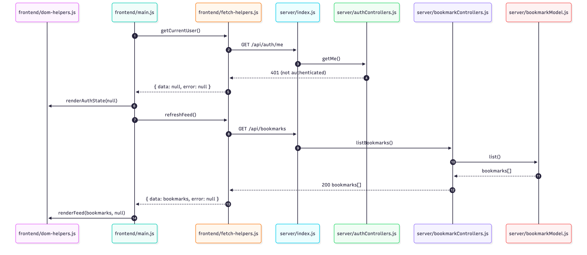
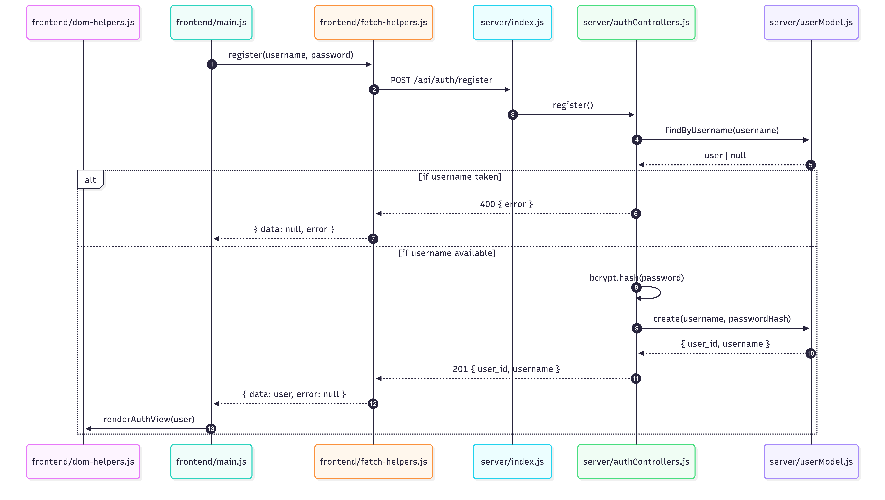
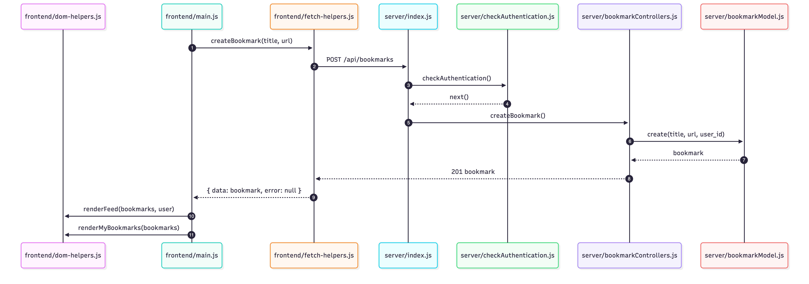
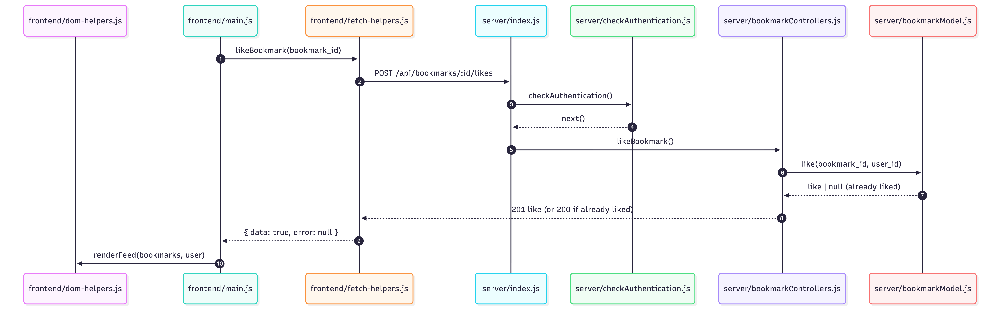
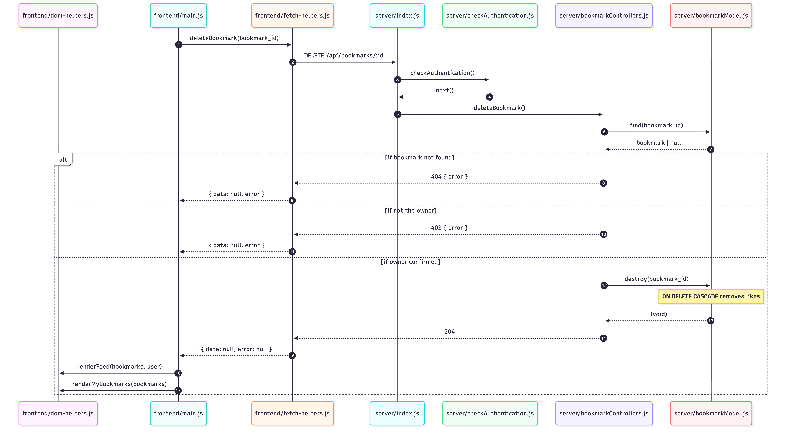

# Case Study: Social Bookmark Manager


Follow along with code examples [here](https://github.com/The-Marcy-Lab-School/swe-casestudy-6-social-bookmark-manager)!


- [Setup](#setup)
- [Overview](#overview)
- [Schema](#schema)
- [API Endpoints](#api-endpoints)
- [Explore the Solution](#explore-the-solution)
  - [Trace the Flow](#trace-the-flow)
    - [Scenario 1: The page loads and the public feed is rendered](#scenario-1-the-page-loads-and-the-public-feed-is-rendered)
    - [Scenario 2: The user submits the registration form](#scenario-2-the-user-submits-the-registration-form)
    - [Scenario 3: A logged-in user submits the Add Bookmark form](#scenario-3-a-logged-in-user-submits-the-add-bookmark-form)
    - [Scenario 4: A logged-in user clicks the Like button on a bookmark](#scenario-4-a-logged-in-user-clicks-the-like-button-on-a-bookmark)
    - [Scenario 5: A logged-in user clicks Delete on their own bookmark](#scenario-5-a-logged-in-user-clicks-delete-on-their-own-bookmark)
  - [Guided Reading Questions](#guided-reading-questions)
    - [`server/db/init.js`](#serverdbinitjs)
    - [`server/db/pool.js`](#serverdbpooljs)
    - [`server/db/seed.js`](#serverdbseedjs)
    - [`server/models/userModel.js`](#servermodelsusermodeljs)
    - [`server/models/bookmarkModel.js`](#servermodelsbookmarkmodeljs)
    - [`server/middleware/checkAuthentication.js`](#servermiddlewarecheckauthenticationjs)
    - [`server/controllers/authControllers.js`](#servercontrollersauthcontrollersjs)
    - [`server/controllers/bookmarkControllers.js`](#servercontrollersbookmarkcontrollersjs)
    - [`frontend/src/fetch-helpers.js`](#frontendsrcfetch-helpersjs)
- [Concepts Checklist](#concepts-checklist)
  - [Core — Databases \& Postgres](#core--databases--postgres)
  - [Core — Authentication \& Authorization](#core--authentication--authorization)
  - [Core — Fullstack Application](#core--fullstack-application)
  - [Core — Frontend](#core--frontend)
  - [Extension — Likes (Many-to-Many)](#extension--likes-many-to-many)

## Setup

Create a Postgres database, configure your environment, and initialize the schema:

```sh
# Create a local Postgres database
createdb social_bookmarks

# Copy the environment template
cp server/.env.template server/.env
# Edit server/.env and fill in your Postgres credentials and a SESSION_SECRET

# Install dependencies
npm install

# Initialize the database schema
npm run db:init

# Start the server
npm run dev
```

The server will be running at [http://localhost:8080](http://localhost:8080).

## Overview

This case study extends the mod-5 Bookmark Manager into a **Social Bookmark Manager** — a fullstack application where users create accounts, share bookmarks with the world, and like each other's links.

This case study demonstrates a Postgres-backed MVC server, user authentication with bcrypt and sessions, authorization middleware, and multi-table SQL queries with JOINs and aggregates.

The completed solution files are:

**Server**
- `server/index.js` — Express server, middleware, and routes
- `server/db/pool.js` — Shared Postgres connection pool
- `server/db/init.js` — One-time schema initialization script
- `server/models/userModel.js` — User data access and password validation
- `server/models/bookmarkModel.js` — Bookmark data access with JOIN queries
- `server/controllers/authControllers.js` — Register, login, me, logout
- `server/controllers/bookmarkControllers.js` — Bookmark CRUD and likes
- `server/middleware/checkAuthentication.js` — Auth guard middleware

**Frontend**
- `frontend/index.html` — Single-page HTML structure
- `frontend/src/main.js` — Page load logic and event handlers
- `frontend/src/fetch-helpers.js` — Functions that call the API
- `frontend/src/dom-helpers.js` — Functions that update the DOM

## Schema

The application uses three tables. Run `npm run db:init` to create them.

```sql
CREATE TABLE IF NOT EXISTS users (
  user_id   SERIAL PRIMARY KEY,
  username  TEXT UNIQUE NOT NULL,
  password_hash TEXT NOT NULL
);

CREATE TABLE IF NOT EXISTS bookmarks (
  bookmark_id SERIAL PRIMARY KEY,
  title       TEXT NOT NULL,
  url         TEXT NOT NULL,
  user_id     INT REFERENCES users(user_id) ON DELETE CASCADE
);

CREATE TABLE IF NOT EXISTS bookmark_likes (
  user_id     INT REFERENCES users(user_id) ON DELETE CASCADE,
  bookmark_id INT REFERENCES bookmarks(bookmark_id) ON DELETE CASCADE,
  PRIMARY KEY (user_id, bookmark_id)
);
```

**Entity relationship diagram:**

```
users ──< bookmarks
users >──< bookmarks  (through bookmark_likes)
```

## API Endpoints

| Method   | Endpoint                            | Auth Required | Description                             |
| -------- | ----------------------------------- | ------------- | --------------------------------------- |
| `POST`   | `/api/auth/register`                | No            | Create a new user account               |
| `POST`   | `/api/auth/login`                   | No            | Log in and start a session              |
| `GET`    | `/api/auth/me`                      | No            | Return the current logged-in user       |
| `DELETE` | `/api/auth/logout`                  | No            | End the current session                 |
| `GET`    | `/api/bookmarks`                    | No            | Get all bookmarks, sorted by like count |
| `POST`   | `/api/bookmarks`                    | Yes           | Create a new bookmark                   |
| `DELETE` | `/api/bookmarks/:bookmark_id`       | Yes           | Delete a bookmark (owner only)          |
| `POST`   | `/api/bookmarks/:bookmark_id/likes` | Yes           | Like a bookmark                         |
| `DELETE` | `/api/bookmarks/:bookmark_id/likes` | Yes           | Unlike a bookmark                       |
| `GET`    | `/api/users/:user_id/bookmarks`     | No            | Get all bookmarks by a specific user    |

## Explore the Solution

### Trace the Flow

Below, you will find 5 scenarios that exist in this application. For each, draw a sequence diagram to illustrate the flow of data and functions that make each scenario possible.

Scenario 1 and 2 are both fully worked examples — study the diagrams and detailed breakdown to understand the pattern. For Scenarios 3–5, draw your own sequence diagram first, then expand the answer to compare your diagram and check your breakdown.

---

#### Scenario 1: The page loads and the public feed is rendered



<details>

<summary><strong>Detailed Breakdown</strong></summary>

1. **`frontend/src/main.js`**: `main()` is called on page load.
2. **`frontend/src/main.js`**: `await getCurrentUser()` is called to check whether a session already exists.
3. **`frontend/src/fetch-helpers.js`**: `getCurrentUser()` sends a `GET /api/auth/me` request.
4. **`server/index.js`**: The request matches `GET /api/auth/me` and calls the `getMe` controller.
5. **`server/controllers/authControllers.js`**: `getMe` checks `req.session.user_id`. No session exists, so it sends `res.sendStatus(401)`.
6. **`frontend/src/fetch-helpers.js`**: `getCurrentUser()` receives the 401 response. Because a 401 here means "not logged in" (expected, not an error), it returns `{ data: null, error: null }`.
7. **`frontend/src/main.js`**: `main()` destructures the result — `currentUser = data` — setting `currentUser` to `null`. `renderAuthView(null)` is called — the "My Bookmarks" section is hidden and the auth forms are shown.
8. **`frontend/src/main.js`**: `await refreshFeed()` is called to load the public feed.
9. **`frontend/src/fetch-helpers.js`**: `refreshFeed()` calls `getBookmarks()`, which sends a `GET /api/bookmarks` request.
10. **`server/index.js`**: The request matches `GET /api/bookmarks` and calls the `listBookmarks` controller.
11. **`server/controllers/bookmarkControllers.js`**: `listBookmarks` calls `bookmarkModel.list()`.
12. **`server/models/bookmarkModel.js`**: `list()` runs a JOIN query combining `bookmarks`, `users`, and `bookmark_likes`. It returns an array of bookmark objects, each including `username` and `like_count`, sorted by `like_count DESC`.
13. **`server/controllers/bookmarkControllers.js`**: `res.send(bookmarks)` sends the array to the client.
14. **`frontend/src/fetch-helpers.js`**: `getBookmarks()` parses the response with `response.json()` and returns `{ data: bookmarks, error: null }`.
15. **`frontend/src/main.js`**: `refreshFeed()` destructures `{ data: bookmarks }` and calls `renderFeed(bookmarks || [], currentUser, likedBookmarkIds)`.
16. **`frontend/src/dom-helpers.js`**: `renderFeed()` clears the feed, creates a card for each bookmark showing title, URL, owner's username, and like count. Like buttons are rendered as disabled because `currentUser` is `null`.

</details>

---

#### Scenario 2: The user submits the registration form

Note: Observe how the diagram visualizes the two pathways: if the username was taken or if the username is available.



**Detailed Breakdown**

1. **`frontend/src/main.js`**: The `submit` event fires on `#register-form`. The inline async handler runs.
2. **`frontend/src/main.js`**: `username` and `password` are read from the form. `await register(username, password)` is called.
3. **`frontend/src/fetch-helpers.js`**: `register()` sends a `POST /api/auth/register` request with `Content-Type: application/json` and the credentials in the request body.
4. **`server/index.js`**: `express.json()` parses the request body into `req.body`. The request matches `POST /api/auth/register` and calls the `register` controller.
5. **`server/controllers/authControllers.js`**: The controller calls `userModel.findByUsername(username)` to check if the username is already taken.
6. **`server/models/userModel.js`**: `findByUsername()` queries the `users` table and returns the user row or `null`.
7. **`server/controllers/authControllers.js`**: If a user was found, the controller sends `400`. Otherwise, it calls `bcrypt.hash(password, SALT_ROUNDS)` to hash the plain-text password.
8. **`server/controllers/authControllers.js`**: Calls `userModel.create(username, passwordHash)`.
9. **`server/models/userModel.js`**: `create()` runs `INSERT INTO users ... RETURNING user_id, username` and returns the new user object (no `password_hash`).
10. **`server/controllers/authControllers.js`**: Sets `req.session.user_id = user.user_id`, then sends `res.status(201).send(user)`.
11. **`frontend/src/fetch-helpers.js`**: Parses the response and returns `{ data: user, error: null }`.
12. **`frontend/src/main.js`**: Destructures `{ data: user }`. If `user` is `null` (registration failed), the handler returns early. Otherwise, `currentUser = user`, `renderAuthView(user)` is called — hides auth forms, shows "My Bookmarks" section, and re-renders the feed with like buttons enabled.

---

#### Scenario 3: A logged-in user submits the Add Bookmark form

Draw a sequence diagram for this scenario, then expand to check your answer.

<details>

<summary><strong>Answer</strong></summary>



**Detailed Breakdown**

1. **`frontend/src/main.js`**: The `submit` event fires on `#add-bookmark-form`. The inline async handler runs.
2. **`frontend/src/main.js`**: `title` and `url` are read from the form. `await createBookmark(title, url)` is called.
3. **`frontend/src/fetch-helpers.js`**: `createBookmark()` sends a `POST /api/bookmarks` request with the bookmark data in the body.
4. **`server/index.js`**: `express.json()` parses the body. The request matches `POST /api/bookmarks`.
5. **`server/middleware/checkAuthentication.js`**: `checkAuthentication` runs first. It reads `req.session.user_id` — a session exists — so it calls `next()`.
6. **`server/controllers/bookmarkControllers.js`**: The `createBookmark` controller validates `title` and `url`, then calls `bookmarkModel.create(title, url, req.session.user_id)`.
7. **`server/models/bookmarkModel.js`**: `create()` runs `INSERT INTO bookmarks (title, url, user_id) VALUES ($1, $2, $3) RETURNING *` and returns the new bookmark.
8. **`server/controllers/bookmarkControllers.js`**: Sends `res.status(201).send(newBookmark)`.
9. **`frontend/src/main.js`**: After the response, calls `refreshFeed()` and `refreshMyBookmarks()` to re-fetch and re-render both lists.

</details>

---

#### Scenario 4: A logged-in user clicks the Like button on a bookmark

Draw a sequence diagram for this scenario, then expand to check your answer.

<details>

<summary><strong>Answer</strong></summary>



**Detailed Breakdown**

1. **`frontend/src/main.js`**: A click event fires on `#feed-list`. Event delegation calls `e.target.closest('.like-btn')` to find the clicked like button.
2. **`frontend/src/main.js`**: `bookmark_id` is read from the button's `data-bookmark-id` attribute. `await likeBookmark(bookmark_id)` is called.
3. **`frontend/src/fetch-helpers.js`**: `likeBookmark()` builds `config = { method: 'POST' }` and sends `POST /api/bookmarks/:bookmark_id/likes`.
4. **`server/index.js`**: The request matches the route and calls the `likeBookmark` controller.
5. **`server/middleware/checkAuthentication.js`**: `checkAuthentication` runs — session exists — calls `next()`.
6. **`server/controllers/bookmarkControllers.js`**: `likeBookmark` calls `bookmarkModel.like(bookmark_id, req.session.user_id)`.
7. **`server/models/bookmarkModel.js`**: `like()` runs `INSERT INTO bookmark_likes (bookmark_id, user_id) VALUES ($1, $2) ON CONFLICT DO NOTHING RETURNING *`. If the like already exists, `ON CONFLICT DO NOTHING` skips the insert and returns `null`. Otherwise it returns the new row.
8. **`server/controllers/bookmarkControllers.js`**: If `likeDidSucceed` is `null` (already liked), sends `res.status(200).send(true)`. Otherwise sends `res.status(201).send(true)`.
9. **`frontend/src/fetch-helpers.js`**: `likeBookmark()` returns `{ data: true, error: null }`.
10. **`frontend/src/main.js`**: Calls `refreshFeed()` to re-fetch and re-render the public feed with the updated like count.

</details>

---

#### Scenario 5: A logged-in user clicks Delete on their own bookmark

Draw a sequence diagram for this scenario, then expand to check your answer. Be sure to include separate sequences for these outcomes:
1. The bookmark was not found
2. The user sending the request is not the owner of the bookmark
3. The user sending the request is the owner and is authorized to delete

<details>

<summary><strong>Answer</strong></summary>



**Detailed Breakdown**

1. **`frontend/src/main.js`**: A click event fires on `#my-bookmarks-list`. Event delegation calls `e.target.closest('.delete-btn')` to find the clicked delete button.
2. **`frontend/src/main.js`**: `bookmark_id` is read from the button's `data-bookmark-id` attribute. `await deleteBookmark(bookmark_id)` is called.
3. **`frontend/src/fetch-helpers.js`**: `deleteBookmark()` sends a `DELETE /api/bookmarks/:bookmark_id` request.
4. **`server/index.js`**: The request matches the route and calls `deleteBookmark`.
5. **`server/middleware/checkAuthentication.js`**: `checkAuthentication` runs — session exists — calls `next()`.
6. **`server/controllers/bookmarkControllers.js`**: `deleteBookmark` calls `bookmarkModel.find(bookmarkId)` to look up the bookmark.
7. **`server/models/bookmarkModel.js`**: `find()` returns the bookmark row or `null`.
8. **`server/controllers/bookmarkControllers.js`**: If the bookmark doesn't exist, sends `404`. If `bookmark.user_id !== req.session.user_id`, sends `403`. Otherwise, calls `bookmarkModel.destroy(bookmarkId)`.
9. **`server/models/bookmarkModel.js`**: `destroy()` runs `DELETE FROM bookmarks WHERE bookmark_id = $1`. Because `bookmark_likes` has `ON DELETE CASCADE`, all associated likes are automatically removed.
10. **`server/controllers/bookmarkControllers.js`**: Sends `res.sendStatus(204)`.
11. **`frontend/src/main.js`**: Re-fetches and re-renders both the public feed and the "My Bookmarks" list.

</details>

---

### Guided Reading Questions

Open each file and answer the questions.

---

#### `server/db/init.js`

1. `init.js` loads a separate `init.sql` file and executes it rather than providing the SQL directly inside of the `pool.query()` call. What are the benefits of doing this? What are the constraints of this approach?
2. The `CREATE TABLE` statements use `CREATE TABLE IF NOT EXISTS` instead of `CREATE TABLE`. What does this mean? What would happen if you ran `npm run db:init` a second time without `IF NOT EXISTS`?
3. Both `bookmarks` and `bookmark_likes` reference `users` with `ON DELETE CASCADE`. What does `ON DELETE CASCADE` mean? What happens to a user's bookmarks and likes when their account is deleted?
4. The `bookmark_likes` table has no `like_id SERIAL` column. Instead it uses `PRIMARY KEY (user_id, bookmark_id)`. What is a composite primary key? What constraint does this enforce, and why is it more appropriate here than a serial ID?

<details>

<summary><strong>Answers</strong></summary>

1. Setting up the database table structure can involve many steps so keeping the SQL logic in a separate file dramatically improves readability and creates clear separation of concerns. Additionally, VS Code has syntax highlighting for `.sql` files making it easier to read, write, and edit SQL code. SQL written as a string in JavaScript is simply more prone to typos. Lastly, you can run a SQL file using the `psql` CLI which can makes the approach more flexible in terms of where you can use that code. The only constraint is that the SQL is hard-coded so data generated at runtime cannot be used.
2. `CREATE TABLE IF NOT EXISTS` only creates the table if it doesn't already exist. Without it, running `npm run db:init` a second time would throw an error because the table already exists and Postgres won't overwrite it.
3. `ON DELETE CASCADE` means that when a row in the referenced table is deleted, all rows in this table that reference it are automatically deleted too. Deleting a user automatically deletes all of their bookmarks (via `bookmarks.user_id`) and all of their likes (via `bookmark_likes.user_id`).
4. A composite primary key uses two or more columns together as a unique identifier. `PRIMARY KEY (user_id, bookmark_id)` means the combination of `user_id` and `bookmark_id` must be unique — a user can only like a specific bookmark once. A serial `like_id` would allow duplicate likes from the same user on the same bookmark.

</details>

---

#### `server/db/pool.js`

1. Why does the application use a connection pool instead of creating a new database connection for each request?
2. `pool.js` checks for `process.env.PG_CONNECTION_STRING` first and falls back to individual variables (`PG_HOST`, `PG_PORT`, etc.) if it isn't set. Why might a deployed application use a connection string while a local development environment uses individual variables?

<details>

<summary><strong>Answers</strong></summary>

1. Opening a new database connection on every request is slow and resource-intensive. A connection pool creates a fixed set of connections that are reused across requests, making the application significantly faster and preventing the database from being overwhelmed by too many simultaneous connections.
2. Hosting providers like Render provide a single `DATABASE_URL` connection string for deployed databases. Individual variables (`PG_HOST`, `PG_PORT`, etc.) are more convenient when configuring a local database by hand. Supporting both means the same `pool.js` works in both environments without modification.

</details>

---

#### `server/db/seed.js`

1. `init.js` loads a separate `init.sql` file and executes it, but `seed.js` keeps all logic in JavaScript with no `.sql` file. Why can't the seed data follow the same pattern as the schema?
2. The seed function uses `Promise.all()` to hash all three passwords at once instead of awaiting each `bcrypt.hash()` call in sequence. What does `Promise.all()` do differently? Why does this matter for a slow operation like bcrypt hashing?
3. The seed function deletes from all three tables before inserting, in the order `bookmark_likes` → `bookmarks` → `users`. Why does this specific order matter? What error would occur if you tried `DELETE FROM users` first?
4. Both `INSERT` queries use a `RETURNING` clause allowing us to capture the newly created data into variables. What problem would arise if you hardcoded IDs like `1`, `2`, `3` when inserting likes instead of using the data returned by the previous inserts?

<details>

<summary><strong>Answers</strong></summary>

1. The seed data includes passwords that must be hashed with `bcrypt` before being stored — plain-text passwords can never go into the database. `bcrypt.hash()` is a JavaScript function; there is no equivalent in SQL. A `.sql` file is just static text with no way to call external libraries. Any seed data that requires runtime computation must live in JavaScript.
2. `Promise.all()` runs all three `bcrypt.hash()` calls concurrently — all three start at the same time and the code waits for all of them to finish together. Awaiting each call in sequence runs them one at a time. Since bcrypt is intentionally slow (~300ms per hash at 12 rounds), sequential hashing would take ~900ms total. `Promise.all()` cuts that to ~300ms regardless of how many passwords there are.
3. `bookmark_likes` has a foreign key referencing `bookmarks`, and `bookmarks` has a foreign key referencing `users`. Deleting from `users` first would violate the foreign key constraint on `bookmarks` — Postgres won't allow deleting a user row that other rows still reference. You must delete dependent rows first, working from the most dependent table (`bookmark_likes`) back to the least (`users`).
4. After each `INSERT`, Postgres assigns auto-incremented IDs via `SERIAL`. The actual values depend on the sequence state — if the seed has been run before, the sequence has already advanced and `user_id` 1 may not exist. `RETURNING` captures the real IDs that Postgres just assigned so the likes insert references rows that are guaranteed to exist. Hardcoded IDs would silently produce wrong data or throw a foreign key violation on any run after the first.

</details>

---

#### `server/models/userModel.js`

1. Every function in this module queries the `users` table but only one of them ever selects `password_hash`. Which function is the exception? Why is it the only one that needs `password_hash`, and what does it do with it?
2. `validatePassword` returns `null` on failure. What does it return on success, and why is that a security problem? Why return `null` instead of throwing an error, and how does the controller use this return value?
3. `validatePassword` needs to look up a user by username, but it does not call `findByUsername` internally. Why not? What would break if it did?

<details>

<summary><strong>Answers</strong></summary>

1. `validatePassword` is the only function that selects `password_hash` (it does so through `SELECT *`). It needs the password hash to call `bcrypt.compare(password, user.password_hash)` — comparing the plain-text password from the login request against the stored hash. After the comparison it returns the full database row, which includes `password_hash`. This is an intentional flaw that the `authControllers.js` questions ask you to find.
2. On success, `validatePassword` returns all the matched user's data which includes `password_hash`. That hash should never leave the server — if `login` controller sends this object directly to the client, the hashed password is exposed in the response. It should instead return only `{ user_id, username }`. Returning `null` on failure signals "this operation produced no result" without crashing the program. The controller can check `if (!user) return res.status(401).json(...)` and handle it gracefully. Throwing an error would require a `try/catch` in the controller and is semantically more appropriate for unexpected failures, not an expected case like "wrong password."
3. `findByUsername` uses `SELECT user_id, username` — it deliberately excludes `password_hash`. If `validatePassword` called it, the returned object would have no `password_hash` field, so `bcrypt.compare` would receive `undefined` as the hash and fail to validate any password. `validatePassword` must run its own `SELECT *` query to get the hash it needs for the comparison.

</details>

---

#### `server/models/bookmarkModel.js`

1. The `list()` query uses both an `INNER JOIN` and a `LEFT JOIN`. Explain how and why each type of JOIN is used.
2. The query uses `GROUP BY bookmarks.bookmark_id, users.username`. Why is `GROUP BY` required here? What would happen without it?
3. Compare `bookmarkModel.list()` here to the mod-5 version (`return [...bookmarks]`). What changed in the model? What stayed exactly the same from the controller's perspective?

<details>

<summary><strong>Answers</strong></summary>

1. We use `LEFT JOIN` for `bookmark_likes` because it's permissive — bookmarks with zero likes still appear in the results. `INNER JOIN users` excludes any bookmarks without a matching user—but that's okay because the schema guarantees via foreign key that every bookmark has a matching user, so no rows would be dropped anyway.
2. `GROUP BY` is required whenever you use an aggregate function like `COUNT`. Without it, Postgres doesn't know how to collapse the multiple rows produced by the join (one row per like) into a single row per bookmark. `GROUP BY bookmarks.bookmark_id, users.user_id` tells Postgres to group all rows with the same `bookmark_id` together so `COUNT` can total the likes for each bookmark.
3. The model method signature is identical — `list()` takes no arguments and returns an array of objects. The controller calls it the same way: `const bookmarks = await bookmarkModel.list()`. What changed is the implementation: instead of returning `[...bookmarks]` from an in-memory array, it now runs an async SQL query. The controller didn't need to change at all — this is the payoff of MVC.

</details>

---

#### `server/middleware/checkAuthentication.js`

1. `checkAuthentication` checks for `req.session.user_id`. Where was this value originally set, and how does the server know which session belongs to which incoming request?
2. `checkAuthentication` returns `401` when the session is missing. What is the difference between `401 Unauthorized` and `403 Forbidden`? Which should the `deleteBookmark` controller use if a logged-in user tries to delete someone else's bookmark?
3. `checkAuthentication` is applied directly to individual routes that need protection (`POST /api/bookmarks`, `DELETE /api/bookmarks/:bookmark_id`, etc.) rather than to the entire router through `app.use(checkAuthentication)`. What would be the benefit of applying it to a whole router instead? What problem would that create for this application?

<details>

<summary><strong>Answers</strong></summary>

1. `req.session.user_id` is set in the `register` and `login` controllers after successful authentication. The `cookie-session` middleware serializes the session data into a signed cookie and sends it to the browser. On every subsequent request, the browser automatically includes this cookie, and `cookie-session` deserializes it back into `req.session` — so the server can read `req.session.user_id` on any request where the user is logged in.
2. `401 Unauthorized` means "you are not authenticated — I don't know who you are." `403 Forbidden` means "I know who you are, but you don't have permission to do this." `deleteBookmark` should use `403` when a logged-in user tries to delete another user's bookmark — the server knows their identity (they passed `checkAuthentication`), but they are not authorized to perform this specific action.
3. Applying middleware to a whole router (with `router.use(checkAuthentication)`) protects every route on that router with a single line. The problem here is that `GET /api/bookmarks` and `GET /api/users/:user_id/bookmarks` are public routes on the same router — adding `checkAuthentication` to the entire router would block unauthenticated users from viewing the feed, which defeats the purpose of a public feed.

</details>

---

#### `server/controllers/authControllers.js`

1. The `register` controller checks for an existing username before creating a new user. What HTTP status code does it return if the username is already taken, and why is that the appropriate code?
2. After a successful registration and login, the controller sets `req.session.user_id = user.user_id`. Where does `req.session` come from and why are we storing only `user.user_id` in it as opposed to the entire `user` object? 
3. There is an intentional security issue somewhere in this file. Can you find it? What data is being exposed that shouldn't be, and how would you fix it?

<details>

<summary><strong>Answers</strong></summary>

1. `400 Bad Request` — the request itself was understood but cannot be fulfilled because the input is invalid (a duplicate username). `409 Conflict` is also a valid choice for duplicate resource errors. `401` would be wrong here because this isn't an authentication failure.
2. `req.session` represents the cookie created by the `cookie-session` middleware (see `index.js`). Storing only `user_id` keeps the session small and avoids stale data. If you stored the full user object and the user later changed their username, the session would contain the old value. Storing just `user_id` means the server always fetches fresh user data from the database when needed (e.g., in the `GET /api/auth/me` endpoint).
3. The `login` controller calls `userModel.validatePassword()` and sends the returned user object directly in the response — `res.send(user)`. However, `validatePassword` uses `SELECT *` internally and returns the full database row including `password_hash`. That hash is sent to the client in the response. The fix: either ensure `validatePassword` returns only `{ user_id, username }` (never the hash), or explicitly destructure before responding: `const { password_hash, ...safeUser } = user; res.send(safeUser)`.

</details>

---

#### `server/controllers/bookmarkControllers.js`

1. `deleteBookmark` fetches the bookmark first, then checks ownership before deleting. What status code does it send if the bookmark doesn't exist? What status code if it exists but belongs to another user? Why are these different?
2. `likeBookmark` and `unlikeBookmark` are two separate controllers rather than a single `toggleLike` controller. What would a `toggleLike` controller need to do differently? What are the tradeoffs between the two approaches?
3. When `destroy()` deletes a bookmark, its associated rows in `bookmark_likes` are deleted automatically. Where exactly in the codebase is this behavior defined? What would happen to the `bookmark_likes` rows if that behavior weren't in place?

<details>

<summary><strong>Answers</strong></summary>

1. `404 Not Found` if the bookmark doesn't exist — the requested resource is absent. `403 Forbidden` if it exists but belongs to another user — the resource exists but the requester doesn't have permission to modify it. These are different because they communicate different problems to the client: "that thing doesn't exist" versus "that thing exists but it's not yours."
2. A single `toggleLike` controller would first query the `bookmark_likes` table to check if the like exists, then either insert or delete based on the result. The two-controller approach is simpler and more RESTful — `POST` to create a resource, `DELETE` to remove it — which is consistent with how the rest of the API is designed. The tradeoff is that the client must track like state and choose the right method, whereas a toggle endpoint offloads that logic to the server.
3. The `ON DELETE CASCADE` clause on `bookmark_likes.bookmark_id REFERENCES bookmarks(bookmark_id)` — defined in `server/db/init.js`. Without it, deleting a bookmark would fail with a foreign key constraint violation because `bookmark_likes` rows still reference the bookmark's `bookmark_id`. You would have to manually delete all associated likes before deleting the bookmark.

</details>

---

#### `frontend/src/fetch-helpers.js`

1. `handleFetch` is a shared wrapper used by every function in this file, and each group of endpoints has a `baseUrl` variable (e.g. `authBaseUrl`, `bookmarksBaseUrl`). What problem does each of these abstractions solve?
2. `getCurrentUser()` is called on every page load. What does it return when no one is logged in? How does `main.js` use this return value to decide which UI sections to show and hide?
3. Every fetch function in this file returns `{ data, error }` instead of returning the data or `null` directly. Why is this pattern useful? How does `main.js` use the destructured result from `login()` and `getCurrentUser()`?

<details>

<summary><strong>Answers</strong></summary>

1. `handleFetch` solves the problem of repeated try/catch boilerplate — without it, every fetch function would need its own error handling and would have to manually construct the `{ data, error }` return shape. The `baseUrl` variables solve the problem of duplicated strings: if the API path changes, there is one variable to update instead of every fetch call that uses that prefix.
2. When no session exists, the server sends `res.sendStatus(401)` from the `getMe` controller. `getCurrentUser()` receives the 401 response and, because a 401 here is expected rather than an error, returns `{ data: null, error: null }`. `main()` sets `currentUser = data` (null) and calls `renderAuthView(null)` — auth forms are shown and the "My Bookmarks" section is hidden. The same `currentUser` value is passed to `renderFeed()` so like buttons can be enabled or disabled based on login state.
3. The `{ data, error }` pattern makes it explicit whether a call succeeded or failed — `data` holds the result on success and `error` holds the Error object if something went wrong. This is more precise than returning `null` for both "no result" and "failure." In `main.js`, `login()` is called as `const { data: user } = await login(...)` — if `user` is `null` (wrong credentials), the handler returns early with `if (!user) return`. `getCurrentUser()` is called as `const { data } = await getCurrentUser()` — if no session exists, `data` is `null` and the UI shows the auth forms.

</details>

---

## Concepts Checklist

### Core — Databases & Postgres

- [ ] `CREATE TABLE IF NOT EXISTS` with `SERIAL PRIMARY KEY`, `TEXT`, `INT`, `NOT NULL`, `UNIQUE`
- [ ] Foreign keys with `REFERENCES` and `ON DELETE CASCADE`
- [ ] Composite primary key (`PRIMARY KEY (col1, col2)`)
- [ ] `INSERT`, `SELECT`, `UPDATE`, `DELETE` with parameterized queries (`$1`, `$2`)
- [ ] `INNER JOIN` to combine rows from two tables
- [ ] `LEFT JOIN` to include rows with no matching records in the joined table
- [ ] `COUNT` aggregate with `GROUP BY`
- [ ] `ORDER BY` to sort results
- [ ] Connection pool with `pg` (`new Pool(config)`)
- [ ] Dual connection config: `PG_CONNECTION_STRING` for production, individual vars for development
- [ ] `npm run db:init` via `server/db/init.js` to initialize schema

### Core — Authentication & Authorization

- [ ] `bcrypt.hash(password, saltRounds)` to hash passwords on registration
- [ ] `bcrypt.compare(password, hash)` to verify passwords on login
- [ ] Functional user model: `create`, `find`, `findByUsername`, `validatePassword`
- [ ] `validatePassword` as the only function that accesses `password_hash`
- [ ] `cookie-session` middleware setup with `SESSION_SECRET`
- [ ] Setting `req.session.user_id` on successful login or registration
- [ ] `GET /api/auth/me` pattern for restoring session state on page load
- [ ] `checkAuthentication` middleware: `401` when session is missing, `next()` when present
- [ ] Ownership check in controller: `403` when resource belongs to another user
- [ ] Route namespacing: `/api/auth/` for identity, `/api/bookmarks/` for data

### Core — Fullstack Application

- [ ] Build order: database → model → controllers → frontend
- [ ] Layer-by-layer testing: `psql`/TablePlus → scratch script → Postman → browser
- [ ] MVC model swap: controller is unchanged when swapping in-memory model for Postgres model
- [ ] `RETURNING` clause in `INSERT`/`UPDATE`/`DELETE` to get the affected row back
- [ ] Tracing a request across all layers: frontend fetch → controller → model → Postgres → response

### Core — Frontend

- [ ] `GET /api/auth/me` on page load to restore session and render correct UI state
- [ ] Show/hide sections with `hidden` class based on auth state
- [ ] Login and register forms with `fetch` to `/api/auth/` endpoints
- [ ] Re-fetching after mutations to keep UI in sync with server state
- [ ] `{ data, error }` return pattern from fetch helper functions
- [ ] `data-*` attributes to store IDs on DOM elements (e.g. `data-bookmark-id`)
- [ ] Event delegation with `closest()` for dynamically rendered lists

### Extension — Likes (Many-to-Many)

- [ ] Junction table (`bookmark_likes`) to represent a many-to-many relationship
- [ ] Composite primary key to enforce "one like per user per bookmark"
- [ ] `LEFT JOIN` + `COUNT` + `GROUP BY` to count likes per bookmark
- [ ] Like with `POST` to the nested route (`/api/bookmarks/:bookmark_id/likes`)
- [ ] `{ data: true, error: null }` as the return shape for fetch functions with no response body (204 / like)
