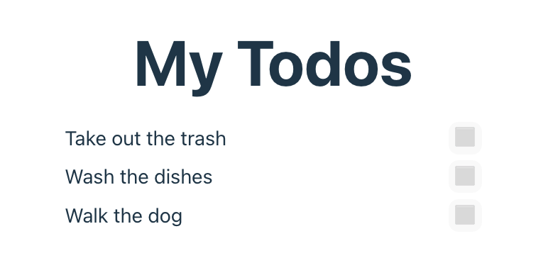
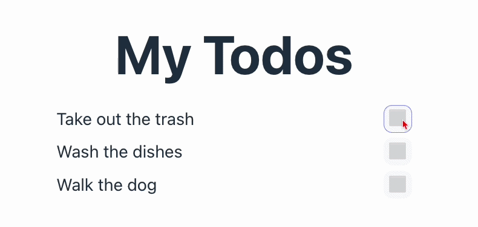
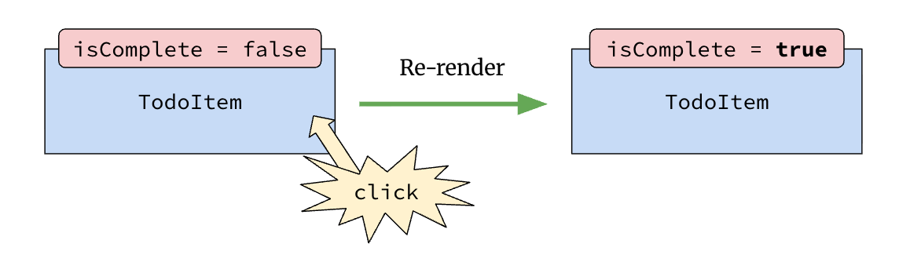

# 2. Events, State, and Forms


Follow along with code examples in the lecture [repo](https://github.com/The-Marcy-Lab-School/7-2-events-state-forms)!


In this lesson, we will look at how to respond to events in React and use those events to manage the ever-changing state in our application.

**Table of Contents**

- [Essential Questions](#essential-questions)
- [Key Concepts](#key-concepts)
- [What is State?](#what-is-state)
- [Event Handlers](#event-handlers)
  - [Adding Event Handlers to Components](#adding-event-handlers-to-components)
  - [Changing A Variable In Reaction to Events](#changing-a-variable-in-reaction-to-events)
- [`useState`](#usestate)
  - [Invoke useState at the top of your component](#invoke-usestate-at-the-top-of-your-component)
  - [Use the setter function to update the state](#use-the-setter-function-to-update-the-state)
  - [All Together Now](#all-together-now)
- [Conditional Rendering](#conditional-rendering)
  - [Ternary Operator](#ternary-operator)
  - [Conditional Rendering Challenge:](#conditional-rendering-challenge)
- [Forms and Lifting State Up](#forms-and-lifting-state-up)
  - [Lifting State Up](#lifting-state-up)
- [Bonus: Controlled Forms](#bonus-controlled-forms)

## Essential Questions

By the end of this lesson you should be able to answer:

1. What is state, and why can't a regular variable be used to track data that changes in a component?
2. What does `useState` return, and how do you use each of the two returned values?
3. What is a controlled form, and how does it differ from reading values directly from the DOM?
4. What does "lifting state up" mean, and when is it necessary?
5. What is conditional rendering, and what are the two common JSX patterns for it?

## Key Concepts

* **State** — Data that is used by an application at a particular point in time. State is often mutable, meaning it can be changed over time, usually in response to user actions or other events
* **Stateful Component** — A component that depends on state and is re-rendered whenever the state changes.
* **Hooks** — Functions that provide a wide variety of features for React components. They all begin with `use()`.
* **`useState`** – A react hook for managing state within a React component. It returns an array with a state value and a setter function that triggers the component to re-render with a new state value.
* **Lifting state up** — A practice where state is defined in a parent component so that it can be used by its child components.
* **Controlled Form** — A form whose value changes are controlled by a piece of state.
* **Conditional Rendering** — Rendering different JSX depending on the current state or props.

## What is State?

In this lesson, we'll build a simple Todo list application to demonstrate **stateful components**. A stateful component is one that depends on state and re-renders whenever the state changes.

**State** is the data that is used by an application at a particular point in time. State is often mutable, meaning it can change over time in response to user actions.

Our todo list will start with a static array of todos and grow to support:
- Toggling a todo between complete and incomplete
- Adding new todos via a form

Right now the app is not stateful or interactive: it renders hard-coded todo items, the toggle buttons don't work, and there is no form.



Before we jump into adding in state, take a moment and analyze the code in the `todo-app` directory. It should be mostly a review the previous lessons. As you look over the code, attempt to answer these questions:

**<details><summary>1. How would you get this project up and running?</summary>**

The project is a Vite project so we would do:

```sh
cd todo-app
npm i       # install Vite dependencies
npm run dev # start the development server
```

</details>

**<details><summary>2. What files are executed by the browser and in what order?</summary>**

The Vite development server first provides the `index.html` file to the browser. It then loads the `main.jsx` file which renders the `App` component in the `App.jsx` file.

</details>

**<details><summary>3. Why do we need to use `className=""` instead of `class=""` in JSX?</summary>**

We are writing HTML-like syntax in a JavaScript file and `class` is a reserved JavaScript keyword. So in JSX we use a slightly different attribute name `className`.

</details>

**<details><summary>4. How is the `todos` array used to generate a list of `TodoItem` components?</summary>**

In `App`, `todos.map` is called to create an array of `TodoItem` components, one per todo object. That array is inserted inside of the `ul` using `{}` syntax.

</details>

**<details><summary>5. What is a prop? What props are used in these components? And what do they do?</summary>**

A prop is a value provided to a component by its parent component. It is like a parameter for a component. For example, the `TodoItem` component receives a `title` prop from the `App` component, allowing each `TodoItem` to display a different task.

</details>

**<details><summary>6. Why is every todo item showing up as incomplete (⬜) instead of complete (✅)?</summary>**

The button element in the `TodoItem` component uses a ternary to show ⬜ or ✅ depending on the value of `isComplete`. 

```jsx
<button>
  {isComplete ? '✅' : '⬜'}
</button>
```

However, `isComplete` value is hard-coded to `false` so all todo items appear incomplete.

</details>

## Event Handlers

Users interacting with applications is one of the primary ways that an application's state will change. For example, with a todo list a user might click on a button to change the state of a todo item between "incomplete" and "complete" states. Our user interface can then update to those changes in state.



### Adding Event Handlers to Components

When learning the DOM API, we used `element.addEventListener()` to set up event handling. We would opt for patterns like **event delegation** to minimize the total number of event listeners when, say, handling click events in a list of elements. 

We also explicitly avoided using in-line event handlers like this as it meant that we would be combining HTML and JavaScript:

```html
<button onclick="doSomething()">Click Me</button>
```

React throws all of our conventions from Vanilla JS out the window and allows us to define event handlers directly on components. Check out how we add a "click" event handler to the button in our `TodoItem`:

```jsx
const TodoItem = ({ title }) => {
  let isComplete = false;

  // New event handler function
  const handleClick = () => {
    console.log(`${title} button clicked`);
  }

  return (
    <li className="todo-item">
      <span>{title}</span>
      <button onClick={handleClick}>
        {isComplete ? '✅' : '⬜'}
      </button>
    </li>
  );
};
```

Notice that we are treating `onClick` as a prop and providing the function `handleClick` as the value. React will then invoke that function whenever a "click" event is triggered by that button.

Also notice that we use camel case `onClick` instead of `onclick`. This naming change applies to all inline event handlers listed below:

**Mouse**: `onclick`, `ondblclick`, `onmouseover`, `onmouseout`, `onmousedown`, `onmouseup`.
**Keyboard**: `onkeydown`, `onkeyup`, `onkeypress`.
**Form**: `onsubmit`, `onchange`, `onfocus`, `onblur`, `oninput`.
**Window/Global**: `onload`, `onresize`, `onscroll`, `onerror`


💡 **In React, we can completely ignore event delegation**. React handles all of the optimizations for us under the hood!

When we set an `onClick` prop, React doesn't actually attach the event listener to that DOM element. Instead, it is attached to a single root element. When a user interacts with the page and triggers an event, the event bubbles up the DOM tree to the root node, where React captures the event and delegates it accordingly.


### Changing A Variable In Reaction to Events

Let's try to make `isComplete` a piece of mutable state.

We want to toggle `isComplete` each time we click on the button. So, maybe this will work?

```jsx
const TodoItem = ({ title }) => {
  console.log('rendering TodoItem');
  
  let isComplete = false;

  const handleClick = () => {
    isComplete = !isComplete;
    console.log(isComplete);
  }

  return (
    <li className="todo-item">
      <span>{title}</span>
      <button onClick={handleClick}>
        {isComplete ? '✅' : '⬜'}
      </button>
    </li>
  );
};
```

While this _does_ flip the `isComplete` value, it doesn't cause the component to re-render. Notice that the `console.log` only runs once! We need something else.

## `useState`

So how do we make the component re-render with the updated `isComplete` value?

We need a **hook**. Hooks in react are functions that perform a variety of jobs. They can be identified by their name which starts with "use":

* `useState()`
* `useEffect()`
* `useNavigate()`
* `useParams()`
* `useContext()`
* etc...

The `useState` hook allows us to create a special piece of state that is attached to a component. React can monitor that state and when its value changes, React will re-render the component.



Let's look at how it works:

### Invoke useState at the top of your component

First import `useState` as a named export from `react`.

Then, delete the existing `isComplete` variable and instead call `useState()` at the top of the component. This "attaches" the state to the component: 

```jsx
import { useState } from "react";

const TodoItem = ({ title }) => {
  // Creates "reactive" state that will re-render TodoItem when it changes
  const [isComplete, setIsComplete] = useState(false);
  
  console.log(isComplete);      // false
  console.log(setIsComplete);   // function () { [native code] }
  
  // the rest of the function...
};
```

`useState` works like this:
* **Input**: the starting value for a new state piece of state
* **Output**: an array with two values:
  1. The current state value, attached to the component
  2. A setter function that re-renders the component with a new state value

And some additional details:
* `useState` _must_ be called at the top of a component [otherwise weird stuff happens](https://legacy.reactjs.org/docs/hooks-rules.html).
* `useState()` is invoked with the starting value for the new piece of state (`false`)
* The convention is to destructure the array to create variables that hold the state value and the setter function with names like `[something, setSomething]`

### Use the setter function to update the state

Our code that uses the `isComplete` variable can stay exactly the same. 

However, `handleClick` now needs to use `setIsComplete()` to change the `isComplete` state and make the component re-render.

Try out each of these approaches below while using `console.log(isComplete)` at the end of the function. What does it print for each approach?

```jsx
const handleClick = () => {
  // Approach 1: hard-code the new state value
  setIsComplete(true);                  
  
  // Approach 2: write a function that uses the current isComplete value to compute and return the new isComplete value
  setIsComplete((current) => !current);
  
  // Approach 3: Don't do this. Updates the value for "this" render but doesn't cause a re-render
  isComplete = !isComplete;   
  
  console.log(isComplete); // What will this print for each approach?
};
```

When we invoke a state setter like `setIsComplete()`, we can provide either:
* the new value we want to set `isComplete` to, or...
* a callback function that uses the current `isComplete` value to compute and return the new `isComplete` value

In approaches 1 and 2, `setIsComplete()` will re-render the component with the new state.

Interestingly, the value of the state doesn't change in the "initial" render. Conversely, mutating `isComplete = !isComplete` directly *does* change its value in the initial render but does not cause the component to re-render so the user never sees the change!

### All Together Now

```jsx
const TodoItem = ({ title }) => {
  const [isComplete, setIsComplete] = useState(false);

  const handleClick = () => {
    setIsComplete((currentIsComplete) => !currentIsComplete);
  };

  return (
    <li className="todo-item">
      <span>{title}</span>
      <button onClick={handleClick}>
        {isComplete ? '✅' : '⬜'}
      </button>
    </li>
  );
};
```

**Quiz!**

* Why did we pass in `false` when we invoked `useState`?
* What does `useState()` return?
* What does `setIsComplete()` do? What kinds of inputs does it take?


`setIsComplete` does NOT change `isComplete` within the current function call — it schedules a re-render with the new value. Add `console.log(isComplete)` inside `handleClick` to see this: the logged value is still the old one. `setIsComplete` tells React what the next value _should_ be; the variable only updates on the next render.


## Conditional Rendering

Often we want to show different UI based on the current state. React makes this easy with two common patterns.

### Ternary Operator

Use a **ternary** when you want to render one thing _or_ another:

```jsx
condition ? <ComponentA /> : <ComponentB />
```

We already have a ternary implemented using the `isComplete` state in `TodoItem` to change the content of the button.

```jsx
const TodoItem = ({ title }) => {
  const [isComplete, setIsComplete] = useState(false);

  const handleClick = () => {
    setIsComplete((currentIsComplete) => !currentIsComplete);
  };

  return (
    <li className="todo-item">
      <span>{title}</span>
      <button onClick={handleClick}>
        {isComplete ? '✅' : '⬜'}
      </button>
    </li>
  );
};
```

Notice how much cleaner this is compared to using a full `if`/`else` statement to choose the return structure:

```jsx
const TodoItem = ({ title }) => {
  const [isComplete, setIsComplete] = useState(false);

  const handleClick = () => {
    setIsComplete((currentIsComplete) => !currentIsComplete);
  };

  // Condition 1
  if (isComplete) {
    return (
      <li className="todo-item">
        <span>{title}</span>
        <button onClick={handleClick}>✅</button>
      </li>
    );
  } 
  
  // Condition 2:
  else {
    return (
      <li className="todo-item">
        <span>{title}</span>
        <button onClick={handleClick}>⬜</button>
      </li>
    );
  }
};
```

### Conditional Rendering Challenge:

Use conditional rendering to set a `className` on the `span`.
* If `isComplete` is true, the class should be set to `'todo-complete'`.
* Otherwise, just set it as an empty string `''`.

**<details><summary>Solution</summary>**

```jsx
<li className="todo-item">
  <span className={isComplete ? 'todo-complete' : ''}>{title}</span>
  <button onClick={handleClick}>
    {isComplete ? '✅' : '⬜'}
  </button>
</li>
```

</details>

## Forms and Lifting State Up

Next up we'll make a form for the user to add new todos. There already is an `AddTodoForm` component in the `App.jsx` file. Include it in the `main` between the `h1` and the list of `TodoItem`s:

```jsx
<main>
  <h1>My Todos</h1>
  <AddTodoForm />
  <ul id='todo-list'>
    {todos.map((todo) => <TodoItem key={todo.id} title={todo.title} />)}
  </ul>
</main>
```

Creating a form using JSX in React is *almost* identical to creating a form using HTML, with a few tweaks that should be familiar by now:
* Instead of `for` we use `htmlFor` when connecting labels and inputs.
* We use `onSubmit` instead of using `addEventListener`.

```jsx
const AddTodoForm = () => {
  const handleSubmit = (e) => {
    e.preventDefault();

    const form = e.target;
    const title = form.elements.title.value;

    console.log(title);
  }

  return (
    <form onSubmit={handleSubmit}>
      <label htmlFor="title-input">Todo:</label>
      <input type="text" name="title" id="title-input" />
      <button>Add</button>
    </form>
  )
}
```

Now, how do we take that `title` value from the form and actually use it to make a new `TodoItem` component?

### Lifting State Up

The last step to putting this together is having the form submission actually add a new todo to the list.

Here is the component tree of the application:

```
App
├── h1
├── TodoItem (× n)
└── AddTodoForm
```

Recall that `todos` is defined within the `App` component which means it is out of scope for `AddTodoForm` to access. Perhaps we just move `todos` to the global scope and write code like this:

```jsx
const handleSubmit = (e) => {
  e.preventDefault();

  const form = e.target;
  const title = form.elements.title.value;

  const newTodo = {
    id: todos.length + 1,
    title
  };
  todos.push(title);
}
```

**Pause and think for a moment:** What is the issue with this? Will the user see the new todo rendered?

Mutating `todos` in "this" rendering will not cause the components to re-render with the updated data. Users will still see the old todo list.

The `todos` array needs to be come a mutable piece of state such that
* `App` can use `todos` to render the list of `TodoItem` elements
* `AddTodoForm` can use `setTodos` to update the `todos` array and trigger a re-render

```jsx
const [todos, setTodos] = useState(initialTodos);
```

**Challenge: Where should I put this? Why?**

The state should be defined in `App`, which is the closest shared ancestor of both `AddTodoForm` the list of and `TodoItem` components. `App` can then pass the values down to its children as props. This is called **"lifting state up"**.

* `App` uses `useState` to define the `todos` and `setTodos` values. When `todos` is updated, the entire `App` will re-render.
* It uses `todos` to render the list of `TodoItem` components
* It makes an `addTodo` helper function and passes it down to `AddTodoForm` to invoke upon submission

```jsx
function App() {
  // 1. Turn todos into a "reactive" state value
  const [todos, setTodos] = useState([
    { id: 1, title: 'Take out the trash' },
    { id: 2, title: 'Wash the dishes' },
    { id: 3, title: 'Walk the dog' },
  ]);

  // 2. A helper that invokes setTodos when called, re-rendering App
  const addTodo = (title) => {
    const newTodo = {
      id: todos.length + 1,
      title
    };

    setTodos((currentTodos) => [...currentTodos, newTodo]);
  }

  // Pass addTodo as a prop to AddTodoForm
  return (
    <main>
      <h1>My Todos</h1>
      <AddTodoForm addTodo={addTodo} />
      <ul id='todo-list'>
        {todos.map((todo) => <TodoItem key={todo.id} title={todo.title} />)}
      </ul>
    </main>
  )
};
```

Notice how `addTodo` sets the new state as `[...currentTodos, newTodo]`? React is "lazy" and only checks if the memory address (the reference) of your state has changed, not the content inside it. If we just pushed a value into `todos` and wrote `setTodos(todos)`, then React would never re-render since the memory address stays the same. 

Instead, we must update the state to a *new* array containing the current contents of the todos array and the new todo object.

Finally, the `AddTodoForm` can invoke `addTodo` in the submit handler which will cause the `App` to re-render.

```jsx
const AddTodoForm = ({ addTodo }) => {
  const handleSubmit = (e) => {
    e.preventDefault();

    const form = e.target;
    const title = form.elements.title.value;

    // This invokes `setTodos` internally, re-rendering App with the new title
    addTodo(title);
  }

  return (
    <form onSubmit={handleSubmit}>
      <label htmlFor="title-input">Todo:</label>
      <input type="text" name="title" id="title-input" />
      <button>Add</button>
    </form>
  )
}
```

In summary, if Component A (the form) needs to change what Component B (the list) shows, the state cannot live in either one. It must live in their closest common parent (in this case, App).
* Data flows down (via props).
* Actions flow up (via helper functions passed as props).

## Bonus: Controlled Forms

A **controlled form** is a form element whose input values are controlled by React state rather than through DOM manipulation.

To create a controlled form, we will:

1. Create a piece of state for each input we want to control
2. Assign the `value` prop of the input to the input state value we just created
3. Assign an `onChange` handler to the input that invokes the state setter function
4. When handling submissions, we can simply reference the input state values.
5. Remember to reset the state values after submission.

```jsx
const AddTodoForm = () => {
  // 1. Create a piece of state for each input we want to control
  const [title, setTitle] = useState('');

  const handleSubmit = (e) => {
    e.preventDefault();

    // 4. When handling submissions, we can simply reference the input state values.
    console.log(title);

    // 5. Remember to reset the state values after submission.
    setTitle('');
  }

  // 2. Assign the `value` prop of the input to the input state value we just created
  // 3. Assign an `onChange` handler to the input so that the `title` state remains up-to-date
  return (
    <form onSubmit={handleSubmit}>
      <label htmlFor="title-input">Todo:</label>
      <input 
        type="text" 
        name="title" 
        id="title-input" 
        value={title} 
        onChange={(e) => setTitle(e.target.value)} 
      />
      <button>Add</button>
    </form>
  )
}
```

Notice how each input has a `value` and an `onChange` prop associated with a particular piece of state. When it is time to submit the form, we can easily use the `title` state value without digging through the form.

Controlled forms present a tradeoff:
* They are most useful if you need **instant validation** on input (e.g. an input cannot include numbers and you want to immediately tell the user when they enter a number, not after they submit).
* However, because the state is updated on every change to the form input, that can cause a much higher number of re-renders. So, for simple forms like this, **uncontrolled forms** (using `form.elements`) is preferred.
