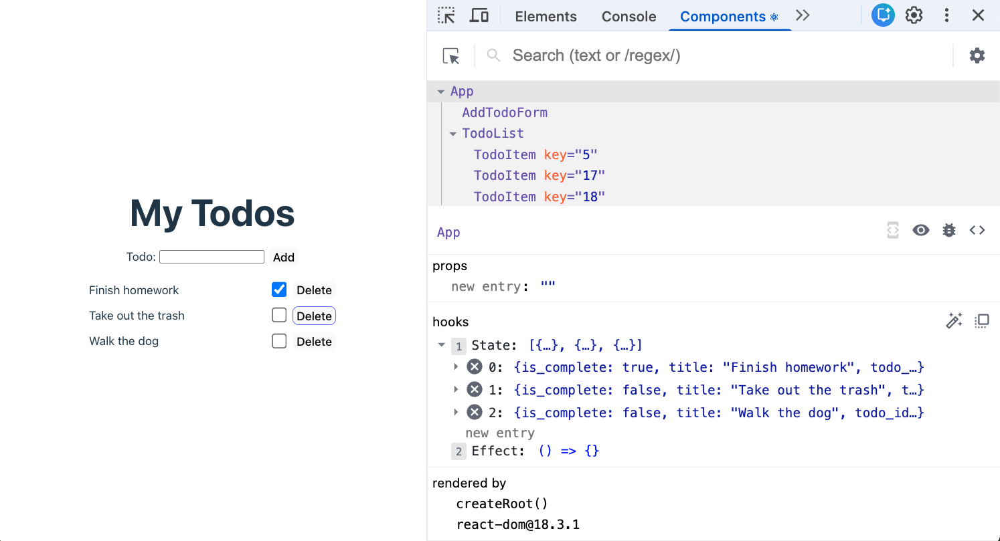

# 4. JSX Compilation and Vite Dev Proxy


Follow along with code examples in the lecture [repo](https://github.com/The-Marcy-Lab-School/7-4-compilation-vite-proxy)!


You've been writing JSX and running `npm run dev` without thinking too hard about what happens behind the scenes. Today we pull back the curtain. Understanding the build pipeline and the dev proxy turns "it just works" into "I know exactly why this works" — and gives you the mental model to debug it when it doesn't.

**Table of Contents**

* [Essential Questions](4-jsx-compilation-vite-dev-proxy.md#essential-questions)
* [Key Concepts](4-jsx-compilation-vite-dev-proxy.md#key-concepts)
* [Under the Hood: JSX Code Must Be Compiled](4-jsx-compilation-vite-dev-proxy.md#under-the-hood-jsx-code-must-be-compiled)
  * [Vite in Development: The Dev Server](4-jsx-compilation-vite-dev-proxy.md#vite-in-development-the-dev-server)
  * [Vite in Production: npm run build](4-jsx-compilation-vite-dev-proxy.md#vite-in-production-npm-run-build)
  * [Serving the Build from Express](4-jsx-compilation-vite-dev-proxy.md#serving-the-build-from-express)
* [The Vite Proxy](4-jsx-compilation-vite-dev-proxy.md#the-vite-proxy)
  * [Why a Proxy?](4-jsx-compilation-vite-dev-proxy.md#why-a-proxy)
  * [Reading vite.config.js](4-jsx-compilation-vite-dev-proxy.md#reading-viteconfigjs)
* [Same-Origin vs. Cross-Origin](4-jsx-compilation-vite-dev-proxy.md#same-origin-vs-cross-origin)
* [React DevTools](4-jsx-compilation-vite-dev-proxy.md#react-devtools)
  * [Installation](4-jsx-compilation-vite-dev-proxy.md#installation)
  * [The Components Tab](4-jsx-compilation-vite-dev-proxy.md#the-components-tab)
  * [Try It](4-jsx-compilation-vite-dev-proxy.md#try-it)

## Essential Questions

By the end of this lesson you should be able to answer:

1. Why can't a browser run JSX directly, and what does Vite do to make it work?
2. What is the difference between running `npm run dev` and `npm run build`?
3. How does `express.static` connect to the React build output in production?
4. Why do we need a Vite proxy in development, and what problem does it solve?
5. What is the difference between a same-origin and cross-origin request, and why does it matter for session cookies?
6. What does the React DevTools Components tab show you that the regular browser DevTools cannot?

## Key Concepts

* **Compilation** — the process of translating code written in one programming language (which is easy for humans to read) into another format (which is easy for a computer to execute).
* **JSX compilation** — The process of transforming JSX syntax into plain JavaScript `React.createElement()` calls that the browser can execute. Vite handles this automatically.
* **`dist/`** — The folder Vite creates when you run `npm run build`. It contains compiled, minified, browser-ready JavaScript and HTML.
* **`express.static`** — An Express middleware that serves static files (like the `dist/` folder) directly from the filesystem.
* **Vite proxy** — A development-only configuration that forwards `/api/*` requests from the Vite dev server to your Express server, avoiding CORS issues and making fetch URLs simpler.
* **Same-origin** — A request is same-origin when the scheme, host, and port all match. `fetch('/api/todos')` is always same-origin with the page serving it.
* **Cross-origin** — A request is cross-origin when the URL has a different origin than the page. Browsers restrict these by default (CORS).
* **React DevTools** — A browser extension that adds a **Components** tab to the browser's developer tools. It lets you inspect the React component tree and see each component's current props and state — the React-specific equivalent of the Elements tab.

## Under the Hood: JSX Code Must Be Compiled

JSX in our code cannot simply be executed by our browser: browsers only understand plain JavaScript.

Try opening your `index.html` file directly in a browser — or trying to serve it from Express as a static file — and the browser will throw a `SyntaxError`.

The JSX syntax in `main.jsx` and `App.jsx` has to be transformed first in a process called **compilation**. Compilation is the process of translating code written in one programming language (which is easy for humans to read) into another format (which is easy for a computer to execute).

Below you can see a simplified example of how React code in a `.jsx` file is compiled into pure JavaScript that can be executed by your browser.



This is what you write in your `.jsx` files. It looks like HTML, making it very intuitive to define the structure of your UI.

```jsx
function WelcomeCard({ user }) {
  return (
    <div className="card">
      <h1 title="Header">Hello, {user.name}</h1>
      <p>Your role is: {user.role}</p>
    </div>
  );
}
```



This is what the browser actually receives. The compiler has stripped away the "HTML" tags and replaced them with standard JavaScript function calls.

```js
// This is a simplified version of the output
function WelcomeCard({ user }) {
  return React.createElement(
    "div",
    { className: "card" },
    React.createElement(
      "h1", 
      { title: "Header" }, 
      "Hello, ", 
      user.name
    ),
    React.createElement(
      "p", 
      null, 
      "Your role is: ", 
      user.role
    )
  );
}
```



\### Vite in Development: The Dev Server

When you run `npm run dev`, Vite starts a **local development server** (by default on port 5173). It:

1. Watches your source files for changes
2. Compiles JSX → JS on the fly as files are requested
3. Sends the compiled JS to the browser
4. Hot-reloads the page when you save

The compiled code only ever lives in memory — nothing is written to disk.

This is why the dev server is **development only**. It is fast and convenient for iteration, but you wouldn't run a Vite dev server in production.

### Vite in Production: npm run build

When you run `npm run build`, Vite:

1. Compiles all JSX → JS
2. Bundles all your files together
3. Minifies the output to reduce file size
4. Writes everything to a `dist/` folder

The `dist/` folder contains only browser-ready files: HTML, CSS, and plain `.js`.

```
dist/
├── index.html
└── assets/
    ├── index-abc123.js   ← your entire React app compiled to plain JS
    └── index-abc123.css
```

You can open `dist/index.html` directly in a browser with no server at all — it's just static files.

### Serving the Build from Express

Now that the build output is plain static files, your Express server can serve them with a single line:


```javascript
app.use(express.static(path.join(__dirname, '../frontend/dist')));
```


This tells Express: "for any request that doesn't match an API route, look for a matching file in `frontend/dist/` and send it."

The full-stack setup looks like this:

```
my-app/
├── server/          ← Express (serves API + the built frontend)
│   └── index.js
└── frontend/        ← Vite React app
    ├── src/
    └── dist/        ← npm run build outputs here
```

In development you run both servers separately (Vite dev server + Express). The browser gets the frontend from the dev server while the API is served by the Express server.

In production, only Express runs — it serves the static `dist/` files for the frontend and handles `/api/*` routes for the backend.

## The Vite Proxy

### Why a Proxy?

A **proxy** is a middleman — a server that sits between the browser and another server and forwards requests on the browser's behalf. For example, recall how we used Express as a proxy server to send requests to APIs that needed API keys on our behalf? We will need to do something similar while using a Vite development server.

In development we run two servers simultaneously:

| Server  | Port | What it serves                                |
| ------- | ---- | --------------------------------------------- |
| Vite    | 5173 | Your React app (converts JSX → JS on the fly) |
| Express | 8080 | Your API (provides `/api/*` routes)           |

Without a proxy, when our React code calls `fetch('/api/todos')` from the Vite page, the origin is `http://localhost:5173`. As a result it would try to reach `/api/todos` on the **same** origin — but your API lives at `http://localhost:8080`. The browser would get a 404.

There are two ways to fix this:

1. **Use the full URL**: `fetch('http://localhost:8080/api/todos')` but then session cookies won't be sent because of cross-origin cookie restrictions, and you need CORS headers on the server.
2. **Use a proxy** (the better option): tell Vite to forward any request to `/api/*` to Express. From the browser's point of view, the request stays same-origin. Cookies work. No CORS config needed.


💡 Note: This is only needed when using your React application through Vite's development server. In production, we will build the React static assets and serve them directly from the Express server. Requests will truly be same-origin and no proxy server is needed.


### Reading vite.config.js

Setting up a Vite proxy is simple and standard. Just copy this into your `vite.config.js` file at the root of your frontend project:

```js
// frontend/vite.config.js
import { defineConfig } from 'vite';
import react from '@vitejs/plugin-react';

export default defineConfig({
  plugins: [react()],
  server: {
    proxy: {
      '/api': {          // any request whose path starts with /api...
        target: 'http://localhost:8080',  // ...forward it to Express
        changeOrigin: true,               // rewrite the Host header
      },
    },
  },
});
```

The `proxy` object says: when the Vite dev server receives a request whose path starts with `/api`, don't serve it — forward it to `http://localhost:8080` instead.

**Q: What does this mean for your fetch calls?**

You can write `fetch('/api/todos')` everywhere in your React code. In development, Vite forwards it to Express. In production (when Express serves the built `dist/` files), the request reaches Express directly — no forwarding needed.

## Same-Origin vs. Cross-Origin

```
Your React app:   http://localhost:5173  (via Vite proxy)
External API:     https://dog.ceo/
```

When a request is **same-origin**, the browser automatically includes cookies. This is how session authentication works — the browser sends the session cookie with every API call, and the server can identify the logged-in user.

```
fetch('/api/todos')                                ← same-origin (proxied to Express)
fetch('https://dog.ceo/api/breeds/image/random')   ← cross-origin (different host)
```

When a request is **cross-origin**, the browser blocks cookies unless the server explicitly opts in with CORS headers. That's why we use the proxy instead of hardcoding `http://localhost:8080` in our fetch calls.

**In production**, your Express server serves both the frontend (`dist/`) and the API (`/api/*`) from the same port. Everything is same-origin automatically — no proxy needed.

## React DevTools

The browser's built-in DevTools are great for inspecting the DOM, network requests, and cookies — but they know nothing about React. They can't tell you what a component's state is, or why a component re-rendered.

**React DevTools** is a browser extension that fills that gap. It adds a **Components** tab alongside Elements, Console, and Network. The Components tab shows you the live React component tree and, for any selected component, its current props and state.

### Installation

Install the extension for your browser:

* [Chrome / Edge](https://chromewebstore.google.com/detail/react-developer-tools/fmkadmapgofadopljbjfkapdkoienihi)
* [Firefox](https://addons.mozilla.org/en-US/firefox/addon/react-devtools/)

After installing, open DevTools (`F12` or `Cmd+Option+I`) with a React app running and you will see a **Components** tab appear.

### The Components Tab

Click any component in the tree to select it. The panel on the right shows:

* **props** — what was passed in from the parent
* **state** (via hooks) — the current value of each `useState` variable



This is the React-specific equivalent of clicking an element in the Elements tab: instead of seeing the rendered HTML, you see the component that produced it and the data it holds.

### Try It

Open the todo app (`npm run dev`), then open DevTools and click the **Components** tab.

1. Find the `App` component in the tree. What state does it hold?
2. Click a `TodoItem` component. What props does it receive? Where do those values come from?
3. Add a new todo via the form, then look at the component that holds the todos list in state. Did it update?
4. Compare what you see in the Components tab with what you see in the Elements tab for the same element. What information does each one give you that the other doesn't?


You'll use React DevTools heavily in the next lesson to trace how state flows through the authenticated Todo app. Get comfortable finding components and reading their state before moving on.

