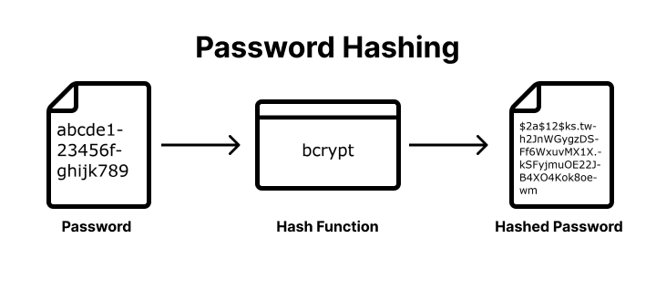

# Hashing Passwords with Bcrypt


Follow along with code examples [here](https://github.com/The-Marcy-Lab-School/8-4-0-hashing-salting-bcrypt)!


**Table of Contents:**

- [Terms](#terms)
- [Pre-Learning](#pre-learning)
- [Hashing](#hashing)
  - [Hashing Functions](#hashing-functions)
  - [Validating Passwords](#validating-passwords)
- [The Importance of Secure Hash Functions](#the-importance-of-secure-hash-functions)
  - [Hashing with Bcrypt](#hashing-with-bcrypt)
  - [Validating Hashes with Bcrypt](#validating-hashes-with-bcrypt)
- [Bcrypt Helpers](#bcrypt-helpers)
- [Summary — The Password Validation Workflow](#summary--the-password-validation-workflow)

## Terms

* **Hashing** - a mathematical algorithm that transforms a string of characters into a fixed-length string of characters. 
* **Password Salt** - A salt is a random string of data that is added to the input data before the hash function is applied. This changes the hash value that is produced, even for the same input data.
* **Salt Rounds** - the number of times a password has been salted before being hashed
* **Plaintext password** - the password as it was entered by the user, before it is hashed.
* **Bcrypt** - a Node module that provides functions for hashing strings and verifying hashed strings.

## Pre-Learning

Check out this video to learn about hashing, salting, and various attacks used by hackers to get accessed to your password! 

[Video: Password Hashing, Salts, Peppers | Explained!](https://www.youtube.com/watch?v=--tnZMuoK3E&ab_channel=Seytonic)

## Hashing

**Hashing** is a mathematical algorithm that transforms a string of characters into a fixed-length string of characters.



When a user signs up for an account, rather than storing their plain-text password in a database, we will "hash" their password and store the resulting hashed password.

**<details><summary>Q: Why is it important to store hashed passwords rather than plain-text passwords in a database? </summary>**

Without password hashing, a hacker who obtains a user database can simply read the passwords in plain text.

With password hashing, the passwords are stored as hash values, and an attacker would need to spend significant time and resources attempting to convert the hash values back into the original passwords.

</details>

### Hashing Functions

A **hashing function** is a pure function that performs the hashing algorithm.

A hashing function can be as simple as something like this:

```js
const simpleHash = (str) => {
  let hash = '';
  // Loops through each character in the string.
  for (let i = 0; i < str.length; i++) {
    // Converts each character to its ASCII code using charCodeAt(i).
    // Adds them together
    hash += str.charCodeAt(i);
  }
  return hash;
}

const hashedPassword1 = simpleHash("abc");  // 979899
const hashedPassword2 = simpleHash("def");  // 100101102

console.log(hashedPassword1, hashedPassword2);
```

Once we hash a password, we can store it in our database without exposing the plain-text password to would-be attackers.

### Validating Passwords

When someone returns to login to their account, we need to be able to verify their login details. However, all we have is their hashed password. How can we know that the password they provide matches the stored hashed password?

Since hashing functions are pure, if we hash the given password, it should produce the same value as the password stored in our database. 

```js
// the stored password
const hashedPassword1 = simpleHash("abc");  // 979899

const validatePassword = (passwordToTest, storedHash) => {
  return simpleHash(passwordToTest) === storedHash;
}

// Compare the password "xyz" against the hashed string 979899
console.log(validatePassword("xyz", hashedPassword1));  
// false, the given password produces a different hash!

// Compare the password "abc" against the hashed string 979899
console.log(validatePassword("abc", hashedPassword1));  
// false, the given password produces the same hash!
```

## The Importance of Secure Hash Functions

Ideally, the algorithm for hashing a string is complicated enough that a hashed string cannot be easily converted back to the plain-text string.

**<details><summary>Q: For the algorithm above, given the hashed string `999897`, what is the plain-text string that would generate that hashed string? </summary>**

```js
simpleHash("cba") //-> "999897"
```

Clearly this hashing function is not secure since the algorithm can easily be reverse-engineered.

</details>

Even if an attacker has a database full of hashed passwords, it should still be nearly impossible to figure out what the plain-text passwords are. This is where secure hashing module like `bcrypt` come in!

### Hashing with Bcrypt

The `bcrypt` node module gives us the `bcrypt.hash(str, saltRounds)` function. It asynchronously returns a hashed string in a promise:

```js
const bcrypt = require('bcrypt');

// Make an async wrapper function so we can use await
const testHashing = async (password) => {
  const hashedPassword1 = await bcrypt.hash('secret', 8)
  console.log(hashedPassword1); // Some crazy string
  
  const hashedPassword2 = await bcrypt.hash('secret', 8)
  console.log(hashedPassword2); // A different crazy string!
}

testHashing();
```


Notice that the output is different each time? This is due to `8` rounds of "salting".

A salt is a random string of data that is added to the input data before the hash function is applied. This changes the hash value that is produced, even for the same input data.

```
No Salting:

hello --(hash)--> asdlk2jf/ie!9231
hello --(hash)--> asdlk2jf/ie!9231

With Salting:

hello --(add salt)--> 3@12hello --(hash)--> $2b$08jkdllleife
hello --(add salt)--> a51!hello --(hash)--> $2b$08eidi93k1Aa
```

Since hashing functions are pure, this randomized salting increases the security of our hashing algorithm!


### Validating Hashes with Bcrypt

To validate a string that was hashed using `bcrypt.hash`, we use the `bcrypt.compare`. 

It returns a promise that resolves to a boolean indicating if the strings match:

```js
const bcrypt = require('bcrypt');

// Make an async wrapper function so we can use await
const testHashing = async (password) => {
  const hashedPassword1 = await bcrypt.hash('secret', 8)
  console.log(hashedPassword1); // Some crazy string
  const hashedPassword2 = await bcrypt.hash('secret', 8)
  console.log(hashedPassword2); // A different crazy string!

  console.log(await bcrypt.compare('hello', hashedPassword1));
  // false, the hashes do not match

  console.log(await bcrypt.compare('secret', hashedPassword1));
  // true, the hashes match!
}

testHashing();
```

## Bcrypt Helpers

Both hashing and comparing can throw errors if the functions are not used properly. So we've created these helpers to handle those errors for us.

```js
const hashPassword = async (password, saltRounds = 8) => {
  try {
    const hashedPassword = await bcrypt.hash(password, saltRounds);
    return hashedPassword;
  } catch (err) {
    return console.error(err.message);
  }
};
const isValidPassword = async (password, hash) => {
  try {
    const isValid = await bcrypt.compare(password, hash);
    return isValid;
  } catch (err) {
    return console.error(err.message);
  }
};
```

## Summary — The Password Validation Workflow

1. A user creates an account and sends their username and password to the server
2. The server hashes the password using `bcrypt.hash` and stores the username and hashed password in the database
3. The user returns later to log in and again sends their username and password to the server
4. The server uses the given username to find the hashed password in the database.
5. The server then uses `bcrypt.compare` to validate the given password against the hashed password from the database.
6. If the given password matches the stored hashed password, the user is logged in.