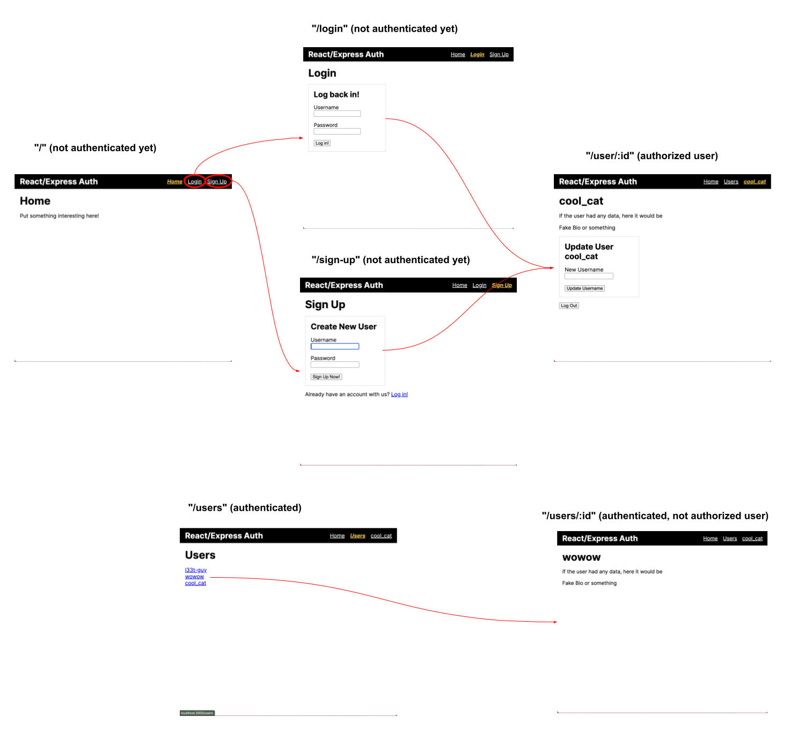
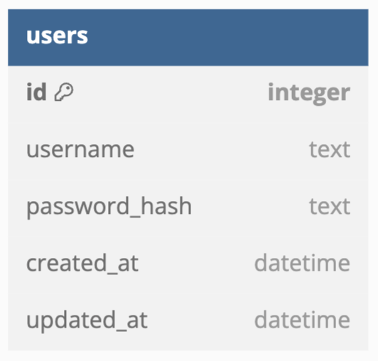
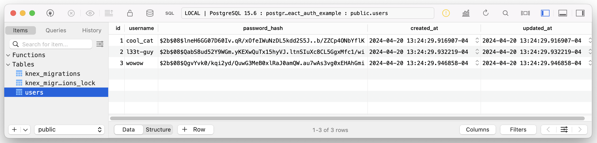
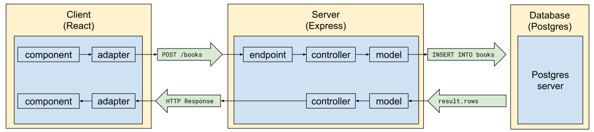
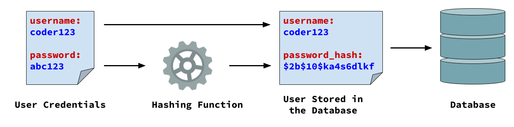
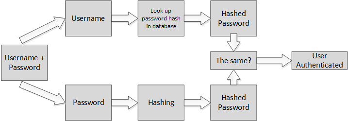
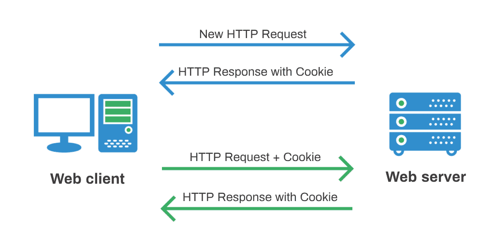
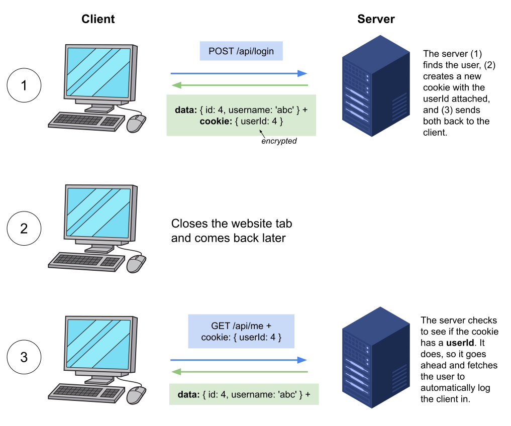
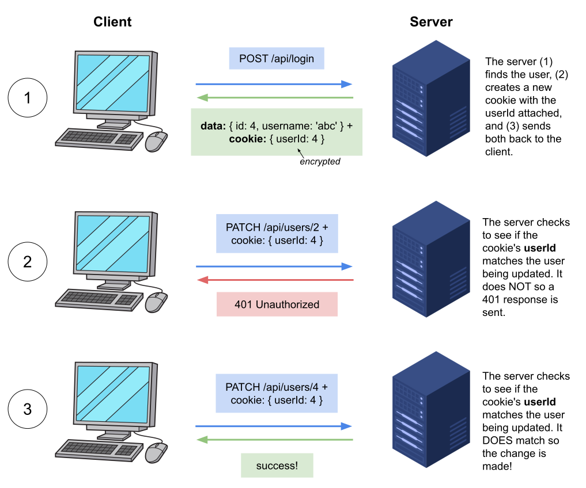
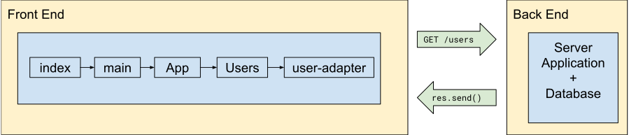

# 14. React Express Auth Template Overview


Follow along with the React Express + Auth Template repository [here](https://github.com/The-Marcy-Lab-School/react-express-auth)!


**Table of Contents**

- [Application Overview](#application-overview)
- [Getting Started](#getting-started)
  - [Create your repo](#create-your-repo)
  - [Getting to know the folder structure](#getting-to-know-the-folder-structure)
  - [Configure your environment variables](#configure-your-environment-variables)
  - [Kickstart the project](#kickstart-the-project)
  - [You're all set up now. Have Fun!](#youre-all-set-up-now-have-fun)
- [Database](#database)
  - [Migrations](#migrations)
    - [Modifying / Adding New Migrations](#modifying--adding-new-migrations)
  - [Seeds](#seeds)
- [The Server Application](#the-server-application)
  - [Server Overview](#server-overview)
  - [User Model](#user-model)
  - [Controllers and API endpoints](#controllers-and-api-endpoints)
  - [Creating New Users: Securing Passwords with Bcrypt](#creating-new-users-securing-passwords-with-bcrypt)
    - [`User.create()` vs. the `User` constructor](#usercreate-vs-the-user-constructor)
  - [Logging In: Authentication and Authorization](#logging-in-authentication-and-authorization)
    - [Cookies and Session Authentication](#cookies-and-session-authentication)
    - [Generating Cookies with Handle Cookie Sessions](#generating-cookies-with-handle-cookie-sessions)
    - [Adding the User ID to a Cookie on Login](#adding-the-user-id-to-a-cookie-on-login)
    - [Session Authentication and Authorization](#session-authentication-and-authorization)
- [Front-end](#front-end)
  - [Frontend Utils](#frontend-utils)
  - [Adapters](#adapters)
  - [Example Page Component](#example-page-component)
  - [Current User Context](#current-user-context)
- [Deploying](#deploying)

## Application Overview

This template repository provides functional, but basic, user management. Users can:
* Register a new account with a username and password
* Log in to their account
* View a list of all users
* View a single user's page
* Update their username
* Log out

Below, you can see the user journey:


* When a user visits the `"/"` page, they see the Home page and options to either login or signup.
  * Returning users will be automatically signed in via the `GET /api/auth/me` endpoint.
* Users can authenticate by visiting the `"/login"` or `"/sign-up"` pages.
  * Login requests are sent to the `POST /api/auth/login` endpoint.
  * Sign up requests are sent to the `POST /api/auth/register` endpoint.
* After logging in or signing up users are taken to the `"/users/:id"` page for their own profile. Since they are authorized to modify their own profile, they have the option to update their username and log out.
  * Individual user data is fetched via the `GET /api/users/:id` endpoint.
  * Username updates are fetched via the `PATCH /api/users/:id` endpoint which requires authorization.
  * User log out is fetched via the `DELETE /api/auth/logout` endpoint.
* Users can visit the `"/users"` page to view all users in the application. Clicking on a user's name takes them to their profile page. Since they are not authorized, they can only view this user's profile.
  * All users data is fetched via the `GET /api/users` endpoint.

The ERD for this application is simple. Just a single `users` table:



## Getting Started

Now that you understand what this app can do, let's jump in and get it running locally!

### Create your repo

* If you are working on a team, first make sure that your team has a new GitHub Organization for your project.
* Select <kbd>Use this template</kbd> and select <kbd>Create a new repository</kbd>. Rename the repo and choose your GitHub organization as the owner. If you are working alone, just select your own account as the owner.
* Clone your repo. 

### Getting to know the folder structure

In the root of this repository are the two parts of the application

* `frontend/` - the front-end application code (React)
* `server/` - the back-end server application code (Node + Express)

Each of these sub-directories has its own `package.json` file with its own dependencies and scripts.

The root of the project also has a `package.json` file. It has no dependencies but does include some scripts for quickly getting the project started from the project root.

### Configure your environment variables

Before you can actually start building, you need to create a database and configure your server to connect with it.

* Create a database with a name of your choice. This will just be the name of your local database so it doesn't need to match with the other members of your team.
* In the `server/` folder, copy the `.env.template` and name it `.env`.
* Update the `.env` variables to match your Postgres database information (username, password, database name)
* Replace the `SESSION_SECRET` value with your own random string. This is used to encrypt the cookie's `userId` value.
  * Use a tool like [https://randomkeygen.com/](https://randomkeygen.com/) to help generate the secret.
* Your `.env` file should look something like this:

```sh
# Replace these variables with your Postgres server information
# These values are used by knexfile.js to connect to your postgres server
PG_HOST='127.0.0.1'
PG_PORT=5432
PG_USER='itsamemario'
PG_PASS='12345'
PG_DB='my_react_express_auth_database'

# Replace session secret with your own random string!
# This is used by handleCookieSessions to hash your cookie data 
SESSION_SECRET='db8c3cffebb2159b46ee38ded600f437ee080f8605510ee360758f6976866e00d603d9b3399341b0cd37dfb8e599fff3'

# When you deploy your database on render, this string can be used to test SQL queries to the deployed database.
# Leave this value blank until you deploy your database.
PG_CONNECTION_STRING=''
```

Remember, these values are used in the Knex configuration file `server/knexfile.js`. Pay attention to how the `connection` configuration is set:

```js
module.exports = {
  development: {
    client: 'pg',
    connection: process.env.PG_CONNECTION_STRING || {
      host: process.env.PG_HOST || '127.0.0.1',
      port: process.env.PG_PORT || 5432,
      user: process.env.PG_USER || 'postgres',
      password: process.env.PG_PASS || 'postgres',
      database: process.env.PG_DB || 'postgres',
    },
    migrations: {
      directory: migrationsDirectory,
    },
    seeds: {
      directory: seedsDirectory,
    },
  },
  production: {
    client: 'pg',
    connection: process.env.PG_CONNECTION_STRING,
    migrations: {
      directory: migrationsDirectory,
    },
    seeds: {
      directory: seedsDirectory,
    },
  },
};
```

The `connection` configuration determines how Knex connects to your database. In `development` mode, if the `PG_CONNECTION_STRING` is blank, then Knex will use the configuration object with `host`, `port`, `user`, `password` and `database`.

However, when you eventually deploy your database on Render, you will be given a `PG_CONNECTION_STRING` value from Render. You can add this to your environment variables to connect directly to your deployed database. If a `PG_CONNECTION_STRING` value exists, Knex will use it to connect to your deployed database.

In `production` mode, the `PG_CONNECTION_STRING` is expected.

The deployed database works exactly like your local database, so you are welcome to use a deployed database during testing as well. That said, the queries may take more time to execute since they are being transferred via the internet rather than between ports on your own machine.

### Kickstart the project

With everything configured, you can now install dependencies in the `frontend` folder (React, etc...) and in the `server` folder (express, Knex, etc...) and run the provided migrations and seeds:

```sh
# install frontend dependencies and build static assets
cd frontend && npm i && npm run build

# Return to the root
cd ..

# install server dependencies, run migrations and seeds
cd server && npm i && npm run migrate && npm run seed
```

> In the future, you can also run the `npm run kickstart` command which will do all of this for you!

As a result of running the migrations and seeds, you should see that a `users` table has been created and seeded with three users. Check out the `server/db/` folder to see how migrations and seeds were configured.

Finally, split the terminal and `cd` into the `frontend/` application and `server/` application. Then start each application using `npm run dev` in each directory.

### You're all set up now. Have Fun!

Below, you will find more information about this repository and how to work with it. Enjoy!

## Database

> **Chapters in this Section:**
>
> * [Migrations](13-react-express-auth-overview.md#migrations)
>   * [Modifying / Adding New Migrations](13-react-express-auth-overview.md#modifying--adding-new-migrations)
> * [Seeds](13-react-express-auth-overview.md#seeds)

***

For this project, you should use a Postgres database. Make sure to set the environment variables for connecting to this database in the `.env` file. These values are loaded into the `knexfile.js` file using the `dotenv` package and the line of code:

```js
require('dotenv').config(); // load the .env file
```

### Migrations

> For an overview of migrations and seeds, check out the chapter on [Migrations and Seeds](https://marcylabschool.gitbook.io/marcy-lab-school-docs/mod-8-backend/10-migrations-and-seeds).

Migration files are stored in the `server/db/migrations` folder. Here, you can see the migration files that generate the `users` table. The first one sets up some initial columns:

```js
exports.up = (knex) => {
  return knex.schema.createTable('users', (table) => {
    table.increments();
    table.string('username').notNullable().unique();
    table.string('password_hash').notNullable();
  })
};
exports.down = (knex) => knex.schema.dropTable('users');
```

This migration file will create a `users` table with an auto-generated and auto-incrementing `id` column, as well as `username` and `password_hash` columns.

#### Modifying / Adding New Migrations

As you build your project, you will likely want to modify your tables. If this is the case, AVOID using the `migration:rollback` unless you are willing to lose all data in your database and re-seed.

If you wish to keep existing data, you can _create a new migration that modifies the table_.

For example, the second migration file adds some timestamp columns to the existing `users` table.

```js
exports.up = (knex) => {
  return knex.schema.alterTable('users', (table) => {
    // creates two columns: created_at and updated_at
    table.timestamps(true, true);
  })
};

exports.down = (knex) => {
  return knex.schema.alterTable('users', (table) => {
    table.dropColumn('created_at');
    table.dropColumn('updated_at');
  })
};
```

Note that instead of using `knex.schema.createTable`, we are using `.alterTable` since the table already exists. We also use `.alterTable` in the `.down` function to drop the two columns created by `table.timestamps` if we ever did want to roll back these changes.

* For more information, look into the [Knex documentation](https://knexjs.org/guide/schema-builder.html)

### Seeds

Seed files are stored in the `server/db/seeds` folder.

The provided `init.js` seed file uses the `User.create` model method to generate the following data:



Notice how the passwords have been hashed! This is because the `User.create` method takes care of hashing passwords for us using `bcrypt`.

## The Server Application

> **Chapters in this Section:**
> - [Server Overview](#server-overview)
> - [User Model](#user-model)
> - [Controllers and API endpoints](#controllers-and-api-endpoints)
> - [Creating New Users: Securing Passwords with Bcrypt](#creating-new-users-securing-passwords-with-bcrypt)
>   - [`User.create()` vs. the `User` constructor](#usercreate-vs-the-user-constructor)
> - [Logging In: Authentication and Authorization](#logging-in-authentication-and-authorization)
>   - [Cookies and Session Authentication](#cookies-and-session-authentication)
>   - [Generating Cookies with Handle Cookie Sessions](#generating-cookies-with-handle-cookie-sessions)
>   - [Adding the User ID to a Cookie on Login](#adding-the-user-id-to-a-cookie-on-login)
>   - [Session Authentication and Authorization](#session-authentication-and-authorization)

### Server Overview

The server acts as the key middleman between the client / frontend application and the database. It is responsible for serving the React project's static assets as well as receiving and parsing client requests, getting data from the database, and sending responses back to the client.

To design a server that performs these interactions consistently and predictably, ask yourself:

* What does the server expect from the frontend?
* What does the frontend expect back from the server?
* What does the database expect from the server?
* What does the server expect back from the database?



The server is organized into a few key components (from right to left in the diagram):

* The "Models" found in `server/models/`
  * Responsible for interacting directly with and returning data from the database.
  * In this application, the models will use `knex` to execute SQL queries.
* The "Controllers" found in `server/controllers/`
  * Responsible for parsing incoming requests, performing necessary server-side logic (like logging requests and interacting using models), and sending responses.
* The "App" found in `server/index.js`
  * The hub of the server application, created by Express.
  * Responsible for defining the endpoint URLs that will be available in the application and assigning controllers to handle each endpoint.
  * It also configures middleware.

### User Model

As mentioned above, a model is the right-most component of a server application. 
* A model interacts directly with the database and can be used by controllers as an interface to the database. 
* An application can have many models and each model is responsible for managing interactions with a particular table in a database.

In our tech stack, our models use Knex to execute SQL statements.


The `User` model (defined in `server/db/models/User.js`) provides static methods for performing CRUD operations with the `users` table in the database:

* `User.create(username, password)`
* `User.list()`
* `User.find(id)`
* `User.findByUsername(username)`
* `User.update(id, username)`
* `User.deleteAll()`

Each method invokes `knex.raw()` and executes a SQL query to create, read, update, or delete data from the database. For example, `User.find` queries for a single user in the database:

```js
static async find(id) {
  const query = `SELECT * FROM users WHERE id = ?`;
  const result = await knex.raw(query, [id]);
  const rawUserData = result.rows[0];
  return rawUserData ? new User(rawUserData) : null;
}
```

Each method follows the same pattern:
* Construct a query
* Execute the query with `knex.raw`, making sure to insert variables
* Return the data (for users, we wrap the data in a `new User`. We'll look at why in the chapters below)

Each `User` method is used by one or more controllers when an API endpoint is requested by a client.

### Controllers and API endpoints

A controller is a function that is invoked when a particular endpoint of the server API is requested. Controllers parse the request for data, invoke the appropriate methods of the models to interact with the database, and send responses back to the client.

The template provides API endpoints and controllers that are divided into two categories:
* **Authentication Endpoints:** These endpoints enable the client to perform actions related to authenticating (registering a new account and logging in / out). 
* **User Endpoints:** These endpoints enable the client to perform various CRUD actions relating to User data.

**Authentication Endpoints**

<table>
  <thead>
    <tr>
      <th width="87.921875">Method</th>
      <th width="200.9296875">Endpoint</th>
      <th width="227.21875">Description</th>
      <th width="148.27734375">Auth Controller</th>
      <th width="179.328125">User Model Method</th>
    </tr>
  </thead>
  <tbody>
    <tr>
      <td>POST</td>
      <td><code>/api/auth/register</code></td>
      <td>Create a new user and set the cookie userId</td>
      <td><code>registerUser</code></td>
      <td><code>create()</code></td>
    </tr><tr>
      <td>POST</td>
      <td><code>/api/auth/login</code></td>
      <td>Log in to an existing user and set cookie userId value</td>
      <td><code>loginUser</code></td>
      <td><code>findByUsername()</code></td>
    </tr><tr>
      <td>GET</td>
      <td><code>/api/auth/me</code></td>
      <td>Get the current logged in user based on the cookie</td>
      <td><code>showMe</code></td>
      <td><code>find()</code></td>
    </tr><tr>
      <td>DELETE</td>
      <td><code>/api/auth/logout</code></td>
      <td>Log the current user out (delete the cookie)</td>
      <td><code>logoutUser</code></td>
      <td>None</td>
    </tr>
  </tbody>
</table>

**User Endpoints**

<table>
  <thead>
    <tr>
      <th width="87.734375">Method</th>
      <th width="170.96484375">Endpoint</th>
      <th width="208.171875">Description</th>
      <th width="134.78125">User Controller</th>
      <th width="151.37109375">User Model Method</th>
      </tr>
    </thead>
  <tbody>
    <tr>
      <td>GET</td>
      <td><code>api/users</code></td>
      <td>Get the list of all users</td>
      <td><code>listUsers</code></td>
      <td><code>list()</code></td>
    </tr>
    <tr>
      <td>GET</td>
      <td><code>/api/users/:id</code></td>
      <td>Get a specific user by id</td>
      <td><code>showUser</code></td>
      <td><code>find()</code></td>
    </tr>
    <tr>
      <td>PATCH</td>
      <td><code>/api/users/:id</code></td>
      <td>Update the username of a specific user by id</td>
      <td><code>updateUser</code></td>
      <td><code>update()</code></td>
    </tr>
  </tbody>
</table>


### Creating New Users: Securing Passwords with Bcrypt

> For more details on how `bcrypt` works, read the chapter on [Hashing Passwords with Bcrypt](12-hashing-passwords-with-bcrypt.md).

Remember how the users that we seeded into our database had their passwords hashed? This happens thanks to Bcrypt!

Open up the `server/models/User` file and at the top you will see `bcrypt` is imported. This module provides two functions: `hash` and `compare`. Here is how they are used:

*   When a user first creates an account, the controller  invokes the `User.create()` method which hashes the user's given password with `bcrypt.hash()`. Then, the hashed password will be stored in the database alongside the username.

    

*   When a user logs in, a controller uses the `User.findByUsername()` method to find the hashed password, and then we can use `bcrypt.compare` to see if the given password generates the same hash as the one stored in the database.

    

#### `User.create()` vs. the `User` constructor

Did you notice that there is both a `User.create()` method AND a `constructor()`? Let's see why.

To create a new user in the database, the `User.create()` static method can be invoked with a `username` and `password`. The method hashes the password before inserting it into the database.

```js
static async create(username, password) {
  // hash the plain-text password using bcrypt before storing it in the database
  const passwordHash = await bcrypt.hash(password, SALT_ROUNDS);

  const query = `INSERT INTO users (username, password_hash)
    VALUES (?, ?) RETURNING *`;
  const result = await knex.raw(query, [username, passwordHash]);
  
  // get the first returned row and convert it to a User instance
  // to make the hashed password private
  const rawUserData = result.rows[0];
  return new User(rawUserData);
}
```

`knex.raw` returns an object with a `.rows` property containing the requested data from the database. The `.rows` value is *always* an array, so we grab just the first value which will be the new user. 

We will get something like this from the database:

```json
rawUserData = {
  "id": 1, 
  "username": "Reuben", 
  "password_hash": "xyzabc123" 
}
```

**<details><summary>Q: Is there any data that we get from the database that we might NOT want to send back to the client?</summary>**

The password hash! Even if it is difficult to get a plain-text password from a hash, we do not just want to send that data in HTTP requests more than we have to (which is never).

</details>

Before returning, we make a `User` instance using the constructor function. The constructor takes in an object with the exact properties of the `user` table in the database and stores the `password_hash` as a private property:

```js
class User {
  #passwordHash = null; // a private property

  // Create a User instance with the password hidden
  // Instances of User can be sent to clients without exposing the password
  constructor({ id, username, password_hash }) {
    this.id = id;
    this.username = username;
    this.#passwordHash = password_hash;
  }

  // instance method
  isValidPassword = async (password) => {
    return await bcrypt.compare(password, this.#passwordHash);
  }

  //... static methods
}
```

Instances also have access to the `isValidPassword` instance method which can be used for re-authentication (see below).

As a result, the data that we end up sending to the client looks like this:

```js
{
  "id": 1, 
  "username": "Reuben", 
  "isValidPassword": f (password) => {}
}
```

As a result, the password is hidden before we send it to the client.

Take a look at each `static` method of the `User` class and you'll find that this pattern is repeated:

1. Data is retrieved from the database (including `password_hash` values)
2. Every user object is converted into a `User` instance to keep the `password_hash` values safely contained within the model.
3. The user objects can then be safely returned and used by the controllers.

### Logging In: Authentication and Authorization

* **Authenticated** means "We have confirmed this person is a real user and is allowed to be here"
  * For example, only logged-in users can see the other users in this app
  * **Session authentication** means that users who have recently provided their credentials do not need to log in again.
* **Authorized** means "This person is allowed to perform this protected action"
  * For example, users are only authorized to edit their OWN profile (they can't change someone else's profile)

To implement this functionality, we'll use cookies.

#### Cookies and Session Authentication

In the context of computing and the internet, a **cookie** is a small text file sent by a server to a client and stored on the client along with where the cookie came from. Cookies are saved across browser sessions by default, meaning they will persist after the browser is closed. If a client has a cookie, it will automatically send it with future requests to the server the cookie came from.



To enable session authentication, when a user logs in, the server sends back a cookie with their user ID inside. That way, whenever the server receives a request with a cookie, it knows:

1. The user had previously signed in (otherwise, they wouldn't have a cookie)
2. Who sent the request based on the ID stored inside the cookie
3. If there is no cookie in the request (perhaps the user has cleared their cookies or is a new user), then the user must provide their credentials again to get a new cookie.&#x20;

Cookies can also be used to control access to protected resources. Some resources require authentication only (the request must have a cookie):

> For example, a user may need to be authenticated in order to access comments on a post.

Additionally, certain actions may be protected depending on the resource being requested and who made the request (the request needs a cookie AND that cookie needs a particular ID inside)

> For example, if user `5` sends a request to edit the profile of user `8`, that request will be rejected with a 403 unauthorized response. Only a request sent by user `8` is authorized to edit the profile of user `8`. In this case, the sender must have a cookie with the id `8` inside.

So, we want to send the client a cookie with their user ID stored inside. This means we need a way to:

1. Create a cookie
2. Put the user ID inside

#### Generating Cookies with Handle Cookie Sessions

To generate cookies, we'll use middleware provided by the `cookie-session` Node module. This middleware is configured in the `handleCookieSessions` file:

```js
const cookieSession = require('cookie-session');
const handleCookieSessions = cookieSession({
  name: 'session', // this creates a req.session property holding the cookie
  secret: process.env.SESSION_SECRET, // this secret is used to encode the cookie
});

module.exports = handleCookieSessions;
```

Here's what's happening:

* The `name: 'session'` configuration means that this middleware will put cookie data inside an object `req.session`. If we ever want to add data to a cookie, all we have to do is add data to `req.session` within a controller.
* The `secret: process.env.SESSION_SECRET` configuration sets a secret string used to encode all data stored in cookies so that the data can't easily be read.

If a user sends a request with no cookie, this middleware will create a new empty object stored at `req.session` and send it back with the response.&#x20;

If a cookie DOES exist, this middleware will parse the cookie, and its data will be added to `req.session`.

Try modifying the `logRoutes` middleware to see incoming requests that have cookies:

```javascript
const logRoutes = (req, res, next) => {
  const time = (new Date()).toLocaleString();
  console.log(`${req.method}: ${req.originalUrl} - ${time}`);
  console.log("Cookie Data: ", req.session);
  next();
};
```

#### Adding the User ID to a Cookie on Login

Remember, the cookie keeps our users logged in and authenticates and authorizes them on future requests. Therefore, we want to give cookies only to users who have logged in (or to users who have just registered).&#x20;

To see this in action, take a look at the controller that handles login requests:

```js
// POST /api/auth/login
exports.loginUser = async (req, res) => {
  // Request needs a body
  if (!req.body) {
    return res.status(400).send({ message: 'Username and password required' });
  }

  // Body needs a username and password
  const { username, password } = req.body;
  if (!username || !password) {
    return res.status(400).send({ message: 'Username and password required' });
  }

  // Username must be valid
  const user = await User.findByUsername(username);
  if (!user) {
    return res.status(404).send({ message: 'User not found.' });
  }

  // Password must match. `user` will be a User instance.
  const isPasswordValid = await user.isValidPassword(password);
  if (!isPasswordValid) {
    return res.status(401).send({ message: 'Invalid credentials.' });
  }

  // Add the user id to the cookie and send the user data back
  req.session.userId = user.id;
  res.send(user);
};
```

As you can see, after validating the user's credentials and right before sending the response, we add the user's ID to the cookie by setting `req.session.userId`:

```js
// Add the user id to the cookie and send the user data back
req.session.userId = user.id;
```

#### Session Authentication and Authorization

We choose to store the `user.id` value in the cookie so that when it comes back with future requests, we can know who sent the request by looking at `req.session.userId`.

For example, when a user returns to the site, the client automatically sends a request to the `GET /api/auth/me` endpoint, which uses this auth controller:

```js
// GET /api/auth/me
exports.showMe = async (req, res) => {
  // No cookie with userId? Not Authenticated
  if (!req.session.userId) return res.sendStatus(401);

  // You already have a cookie with userId? Let me get your user info.
  const user = await User.find(req.session.userId);
  res.send(user);
};
```

Without needing to log in again, the `/api/auth/me` endpoint checks to see if a cookie exists, and if it does, fetches the appropriate user!



You'll also notice this `req.session` value is checked in the `checkAuthentication` middleware which requires a cookie for certain endpoints to be used:

```js
const checkAuthentication = (req, res, next) => {
  const { userId } = req.session;
  if (!userId) return res.sendStatus(401);
  return next();
};
```

&#x20;Lastly, `req.session` is also checked to authorize a user to update their profile in the `PATCH /api/users/:id` controller:

```js
/* 
PATCH /api/users/:id
Updates a single user (if found) and only if authorized
*/
exports.updateUser = async (req, res) => {
  const { username } = req.body;
  if (!username) {
    return res.status(400).send({ message: 'New username required.' });
  }

  // The userToModify comes from the endpoint: /api/users/5
  // The userRequestingChange comes from the cookie
  const userToModify = Number(req.params.id);
  const userRequestingChange = Number(req.session.userId);
  
  // A user is authorized to modify only their own user data
  if (userRequestingChange !== userToModify) {
    return res.status(403).send({ message: "Unauthorized." });
  }

  const updatedUser = await User.update(userToModify, username);
  if (!updatedUser) {
    return res.status(404).send({ message: 'User not found.' });
  }

  res.send(updatedUser);
};
```

To paint the picture clearly, this is how the cookie is passed back and forth between client and server enabling authorization:



## Front-end

**Chapters in this Section**

> * [Frontend Utils](13-react-express-auth-overview.md#frontend-utils)
> * [Adapters](13-react-express-auth-overview.md#adapters)
> * [Example Page Component](13-react-express-auth-overview.md#example-page-component)
> * [Current User Context](13-react-express-auth-overview.md#current-user-context)

The front-end is responsible for handling user interactions, sending requests to the server application, and rendering content provided by the server.

While it is developed as a React application and `.jsx` files, it will ultimately be built into static assets (HTML, CSS, and JS files that can be sent directly to the browser).



The frontend application is organized into a few key components (from right to left in the diagram):

* The "Adapters" found in `frontend/src/adapters/`
  * Responsible for structuring requests sent to the server and for parsing responses.
  * The front-end equivalent of controllers
* The "Pages" found in `frontend/src/pages/`
  * Responsible for rendering separate pages of the front-end application.
  * These components make use of sub-components defined in `frontend/src/components`
* The "App" found in `frontend/src/App.jsx`
  * The root component that is responsible for defining frontend routes and establishing site-wide layout components (like the navigation bar)
* The `frontend/main.jsx` file
  * Renders the `App` component
  * Provides access to the `BrowserRouter` and the application's global Context.
* The `index.html` file
  * Loads the `main.jsx` file and any additional scripts.

### Frontend Utils

Let's again start at the right end of the diagram and talk about fetching. Provided in the `frontend/src/utils/fetchingUtils.js` file are a series of helper functions for formatting a fetch request.

The `fetchHandler` function will actually send the `fetch` request, making sure that the response is valid and that the response is in JSON format before parsing.

If the front-end wants to make a `POST`/`PATCH`/`DELETE` request, an `options` object must be provided. For example, this `options` object for a `POST`:

```js
const options = {
  method: 'POST',
  credentials: 'include',
  headers: { 'Content-Type': 'application/json' },
  body: JSON.stringify({ someProperty: 'someValue' }),
}
```

Since these objects are mostly boilerplate, there are helpers for creating those `options` objects. For example, the `getPostOptions` function can be used like this

```js
const options = getPostOptions({ username, password }))
```

### Adapters

An adapter is another layer of abstraction around the fetching process. Really, they are just helper functions for fetching from a specific server endpoint.

Often, they will be short, like this from the `adapters/user-adapter.js` file:

```js
const baseUrl = '/api/users';

export const createUser = async ({ username, password }) => {
  return fetchHandler(baseUrl, getPostOptions({ username, password }))
};
```

* A `baseUrl` is defined for all adapters in this `user-adapter` file to simplify building URLs
* The `fetchHandler` will return a `[data, error]` tuple which we can return, passing both values along to the component that uses it. We let the component handle the error.

This separation of concerns keeps our component files a bit cleaner while also allowing multiple components to fetch from the same endpoint if needed.

Errors are handled in the components that use these adapters.

### Example Page Component

Let's look at that `Users` page component! It is a great example of a page component that uses an adapter to fetch data from the server and gracefully handle the response data and error.

```jsx
import { useEffect, useState } from "react";
import { getAllUsers } from "../adapters/user-adapter";
import UserLink from "../components/UserLink";

export default function UsersPage() {
  const [users, setUsers] = useState([]);
  const [error, setError] = useState(null);

  useEffect(() => {
    const loadUsers = async () => {
      const [data, error] = await getAllUsers();
      if (error) setError(error);
      else if (data) setUsers(data);
    }
    loadUsers();
  }, []);

  if (error) return <p>Sorry, there was a problem loading users. Please try again later.</p>;

  return <>
    <h1>Users</h1>
    <ul>
      {
        users.map((user) => <li key={user.id}><UserLink user={user} /></li>)
      }
    </ul>
  </>;
}
```

Let's break down the component:

* State is created for the `users` and `error` that we expect to get in return from the server when we fetch for users.
* On render, the component uses the `getAllUsers` adapter to fetch the data and set either the `users` state or the `error` state, depending on what is returned.
* The component renders an error message if the `error` state is set.
* Otherwise, the `users` state is mapped into a list of elements and rendered.

### Current User Context

This application uses [**React Context**](https://react.dev/learn/passing-data-deeply-with-context) to share the current logged-in user throughout the entire application. Many pages will need to know if a user is logged in

The frontend uses a `CurrentUserContext` to provide the entire application with the currently logged in user and a function to set the currently logged in user.

The first component to use this context is `App` which sets the current user after a successful `GET /api/me` request (the user had a cookie indicating they previously signed in). This is the first thing that happens whenever a user visits the web application.

```js
export default function App() {
  const { setCurrentUser } = useContext(UserContext);
  useEffect(() => {
    const loadCurrentUser = async () => {
      // we aren't concerned about an error happening here
      const [data] = await checkForLoggedInUser();
      if (data) setCurrentUser(data)
    }
    loadCurrentUser();
  }, [setCurrentUser]);

  return <>
    <SiteHeadingAndNav />
    <main>
      <Routes>
        <Route path='/' element={<Home />} />
        <Route path='/login' element={<LoginPage />} />
        <Route path='/sign-up' element={<SignUpPage />} />
        <Route path='/users' element={<UsersPage />} />
        <Route path='/users/:id' element={<UserPage />} />
        <Route path='*' element={<NotFoundPage />} />
      </Routes>
    </main>
  </>;
}
```

Once the `currentUser` is set in context, it can be used by any page.

For example, the `pages/Login` page redirects users away from the page if the `currentUser` value is set (we don't want signed-in users to be able to view the login page). It uses the `currentUser.id` value to redirect the user to their specific profile page.

```js
const { currentUser, setCurrentUser } = useContext(CurrentUserContext);

if (currentUser) return <Navigate to={`/users/${currentUser.id}`} />;
```

Below are the pages/components that use the context:

* `components/SiteHeadingAndNav`
  * if a user is logged in show a link to view their own profile and a link to see all users, otherwise show the login/sign up buttons in the nav
* `pages/Login`
  * if a user is already logged in, it navigates back to the home page.
  * otherwise, this page can set the current user after a successful `POST /api/login` request
* `pages/SignUp`
  * if a user is already logged in, it navigates back to the home page.
  * otherwise, this page can set the current user after a successful `POST /api/users` request
* `pages/User`
  * if the currently logged in user matches the current profile page, the user can edit the profile and log out
  * if the user logs out, it sets the current logged in user to `null` before navigating back home.

## Deploying

For instructions on deployment, check out the Marcy Lab School Docs guide on [How to Deploy On Render](https://marcylabschool.gitbook.io/marcy-lab-school-docs/how-tos/deploying-using-render) making sure to follow the instructions for deploying both a server and a database.
