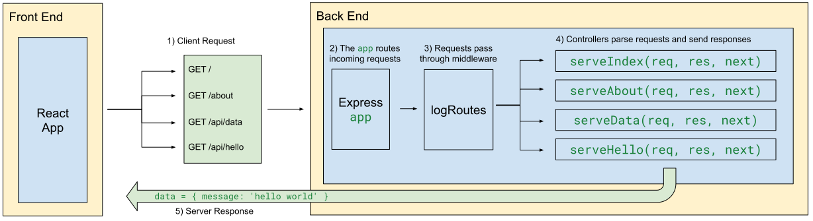

# Building a Static Web Server with Middleware


Follow along with code examples [here](https://github.com/The-Marcy-Lab-School/8-0-1-express-middleware)!


In the last lecture, we learned about the basics of Express: endpoints and controllers. Today, we'll learn about a new kind of controller that will expand our server's capabilities: middleware.

**Table of Contents:**

- [Terms](#terms)
- [Express Review](#express-review)
- [Middleware and `next()`](#middleware-and-next)
- [Static Web Servers](#static-web-servers)
  - [Serving React Static Assets](#serving-react-static-assets)
  - [`express.static()` Middleware](#expressstatic-middleware)
- [Summary](#summary)

## Terms

* **Middleware** - a function in express that intercepts and processes incoming HTTP requests. It can perform server-side actions such as parsing the request, modifying the response, or executing additional logic before passing control to the next middleware in the chain."
* **`path` module** - a module for creating absolute paths to static assets
* **Environment Variable** - a variable defined outside of the JavaScript execution context.
* **`__dirname`** — an environment variable that returns the path to the parent directory of the current file.
* **Static Assets** - unchanging files delivered to the client exactly as they are stored on a server. These include HTML, CSS, JavaScript files, images, videos, fonts, and documents. For React projects, we need to "build" our project to generate static assets (convert `.jsx` files to `.js` files).

## Express Review

Remember how the Express app works?


1. A client sends a **request** to the server.
2. The server receives the request and **routes** it to the proper **controller** based on the specific **endpoint**.
3. The controller processes the request, interacts with any necessary data or services, and generates a **response**.
4. The server sends the response back to the client.
5. The client is now free to do what it likes with the response.

And here is how we can create a server with a single endpoint: `/api/hello`

```js
const express = require('express');
const app = express();

// When triggered, this controller will send a response
const serveHello = (req, res, next) => {
  const name = req.query.name || "stranger"
  res.send(`hello ${name}`);
}

// A GET request to /api/hello serveHello
app.get('/api/hello', serveHello);


// Listen for requests on port 8080
const port = 8080;
app.listen(port, () => console.log(`listening at http://localhost:${port}`)); 
```

Remember, a **controller** is a callback function that parses a request and sends a response. It will be invoked asynchronously when the associated endpoint is sent a request.

Every controller is invoked with three values:
* A `req` object which holds data related to the request, including **query parameters**.
* A `res` object which has methods to send a response.
* A `next` function, typically only used by "Middleware".

Now its time to learn about that `next` method!

## Middleware and `next()`

When a server receives an HTTP request, it can do more than just send back a response. Often, the server will perform a number of server-side actions before a response is sent.

For example, suppose that you wanted the server to print out a message each time that the server is sent an HTTP request. The message could include the endpoint that was requested, the request method, and the time of the request.

**<details><summary>Q: Why would it be helpful to see this information?</summary>**

Logging incoming HTTP requests can be incredibly helpful for debugging purposes. Suppose that your server crashes unexpectedly. If the crash was caused by an incoming request, we can simply look at the most recent request in the logs and know where to start debugging.

</details>

To add this functionality, we could modify every endpoint controller like so:

```js
const serveHello = (req, res, next) => {
  // print the current time and request information 
  const timeOfRequest = new Date().toLocaleString();
  console.log(`${req.method}: ${req.originalUrl} - ${timeOfRequest}`);
  
  // then send the response
  const name = req.query.name || "stranger"
  res.send(`hello ${name}`);
}
```

However, adding this to every single controller would be way too repetitive.

Instead, we can use a **middleware**. Middleware in Express is a function that intercepts and processes incoming HTTP requests before it reaches the final controller or response handler.

To add a new middleware, create a controller that invokes `next()` and register it with `app.use()`

```js
// Middleware function for logging route requests
const logRoutes = (req, res, next) => {
  const time = new Date().toLocaleString();
  console.log(`${req.method}: ${req.originalUrl} - ${time}`);
  next(); // Passes the request to the next middleware/controller
};
// Register the logRoutes middleware globally to log all requests
app.use(logRoutes);

// Other endpoints and controllers
```

* We first create the `logRoutes` function to print out information about the request
* At the end, we invoke `next()`, passing along the request to one of our controllers to send a response.
* We register `logRoutes` using `app.use()` which causes it to be invoked for ALL endpoints. 
* Order matters! Middleware should be defined before controllers to ensure that it is invoked before the response is sent to the client.

Our diagram now looks like this:



<details>

<summary><strong>Q: So, if a user sends a request to <code>http://localhost:8080/api/hello</code>, which functions are invoked and in what order?</strong></summary>

First the `logRoutes` middleware is invoked. The `next()` function is called which passes the request to the next controller, `serveHello`.

</details>

<details>

<summary><strong>Q: What would happen if the <code>logRoutes</code> controller DID send a response to the client? What would happen if it didn't invoke <code>next()</code>?</strong></summary>

If `logRoutes` did invoke `res.send()`, the `serveHello` controller would NOT be invoked as a response has already been sent. 

If we simply didn't invoke `next()`, our server would "hang" — the response would never be completed and the client would likely receive a timeout error because the request took too long.

</details>

Middleware can be custom-made like this `logRoutes`. However, we can also utilize some of the out-of-the-box middleware controllers provided by Express.

## Static Web Servers

When you visit a website, like [https://google.com](https://google.com), you are immediately presented with a rendered website. What's happening there?


Now, imagine that the website is just the "static assets" of a React project deployed on GitHub pages! But instead of using GitHub pages, Google has its own servers to store those files and serve them to visiting users.

We call these **static web servers** because they store **static assets** (HTML, CSS, and JS files) and then provide a server application that serves those assets when requested. 



HTML, CSS, and JavaScript files are considered "static" because their content remains unchanged when being transferred from server to client.

APIs on the other hand serve dynamic content that changes depending on parameters of the request.



### Serving React Static Assets

As we've learned, a React project's static assets are built into a folder called `dist`. In the provided repo, build the `dist` folder and note the file structure:

```
dist/
  - index.html
  - assets/
      - index-CZ4vidNt.js
      - index-kQJbKSsj.css
```

When a user visits the server's homepage `/`, we want to send the `index.html` file. Back in the server, we can add the following endpoints and controllers:

```js
// The path module is useful for constructing relative filepaths
const path = require('path');

const serveIndexHTML = (req, res, next) => {
  // `path.join()` constructs an absolute file from the arguments
  // `__dirname` provides the absolute path of the current module's parent directory.
  const filepath = path.join(__dirname, '../vite-project/dist/index.html');
  res.sendFile(filepath);
};

app.get('/', serveIndexHTML);
```

But the `index.html` file needs access to `/assets/index-CZ4vidNt.js` and `/assets/index-kQJbKSsj.css`. So we need two more controllers:

```js
const serveIndexHTML = (req, res, next) => {
  const filepath = path.join(__dirname, '../vite-project/dist/index.html');
  res.sendFile(filepath);
}

const serveJS = (req, res, next) => {
  const filepath = path.join(__dirname, '../vite-project/dist/assets/index-CZ4vidNt.js');
  res.sendFile(filepath)
};

const serveCSS = (req, res, next) => {
  const filepath = path.join(__dirname, '../vite-project/dist/assets/index-kQJbKSsj.css');
  res.sendFile(filepath)
};

app.get('/', serveIndexHTML);
app.get('/assets/index-CZ4vidNt.js', serveJS);
app.get('/assets/index-kQJbKSsj.css', serveCSS);
```

Seems repetitive, no? Now, imagine that your application has hundreds of static assets!

### `express.static()` Middleware

Rather than defining endpoints for every single static asset that you wish to serve, we can use the `express.static()` middleware generator included with Express.

`express.static()` is not middleware itself. Instead, invoking this function with a filepath to the entire folder containing our static statics will generate a middleware function that we can use:

```js
const path = require('path');

// the filepath is to the entire assets folder
const filepath = path.join(__dirname, '../vite-project/dist');

// generate middleware using the filepath
const serveStatic = express.static(filepath);

app.use(serveStatic);

// other controllers 
```

Explanation:

* Now, we just make a filepath to the entire dist folder and pass the filepath to `express.static()` which returns a middleware function which we call `serveStatic`
* `app.use(serveStatic)` will checks all incoming requests to see if they match files in the provided folder. if they do, they will be sent to the client
* Order matters! Remember to add this before the rest of your controllers. 

Like `logRoutes`, this middleware intercepts incoming requests before they reach the controllers. Unlike `logRoutes`, the middleware generated by `express.static()` can send a response to the client if a matching file is found. If not, it will pass the request to the controllers.

## Summary

* **Controllers:** Callback functions that handle requests by parsing them and sending responses.
* **Middleware Functions**: Functions similar to controllers but pass requests to the next middleware without sending a response. They can also be executed for all requests while controllers typically handle a single endpoint.
* **Static Assets:** Unchanging files (e.g., HTML, CSS, JS) served by a web server. For React projects, we need to "build" the project to convert "dynamic" `.jsx` files to "static" `.js` files
* **Serving Static Assets**:
  1. Construct an absolute file path to the static assets folder using `path.join()` and `__dirname`.
  2. Use `express.static(filepath)` middleware to make static assets publicly available.
  3. Register the middleware with `app.use()`
