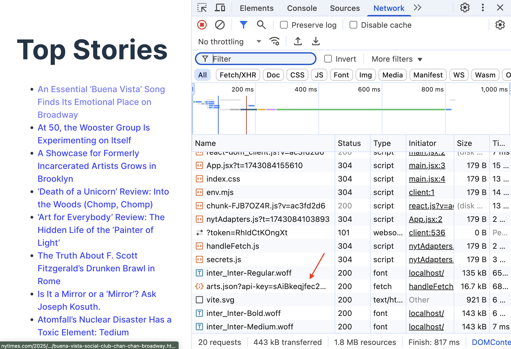
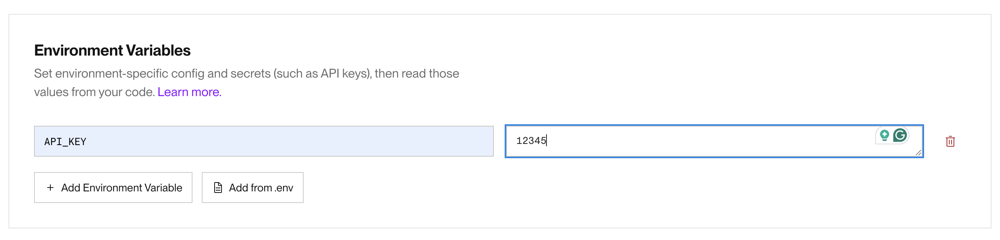

# 4. Securing API Keys and Environment Variables


Follow along with code examples [here](https://github.com/The-Marcy-Lab-School/8-0-2-express-api-middleman)!


Thus far, we have not been able to deploy a project that uses an API key without likely exposing that API key to the public. Now that we have the power to build a server, we can finally do just that!

**Table of Contents:**

* [Terms](3-securing-api-keys-and-environment-variables.md#terms)
* [Setup](3-securing-api-keys-and-environment-variables.md#setup)
* [Never Use API Keys In The Frontend](3-securing-api-keys-and-environment-variables.md#never-use-api-keys-in-the-frontend)
  * [Create a Server Application To Make API Key Requests For You](3-securing-api-keys-and-environment-variables.md#create-a-server-application-to-make-api-key-requests-for-you)
* [API Requests From The Server](3-securing-api-keys-and-environment-variables.md#api-requests-from-the-server)
  * [Environment Variables and Dotenv](3-securing-api-keys-and-environment-variables.md#environment-variables-and-dotenv)
  * [Deploying with Environment Variables](3-securing-api-keys-and-environment-variables.md#deploying-with-environment-variables)
* [Same Origin Requests from the Frontend](3-securing-api-keys-and-environment-variables.md#same-origin-requests-from-the-frontend)
* [Development Frontend Request Proxy](3-securing-api-keys-and-environment-variables.md#development-frontend-request-proxy)
  * [Enable Proxy Requests In Development](3-securing-api-keys-and-environment-variables.md#enable-proxy-requests-in-development)

## Terms

* **API Key** - a secret code that verifies your identity as a developer using an API's limited resources. Do not share these!
* **Environment Variable** — a hidden variable stored on the host's machine (your laptop or Render.com) and accessible in Node through the `process.env` object
* **`.env` file** - a file to store hidden variables like API keys. Ignored by GitHub and uploaded to Render for deployment.
* **`dotenv` module** - an npm package for importing `.env` files
* **Cross-origin requests** - HTTP requests made from one domain to another domain, protocol or port.
* **Request Proxy In Development** — faking the origin of the request in a frontend development server to match the origin of the backend server

## Setup

For this lecture, you'll need an API that requires an **API key** - a secret code that verifies your identity as a developer using an API's limited resources.

We'll use the New York Times API because the API is quite friendly to use. Make an account on the [NYT Developers Page](https://developer.nytimes.com/get-started) and follow the instructions to enable the "Top Stories API".

We'll use the endpoint below to access the top stories in the "Arts" section:

```
https://api.nytimes.com/svc/topstories/v2/arts.json?api-key=yourkey
```

Once you have an API key, clone the practice repository linked above and do the following:

* `cd` into the `frontend` application and install dependencies.
*   Then, create a file inside of `frontend/` called `secrets.js` and paste the following code:

    ```js
    export const API_KEY = "paste-api-key-here"
    ```

    This value is imported and used by the `frontend/src/adapters/nytAdapters.js` file to send a request to the NYT API. The file is already added to `.gitignore`.
* Finally, run the program with `npm run dev`. You should see the application below:


## Never Use API Keys In The Frontend

Working with API keys presents a tricky problem. We need the API key to exist in our program to access the API's resources, but we need to avoid putting it in a place that can be viewed by the public.

<details>

<summary><strong>Q: Why is it not a good idea to share your API key? What really could go wrong?</strong></summary>

The API key is a way to verify your identity as a developer. Some APIs will charge you for each request that you make using your API key and if someone else gets a hold of your API key, they could steal your request resources.

</details>

There are two common places that we can mistakenly expose our API keys to the public.

1. In a public remote repository (on GitHub)
2. In the HTTP requests sent by the client (the browser) to the API

To avoid the first mistake, we should always store API keys and other sensitive information in a git-ignored file (e.g. `secrets.js` or `.env`).

To avoid the second mistake, _we must NEVER send requests with API keys from client-side (frontend) applications_.


NEVER send requests with API keys from client-side (frontend) applications!


To understand why, run the `frontend` application from the provided repo, view the Networks tab and refresh the page. Then, look through the requests sent by the application and see if you can find the exposed API key!



All requests sent by the client will appear in this Network tab. Even if the API key is hidden in a gitignored file or stored in an environment variable (more on that soon), the client-side (frontend) application still needs to embed that value into the HTTP request URL. There is simply no way to hide it from this Networks tab.

### Create a Server Application To Make API Key Requests For You

Generally, client-side (frontend) code is inherently insecure because, well, we just give the code to the user to run on their browser! If we're not careful, we may accidentally give away sensitive data.

Server-side (backend) code on the other hand is much more secure. A client can send HTTP requests to a server's endpoints to request the server to execute code, but the client has no visibility into the inner-workings of the server.

So, to securely use an API key, we must use it in our server-side code. This means building a server to make requests on behalf of the client, acting as a sort of middleman. As long as the server has the API key, the client doesn't need it!


In other words, the client sends a request to the server without any API key. The server then sends a request using the API key and sends the fetched data back to the client.

In order to implement this, we need to build a server application that:

* Has its own API endpoint that the client can use without the client needing to know the API key.
* Securely stores the API key (we'll use environment variables for this)

## API Requests From The Server

Let's start by making a server endpoint that fetches from the API using the API key.

```js
// We'll secure this value soon!
const API_KEY = 'paste-your-api-key-here';

// First, we make a controller
const serveTopArtStories = async (req, res, next) => {
  const url = `https://api.nytimes.com/svc/topstories/v2/arts.json?api-key=${API_KEY}`;

  try {
    // This is pretty standard fetching logic
    const response = await fetch(url);
    const data = await response.json();
    const storiesWithTitle = data.results.filter(story => story.title);

    // send the fetched data to the client
    res.send(storiesWithTitle);
  } catch (error) {
    // or send an error. 503 means the service is unavailable
    res.status(503).send(error);
  }
}

// Then, we make that controller available with an endpoint
app.get('/api/stories', serveTopArtStories)
```

Start your server and visit [http://localhost:8080/api/stories](http://localhost:8080/api/stories) to see the fetched data! Note that the client (your browser) doesn't need an API key anymore to access this data!

There is one thing we need to clean up first — we need to secure the API key.

### Environment Variables and Dotenv

The most common way to store sensitive server-side data like API keys is with a `.env` file ("dot E-N-V file").

`.env` files have a really simple format.

```
secretValue1="abc123"
anotherSecret="my password"
API_KEY="xyz"
```


Remember to add `.env` to your `.gitignore` file!


To use the environment variables in our server code, we'll use the `dotenv` module from npm.

```
npm i dotenv
```

`dotenv` provides a `dotenv.config()` method which looks for `.env` files and loads them into a special object `process.env` object:

```js
const dotenv = require('dotenv');
dotenv.config();

// .env values are added to process.env
console.log(process.env.API_KEY); // xyz
```

With our `API_KEY` variable moved to the `.env` file, we can modify our controller:

```js
const serveTopArtStories = async (req, res, next) => {
  const url = `https://api.nytimes.com/svc/topstories/v2/arts.json?api-key=${process.env.API_KEY}`;

  try {
    const response = await fetch(url);
    const data = await response.json();
    const storiesWithTitle = data.results.filter(story => story.title);
    res.send(storiesWithTitle);
  } catch (error) {
    console.error("Error while fetching:", error);
    res.status(503).send(error);
  }
}
```

### Deploying with Environment Variables

`.env` files are so widely used that most server hosting services will provide a way to securely upload `.env` files. That way, your deployed server will have access to `.env` values without needing those values to be stored on GitHub.

For example, on Render, you can add environment variables when configuring your new web service.



## Same Origin Requests from the Frontend

Now our server can perform an API request using a protected API key.

Let's update the frontend React application to use our server instead of directly accessing the NYT API.


Let's update the `url` that our adapter function uses and remove the filter code which is now handled server-side:

```js
import { handleFetch } from './handleFetch';

export const getTopStories = async () => {
  const url = `/api/stories`;

  return await handleFetch(url);
}
```

To test this out we should:

* Re-run `npm run build` to re-build our frontend application's static assets in the `dist/` folder.
* Re-run the server which will serve our updated frontend static assets.
* Visit the server [http://localhost:8080](http://localhost:8080) to see the updated frontend!


Why is the API url just `/api/stories` and not `http://localhost:8080/api/stories`?

When we send requests to servers that we don't control, we include the full URL (e.g. [https://dog.ceo/api/breeds/image/random](https://dog.ceo/api/breeds/image/random)). These kinds of requests are **cross-origin** because the origin of the request and the destination are not the same.

In this case, we visit `http://localhost:8080` to access both the client-side (frontend) code and the API endpoint `http://localhost:8080/api/stories`. In this case, the client-side code is coming from the same origin as the destination of its API request. When we leave out the host (`http://localhost:8080`), our browser assumes we are making a **same-origin request**.


## Development Frontend Request Proxy

In that last step, we tested the frontend changes by running `npm run build` to update our frontend `dist` folder, and by opening the static frontend application served by our backend at [http://localhost:8080](http://localhost:8080).

Re-building the frontend application each time we make a change is tedious. And remember, we have a frontend development server that will automatically re-load the application each time we save a file! However, when we try running the frontend with `npm run dev`, the app breaks!

When the frontend makes a request to `/api/gifs` from [http://localhost:5173/](http://localhost:5173/), the browser assumes it is a same-origin request and sends the request to [http://localhost:5173/api/gifs](http://localhost:5173/api/gifs).

But remember, the API lives at port `8080`. Now that we're viewing the frontend from port `5173`, we've changed the origin of the request!

### Enable Proxy Requests In Development

To enable the development version of our frontend to send requests to `http://localhost:8080`, we need to redirect the "same-origin" requests from [http://localhost:5173](http://localhost:5173) to [http://localhost:8080](http://localhost:8080). This is called "proxying".


The word "proxy" is synonymous with the word "substitute".


To set up proxying, replace your `frontend/vite.config.js` file's contents with the code below:

```js
import { defineConfig } from 'vite';
import react from '@vitejs/plugin-react';

const SERVER_PORT = 8080;

// https://vitejs.dev/config/
export default defineConfig({
  plugins: [react()],
  server: {
    proxy: {
      '/api': {
        target: `http://localhost:${SERVER_PORT}`,
        changeOrigin: true,
      },
    },
  },
});
```

Now, when we run our development server, all requests starting with `/api` will be sent to the defined `target` which we set to `http://localhost:8080`.
