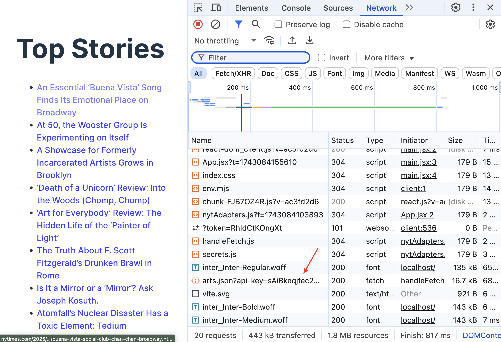

# Securing API Keys with Environment Variables


Follow along with code examples [here](https://github.com/The-Marcy-Lab-School/8-0-2-express-api-middleman)!


Serving static assets is a core functionality of a server application.

The second use case for a server is to perform 3rd-party API requests that require an API key in a manner that protects the developer's API key.

Let's do it!

**Table of Contents:**

- [Terms](#terms)
- [Setup](#setup)
- [Never Use API Keys In The Frontend](#never-use-api-keys-in-the-frontend)
  - [Create a Server Application To Make API Key Requests For You](#create-a-server-application-to-make-api-key-requests-for-you)
- [API Requests From The Server](#api-requests-from-the-server)
  - [Environment Variables and Dotenv](#environment-variables-and-dotenv)
  - [Deploying with Environment Variables](#deploying-with-environment-variables)
- [Making an API request from the frontend](#making-an-api-request-from-the-frontend)
- [Development Frontend Request Proxy (if time)](#development-frontend-request-proxy-if-time)
  - [Two Version of the Frontend](#two-version-of-the-frontend)
  - [Proxy Requests](#proxy-requests)

## Terms

* **API Key** - a secret code that verifies your identity as a developer using an API's limited resources. Do not share these!
* **Environment Variable** — a hidden variable stored on the host's machine (your laptop or Render.com) and accessible in Node through the `process.env` object
* **`.env` file** - a file to store hidden variables like API keys. Ignored by GitHub and uploaded to Render for deployment.
* **`dotenv` module** - an npm package for importing `.env` files
* **Cross-origin requests** - HTTP requests made from one origin to another.
* **Request Proxy In Development** — faking the origin of the request in a frontend development server to match the origin of the backend server

## Setup

For this lecture, you'll need an API that requires an **API key** - a secret code that verifies your identity as a developer using an API's limited resources. We'll use the New York Times API because the API is quite friendly to use.

You can either use an API key provided by your instructor or acquire your own API key by making an account on the [NYT Developers Page](https://developer.nytimes.com/get-started) and following the instructions. Just make sure to enable the "Top Stories API" and copy the API key.

We'll use the endpoint below to access the top stories in the "Arts" section:

```
https://api.nytimes.com/svc/topstories/v2/arts.json?api-key=yourkey
```

Once you have an API key, clone the repository linked above and do the following:
- `cd` into the `frontend` application and install dependencies.
- Then, create a file inside of `frontend/` called `secrets.js` and paste the following code:

  ```js
  export const API_KEY = "paste-api-key-here"
  ```

  This value is imported and used by the `frontend/src/adapters/nytAdapters.js` file to send a request to the NYT API. The file is already added to `.gitignore`.
- Finally, run the program with `npm run dev`. You should see the application below:


## Never Use API Keys In The Frontend

Working with API keys presents a tricky problem. We need the API key to exist in our program to access the API's resources, but we need to avoid putting it in a place that can be viewed by the public. So, where can we safely use an API key?

<details><summary><strong>Q: Why is it not a good idea to share your API key? What really could go wrong?</strong></summary>

The API key is a way to verify your identity as a developer. Some APIs will charge you for each request that you make using your API key and if someone else gets a hold of your API key, they could steal your request resources.

</details>

There are two common places that we can mistakenly expose our API keys to the public.
1. In a public remote repository (on GitHub)
2. In the HTTP requests sent by the client (the browser) to the API

To address the first mistake, we should always store API keys and other sensitive information in a git-ignored file (e.g. `secrets.js` or `.env`).

To address the second mistake, _we must NEVER send requests with API keys from client-side (frontend) applications_.



NEVER send requests with API keys from client-side (frontend) applications!




To understand why, run the `frontend` application from the provided repo, view the Networks tab and refresh the page. Then, look through the requests sent by the application and see if you can find the exposed API key!



All requests sent by the client will appear in this Network tab. Even though the API key is hidden in a gitignored file, the client-side (frontend) application still needs to embed that value into the HTTP request URL and there is no way to hide it from this Networks tab.


### Create a Server Application To Make API Key Requests For You

Client-side (frontend) code is inherently insecure because, well, we just give it to the user to run on their browser!

Server-side (backend) code on the other hand is much more secure. A client can send HTTP requests to a server's endpoints to request the server to execute code, but the client has no visibility into the inner-workings of the server. 

So, to securely use an API key, we can create our own server to make requests on behalf of the client. As long as the server has the API key, the client doesn't need it!


In other words, the client sends a request to the server without any API key. The server then sends a request using the API key and sends the fetched data back to the client.

In order to implement this, we need to build a server application that:

- Has its own API endpoint that the client can use without the client needing to know the API key.
- Securely stores the API key (we'll use environment variables for this)

## API Requests From The Server

Let's start by making a server endpoint that fetches from the API using the API key.

```js
// We'll secure this value soon!
const API_KEY = 'paste-your-api-key-here';

// First, we make a controller
const serveTopArtStories = async (req, res, next) => {
  const url = `https://api.nytimes.com/svc/topstories/v2/arts.json?api-key=${API_KEY}`;

  try {
    // This is pretty standard fetching logic
    const response = await fetch(url);
    const data = await response.json();
    const storiesWithTitle = data.results.filter(story => story.title);

    // send the fetched data to the client
    res.send(storiesWithTitle);
  } catch (error) {
    // or send an error. 503 means the service is unavailable
    res.status(503).send(error);
  }
}

// Then, we make that controller available with an endpoint
app.get('/api/stories', serveTopArtStories)
```

Start your server and visit [http://localhost:8080/api/stories](http://localhost:8080/api/stories) to see the fetched data! Note that the client (your browser) doesn't need an API key anymore to access this data!

There is one thing we need to clean up first — we need to secure the API key.

### Environment Variables and Dotenv

The most common way to store sensitive server-side data like API keys is with a `.env` file ("dot E-N-V file").

`.env` files have a really simple format.

```
secretValue1="abc123"
anotherSecret="my password"
API_KEY="xyz"
```


Remember to add `.env` to your `.gitignore` file!


To use the environment variables in our server code, we'll use the `dotenv` module from npm.

```
npm i dotenv
```

`dotenv` provides a `dotenv.config()` method which looks for `.env` files and loads them into a special object `process.env` object:

```js
const dotenv = require('dotenv');
dotenv.config();

// .env values are added to process.env
console.log(process.env.API_KEY); // xyz
```

With our `API_KEY` variable moved to the `.env` file, we can modify our controller:

```js
const serveTopArtStories = async (req, res, next) => {
  const url = `https://api.nytimes.com/svc/topstories/v2/arts.json?api-key=${process.env.API_KEY}`;

  try {
    const response = await fetch(url);
    const data = await response.json();
    const storiesWithTitle = data.results.filter(story => story.title);
    res.send(storiesWithTitle);
  } catch (error) {
    res.status(503).send(error);
  }
}
```

### Deploying with Environment Variables

`.env` files are so widely used that most server hosting services will provide a way to securely upload `.env` files. That way, your deployed server will have access to `.env` values without needing those values to be stored on GitHub.

For example, on Render, you can add environment variables when configuring your new web service.


## Making an API request from the frontend

Now our server can perform an API request using a protected API key. 

Let's update the frontend React application to use our server instead of directly accessing the NYT API.


Let's update the `url` that our adapter function uses:

```js
import { handleFetch } from './handleFetch';

export const getTopStories = async () => {
  const url = `/api/stories`;

  return await handleFetch(url);
}
```

To test this out we should:

* Re-run `npm run build` to re-build our frontend application's static assets in the `dist/` folder.
* Re-run the server which will serve our updated frontend static assets.
* Visit the server http://localhost:8080 to see the updated frontend!



Normally when sending requests to 3rd-party APIs, we include the full URL: `http://someapi.com/endpoint`. These kinds of requests are **cross-origin** requests because the origin (`http://someapi.com`) is different from the origin of our server (`http://localhost` or wherever the app is deployed). Our server can safely do this but as we've seen, our front-ends should not.

However, we want to send a **same-origin** request — the origin of the request is the same as the origin of the response (we got the frontend application from the same server that we are now requesting data from).

So, our request URL will be: `/api/gifs`. When we leave the host out of the URL, our browser will assume the request is a same-origin request.



## Development Frontend Request Proxy (if time)



TLDR: copy and paste the code snippet below into your `vite.config.js` file to make your development frontend application play nicely with your server and avoid cross-origin resource sharing (CORS) issues.



### Two Version of the Frontend

We could totally stop here and everything would be great. We can now build server applications that provide frontends that utilize 3rd-party APIs without exposing API keys by utilizing environment variables!

However, we need to remember that we have two different versions of our frontend:

1. The development version (which lives in the `frontend/src` folder)
2. The built "production/distribution" version (which lives in the `frontend/dist` folder)

<details>

<summary><strong>Q: Which version does the server serve?</strong></summary>

The built "production/distribution" version in the `frontend/dist` folder!

Remember, the server can only serve static assets. The development version is not "static" because it contains dynamic JSX React code. It must be compiled into plain JS first.

</details>

### Proxy Requests

This is where things may get confusing... Bear with me...

In that last step, we tested the frontend changes by running `npm run build` to update our frontend `dist` folder, and by opening the static frontend application served by our backend at http://localhost:8080.

If we instead tested the frontend changes by running `npm run dev` and viewing the app through the Vite development server, the app would break. In fact, if you do that now, it will still break. This is because `npm run dev` will serve our frontend at [http://localhost:5173/](http://localhost:5173/) which is a different origin from our server: [http://localhost:8080](http://localhost:8080).

When the frontend makes a request to `/api/gifs` from [http://localhost:5173/](http://localhost:5173/), the request is going to [http://localhost:5173/api/gifs](http://localhost:5173/api/gifs) which doesn't provide the resources we are looking for.

To enable the development version of our frontend to send same-origin requests, we need to "trick" the Vite development server into sending "same-origin" requests to [http://localhost:8080](http://localhost:8080) instead of [http://localhost:5173](http://localhost:5173).

To do this, copy and paste the code below into your `frontend/vite.config.js` file. This is called a **proxy**.

```js
import { defineConfig } from 'vite';
import react from '@vitejs/plugin-react';

const SERVER_PORT = 8080;

// https://vitejs.dev/config/
export default defineConfig({
  plugins: [react()],
  server: {
    proxy: {
      '/api': {
        target: `http://localhost:${SERVER_PORT}`,
        changeOrigin: true,
      },
    },
  },
});
```
