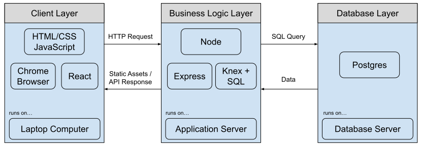

# SQL and Databases


Follow along with code examples [here](https://github.com/The-Marcy-Lab-School/8-2-0-sql-and-databases)!


We've learned how to build a server application using Express. It can serve the static assets for a frontend and can handle requests through an API. But the data is not persistent!

This week, we'll learn about the tools needed to build a truly "fullstack" web application with a proper database.

Prior to this lecture, please follow these [PostgreSQL Setup Steps](../environment-setup/postgres-setup.md).

Let's dive in!

**Table of Contents**

- [Terms](#terms)
- [What even is a database?](#what-even-is-a-database)
  - [Relational Database Management Systems](#relational-database-management-systems)
  - [How does a database fit into an application?](#how-does-a-database-fit-into-an-application)
- [What is SQL?](#what-is-sql)
  - [Tips to avoid SQL errors](#tips-to-avoid-sql-errors)
- [Summary](#summary)

## Terms

* **Fullstack** - refers to the combination of frontend (client-side) and backend (server-side) technologies.
* **PERN** - an acronym for a specific set of technologies used to build a fullstack web application: Postgres, Express, React, and Node. This acronym is useful when asked "what stack do you use?"
* **Database** - a structured collection of data that is organized in a manner for easy retrieval.
* **Database Management System (DBMS)** - a piece of software used to create and maintain a database.
* **Postgres** - a popular "relational" database management system that stores data in a table-like manner
* **Table** - a collection of related data organized in rows and columns.
  * A **row** represents a single object/instance/record in the table
  * A **column** represents a property/attribute/field of that object. Columns have data types such as integer, string, date, boolean, etc...
  * A **primary key** serves as the unique identifier for a row in a table
* **SQL (Structured Query Language)** - a language used by relational database management systems to create, read, update, or delete data from a database.

## What even is a database?

A **database** is just a structured collection of data.

Postgres is a type of **database management system** (DBMS), a program that makes it easier for users to find, update, and manage the data.




💡 If a database is like a library, then a database management system is like a librarian with a catalog system. The librarian organizes the books and manages how visitors take and return books.



### Relational Database Management Systems

Specifically, Postgres is a **Relational DBMS (RDBMS)**, which just refers to the particular way that Postgres organizes its databases. 


In a relational DBMS:
* Data is separated into collections called **tables**, spreadsheet-like structures that represent a single type of value or "entity" (*e.g. users, posts, comments, likes, etc...*)
  * Each **row** represents a single resource in the table. (*e.g. a single user in the users table*)
  * Each **column** defines a property that all resources of a table share (*e.g. a users table has `id`, `username`, and `password` columns*).
* Every table needs a **primary key** — a column that uniquely identifies each row in the table. Typically this is just called `id` 
* Tables can be related to each other, typically by referencing the `id` of another table (*e.g. a posts table has a `user_id` column so that each post is related to the user in the users table that created it*)



While there are many types of database management systems, each with their own approach to managing a database, [Postgres is the most popular](https://survey.stackoverflow.co/2024/technology/#1-databases). The next 3 most popular are also RDBMSs too!

Popular non-relational database management systems include [MongoDB](https://www.mongodb.com/), [Redis](https://redis.io/), and [Firebase](https://firebase.google.com/).

### How does a database fit into an application?

Relational database management systems like Postgres are quite similar to our Express servers! When we run the Postgres software, it provides access to the database via a server port (`localhost:5432`). 



However, while our Express servers take in HTTP requests, Postgres accepts **Structured Query Language (SQL)** queries. For example, to insert data into a table of users we might send the following SQL query to Postgres:

```SQL
INSERT INTO user (id, username, password) VALUES (1, 'reuben', 'coder123')
```

We'll use a tool called [Knex](./8-knex.md) to execute those queries from our server's model. Code that uses `knex` looks like this:


```js
class User {

  //...other methods

  static async getAll() {
    const allUsers = await knex.raw(`SELECT * FROM user`);
    res.send(allUsers);
  }
}
```

With Postgres, we now have achieved a 3-layer system of responsibility:

* The database layer is focused solely on managing and securing the data.
* The application layer is focused solely on receiving client requests, retrieving the appropriate data from the database, and sending it back to the client.
* If we need to update or restart the application server, the database server can continue running without losing the data.

## What is SQL?

SQL (Structured Querying Language) is the language used by many relational DBMSs to create, modify, and retrieve data from a database.

SQL is written in **query statements** that are composed of **keywords** and **clauses**. Keywords determine the operation to be performed. Clauses modify the operation.

* Common keywords: `SELECT`, `FROM`, `INSERT INTO`, `UPDATE`, `DELETE`
* Common clauses: `WHERE`, `GROUP BY`, `ORDER BY`

For example:

```sql
SELECT title, release_year FROM film WHERE length <= 90;
```

**Q: What does the query above look for?**

<details>

<summary>Answer</summary>

The title and release year of the movies that are 90 minutes or less in length from the `film` table.

</details>

```sql
SELECT * FROM film;
```

**Q: What about this one?**

<details>

<summary>Answer</summary>

This query will get all of the data from the films table.

</details>

### Tips to avoid SQL errors

* SQL is NOT case sensitive. However, it is a standard practice to write keywords in all-caps to distinguish them from values.
* SQL strings MUST be written with single quotes `''` to avoid unwanted errors.
* SQL queries MUST end in a semicolon `;` to avoid unwanted errors.

## Summary

* **Database** - a structured collection of data that is organized in a manner for easy retrieval (like a library)
* **Database Management System (DBMS)** - a piece of software used to organize and manage access to a database (like a librarian)


* **Postgres** - a popular "relational" database management system that stores data in a table-like manner
* **Table** - a collection of related data organized in rows and columns.
  * A **row** represents a single object/instance/record in the table
  * A **column** represents a property/attribute/field of that object. Columns have data types such as integer, string, date, boolean, etc...
  * A **primary key** serves as the unique identifier for a row in a table


* **SQL (Structured Query Language)** - a language used by relational database management systems to create, read, update, or delete data from a database.

```sql
SELECT title, release_year FROM film WHERE length <= 90;
```
