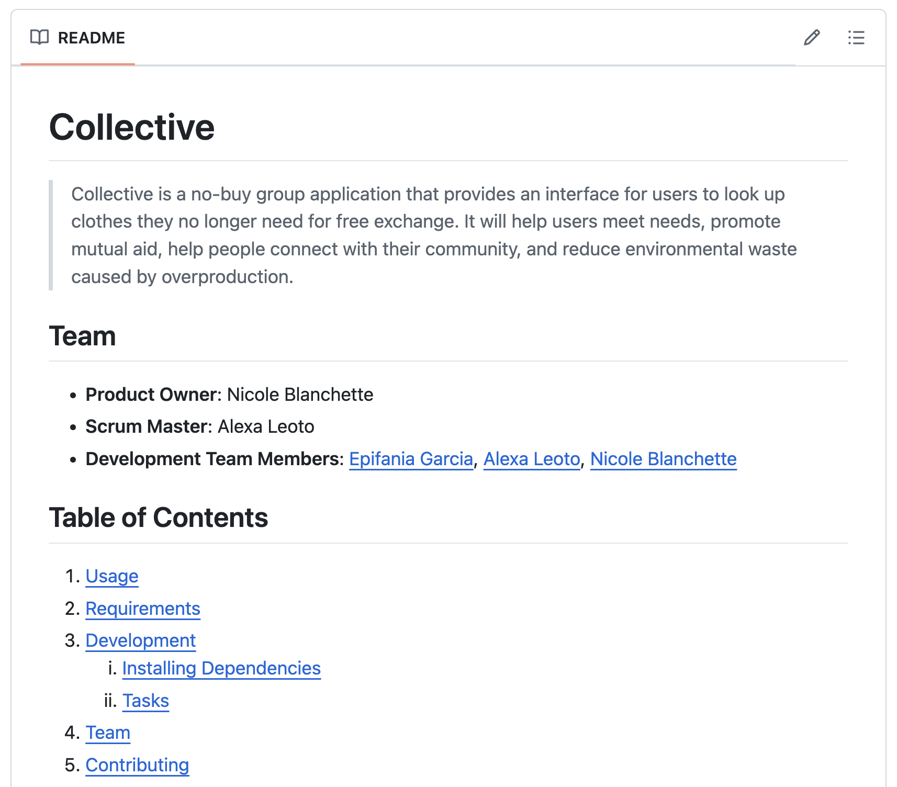

# Mod 9 — Civic Tech Hackathon

**Table of Contents**

- [🧭 Overview](#-overview)
  - [🌈 What does Civic Tech Hackathon Represent in the Program Arc?](#what-does-civic-tech-hackathon-represent-in-the-program-arc)
  - [🚀 How Will Civic Tech Hackathon *feel*?](#-how-will-civic-tech-hackathon-feel)
  - [😌 What skills and mindsets lead to success?](#-what-skills-and-mindsets-lead-to-success)
- [🏃 Sprints](#-sprints)
- [📆 Calendar, Rituals, and Support Meetings](#-calendar-rituals-and-support-meetings)
  - [🕰️ Sample Schedule](#️-sample-schedule)
  - [👥 Whole-Group Meetings](#-whole-group-meetings)
  - [🤝 Support Meetings](#-support-meetings)
  - [🥲 Fridays and Weekends](#-fridays-and-weekends)
- [✅ Key Deliverables and Examples](#-key-deliverables-and-examples)
  - [Entity Relationship Diagram](#entity-relationship-diagram)
  - [Wireframe:](#wireframe)
  - [Polished GitHub Repository:](#polished-github-repository)
  - [Demo Day Presentation \& Project Demo:](#demo-day-presentation--project-demo)
- [👀 What's Next](#-whats-next)

##  🧭 Overview 
At the Marcy Lab School, training software engineers is just one of our ambitions. Our hope is that you become innovators and leaders.

Civic Tech Hackathon (CTH) is a three-week-long culmination of our Leadership & Development and Software Engineering curricula, resulting in more than just another technical project. CTH is an opportunity for you and your peers to come together to solve real-world problems facing your communities.  

The final day of Civic Tech Hackathon will be Demo Day, where you will present your solution to an audience of friends, families, staff, mentors, volunteers, employers, funders, and members of the Marcy Lab School community at large!

### 🌈 What does Civic Tech Hackathon Represent in the Program Arc?

The Civic Tech Hackathon comes at the end of the third quarter of the Software Engineering Fellowship. In the Leadership & Development curriculum, you will have explored your personal and racial identities to better understand yourselves as individuals, community members, and technologists. You will have also spent time investigating how systems of power like racism, sexism, and classism can shape your own lives and the lives of your families and communities. 

Simultaneously, by the close of Quarter 3, you will have built a strong foundation in JavaScript, problem-solving, and interface design. You will also have just finished the two most technically challenging technical units of the year: React and Backend. Throughout, you will have built projects to help you reinforce your learnings. The projects built during CTH will be your first full-stack projects!

CTH also represents a milestone moment for *how* you work. You began the year by working on your projects individually, before moving on to paired projects. During CTH, you will work in groups of 3 or 4, which will push you to higher levels of collaboration, communication, and project management than ever before. 

**During Civic Tech Hackathon, you will:**

- Draw from the content and skills developed in the Leadership & Development Curriculum to generate ideas you will build out in code
- Utilize all the technical units of the curriculum
- Test leadership skills developed in individual and group coaching
- Practice teamwork, communication, and Agile project management

### 🚀 How Will Civic Tech Hackathon *feel*?

For you, we hope that the Civic Tech Hackathon will leave you feeling **challenged, gratified, capable, and inspired**.

* Like college students studying for their final exams, your dedication to your project, combined with your discpline and work ethic, may result in some all nighters and long weekends as you strive to create the best product possible. We hope this leaves you feeling **challenged and gratified**. 
* Like members on a hackathon team, your planning, collaboration, and communication skills will be tested as you navigate a tight timeline with requirements to meet. We hope this leaves you feeling **capable**.
* Like founders of a startup with dreams to change the world, your creativity and storytelling will be put the test as you build a product that meets a real need in your community. We hope this leaves you feeling **inspired**.

### 😌 What skills and mindsets lead to success?

Throughout the Software Engineering Fellowship, you have developed these skills and mindsets. Now it is time to put them to the test. To succeed during CTH, we believe you must demonstrate:

- **Collaboration**: tap into your strengths and recognize the strengths of others to work effectively towards a common goal.
- **Compromise**: sacrifice your own ambitions to ensure that deadlines are met.
- **Self-Efficacy**: confidently take initiative to adapt and innovate to meet goals.
- **Professionalism**: demonstrate strong work habits to act in the interests of the school and the greater Marcy community.
- **Communication:** convey information, ideas, facts, and perspectives clearly and effectively in your speaking and writing

## 🏃 Sprints

When building a fullstack project on a team over the course of multiple weeks, it is essential that everyone is aligned on what to prioritize.

Rather than aiming to build the entire application in one go, we've broken down CTH into 4 distinct sprints, each with their own objectives and priorities:

| Sprint                | Objectives / Priorities                                                                                                                                                                                                                                                                                                      |
| --------------------- | ---------------------------------------------------------------------------------------------------------------------------------------------------------------------------------------------------------------------------------------------------------------------------------------------------------------------------- |
| 0 - Planning          | • Get final approval on the proposal.   • Complete the Product Spec Sheet, ERD, and Mockups   • Set up your GitHub organization, repository, and Scrumboard                                                                                                                                                            |
| 1 - First Feature     | • Database, Model, and Controllers work together to Read and Create a primary resource (post, event, etc...)   • Adapters are built for key endpoints, frontend page routing is established, and key components are built (forms, buttons, content lists)   • Integration testing of frontend and backend is complete. |
| 2 - MVP Complete      | • Fullstack functionality on two user-created resources.   • Styling and page layout is beginning to take shape                                                                                                                                                                                                           |
| 3 - Polish + Present! | • Full CRUD on at least one user-created resource   • Ironing out bugs for a full demo   • Styling is polished and consistent   • Presentations are practiced and ready to present   • Project is Deployed                                                                                                       |

These are the high-level priorities of each sprint but it will be up to each group to align on *how* to achieve these objectives for your particular project.

## 📆 Calendar, Rituals, and Support Meetings

### 🕰️ Sample Schedule

Below you can see a sample schedule for a typical week during Civic Tech Hackathon. As you can see, there is quite a lot of time for project work time!

Below, you can learn more about each event on your calendar!

### 👥 Whole-Group Meetings

These whole-group meetings will ensure you remain grounded and connected to your classmates! Share your wins, challenges, and the things you learn as you embark on this journey!

Mindful Morning

As usual, we will begin our days with meditation and journaling! In the second half of mindful morning, we will transition into stand up (see below).

Daily Stand Up and Stand Down

Check in with your team every morning and afternoon to align on team progress and priorities. Led by your scrum master, you will update your scrum board and share:
* What progress you've made
* What you plan on working on next
* Questions / requests for support you have for the team

Code Challenge

Even during Civic Tech Hackathon, we will continue practicing our Code Challenge skills! However, Code Challenge will only occur on Tuesdays on Wednesdays.

Sprint Kickoffs

Start the sprint off strong by reviewing the milestones and deliverables for the current sprint. Led by your scrum master, meet with your team to update your scrum board and assign tickets.

Sprint Demos

Held weekly on the last day of each Sprint.
Share the progress your team has made during the sprint and get feedback from your peers and instructors.

Sprint Retro

Held weekly after Sprint Demos, reflect on the successes (and missteps) of the previous sprint and make adjustments for the upcoming sprint. This is where you make progress as a team on *how* you work together to ensure that your sprint objectives are met.

### 🤝 Support Meetings

During each week-long sprint, you will have multiple touch points with your support staff whose aim is to ensure that you and your team are moving in the right direction and at the right pace.

Manager Meetings

Teams will meet twice per week with their instructional staff to share updates on their team's progress. Instructional staff can provide guidance and support on project planning, team communication, task distribution and prioritization, managing scope creep, and technical problem solving.

Scrum Master Group Coaching

This isn't shown on the calendar! With support and coaching from the instructional staff, scrum masters will gather once per week to discuss strategies for ensuring their team is remaining organized when it comes to completing their tasks and deliverables on time.

### 🥲 Fridays and Weekends

Should our team expect to work on Fridays, Saturdays, and Sundays?

**YES!**

This is it! This is your final exam and your most important portfolio project to date. The time and effort you put into these three weeks may have a greater impact on your future career than any other three weeks in your entire life!

Collaborate with your team to find times over the weekends to communicate and get work done! By working on weekends **you can get up to 6 days of extra work done** over the course of these three weeks of CTH! That is almost an entire week of extra time, so take advantage of it!

## ✅ Key Deliverables and Examples

### Entity Relationship Diagram

A well designed Entity Relationship Diagram (ERD) can quickly communicate the data that is most important to your

Here are the requirements for a well designed ERD:
- Every entity/table has a clear and descriptive table name.
- Clearly shows the relationship between entities (One-to-Many, One-to-One, etc.) and relationships must be in the right direction.
- Join tables are shown when Many-to-Many relationships are needed.
- Every table list all critical attribute/column names.
- Primary Keys and Foreign Keys must be labeled and clearly distinguished from other attributes/columns.
- Every attribute/column has a data type.
- Diagram must be neatly structured with as few overlapping or intersecting lines as possible.
- ERD reflects the same project and all features outlined in the project proposal.

### Wireframe:

The wireframe should clearly show the various frontend views of your application and how users can navigate between them.

Here are the requirements for a well designed wireframe:
- Wireframes must show a landing page, one or two pages for log-in and sign-up, plus an additional page for every other front-end client route in the application.
- Wirefremes must have a navigation feature: either a menu, header, or sidebar.
- Every page must be labeled with its client-side path (`/profile`, `/`, `/newsfeed`, `/user/:id`, etc.).
- The only text that is visible is text which denotes action or hierarchy (headings and button labels, but body text is not needed)
- Entire wireframe is neatly structured and visually accessible with no overlapping pages.
- Mockup reflects the same project and all features outlined in the project proposal.

### Polished GitHub Repository:

The repository is the most important artifact for your technical audience. Make sure that your README is clean and helps your technical audience get acquainted with your code.

[https://github.com/ENiA-collective/collective](https://github.com/ENiA-collective/collective)

### Demo Day Presentation & Project Demo:

And finally, the presentation and project demo will serve as your elevator pitch! You will only have a few minutes to show off your work during Demo Day so make the most out of it!

Observe the professionalism and polish of the slides here! Each member has their moment to shine and share their contributions to the project. The demo video walks the user through the essential user-stories in a natural manner.



## 👀 What's Next

Head over to the [Civic Tech Hackathon Rubric](./rubric.md) to see more details about the requirements for your project and other minor deliverables.