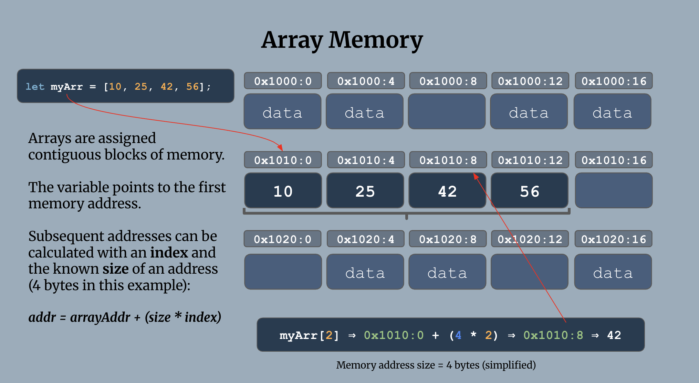
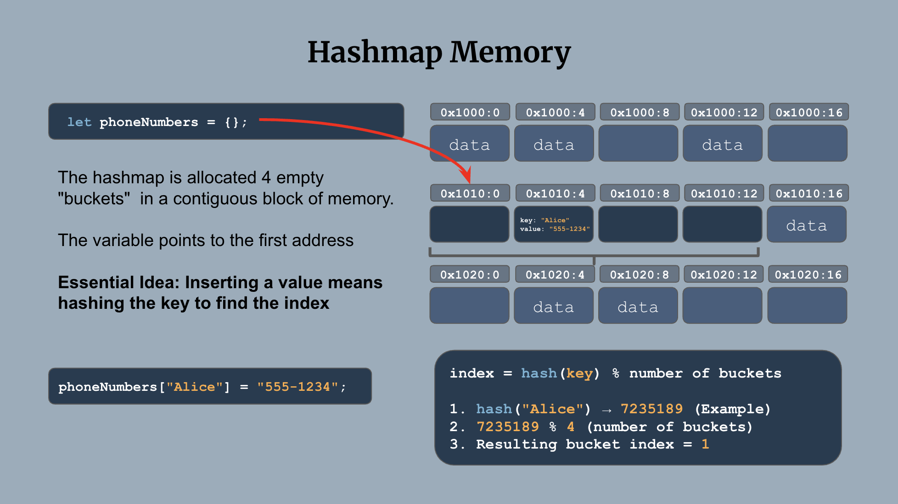
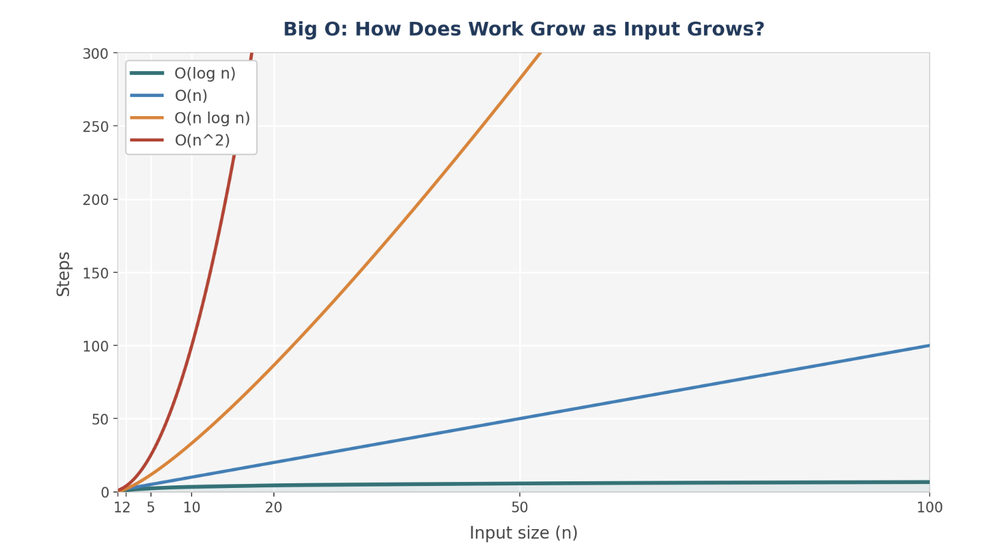

# 0. Intro to Data Structures & Algorithms: Arrays, Strings & Hash Maps

- [Essential Questions](#essential-questions)
- [Key Concepts](#key-concepts)
- [What is a Data Structure?](#what-is-a-data-structure)
- [Arrays: Fast Access, Slow Search](#arrays-fast-access-slow-search)
- [Hash Maps: Fast Existence Checks](#hash-maps-fast-existence-checks)
- [Choosing Between Them](#choosing-between-them)
  - [Comparison: Find the First Non-Repeating Character](#comparison-find-the-first-non-repeating-character)
- [Sorted Array and Binary Search](#sorted-array-and-binary-search)
- [What's Next](#whats-next)

## Essential Questions

By the end of this lesson, you should be able to answer these questions:

1. What makes array access O(1), and what makes array search O(n)?
2. What makes hash map lookup O(1) on average, and when does that guarantee break down?
3. Given a problem, how do you decide whether an array or a hash map is the better fit?
4. Why does binary search require sorted data, and what run time does it achieve?

## Key Concepts

* **Data Structure** - a way of organizing data that makes some operations fast, usually at the cost of making other operations slower. No data structure is "better" in the abstract — only better *for a given set of operations*.
  * Operation typically include: insertion, deletion, search/traversal, random access
* **Array** - an ordered, indexed collection of values stored in contiguous memory. Supports fast random access by index, but slow search.
* **Hash Map** (a.k.a. object/dictionary) - a collection of key-value pairs that uses a **hash function** to convert a key directly into a memory location, enabling lookup, insertion, and deletion by key in O(1) time on average.
  * **Hash Function** - a function that converts a key (like a string) into a number that can be used as an index.
  * **Collision** - when two different keys hash to the same index. Frequent collisions degrade a hash map's O(1) guarantee.
* **Binary Search** - an algorithm that repeatedly halves a *sorted* search space to find a target in O(log n) time.

## What is a Data Structure?

Before this module, you've mostly used Arrays and Objects because JavaScript hands them to you for free. They're the first and most common example of the central idea of this entire module:

> Every data structure makes a deliberate tradeoff. It makes some operations fast by making other operations slow (or impossible). These tradeoffs help us decide which data structure to use for a given problem.

<details>

<summary><strong>Q: Arrays and Objects can both store collections of data. What are their tradeoffs? What kinds of problems are they each suited for?</strong></summary>

Because they're fast at different things. 
* An Array is fast when you care about *order* and *position*. 
* An Object (or Hash Map) is fast when you care about *looking something up by name* without caring where it lives. 

</details>

## Arrays: Fast Access, Slow Search



An Array stores its values in contiguous memory, one right after another. Because of this, the computer can calculate the exact memory address of `myArr[2]` using simple arithmetic (`start address + 2 * size of one element`) without looking at anything else in the array.

```js
let myArr = [10, 25, 42, 56];
myArr[2]; // O(1) — the computer jumps directly to this address
```

This is why **array access by index is a constant time operation O(1)**: it doesn't matter if the array has 10 elements or 10 million, reading `arr[2]` takes the same amount of time.

But what if you don't know the index? What if you only have the value and need to find *where* it is, or whether it's in the array at all?

```js
const contains = (arr, target) => {
  for (let i = 0; i < arr.length; i++) {
    if (arr[i] === target) return true;
  }
  return false;
};
```

There's no shortcut here — in the worst case (the value is last, or not present at all), you have to check every element. This is why **array search is O(n)**.

<details>

<summary><strong>Q: Why can't the computer do for search what it does for indexed access — jump straight to the answer?</strong></summary>

Indexed access works because position tells the computer exactly where to look. Search is different: the *value* you're looking for doesn't tell the computer anything about *where* it lives in memory. Without additional information (like the array being sorted — more on that later), the only option is to check elements one by one.

</details>

## Hash Maps: Fast Existence Checks

A Hash Map solves exactly the problem Arrays are slow at: "is this value in here?" and "what value is associated with this key?"

```js
const ages = {};
ages['sam'] = 25;
ages['ari'] = 30;

console.log(ages['sam']); // 25 — O(1) average lookup
console.log('sam' in ages); // true — O(1) average existence check
```

Internally, a hash map runs your key through a **hash function** that converts it into a number, and uses that number as a shortcut directly to the value's location — similar in spirit to how an array uses an index, except *you* don't have to know the index. The hash function computes it for you from the key itself.



This is why **hash map lookup, insertion, and deletion are all O(1) on average**: regardless of how many keys are stored, the hash function gets you to the right spot in roughly constant time.

<details>

<summary><strong>Q: Lookup is "O(1) on average" — when does that guarantee break down?</strong></summary>

When two different keys hash to the same location, a **collision** occurs. If the hash function distributes keys poorly, or if there are enough keys packed into a small enough space, multiple keys pile up at the same location and the hash map has to fall back to something slower (like checking each colliding key one by one) to disambiguate them. In the worst case, a hash map with terrible collisions degrades toward O(n). In practice, well-designed hash functions make this rare enough that "O(1) average" is a safe assumption for this module.

</details>

## Choosing Between Them

The decision usually comes down to one question: **does this problem need fast lookup by order/position, or does it need fast lookup by value?**

| Need...                                    | Use...   |
| ------------------------------------------ | -------- |
| To access the 5th item                     | Array    |
| To preserve insertion order                | Array    |
| To check "have I seen this before?" fast   | Hash Map |
| To count how many times something occurred | Hash Map |
| To associate a value with a name/label     | Hash Map |

### Comparison: Find the First Non-Repeating Character

**The Problem**: Given a string, return the first character that appears only once. If every character repeats, return `null`.

* `firstNonRepeating('aabbc')` → `'c'`
* `firstNonRepeating('abcabc')` → `null`

**Array-based approach (nested loop):**

```js
const firstNonRepeating = (str) => {
  for (let i = 0; i < str.length; i++) {
    let count = 0;
    for (let j = 0; j < str.length; j++) {
      if (str[i] === str[j]) count++;
    }
    if (count === 1) return str[i];
  }
  return null;
};
```

**<details><summary>Q: What is the runtime of this solution? Use Big-O notation. </summary>**
For every character, this re-scans the *entire* string to count occurrences — an O(n) operation nested inside another O(n) loop, making this **O(n²)**.
</details>

**Hash-map-based approach:**

```js
const firstNonRepeating = (str) => {
  const counts = {};

  // first pass: count every character
  for (const char of str) {
    counts[char] = (counts[char] || 0) + 1;
  }

  // second pass: find the first one with a count of 1
  for (const char of str) {
    if (counts[char] === 1) return char;
  }

  return null;
};
```

**<details><summary>Q: What is the runtime of this solution?</summary>**
This makes two full passes over the string — but each pass is O(n), and a hash map lookup/update is O(1), so the total is **O(n)**. Trading one nested loop for a hash map turned a quadratic solution into a linear one.
</details>

<details>

<summary><strong>Q: Why does the hash map version need two separate passes instead of one?</strong></summary>

On the first pass, you don't yet know the final count for a character — a character you've seen once so far might repeat later in the string. You need the *complete* counts before you can trust any of them, so counting (pass 1) and checking (pass 2) can't be collapsed into a single pass.

</details>

This is the first instance of a recurring thread within Data Structures & Algorithms: **the same problem, solved with two different structures, at two different costs.** You'll see this comparison again with Queues (array vs. linked list) and with tree search (BFS vs. DFS).

## Sorted Array and Binary Search


We saw that Hashmaps give us O(1) value lookups while Arrays give us O(n) lookups. Now, let's look at a way to improve the efficiency of searching an Array for a value. 

**The Problem**: Given an array, determine whether it contains a target value.

**<details><summary>Q: If I told you to find the word "platypus" in a dictionary with 1000 pages, how many pages would you need to look at in order to find it? What would be your approach?</summary>**

P is the 16th letter in the dictionary which puts it at about 60% of the way through the alphabet.

If you looked at every single page starting with the first, you would end up looking at close to 600 pages before arriving at the word "Platypus". This would be a linear algorithm.

However, if you opened the dictionary to the middle (around the letter "M"), you would flip to the right half of the dictionary (between "M" and "Z") to keep looking. Repeat this process again and again, each time cutting the dictionary in half and choosing the left or right and you would only need to look at about **10 pages**!

This is called **Binary Search** which is a **logarithmic** algorithm.

</details>

Searching an unsorted array is O(n) — you must check every element.

```js
const contains = (arr, target) => {
  for (let i = 0; i < arr.length; i++){ 
    if (numbers[i] === target) {
      return true;
    }
  }
  return false;
}
```

But if we add the constraint that the array must be sorted then the more efficient **Binary Search** approach becomes possible.

Binary Search is a **Divide and Conquer** algorithm: it takes a given "solution space" (the values in an Array) and divides the possibilities by 2 over and over again.




Each comparison eliminates half of the remaining search space, giving us a runtime of **O(log n)**. To put that into context, for an array of a million elements, binary search needs at most ~20 comparisons.



To implement this in code is an interesting exercise that you can try figuring out yourself. To help, here are a few questions to consider:
1. What kind of iteration is best here, a `for` loop or a `while` loop?
2. For each iteration, how will you calculate the middle of the remaining solution space?
3. For each iteration, how will you shrink the remaining solution space?
4. When will you know that you've searched the entire space and can stop iterating?


**<details><summary>Solution</summary>**

```js
const binarySearch = (sortedArr, target) => {
  let left = 0;
  let right = sortedArr.length - 1;

  while (left <= right) {
    const mid = Math.floor((left + right) / 2);

    if (sortedArr[mid] === target) return mid;
    if (sortedArr[mid] < target) left = mid + 1;  // target is in the right half
    else right = mid - 1;                          // target is in the left half
  }

  return -1; // not found
};
```

1. A `while` loop is best here because we don't know how many loops to run.
2. A `mid` pointer is calculated by using two pointers to track the boundaries of the solution space: `left` starts at index `0` and `right` starts at the last index of the Array.
3. The solution space is shrunk by moving either the `left` pointer or the `right` pointer to just beside the `mid` pointer. On the next iteration, the solution space is shrunk in half.
4. We know that we can stop looping when the `left` pointer and the `right` pointer have crossed paths (`left <= right`).

</details>

<details>

<summary><strong>Q: Why is sorted order the precondition that makes binary search possible?</strong></summary>

Checking the middle element only tells you anything useful if you can trust that everything to its left is smaller and everything to its right is larger. That trust *is* the sorted invariant. Without it, finding a mismatch at the midpoint gives you no information about which half to search next — you'd have no choice but to check every element.

</details>

## What's Next

Arrays and Hash Maps are the structures JavaScript gives you "for free." The next several lessons introduce structures you have to build yourself — starting with the **Stack**, which restricts what an Array can do in exchange for a guarantee about order.