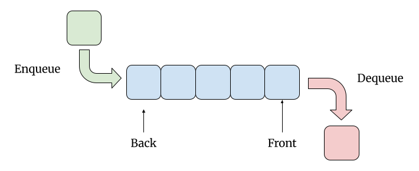

# Queues

**Table of Contents:**

- [Essential Questions](#essential-questions)
- [Key Concepts](#key-concepts)
- [What is a Queue?](#what-is-a-queue)
  - [Queue Implementation](#queue-implementation)
  - [Classic Algorithm: Hot Potato](#classic-algorithm-hot-potato)
    - [Implementation Challenge:](#implementation-challenge)
- [A More Efficient Queue](#a-more-efficient-queue)


## Essential Questions

By the end of this lesson, you should be able to answer these questions:

1. How are the values in a Queue organized?
2. Where do we see queues in the real world?
3. What are common use cases for queues in computer science?
4. What are the run times for insertion, deletion, and accessing values in a queue?

## Key Concepts

* **Queue** - an ADT that stores a collection of values that you can visualize as a line: you can only add values to the "back" of the queue and you can only access or remove the value at the "front" of the queue. Example use cases include task scheduling, handling requests in the order they arrive, and breadth first search graph traversal.
  * **FIFO ("First In, First Out")** - the ordering behavior of a queue: the first value enqueued is the first value dequeued.
  * **`enqueue`** - inserts a new value onto the "back" of the queue.
  * **`dequeue`** - removes and returns the value at the "front" of the queue.
  * **`peek`** - returns the value at the "front" of the queue without removing it.

## What is a Queue?

Imagine you go to a restaurant. There's a line of people waiting. Some audacious, rule-breaking people may cut straight to the front, but they will likely receive some serious glares.


According to the norms of society, the **first** person in line is the **first** person to be served. Queues follow this "first in, first out" (FIFO) access pattern.

A Queue has three basic operations:

* enqueue — inserts a new element to the "back" of the queue
* dequeue — removes the front element of the queue
* peek - look at the front element of the queue without removing it



Queues show up in the wild in a few places, such as:
* Task scheduling:
  * Every time a new task is created, it's enqueued to the back of the line
  * The scheduler dequeues the next task to run from the front of the line
* Handling requests to a server:
  * Requests are enqueued in the order they arrive
  * The server dequeues and processes them one at a time, in that same order
* Breadth first search graph traversal:
  * Neighboring nodes are enqueued as they're discovered
  * Nodes are dequeued in the order they were discovered, so the closest nodes are visited first

### Queue Implementation

Implementing a Queue is quite similar to implementing a Stack. In both cases, we can use an Array and its methods to add/remove values. 

However, while a Stack adds and removes from the same end, Queues add and remove from opposite ends. This means using `push` to add to the end (enqueue) and `shift` to remove from the front (dequeue):

```js
class Queue {
  #values = [];

  enqueue(data) {
    this.#values.push(data);
  }

  dequeue() {
    return this.#values.shift();
  }

  peek() {
    return this.#values[0];
  }
}
```

For a Stack, the `peek` method returns the last value. For a Queue, it returns the first value.

Let's look at a classic algorithm that can be solved using a Queue.

### Classic Algorithm: Hot Potato

**The Problem**: Given a list of names `names` and a number `num`, simulate a game of hot potato. Starting with the first name in line, the potato is passed around the circle `num` times. Whoever is holding the potato after `num` passes is eliminated. This repeats with the remaining names until only one person — the winner — is left.

* Example: `names = ['Alice', 'Bob', 'Charlie', 'David', 'Eve']`, `num = 3`
  * Eliminated, in order: David, Charlie, Eve, Bob
  * Winner: Alice

**<details><summary>Q: What makes a Queue a perfect ADT to solve this problem? How does the FIFO access pattern model passing the potato around a circle?</summary>**

**Why a Queue is Perfect**: "Passing" the potato to the next person is the same as removing the person from the front of the line and adding them to the back — a `dequeue` immediately followed by an `enqueue`. Because a queue is FIFO, the person who has been waiting the longest is always the next one to hold the potato, which is exactly how a circle works.

</details>

#### Implementation Challenge:

**The Algorithm Steps**
1. Enqueue every name into a queue, in order.
2. Loop until only one name is left in the queue:
   1. Pass the potato `num` times: `num` times in a row, dequeue the front name and immediately enqueue it again.
   2. Eliminate whoever is now at the front: dequeue the front name and do **not** enqueue it again.
3. Once one name remains in the queue, dequeue and return it — that's the winner!

Use the `Queue` class in your implementation:

```js
class Queue {
  #values = [];

  enqueue(data) {
    this.#values.push(data);
  }

  dequeue() {
    return this.#values.shift();
  }

  peek() {
    return this.#values[0];
  }

  // Though not required, it is standard to include a size method in a Queue
  size() {
    return this.#values.length;
  }
}

const hotPotato = (names, num) => {
  // return the name of the winner
};
```

**<details><summary>Solution</summary>**

```js
function hotPotato(names, num) {
  // Instantiate your custom Queue class and add all names to it
  const queue = new Queue();
  names.forEach((name) => queue.enqueue(name));

  while (queue.size() > 1) {
    // Pass the potato `num` times
    for (let i = 0; i < num; i++) {
      // loop the person in front to the back
      queue.enqueue(queue.dequeue());
    }
    // Whoever is at the front when the passing stops is eliminated
    queue.dequeue();
  }

  // The last name left in the queue is the winner
  return queue.dequeue();
}

// Test Cases
console.log(hotPotato(['Alice', 'Bob', 'Charlie', 'David', 'Eve'], 3)); // 'Alice'
console.log(hotPotato(['Alice', 'Bob', 'Charlie', 'David', 'Eve'], 1)); // 'Charlie'
```

</details>

## A More Efficient Queue

The Array-based `Queue` we built in this lesson works, but its `dequeue` isn't as efficient as it could be: removing from the front of an Array with `shift()` forces every remaining value to shift down a position making it an O(n) linear operation. Ideally, `enqueue` and `dequeue` can be both implemented in constant time.

A more efficient `Queue` can be built using another ADT — the **Linked List** — which we'll cover in the next lesson!
