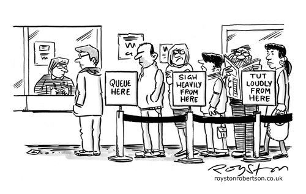

# 2. Queues

* [Essential Questions](2-queues.md#essential-questions)
* [Key Concepts](2-queues.md#key-concepts)
* [What is a Queue?](2-queues.md#what-is-a-queue)
  * [Queue Implementation](2-queues.md#queue-implementation)

## Essential Questions

By the end of this lesson, you should be able to answer these questions:

1. How are the values in a Queue organized?
2. Where do we see queues in the real world?
3. What are common use cases for queues in computer science?
4. What are the run times for insertion, deletion, and accessing values in a queue?

## Key Concepts

* **Abstract Data Type (ADT)** - a high-level description of how a type of data behaves, independent of how it is implemented.
* **Queue** - an ADT that stores a collection of values that you can visualize as a line: you can only add values to the "back" of the queue and you can only access or remove the value at the "front" of the queue.
  * **FIFO ("First In, First Out")** - the ordering behavior of a queue: the first value enqueued is the first value dequeued.
  * **`enqueue`** - inserts a new value onto the "back" of the queue.
  * **`dequeue`** - removes and returns the value at the "front" of the queue.
  * **`peek`** - returns the value at the "front" of the queue

## What is a Queue?

Imagine you go to a restaurant. There's a line of people waiting. Some audacious, rule-breaking people may cut straight to the front, but they will likely receive some serious glares.



According to the norms of society, the **first** person in line is the **first** person to be served.

A Queue is a collection of values, similar to the Stack, with these two operations:

* enqueue — inserts a new element to the "back" of the Queue.
* dequeue — removes the element at the "front" of the Queue.


Queues are often referred to as "first in, first out" (FIFO) data structures.

### Queue Implementation

To implement a Queue, we can again use an Array! The `enqueue` method is just like the Stack and Array `push` method. However, the `dequeue` method requires us to remove the first element from the Array.

Rather than using `pop`, we can use `shift`.

```js
class Queue {
  #values = [];

  enqueue(data) {
    this.#values.push(data)
  }

  dequeue() {
    return this.#values.shift();
  }
}
```
