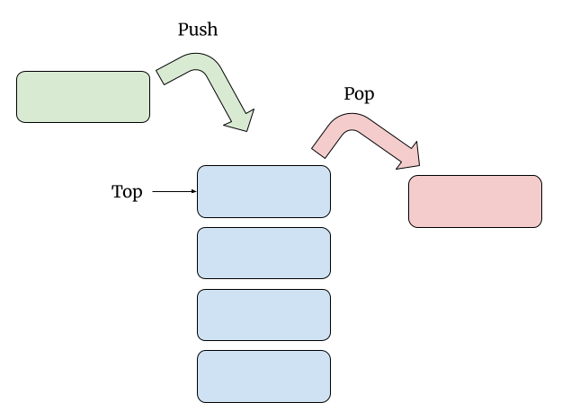

# 1. Stacks and Queues

**Table of Contents:**
- [Essential Questions](#essential-questions)
- [Key Concepts](#key-concepts)
- [Problem: Balanced Brackets](#problem-balanced-brackets)
- [What is an Abstract Data Type?](#what-is-an-abstract-data-type)
  - [What is a Stack?](#what-is-a-stack)
  - [Queues](#queues)
- [Solving Balanced Brackets](#solving-balanced-brackets)
  - [The Algorithm](#the-algorithm)
  - [Implementation](#implementation)
- [Summary](#summary)

## Essential Questions

By the end of this lesson, you should be able to answer these questions:

1. What is an _abstract data type_ and how do they help us solve problems?
2. What is a Stack and what operations does it support?
3. Where do we see Stacks in the real world?
4. What is a Queue and what operations does it support?
5. Where do we see Queues in the real world?
6. Which ADT is best used to solve the "Balanced Brackets" problem?

## Key Concepts

* **Abstract Data Type (ADT)** - a high-level description of a set of operations you can perform with a collection of data. Abstract Data Types give programmers a way to think about a problem rather than an actual tool that you can use in Code.
* **Stack** - an Abstract Data Type that stores a collection of values as a "vertical stack": you can only add values to the "top" of the stack and can only access or remove the value at the "top" of the stack. Example use cases include an "undo" button, a function call stack, depth first search graph traversal.
  * **LIFO ("Last In, First Out")** - the ordering behavior of a stack: the last value "pushed" (added) is the first value "popped" (removed).
* **Queue** - an Abstract Data Type that stores a collection of values that you can visualize as a line: you can only add values to the "back" and can only access or remove the value at the "front." Example use cases include task scheduling and handling requests in the order they arrive.
  * **FIFO ("First In, First Out")** - the ordering behavior of a queue: the first value "enqueued" (added) is the first value "dequeued" (removed).

## Problem: Balanced Brackets

**The Problem**: Given a string containing just the characters `(`, `)`, `{`, `}`, `[` and `]`, determine if the input string is balanced.

* Balanced Examples:
  * `{[()]}`
  * `[()]{}`
  * `[](){}`
* Unbalanced Examples:
  * `[(])` (The `(` was opened after the `[`, so it must be closed before the `[` can close).
  * `}}{{` (The pairs match but the closing brackets come first)

How would you implement this function?

```js
const isBalanced = (str) => {
  // ???
}
```

To help us think about how to implement this, let's look at **Abstract Data Types**.

## What is an Abstract Data Type?

An **Abstract Data Type (ADT)** is a high-level description of a collection of data and what operations you can perform with that data. 

Two ADTs that you have already encountered are the List and Map:
* **List**: Defines a sequential collection of elements where the relative order of items matters. It specifies abstract operations like:
  * `insert(index, element)`: Adds an item at a specific position, shifting subsequent items down.
  * `append(element)`: Adds an item to the very end of the list.
  * `remove(index)`: Removes the item at a specific position, shifting subsequent items up.
  * `get(index)`: Retrieves the item located at a specific index.
  * `set(index, element)`: Overwrites the item at a specific index with a new value.
  * `size()`: Returns the total number of elements currently in the list.
* **Map**: Defines a collection of unique key-value pairs where each key maps to exactly one value. It specifies abstract operations like:
  * `set(key, value)`: Binds a value to a specific key. If the key already exists in the map, its old value is overwritten.
  * `get(key)`: Retrieves the value associated with the specified key.
  * `remove(key)`: Detaches the key-value pair from the map completely.
  * `size()`: Returns the total count of key-value pairs currently stored in the map.

Abstract Data Types help us conceptualize how to solve problems based on what the data needs to do. If we need the data to be ordered and accessible by index, we reach for a List. If we need values to be paired with unique keys, we reach for a Map.

By contrast, **concrete data structures**—like Arrays and Objects in JavaScript—are the actual tools we use to bring those abstract concepts to life in our code.


💡 You can think of this relationship between ADTs and concrete data structures like the difference between the general concept of a car and a specific Honda Civic. A car is an abstract idea: a vehicle with wheels and an engine that can be operated with a steering wheel, a brake pedal, and an acceleration pedal. A Honda Civic is a concrete implementation of the "Car" concept. 

Understanding the abstract concept of a "Car" versus, say, a "Bike" helps us think about the problem of commuting to work: "should I drive my car or ride my bike?". Then when it comes time to actually get to work, you take your Honda Civic or your Cannondale (a brand of bicycle).


**<details><summary>Q: Can you think of any other real-world examples of abstract ideas and their concrete implementations?</summary>**

* Ice Cream: Ben & Jerry's Tonight Dough
* Hat: New York Yankees Baseball Cap
* Memoir: Between the World and Me

</details>

Now, let's learn about two more Abstract Data Types that will help us solve this balanced brackets problem: Stacks and Queues.

### What is a Stack?

A Stack is an Abstract Data Type that organizes data as a vertical pile, kind of like stack of plates: you only add/remove plates to/from the top.


A Stack has three basic operations:

* `push(value)` — inserts a new element to the "top" of the stack (add a plate to the top)
* `pop()` — removes the top element of the stack (take a plate off the top)
* `peek()` - look at the top element of the stack without removing it (look at a plate to decide if you want to use it)



This is more formally known as **LIFO**: or "last in, first out" (the last plate you add to the stack is the first one you use).

Stacks show up in a few common places in Software Development such as:

* Building a call stack:
  * Every time a function is invoked, it is pushed to the top of the call stack
  * When the function returns, it is popped from the stack
  * When the program crashes, you print out the stack at that moment and you can see what functions were called and in what order
* Implementing an "Undo" button:
  * Every time a user performs an action, push it to the top of the Stack
  * If the user wants to "Undo" an action, simply pop the most recent action from the Stack
  * You can "Redo" actions by maintaining a second stack where any undone actions are pushed to the second stack until the user takes a completely new action.

### Queues

A Queue is an Abstract Data Type that organizes data in an ordered line where data is processed in the order in which they enter the line.


A Queue has three basic operations:

* `enqueue(value)` — inserts a new element to the "back" of the queue
* `dequeue()` — removes the front element of the queue
* `peek()` — look at the front element of the queue without removing it


This is more formally known as **FIFO**: **first in, first out** (the first person in line is the first person who gets served).

Queues show up in a few common places in Software Development such as:
* **Handling requests to a server** — requests are handled in the order they came in, not in reverse.
* **Task scheduling in an operating system** — new tasks join the back of the line, and the OS works through them in the order they arrived.

## Solving Balanced Brackets

Now, back to the problem: given a string containing just the characters `(`, `)`, `{`, `}`, `[` and `]`, determine if the input string is balanced.

As you think about the problem, consider the example invalid inputs `}}{{` and `[(])` and these questions:
1. If you just counted the number of each type of bracket, would that tell you if a string is balanced? Try it on `}}{{`.
2. As you read left to right, what do you need to remember about the brackets you've already seen?
3. Looking at `[(])`, when you hit the first closing bracket `]`, which opening bracket is it trying to close? Can you generalize that observation into a rule?
4. Between a Stack and Queue, which Abstract Data Type can we use to solve this problem? Do brackets appear in LIFO or FIFO order?

**<details><summary>Answers</summary>**

Considering the questions above leads us to learn that:
* the order of the brackets matters, not just how many pairs there are
* we need to keep track of opening brackets that haven't been closed yet
* a closing bracket must always pair with the most recently opened, still-unclosed bracket
* **a Stack is perfect**: As you read the string from left to right, the last opening bracket you see is always the very first one that needs to be closed (LIFO)

</details>

### The Algorithm

To turn this into an Algorithm, we should consider:
* When you see an opening bracket, what should happen to it?
* When you see a closing bracket, what's the first thing you need to check?
* What do you do if it matches?
* What do you do if it doesn't match?

**<details><summary>Algorithm Solution</summary>**

And here is an algorithm we can use to solve the problem

1. Initialize an empty stack
2. Loop through each character in the string:
   1. If it's an opening bracket (`(`, `{`, `[`), "push" it onto the stack.
   2. If it's a closing bracket (`)`, `}`, `]`), "peek" at the top of the stack. 
      1. If the top of the stack is its matching opening partner, "pop" it off the stack. 
      2. If it doesn't match (or the stack is empty), the string is invalid.
3. After checking the whole string, if the stack is completely empty (you peek at the top and nothing is there), the brackets are perfectly balanced. If there are still brackets left in the stack, someone forgot a closing bracket!
</details>

Here is a visualization of the algorithm:



### Implementation

Finally, we can translate that algorithm into JavaScript. Consider these questions:
* What concrete data structure can I use to represent the Stack?
* How can I quickly look up whether a given closing bracket matches a given opening bracket?

**<details><summary>Solution</summary>**
 
```js
function isBalanced(str) {
  // An array can easily be used as a Stack since it has push and pop methods
  const stack = [];
  
  // when you encounter a ), ], or }, look up the matching opening bracket
  const bracketPairs = {
    ')': '(',
    '}': '{',
    ']': '['
  };

  for (let i = 0; i < str.length; i++) {
    const char = str[i];

    // 1. If it's an opening bracket, push it onto the stack
    if (char === '(' || char === '{' || char === '[') {
      stack.push(char);
    } 
    // 2. If it's a closing bracket
    else if (char === ')' || char === '}' || char === ']') {
      // Look at the topmost opening bracket in the stack
      const top = stack[stack.length - 1]
      
      // If the current closing bracket is not matched with the top, they aren't balanced
      if (bracketPairs[char] !== top) {
        return false; 
      }
      // If it's a perfect match, pop it off
      stack.pop();
    }
  }

  // 3. If the stack is completely empty, it is balanced
  // Otherwise, an opening bracket remains un-closed
  return stack.length === 0;
}

// Test Cases
console.log(isBalanced("{[()]}")); // true
console.log(isBalanced("[(])"));   // false
console.log(isBalanced("[{()"));   // false
```

</details>

## Summary

An **Abstract Data Type (ADT)** describes *what* operations a collection supports without dictating *how* they're implemented — it's a way of thinking about a problem before choosing a concrete data structure to solve it. Lists and Maps are the ADTs implemented by Arrays and Objects in JavaScript.

* A **Stack** supports `push`, `pop`, and `peek`, and follows **LIFO** ("last in, first out") ordering. You'll find Stacks behind the call stack, "Undo" buttons, and depth-first traversal.
* A **Queue** supports `enqueue`, `dequeue`, and `peek`, and follows **FIFO** ("first in, first out") ordering. You'll find Queues behind request handling and task scheduling.

The "Balanced Brackets" problem showed how recognizing the *shape* of a problem — here, that the most recently opened bracket must be the next one closed — points you to the right ADT. Once we knew a Stack's LIFO behavior matched the problem, an Array (JavaScript's concrete stand-in for a Stack) was all we needed to implement it.

This is the same theme from the last lesson: just as choosing between an Array and a Hash Map depends on the operations a problem needs, choosing between a Stack and a Queue depends on whether the data needs to come out in LIFO or FIFO order. Next, we'll look at **Linked Lists** — a structure that reorganizes how data is stored in memory to solve a limitation Arrays run into.

